# 尚硅谷Flink入门到实战-学习笔记

[尚硅谷2022版Flink1.13实战教程](https://www.bilibili.com/video/BV133411s7Sa)


# 1. Flink 的特性

Flink 是第三代分布式流处理器，它的功能丰富而强大。

## 1.1 Flink 的核心特性

Flink 区别与传统数据处理框架的特性如下。

- 事件驱动（Event-driven）

- 基于流处理

  一切皆由流组成，离线数据是有界的流；实时数据是一个没有界限的流。（有界流、无界流）

- 分层API

  + 越顶层越抽象，表达含义越简明，使用越方便
  + 越底层越具体，表达能力越丰富，使用越灵活


- 高吞吐和低延迟。每秒处理数百万个事件，毫秒级延迟。
- 结果的准确性。Flink 提供了事件时间（event-time）和处理时间（processing-time）语义。对于乱序事件流，事件时间语义仍然能提供一致且准确的结果。
- **精确一次**（exactly-once）的状态一致性保证。
- 可以连接到最常用的存储系统，如 Apache Kafka、Apache Cassandra、Elasticsearch、JDBC、Kinesis 和（分布式）文件系统，如 HDFS 和 S3。
- **高可用**。本身高可用的设置，加上与 K8s，YARN 和 Mesos 的紧密集成，再加上从故障中快速恢复和**动态扩展**任务的能力，Flink 能做到以极少的停机时间 **7×24 全天候运行**。
- 能够更新应用程序代码并将作业（jobs）迁移到不同的 Flink 集群，而不会丢失应用程序的状态。


## 1.2 分层 API

它拥有易于使用的分层 API，整体 API 分层如下图：

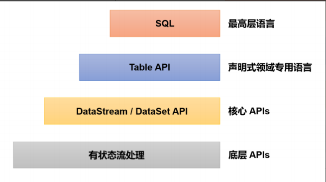

## 1.3 Flink vs Spark

+ 数据模型
  + Spark采用RDD模型，spark streaming的DStream实际上也就是一组组小批数据RDD的集合
  + flink基本数据模型是数据流，以及事件（Event）序列
+ 运行时架构
  + spark是批计算，将DAG划分为不同的stage，一个完成后才可以计算下一个
  + flink是标准的流执行模式，一个事件在一个节点处理完后可以直接发往下一个节点处理


​	批处理领域 Spark 称王，而在流处理方面 Flink 当仁不让。具体到项目应用中，不仅要看是流处理还是批处理，还需要在延迟、吞吐量、可靠性，以及开发容易度等多个方面进行权衡。

​	如果在工作中需要从 Spark 和 Flink 这两个主流框架中选择一个来进行实时流处理，我们更加推荐使用 Flink，主要的原因有：

- Flink 的延迟是毫秒级别，而 Spark Streaming 的延迟是秒级延迟。
- Flink 提供了严格的精确一次性语义保证。
- Flink 的窗口 API 更加灵活、语义更丰富。
- Flink 提供事件时间语义，可以正确处理延迟数据。
- Flink 提供了更加灵活的对状态编程的 API。

​	基于以上特点，使用 Flink 可以解放程序员, 加快编程效率, 把本来需要程序员花大力气手动完成的工作交给框架完成。

​	当然，在海量数据的批处理方面，Spark 还是具有明显的优势。而且 Spark 的生态更加成熟，也会使其在应用中更为方便。相信随着 Flink 的快速发展和完善，这方面的差距会越来越小。


# 2. Flink 快速上手

## 2.1. 批处理实现WordCount

### 1.创建工程-MAVEN工程

### 2.添加项目依赖

​		在项目的 pom 文件中，增加<properties>标签设置属性，然后增加<denpendencies>标签引入需要的依赖。我们需要添加的依赖最重要的就是 Flink 的相关组件，包括 flink-java、flink-streaming-java，以及 flink-clients（客户端，也可以省略）。另外，为了方便查看运行日志，我们引入 slf4j 和 log4j 进行日志管理

```xml
    <properties>
        <maven.compiler.source>8</maven.compiler.source>
        <maven.compiler.target>8</maven.compiler.target>
        <flink.version>1.13.0</flink.version>
        <java.version>1.8</java.version>
        <scala.binary.version>2.12</scala.binary.version>
        <slf4j.version>1.7.30</slf4j.version>
    </properties>

    <dependencies>
    <!-- 引入 Flink 相关依赖-->
    <dependency>
        <groupId>org.apache.flink</groupId>
        <artifactId>flink-java</artifactId>
        <version>${flink.version}</version>
    </dependency>
    <dependency>
    <groupId>org.apache.flink</groupId>
        <artifactId>flink-streaming-java_${scala.binary.version}</artifactId>
        <version>${flink.version}</version>
    </dependency>
        <dependency>
            <groupId>org.apache.flink</groupId>
            <artifactId>flink-clients_${scala.binary.version}</artifactId>
            <version>${flink.version}</version>
        </dependency>
        <!-- 引入日志管理相关依赖-->
        <dependency>
            <groupId>org.slf4j</groupId>
            <artifactId>slf4j-api</artifactId>
            <version>${slf4j.version}</version>
        </dependency>
        <dependency>
            <groupId>org.slf4j</groupId>
            <artifactId>slf4j-log4j12</artifactId>
            <version>${slf4j.version}</version>
        </dependency>
        <dependency>
            <groupId>org.apache.logging.log4j</groupId>
            <artifactId>log4j-to-slf4j</artifactId>
            <version>2.14.0</version>
        </dependency>
    </dependencies>
```

在属性中，我们定义了<scala.binary.version>，这指代的是所依赖的 Scala 版本。这有一点奇怪：Flink 底层是 Java，而且我们也只用 Java API，为什么还会依赖 Scala 呢？这是因为 Flink的架构中使用了 Akka 来实现底层的分布式通信，而 Akka 是用 Scala 开发的。我们本书中用到的 Scala 版本为 2.12。

### 3. 配置日志管理

在目录 src/main/resources 下添加文件:log4j.properties，内容配置如下：

```properties
log4j.rootLogger=error, stdout

log4j.appender.stdout=org.apache.log4j.ConsoleAppender

log4j.appender.stdout.layout=org.apache.log4j.PatternLayout

log4j.appender.stdout.layout.ConversionPattern=%-4r [%t] %-5p %c %x - %m%n
```

### 4. 代码实现

统计一段文字中，每个单词出现的频次

```java
import org.apache.flink.api.common.functions.FlatMapFunction;
import org.apache.flink.api.common.typeinfo.Types;
import org.apache.flink.api.java.ExecutionEnvironment;
import org.apache.flink.api.java.operators.AggregateOperator;
import org.apache.flink.api.java.operators.DataSource;
import org.apache.flink.api.java.operators.FlatMapOperator;
import org.apache.flink.api.java.operators.UnsortedGrouping;
import org.apache.flink.api.java.tuple.Tuple2;
import org.apache.flink.util.Collector;

/**
 * @Description: TODO
 * @Data: 2022-06-01 20:07:46
 * @Pacakge: com.flink.wordcount
 * @ClassName: BatchWordCount
 * @Version: v1.0.0
 * @Author: Yellow Power
 */
public class BatchWordCount {
    public static void main(String[] args) throws Exception {
        // 1. 创建执行环境
        ExecutionEnvironment env = ExecutionEnvironment.getExecutionEnvironment();
        // 2. 从文件读取数据 按行读取(存储的元素就是每行的文本)
        DataSource<String> lineDS = env.readTextFile("D:\\software\\Code\\StudyCode\\FlinkCode\\FlinkTutorial\\intput\\words.txt");
        // 3. 转换数据格式
        /*FlatMapOperator<String, Tuple2<String, Long>> wordAndOne2 = lineDS
                .flatMap(new FlatMapFunction<String, Tuple2<String, Long>>() {
                    @Override
                    public void flatMap(String line, Collector<Tuple2<String, Long>> collector) throws Exception {
                        String[] words = line.split(" ");
                        for (String word : words) {
                            collector.collect(Tuple2.of(word, 1L));
                        }
                    }
                }).returns(Types.TUPLE(Types.STRING, Types.LONG));*/
        FlatMapOperator<String, Tuple2<String, Long>> wordAndOne = lineDS
                .flatMap((String line, Collector<Tuple2<String, Long>> out) -> {
                    String[] words = line.split(" ");
                    for (String word : words) {
                        out.collect(Tuple2.of(word, 1L));
                    }
                })
                .returns(Types.TUPLE(Types.STRING, Types.LONG)); //当 Lambda 表达式使用 Java 泛型的时候, 由于泛型擦除的存在, 需要显示的声明类型信息
        // 4. 按照 word 进行分组
        UnsortedGrouping<Tuple2<String, Long>> wordAndOneUG =
                wordAndOne.groupBy(0);// 索引0，就是第一个元素作为分组的Key
        // 5. 分组内聚合统计
        AggregateOperator<Tuple2<String, Long>> sum = wordAndOneUG.sum(1);
        // 6. 打印结果
        sum.print();
    }
```


```
(java,1)
(flink,1)
(world,1)
(hello,3)
```


## 2.2 流处理读取文件

+ 读取文档 words.txt 中的数据，并统计每个单词出现的频次。这是一个“有

  界流”的处理，整体思路与之前的批处理非常类似，代码模式也基本一致。

  ```java
  package com.flink.wordcount;
  
  import org.apache.flink.api.common.typeinfo.Types;
  import org.apache.flink.api.java.tuple.Tuple2;
  import org.apache.flink.streaming.api.datastream.DataStreamSource;
  import org.apache.flink.streaming.api.datastream.KeyedStream;
  import org.apache.flink.streaming.api.datastream.SingleOutputStreamOperator;
  import org.apache.flink.streaming.api.environment.StreamExecutionEnvironment;
  import org.apache.flink.util.Collector;
  
  import java.util.Arrays;
  
  /**
   * @Description: TODO
   * @Data: 2022-06-01 20:26:30
   * @Pacakge: com.flink.wordcount
   * @ClassName: BoundedStreamWordCount
   * @Version: v1.0.0
   * @Author: Yellow Power
   */
  public class BoundedStreamWordCount {
      public static void main(String[] args) throws Exception {
          // 1. 创建流式执行环境
          StreamExecutionEnvironment env =
                  StreamExecutionEnvironment.getExecutionEnvironment();
          // 2. 读取文件
          DataStreamSource<String> lineDSS = env.readTextFile("D:\\software\\Code\\StudyCode\\FlinkCode\\FlinkTutorial\\intput\\words.txt");
          // 3. 转换数据格式
          SingleOutputStreamOperator<Tuple2<String, Long>> wordAndOne = lineDSS
                  .flatMap((String line, Collector<String> words) -> {
                      Arrays.stream(line.split(" ")).forEach(words::collect);
                  })
                  .returns(Types.STRING)
                  .map(word -> Tuple2.of(word, 1L))
                  .returns(Types.TUPLE(Types.STRING, Types.LONG));
          // 4. 分组
          KeyedStream<Tuple2<String, Long>, String> wordAndOneKS = wordAndOne
                  .keyBy(t -> t.f0);
          // 5. 求和
          SingleOutputStreamOperator<Tuple2<String, Long>> result = wordAndOneKS
                  .sum(1);
          // 6. 打印
          result.print();
          // 7. 执行
          env.execute();
      }
  }
  ```


```
2> (java,1)
4> (hello,1)
7> (world,1)
4> (hello,2)
4> (hello,3)
10> (flink,1)
```

最前面代表的是用的哪个线程（slot）,编号取决于并行度，就是当前任务分成多少分去处理（电脑是12核，就是1-12的数字）


## 2.3 流处理读取文本流

​		真正的数据流其实是无界的，有开始却没有结束，这就要求我们需要保持一个监听事件的状态，持续地处理捕获的数据。为了模拟这种场景，我们就不再通过读取文件来获取数据了，而是监听数据发送端主机的指定端口，统计发送来的文本数据中出现过的单词的个数。具体实现上，我们只要对BoundedStreamWordCount 代码中读取数据的步骤稍做修改，就可以实现对真正无界流的处理

1. 通过`nc -lk <port>`打开一个socket服务，用于模拟实时的流数据

   ```shell
   nc -lk 7777
   ```

2. 对BoundedStreamWordCount 代码修改

```java
package com.flink.wordcount;

import org.apache.flink.api.common.typeinfo.Types;
import org.apache.flink.api.java.tuple.Tuple2;
import org.apache.flink.streaming.api.datastream.DataStreamSource;
import org.apache.flink.streaming.api.datastream.KeyedStream;
import org.apache.flink.streaming.api.datastream.SingleOutputStreamOperator;
import org.apache.flink.streaming.api.environment.StreamExecutionEnvironment;
import org.apache.flink.util.Collector;

import java.util.Arrays;

/**
 * @Description: TODO
 * @Data: 2022-06-01 20:35:34
 * @Pacakge: com.flink.wordcount
 * @ClassName: StreamWordCount
 * @Version: v1.0.0
 * @Author: Yellow Power
 */
public class StreamWordCount {
    public static void main(String[] args) throws Exception {
        // 1. 创建流式执行环境
        StreamExecutionEnvironment env =
                StreamExecutionEnvironment.getExecutionEnvironment();
        // 用parameter tool工具从程序启动参数中提取配置项
        ParameterTool parameterTool = ParameterTool.fromArgs(args);
        String host = parameterTool.get("host");//172.18.194.90
        int port = parameterTool.getInt("port");//7777

        // 2. 读取文本流
        DataStreamSource<String> lineDSS = env.socketTextStream(host, port);
        // 3. 转换数据格式
        SingleOutputStreamOperator<Tuple2<String, Long>> wordAndOne = lineDSS
                .flatMap((String line, Collector<String> words) -> {
                    Arrays.stream(line.split(" ")).forEach(words::collect);
                })
                .returns(Types.STRING)
                .map(word -> Tuple2.of(word, 1L))
                .returns(Types.TUPLE(Types.STRING, Types.LONG));
        // 4. 分组
        KeyedStream<Tuple2<String, Long>, String> wordAndOneKS = wordAndOne
                .keyBy(t -> t.f0);
        // 5. 求和
        SingleOutputStreamOperator<Tuple2<String, Long>> result = wordAndOneKS
                .sum(1);
        // 6. 打印
        result.print();
        // 7. 执行
        env.execute();
    }
}
```


```
11> (shuaige,1)
3> (huangqiang,1)
7> (world,1)
4> (hello,1)
10> (flink,1)
4> (hello,2)
2> (java,1)
4> (hello,3)
```


# 3. Flink 部署

安装目录：

```
/usr/soft/flink-1.10.1
```

到 Flink 中的几个关键组件：客户端（Client）、作业管理器（JobManager）和任务管理器（TaskManager）。我们的代码，实际上是由客户端获取并做转换，之后提交给JobManger 的。所以 JobManager 就是 Flink 集群里的“管事人”，对作业进行中央调度管理；而它获取到要执行的作业后，会进一步处理转换，然后分发任务给众多的 TaskManager。这里的 TaskManager，就是真正“干活的人”，数据的处理操作都是它们来做的，

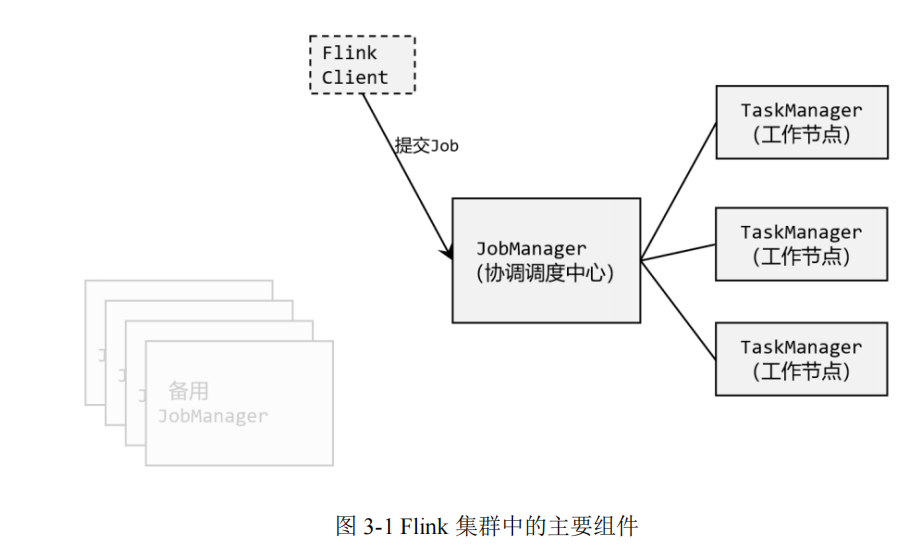


## 3.1 快速启动一个 Flink 集群

3.1.1 环境配置

### 3.1.2 本地启动

​		本地部署非常简单，直接解压安装包就可以使用，不用进行任何配置；一般用来做一些简单的测试。

#### 1.下载安装包

​		进入 Flink 官网，下载 1.13.0 版本安装包 flink-1.13.0-bin-scala_2.12.tgz，注意此处选用对应 scala 版本为 scala 2.12 的安装包。

https://archive.apache.org/dist/flink/

#### 2. 解压

```
cd /realtime/wlb/software

tar -zxvf flink-1.13.0-bin-scala_2.12.tgz -C ./
```


#### 3. 启动

进入解压后的目录，执行启动命令，并查看进程。

```
cd flink-1.13.0/

[appuser@host-172-18-194-91 flink-1.13.0]$ bin/start-cluster.sh
Starting cluster.
Starting standalonesession daemon on host host-172-18-194-91.
Starting taskexecutor daemon on host host-172-18-194-91.
```


#### 4. 访问 Web UI

启动成功后，访问 http://172.18.194.91:8081，可以对 flink 集群和任务进行监控管理.


#### 5. 关闭集群

如果想要让 Flink 集群停止运行，可以执行以下命令：

```
[appuser@host-172-18-194-91 flink-1.13.0]$ bin/stop-cluster.sh 
Stopping taskexecutor daemon (pid: 22949) on host host-172-18-194-91.
Stopping standalonesession daemon (pid: 22544) on host host-172-18-194-91.
```


### 3.1.3 集群启动

如果我们想要扩展成集群，其实启动命令是不变的，主要是需要指定节点之间的主从关系。

Flink 是典型的 Master-Slave 架构的分布式数据处理框架，其中 Master 角色对应着JobManager，Slave 角色则对应 TaskManager。

节点服务器 角色

172.18.194.90 TaskManager

172.18.194.91 JobManager

172.18.194.92 TaskManager


具体安装部署步骤如下：

#### 1. 下载并解压安装包

具体操作与上节相同。

#### 2. 修改集群配置

（1）进入 conf 目录下，修改 flink-conf.yaml 文件，修改 jobmanager.rpc.address 参数为

172.18.194.91，如下所示：

```
$ cd conf
$ vim flink-conf.yaml

# JobManager 节点地址.

jobmanager.rpc.address: 172.18.194.91
```

这就指定了 172.18.194.91节点服务器为 JobManager 节点。

2）修改 workers 文件，将另外两台节点服务器添加为本 Flink 集群的 TaskManager 节点，

具体修改如下：

```
$ vim workers 

172.18.194.90
172.18.194.92
```

这样就指定了 172.18.194.90 和 172.18.194.92 为 TaskManager 节点。

3）另外，在 flink-conf.yaml 文件中还可以对集群中的 JobManager 和 TaskManager 组件

进行优化配置，主要配置项如下：

-  jobmanager.memory.process.size：对 JobManager 进程可使用到的全部内存进行配置，包括 JVM 元空间和其他开销，默认为 1600M，可以根据集群规模进行适当调整。

-  taskmanager.memory.process.size：对 TaskManager 进程可使用到的全部内存进行配置，包括 JVM 元空间和其他开销，默认为 1600M，可以根据集群规模进行适当调整。

-  taskmanager.numberOfTaskSlots：对每个 TaskManager 能够分配的 Slot 数量进行配置，默认为 1，可根据 TaskManager 所在的机器能够提供给 Flink 的 CPU 数量决定。所谓Slot 就是 TaskManager 中具体运行一个任务所分配的计算资源。

-  parallelism.default：Flink 任务执行的默认并行度，优先级低于代码中进行的并行度配置和任务提交时使用参数指定的并行度数量。


#### 3. 分发安装目录

配置修改完毕后，将 Flink 安装目录发给另外两个节点服务器。

```
$ scp -r ./flink-1.13.0 appuser@172.18.194.90:/realtime/wlb/software

$ scp -r ./flink-1.13.0 appuser@172.18.194.92:/realtime/wlb/software
```


#### 4. 启动集群

（1）在 172.18.194.91节点服务器上执行 start-cluster.sh 启动 Flink 集群：

```
[appuser@host-172-18-194-91 flink-1.13.0]$ bin/start-cluster.sh 
Starting cluster.
Starting standalonesession daemon on host host-172-18-194-91.
Starting taskexecutor daemon on host host-172-18-194-90.
Starting taskexecutor daemon on host host-172-18-194-92.
```

（2）查看进程情况：jps

启动成功后，同样可以访问 http://172.18.194.91:8081 对 flink 集群和任务进行监控管理

这里可以明显看到，当前集群的 TaskManager 数量为 2；由于默认每个 TaskManager 的 Slot 数量为 1，所以总 Slot 数和可用 Slot 数都为 2。

### 3.1.4 向集群提交作业

在上一章中，我们已经编写了词频统计的批处理和流处理的示例程序，并在开发环境的模

拟集群上做了运行测试。现在既然已经有了真正的集群环境，那接下来我们就要把作业提交上

去执行了。

本节我们将以流处理的程序为例，演示如何将任务提交到集群中进行执行。具体步骤如下。

#### 1. 程序打包

（1）为方便自定义结构和定制依赖，我们可以引入插件 maven-assembly-plugin 进行打包。

在 FlinkTutorial 项目的 pom.xml 文件中添加打包插件的配置，具体如下：

```xml
    <build>
        <plugins>
            <plugin>
                <groupId>org.apache.maven.plugins</groupId>
                <artifactId>maven-assembly-plugin</artifactId>
                <version>3.0.0</version>
                <configuration>
                    <descriptorRefs>
                        <descriptorRef>jar-with-dependencies</descriptorRef>
                    </descriptorRefs>
                </configuration>
                <executions>
                    <execution>
                        <id>make-assembly</id>
                        <phase>package</phase>
                        <goals>
                            <goal>single</goal>
                        </goals>
                    </execution>
                </executions>
            </plugin>
        </plugins>
    </build>
```


2）插件配置完毕后，可以使用 IDEA 的 Maven 工具执行 package 命令，出现如下提示即

表示打包成功。

```
[INFO] -----------------------------------------------------------------------
[INFO] BUILD SUCCESS
[INFO] -----------------------------------------------------------------------
[INFO] Total time: 21.665 s
[INFO] Finished at: 2021-06-01T17:21:26+08:00
[INFO] Final Memory: 141M/770M
[INFO] -----------------------------------------------------------------------
```

​		打包完成后，在target目录下即可找到所需 JAR 包 ，JAR包会有两个，FlinkTutorial-1.0-SNAPSHOT.jar和FlinkTutorial-1.0-SNAPSHOT-jar-with-dependencies.jar，因为集群中已经具备任务运行所需的所有依赖，所以建议使用FlinkTutorial-1.0-SNAPSHOT.jar。

#### 2. 在 Web UI 上提交作业

（1）任务打包完成后，我们打开 Flink 的 WEB UI 页面，在右侧导航栏点击“Submit New Job”，然后点击按钮“+ Add New”，选择要上传运行的 JAR 包

（2）点击该 JAR 包，出现任务配置页面，进行相应配置。

主要配置程序入口主类的全类名，任务运行的并行度，任务运行所需的配置参数和保存点路径等，配置完成后，即可点击按钮“Submit”，将任务提交到集群运行。

（3）任务提交成功之后，可点击左侧导航栏的“Running Jobs”查看程序运行列表情况

（4）点击该任务，可以查看任务运行的具体情况，也可以通过点击“Cancel Job”结束任务运行

#### 3. 命令行提交作业

除了通过 WEB UI 界面提交任务之外，也可以直接通过命令行来提交任务。这里为方便起见，我们可以先把 jar 包直接上传到目录 flink-1.13.0 下

（1）首先需要启动集群。

```
$ bin/start-cluster.sh
```

（2）在 hadoop102 中执行以下命令启动 netcat。

```
$ nc -lk 7777
```

（3）进入到 Flink 的安装路径下，在命令行使用 flink run 命令提交作业。

```
[appuser@host-172-18-194-91 flink-1.13.0]$ bin/flink run -m 172.18.194.91:8081 -c com.flink.wordcount.StreamWordCount ./FlinkTutorial-1.0-SNAPSHOT.jar --host 172.18.194.90 --port 7777
host=172.18.194.90,port=7777
Job has been submitted with JobID f451f8dad8784934a0878f2054c95283
```

这里的参数 –m 指定了提交到的 JobManager，-c 指定了入口类。

任意主机都可执行这个命令，进行提交job

（4）在浏览器中打开 Web UI，172.18.194.91:8081 查看应用执行情况

用 netcat 输入数据，可以在 TaskManager 的标准输出（Stdout）看到对应的统计结果。

（5）在 log 日志中，也可以查看执行结果，需要找到执行该数据任务的 TaskManager 节点查看日志。

```
[appuser@host-172-18-194-90 ~]$ cd /realtime/wlb/software/flink-1.13.0/log
[appuser@host-172-18-194-90 log]$ cat flink-appuser-taskexecutor-0-host-172-18-194-90.out 
1> (hello,1)
1> (huangqiang,1)
1> (hahaha,1)
1> (haha,1)

```


## 3.2 部署模式

​		在一些应用场景中，对于集群资源分配和占用的方式，可能会有特定的需求。Flink 为各种场景提供了不同的部署模式，主要有以下三种：

-  会话模式（Session Mode）

-  单作业模式（Per-Job Mode）

-  应用模式（Application Mode）


​		它们的区别主要在于：集群的生命周期以及资源的分配方式；以及应用的 main 方法到底在哪里执行——客户端（Client）还是 JobManager。

### 3.2.1 会话模式（Session Mode）

​		会话模式其实最符合常规思维。我们需要先启动一个集群，保持一个会话，在这个会话中通过客户端提交作业，如下所示。集群启动时所有资源就都已经确定，所以所有提交的作业会竞争集群中的资源。

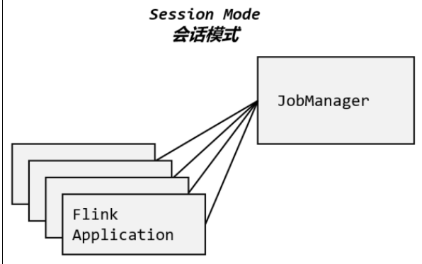

​		这样的好处很明显，我们只需要一个集群，就像一个大箱子，所有的作业提交之后都塞进去；集群的生命周期是超越于作业之上的，铁打的营盘流水的兵，作业结束了就释放资源，集群依然正常运行。当然缺点也是显而易见的：因为资源是共享的，所以资源不够了，提交新的作业就会失败。另外，同一个 TaskManager 上可能运行了很多作业，如果其中一个发生故障导致 TaskManager 宕机，那么所有作业都会受到影响。

​		3.1 中先启动集群再提交作业，这种方式其实就是会话模式。

​		会话模式比较适合于单个规模小、执行时间短的大量作业。

### 3.2.2 单作业模式（Per-Job Mode）

​	会话模式因为资源共享会导致很多问题，所以为了更好地隔离资源，我们可以考虑为每个提交的作业启动一个集群，这就是所谓的单作业（Per-Job）模式，如下图所示。

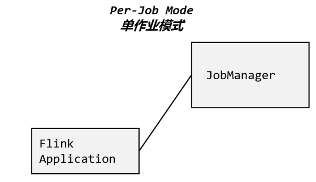

单作业模式也很好理解，就是严格的一对一，集群只为这个作业而生。同样由客户端运行应用程序，然后启动集群，作业被提交给 JobManager，进而分发给 TaskManager 执行。作业作业完成后，集群就会关闭，所有资源也会释放。这样一来，每个作业都有它自己的 JobManager管理，占用独享的资源，即使发生故障，它的 TaskManager 宕机也不会影响其他作业。

​		这些特性使得单作业模式在生产环境运行更加稳定，所以是实际应用的首选模式。

​		需要注意的是，Flink 本身无法直接这样运行，所以单作业模式一般需要借助一些资源管理框架来启动集群，比如 YARN、Kubernetes。


### 3.2.3 应用模式（Application Mode）

​		前面提到的两种模式下，应用代码都是在客户端上执行，然后由客户端提交给 JobManager的。但是这种方式客户端需要占用大量网络带宽，去下载依赖和把二进制数据发送给JobManager；加上很多情况下我们提交作业用的是同一个客户端，就会加重客户端所在节点的资源消耗。

​		所以解决办法就是，我们不要客户端了，直接把应用提交到 JobManger 上运行。而这也就代表着，我们需要为每一个提交的应用单独启动一个 JobManager，也就是创建一个集群。这个 JobManager 只为执行这一个应用而存在，执行结束之后 JobManager 也就关闭了，这就是所谓的应用模式，如下图所示。

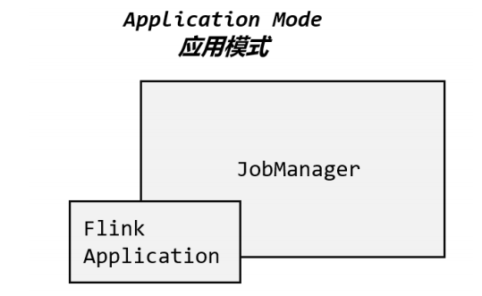

​		应用模式与单作业模式，都是提交作业之后才创建集群；单作业模式是通过客户端来提交的，客户端解析出的每一个作业对应一个集群；而应用模式下，是直接由 JobManager 执行应用程序的，并且即使应用包含了多个作业，也只创建一个集群。

​		总结一下，在会话模式下，集群的生命周期独立于集群上运行的任何作业的生命周期，并且提交的所有作业共享资源。而单作业模式为每个提交的作业创建一个集群，带来了更好的资源隔离，这时集群的生命周期与作业的生命周期绑定。最后，应用模式为每个应用程序创建一个会话集群，在 JobManager 上直接调用应用程序的 main()方法。

​		部署模式，相对是比较抽象的概念。实际应用时，一般需要和资源管理平台结合起来，选择特定的模式来分配资源、部署应用。


## 3.3 独立模式（Standalone）

​		独立模式（Standalone）是部署 Flink 最基本也是最简单的方式：所需要的所有 Flink 组件，都只是操作系统上运行的一个 JVM 进程。

​		独立模式是独立运行的，不依赖任何外部的资源管理平台；当然独立也是有代价的：如果资源不足，或者出现故障，没有自动扩展或重分配资源的保证，必须手动处理。所以独立模式一般只用在开发测试或作业非常少的场景下。

​		另外，我们也可以将独立模式的集群放在容器中运行。Flink 提供了独立模式的容器化部署方式，可以在 Docker 或者 Kubernetes 上进行部署。

### 3.3.1 会话模式部署

​		可以发现，独立模式的特点是不依赖外部资源管理平台，而会话模式的特点是先启动集群、后提交作业。3.1 用的就是独立模式（Standalone）的会话模式部署。

### 3.3.2 单作业模式部署

​		在 3.2.2 ，Flink 本身无法直接以单作业方式启动集群，一般需要借助一些资源管理平台。所以 Flink 的独立（Standalone）集群并不支持单作业模式部署。

### 3.3.3 应用模式部署

​		应用模式下不会提前创建集群，所以不能调用 start-cluster.sh 脚本。可以使用同样在bin 目录下的 standalone-job.sh 来创建一个 JobManager。

​		具体步骤如下：

（1）进入到 Flink 的安装路径下，将应用程序的 jar 包放到 lib/目录下。

```
$ cp ./FlinkTutorial-1.0-SNAPSHOT.jar lib/
```

（2）执行以下命令，启动 JobManager。

```
$ ./bin/standalone-job.sh start --job-classname com.atguigu.wc.StreamWordCount
```

这里我们直接指定作业入口类，脚本会到 lib 目录扫描所有的 jar 包。

（3）同样是使用 bin 目录下的脚本，启动 TaskManager。

```
$ ./bin/taskmanager.sh start
```

（4）如果希望停掉集群，同样可以使用脚本，命令如下。

```
$ ./bin/standalone-job.sh stop

$ ./bin/taskmanager.sh stop
```


### 3.3.4 高可用(High Availability )

​		分布式除了提供高吞吐，另一大好处就是有更好的容错性。对于 Flink 而言，因为一般会有多个 TaskManager，即使运行时出现故障，也不需要将全部节点重启，只要尝试重启故障节点就可以了。但是我们发现，针对一个作业而言，管理它的 JobManager 却只有一个，这同样有可能出现单点故障。为了实现更好的可用性，我们需要 JobManager 做一些主备冗余，这就是所谓的高可用（High Availability，简称 HA）。

​		我们可以通过配置，让集群在任何时候都有一个主 JobManager 和多个备用 JobManagers，这样主节点故障时就由备用节点来接管集群，接管后作业就可以继续正常运行。主备 JobManager 实例之间没有明显的区别，每个 JobManager 都可以充当主节点或者备节点。

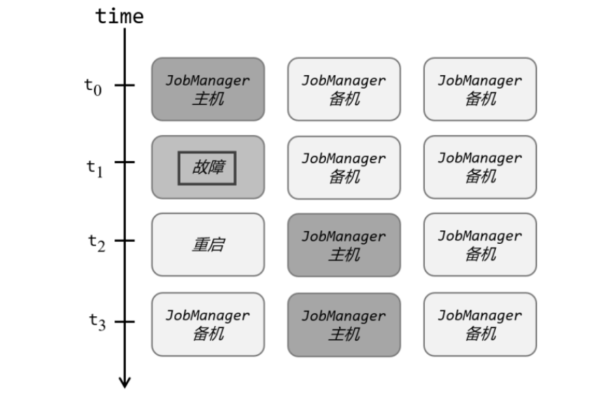

​																				一个主 JobManager 多个备用 JobManager

具体配置如下：

（1）进入 Flink 的安装路径下的 conf 目录下，修改配置文件: flink-conf.yaml，增加如下配

置。

```properties
high-availability: zookeeper

high-availability.storageDir: hdfs://hadoop102:9820/flink/standalone/ha

high-availability.zookeeper.quorum: hadoop102:2181,hadoop103:2181,hadoop104:2181

high-availability.zookeeper.path.root: /flink-standalone

high-availability.cluster-id: /cluster_atguigu
```

（2）修改配置文件: masters，配置备用 JobManager 列表。

```
hadoop102:8081

hadoop103:8081
```

（3）分发修改后的配置文件到其他节点服务器。

（4）在/etc/profile.d/my_env.sh 中配置环境变量

```bash
export HADOOP_CLASSPATH=`hadoop classpath`
```

注意:

- 需要提前保证 HAOOP_HOME 环境变量配置成功

- 分发到其他节点


具体部署方法如下：

（1）首先启动 HDFS 集群和 Zookeeper 集群。

（2）执行以下命令，启动 standalone HA 集群。

```
$ bin/start-cluster.sh
```

（3）可以分别访问两个备用 JobManager 的 Web UI 页面。

http://hadoop102:8081

http://hadoop103:8081

（4）在 zkCli.sh 中查看谁是 leader。

```
[zk: localhost:2181(CONNECTED) 1] get /flink-standalone/cluster_atguigu/leader/rest_server_lock
```

杀死 hadoop102 上的 Jobmanager, 再看 leader。

```
[zk: localhost:2181(CONNECTED) 7] get /flink-standalone/cluster_atguigu/leader/rest_server_lock
```

注意: 不管是不是 leader，从 WEB UI 上是看不到区别的, 都可以提交应用。


## 3.4 YARN 模式

> [4.6 Flink-流处理框架-Flink On Yarn（Session-cluster+Per-Job-Cluster）](https://blog.csdn.net/suyebiubiu/article/details/111874245)	<=	下面内容出自此处，主要方便索引图片URL

​		独立（Standalone）模式由 Flink 自身提供资源，无需其他框架，这种方式降低了和其他第三方资源框架的耦合性，独立性非常强。但Flink 是大数据计算框架，不是资源调度框架，这并不是它的强项；所以还是应该让专业的框架做专业的事，和其他资源调度框架集成更靠谱。而在目前大数据生态中，国内应用最为广泛的资源管理平台就是 YARN 了。

​		整体来说，YARN 上部署的过程是：客户端把 Flink 应用提交给 Yarn 的 ResourceManager, Yarn 的 ResourceManager 会向 Yarn 的 NodeManager 申请容器。在这些容器上，Flink 会部署JobManager 和 TaskManager 的实例，从而启动集群。Flink 会根据运行在 JobManger 上的作业所需要的 Slot 数量动态分配 TaskManager 资源。

### 3.4.1 相关准备和配置

​		在 Flink1.8.0 之前的版本，想要以 YARN 模式部署 Flink 任务时，需要 Flink 是有 Hadoop支持的。从 Flink 1.8 版本开始，不再提供基于 Hadoop 编译的安装包，若需要 Hadoop 的环境支持，需要自行在官网下载 Hadoop 相关版本的组件 flink-shaded-hadoop-2-uber-2.7.5-10.0.jar，并将该组件上传至 Flink 的 lib 目录下。在 Flink 1.11.0 版本之后，增加了很多重要新特性，其中就包括增加了对Hadoop3.0.0以及更高版本Hadoop的支持，不再提供“flink-shaded-hadoop-*”jar 包，而是通过配置环境变量完成与 YARN 集群的对接。

​		**在将 Flink 任务部署至 YARN 集群之前，需要确认集群是否安装有 Hadoop，保证 Hadoop版本至少在 2.2 以上，并且集群中安装有 HDFS 服务。**

​		具体配置步骤如下：

​		（1）按照 3.1 节所述，下载并解压安装包，并将解压后的安装包重命名为 flink-1.13.0-yarn，

​		本节的相关操作都将默认在此安装路径下执行。

​		（2）配置环境变量，增加环境变量配置如下：

```
$ sudo vim /etc/profile.d/my_env.sh
https://blog.csdn.net/huanby/article/details/123103191

因为用的是公司环境91，只能配置当前登录用户的环境变量
vim ~/.bash_profile
设置当前登录用户环境变量，在最后一行添加 export [变量名称]=[变量设置值]。
生效时间：当前用户打开新终端生效，或者执行 source ~/.bash_profile 生效

生效期限：永久有效

生效范围：仅对当前用户有效

HADOOP_HOME=/opt/module/hadoop-2.7.5

export PATH=$PATH:$HADOOP_HOME/bin:$HADOOP_HOME/sbin

export HADOOP_CONF_DIR=${HADOOP_HOME}/etc/hadoop

export HADOOP_CLASSPATH=`hadoop classpath`
```

这里必须保证设置了环境变量 HADOOP_CLASSPATH。

（3）启动 Hadoop 集群，包括 HDFS 和 YARN。

```
[atguigu@hadoop102 ~]$ start-dfs.sh

[atguigu@hadoop103 ~]$ start-yarn.sh
```

分别在 3 台节点服务器查看进程启动情况。

```
[atguigu@hadoop102 ~]$ jps

5190 Jps

5062 NodeManager

4408 NameNode

4589 DataNode

[atguigu@hadoop103 ~]$ jps

5425 Jps

4680 ResourceManager

5241 NodeManager

4447 DataNode

[atguigu@hadoop104 ~]$ jps

4731 NodeManager

4333 DataNode

4861 Jps

4478 SecondaryNameNode
```

（4）进入 conf 目录，修改 flink-conf.yaml 文件，修改以下配置，若在提交命令中不特定指明，这些配置将作为默认配置。

```
$ cd /opt/module/flink-1.13.0-yarn/conf/

$ vim flink-conf.yaml

jobmanager.memory.process.size: 1600m

taskmanager.memory.process.size: 1728m

taskmanager.numberOfTaskSlots: 8

parallelism.default: 1
```


### 3.4.2 会话模式部署

​		YARN 的会话模式与独立集群略有不同，需要首先申请一个 YARN 会话（YARN session）来启动 Flink 集群。

​		Session-Cluster 模式需要先启动集群，然后再提交作业，接着会向 yarn 申请一块空间后，**资源永远保持不变**。如果资源满了，下一个作业就无法提交，只能等到 yarn 中的其中一个作业执行完成后，释放了资源，下个作业才会正常提交。**所有作业共享 Dispatcher 和 ResourceManager**；**共享资源；适合规模小执行时间短的作业。**

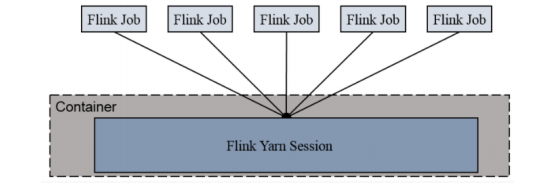

​		**在 yarn 中初始化一个 flink 集群，开辟指定的资源，以后提交任务都向这里提交。这个 flink 集群会常驻在 yarn 集群中，除非手工停止。**

具体步骤如下：

#### 1.启动集群

（1）启动 hadoop 集群(HDFS, YARN)。

（2）执行脚本命令向 YARN 集群申请资源，开启一个 YARN 会话，启动 Flink 集群。

```
$ bin/yarn-session.sh -nm test
```

可用参数解读：

-  -d：分离模式，如果你不想让 Flink YARN 客户端一直前台运行，可以使用这个参数，即使关掉当前对话窗口，YARN session 也可以后台运行。

-  -jm(--jobManagerMemory)：配置 JobManager 所需内存，默认单位 MB。

-  -nm(--name)：配置在 YARN UI 界面上显示的任务名。

-  -qu(--queue)：指定 YARN 队列名。

-  -tm(--taskManager)：配置每个 TaskManager 所使用内存。


​		注意：Flink1.11.0 版本不再使用-n 参数和-s 参数分别指定 TaskManager 数量和 slot 数量，YARN 会按照需求动态分配 TaskManager 和 slot。所以从这个意义上讲，YARN 的会话模式也不会把集群资源固定，同样是动态分配的。

​		YARN Session 启动之后会给出一个 web UI 地址以及一个 YARN application ID，如下所示，用户可以通过 web UI 或者命令行两种方式提交作业。

```
2021-06-03 15:54:27,069 INFO org.apache.flink.yarn.YarnClusterDescriptor 

[] - YARN application has been deployed successfully.

2021-06-03 15:54:27,070 INFO org.apache.flink.yarn.YarnClusterDescriptor 

[] - Found Web Interface hadoop104:39735 of application 'application_1622535605178_0003'.

JobManager Web Interface: http://hadoop104:39735
```

#### 2. 提交作业

（1）通过 Web UI 提交作业

这种方式比较简单，与上文所述 Standalone 部署模式基本相同。

（2）通过命令行提交作业

① 将 Standalone 模式讲解中打包好的任务运行 JAR 包上传至集群

② 执行以下命令将该任务提交到已经开启的 Yarn-Session 中运行。

```
$ bin/flink run -c com.atguigu.wc.StreamWordCount FlinkTutorial-1.0-SNAPSHOT.jar
```

​		客户端可以自行确定 JobManager 的地址，也可以通过-m 或者-jobmanager 参数指定JobManager 的地址，JobManager 的地址在 YARN Session 的启动页面中可以找到。

③ 任务提交成功后，可在 YARN 的 Web UI 界面查看运行情况。

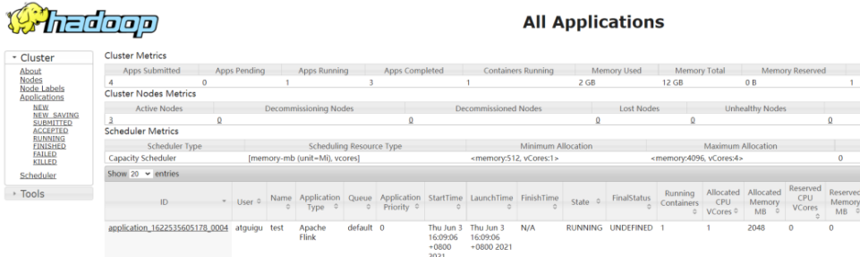

​																						图 3-14 YARN 的 Web UI 界面

​		如图 3-14 所示，从图中可以看到我们创建的 Yarn-Session 实际上是一个 Yarn 的Application，并且有唯一的 Application ID。

④也可以通过 Flink 的 Web UI 页面查看提交任务的运行情况，如图 3-15 所示。

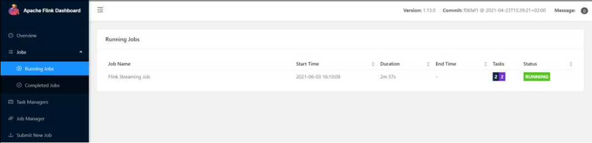

​																						图 3-15 Flink 的 Web UI 页面

### 3.4.3 单作业模式部署

​		在 YARN 环境中，由于有了外部平台做资源调度，所以我们也可以直接向 YARN 提交一个单独的作业，从而启动一个 Flink 集群。

​		一个 Job 会对应一个集群，每提交一个作业会根据自身的情况，都会单独向 yarn 申请资源，直到作业执行完成，一个作业的失败与否并不会影响下一个作业的正常提交和运行。**独享 Dispatcher 和 ResourceManager**，按需接受资源申请；适合规模大长时间运行的作业。

​		**每次提交都会创建一个新的 flink 集群，任务之间互相独立，互不影响，方便管理。任务执行完成之后创建的集群也会消失。**

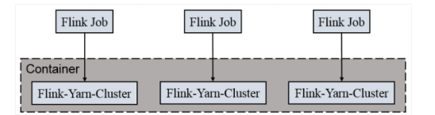

（1）执行命令提交作业。

```
$ bin/flink run -d -t yarn-per-job -c com.atguigu.wc.StreamWordCount FlinkTutorial-1.0-SNAPSHOT.jar
```

​		早期版本也有另一种写法：

```
$ bin/flink run -m yarn-cluster -c com.atguigu.wc.StreamWordCount FlinkTutorial-1.0-SNAPSHOT.jar
```

​		注意这里是通过参数-m yarn-cluster 指定向 YARN 集群提交任务。

（2）在 YARN 的 ResourceManager 界面查看执行情况，如图 3-16 所示。

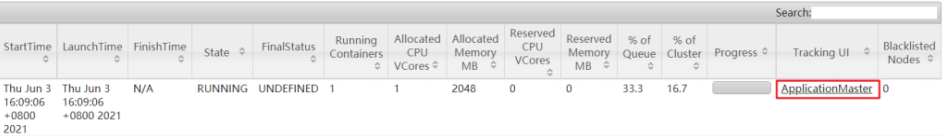

​																				图 3-16 YARN 的 ResourceManager 界面

​		点击可以打开 Flink Web UI 页面进行监控，如图 3-17 所示：

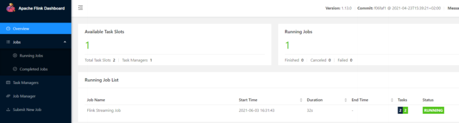

（3）可以使用命令行查看或取消作业，命令如下

```
$ ./bin/flink list -t yarn-per-job -Dyarn.application.id=application_XXXX_YY

$ ./bin/flink cancel -t yarn-per-job -Dyarn.application.id=application_XXXX_YY <jobId>
```

​		这里的 application_XXXX_YY 是当前应用的 ID，<jobId>是作业的 ID。注意如果取消作业，整个 Flink 集群也会停掉。

### 3.4.4 应用模式部署

​		应用模式同样非常简单，与单作业模式类似，直接执行 flink run-application 命令即可。

（1）执行命令提交作业。

```
$ bin/flink run-application -t yarn-application -c com.atguigu.wc.StreamWordCount FlinkTutorial-1.0-SNAPSHOT.jar
```

（2）在命令行中查看或取消作业。

```
$ ./bin/flink list -t yarn-application -Dyarn.application.id=application_XXXX_YY

$ ./bin/flink cancel -t yarn-application -Dyarn.application.id=application_XXXX_YY <jobId>
```

（3）也可以通过 yarn.provided.lib.dirs 配置选项指定位置，将 jar 上传到远程。

```
$ ./bin/flink run-application -t yarn-application -Dyarn.provided.lib.dirs="hdfs://myhdfs/my-remote-flink-dist-dir" hdfs://myhdfs/jars/my-application.jar
```

​		这种方式下 jar 可以预先上传到 HDFS，而不需要单独发送到集群，这就使得作业提交更加轻量了。

### 3.4.5 高可用

​		YARN 模式的高可用和独立模式（Standalone）的高可用原理不一样。

​		Standalone 模式中, 同时启动多个 JobManager, 一个为“领导者”（leader），其他为“后备”（standby）, 当 leader 挂了, 其他的才会有一个成为 leader。

​		而 YARN 的高可用是只启动一个 Jobmanager, 当这个 Jobmanager 挂了之后, YARN 会再次启动一个, 所以其实是利用的 YARN 的重试次数来实现的高可用。

（1）在 yarn-site.xml 中配置。

```xml
<property>
 <name>yarn.resourcemanager.am.max-attempts</name>
 <value>4</value>
 <description>
 The maximum number of application master execution attempts.
 </description>
</property>
```

​		**注意: 配置完不要忘记分发, 和重启 YARN。**

（2）在 flink-conf.yaml 中配置。yarn.application-attempts: 3

```
high-availability: zookeeper

high-availability.storageDir: hdfs://hadoop102:9820/flink/yarn/ha

high-availability.zookeeper.quorum: 

hadoop102:2181,hadoop103:2181,hadoop104:2181

high-availability.zookeeper.path.root: /flink-yarn
```

（3）启动 yarn-session。

（4）杀死 JobManager, 查看复活情况。

​		**注意: yarn-site.xml 中配置的是 JobManager 重启次数的上限, flink-conf.xml 中的次数应该小于这个值。**

## 3.5 K8S 模式

​		容器化部署是如今业界流行的一项技术，基于 Docker 镜像运行能够让用户更加方便地对应用进行管理和运维。容器管理工具中最为流行的就是 Kubernetes（k8s），而 Flink 也在最近的版本中支持了 k8s 部署模式。基本原理与 YARN 是类似的，具体配置可以参见官网说明。

1. 搭建*Kubernetes*集群（略）

2. 配置各组件的*yaml*文件

​	在k8s上构建Flink Session Cluster，需要将Flink集群的组件对应的docker镜像分别在k8s上启动，包括JobManager、TaskManager、JobManagerService三个镜像服务。每个镜像服务都可以从中央镜像仓库中获取。

3. 启动*Flink Session Cluster*

   ```shell
   // 启动jobmanager-service 服务
   kubectl create -f jobmanager-service.yaml
   // 启动jobmanager-deployment服务
   kubectl create -f jobmanager-deployment.yaml
   // 启动taskmanager-deployment服务
   kubectl create -f taskmanager-deployment.yaml
   ```

4. 访问*Flink UI*页面

   集群启动后，就可以通过JobManagerServicers中配置的WebUI端口，用浏览器输入以下url来访问Flink UI页面了：

   `http://{JobManagerHost:Port}/api/v1/namespaces/default/services/flink-jobmanager:ui/proxy`

## 3.6 本章总结

​		Flink 支持多种不同的部署模式，还可以和不同的资源管理平台方便地集成。本章从快速启动的示例入手，接着介绍了 Flink 中几种部署模式的区别，并进一步针对不同的资源提供者展开讲解了具体的部署操作。在这个过程中，我们不仅熟悉了 Flink 的使用方法，而且接触到了很多内部运行原理的知识。


# 4.Flink 运行时架构

> [Flink-运行时架构中的四大组件|任务提交流程|任务调度原理|Slots和并行度中间的关系|数据流|执行图|数据得传输形式|任务链](https://blog.csdn.net/qq_40180229/article/details/106321149)

## 4.1 系统架构

### 4.1.1 整体构成

​		Flink运行时架构主要包括四个不同的组件，它们会在运行流处理应用程序时协同工作：

- **作业管理器（JobManager）**
- **资源管理器（ResourceManager）**
- **任务管理器（TaskManager）**
- **分发器（Dispatcher）**


​		Flink 的运行时架构中，最重要的就是两大组件：作业管理器（JobManger）和任务管理器（TaskManager）。对于一个提交执行的作业，JobManager 是真正意义上的“管理者”（Master），负责管理调度，所以在不考虑高可用的情况下只能有一个；而 TaskManager 是“工作者”（Worker、Slave），负责执行任务处理数据，所以可以有一个或多个。Flink 的作业提交和任务处理时的系统如图所示。

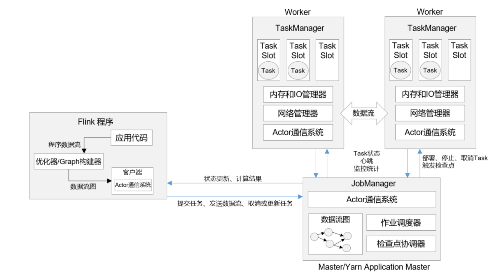

​		客户端并不是处理系统的一部分，它只负责作业的提交。具体来说，就是调用程序的 main 方法，将代码转换成“数据流图”（Dataflow Graph），并最终生成作业图（JobGraph），一并发送给 JobManager。提交之后，任务的执行其实就跟客户端没有关系了；我们可以在客户端选择断开与 JobManager 的连接, 也可以继续保持连接。之前我们在命令提交作业时，加上的-d 参数，就是表示分离模式（detached mode)，也就是断开连接。

​		客户端可以随时连接到 JobManager，获取当前作业的状态和执行结果，也可以发送请求取消作业。上一章中不论通过 Web UI 还是命令行执行“flink run”的相关操作，都是通过客户端实现的。

​		JobManager 和 TaskManagers 可以以不同的方式启动：

- 作为独立（Standalone）集群的进程，直接在机器上启动
- 在容器中启动
- 由资源管理平台调度启动，比如 YARN、K8S这其实就对应着不同的部署方式。

​		TaskManager 启动之后，JobManager 会与它建立连接，并将作业图（JobGraph）转换成可执行的“执行图”（ExecutionGraph）分发给可用的 TaskManager，然后就由 TaskManager 具体执行任务。

### 4.1.2 作业管理器（JobManager）

​		JobManager 是一个 Flink 集群中任务管理和调度的核心，是控制应用执行的主进程。也就是说，每个应用都应该被唯一的 JobManager 所控制执行。当然，在高可用（HA）的场景下，可能会出现多个 JobManager；这时只有一个是正在运行的领导节点（leader），其他都是备用节点（standby）。

​		JobManager 又包含 3 个不同的组件：

#### 1. JobMaster

​		JobMaster 是 JobManager 中最核心的组件，负责处理单独的作业（Job）。所以 JobMaster和具体的 Job 是一一对应的，多个 Job 可以同时运行在一个 Flink 集群中, 每个 Job 都有一个自己的 JobMaster。需要注意在早期版本的 Flink 中，没有 JobMaster 的概念；而 JobManager的概念范围较小，实际指的就是现在所说的 JobMaster。

​		在作业提交时，JobMaster 会先接收到要执行的应用。这里所说“应用”一般是客户端提交来的，包括：Jar 包，数据流图（dataflow graph），和作业图（JobGraph）。

​		JobMaster 会把 JobGraph 转换成一个物理层面的数据流图，这个图被叫作“执行图”（ExecutionGraph），它包含了所有可以并发执行的任务。 JobMaster 会向资源管理器（ResourceManager）发出请求，申请执行任务必要的资源。一旦它获取到了足够的资源，就会将执行图分发到真正运行它们的 TaskManager 上。

​		而在运行过程中，JobMaster 会负责所有需要中央协调的操作，比如说检查点（checkpoints）的协调。

#### 2.资源管理器（ResourceManager）

​		ResourceManager 主要负责资源的分配和管理，在 Flink 集群中只有一个。所谓“资源”，主要是指 TaskManager 的任务槽（task slots）。任务槽就是 Flink 集群中的资源调配单元，包含了机器用来执行计算的一组 CPU 和内存资源。每一个任务（Task）都需要分配到一个 slot 上执行。

​		这里注意要把 Flink 内置的 ResourceManager 和其他资源管理平台（比如 YARN）的ResourceManager 区分开。

​		Flink 的 ResourceManager，针对不同的环境和资源管理平台（比如 Standalone 部署，或者YARN），有不同的具体实现。在 Standalone 部署时，因为 TaskManager 是单独启动的（没有Per-Job 模式），所以 ResourceManager 只能分发可用 TaskManager 的任务槽，不能单独启动新TaskManager。

​		而在有资源管理平台时，就不受此限制。当新的作业申请资源时，ResourceManager 会将有空闲槽位的 TaskManager 分配给 JobMaster。如果 ResourceManager 没有足够的任务槽，它还可以向资源提供平台发起会话，请求提供启动 TaskManager 进程的容器。另外，ResourceManager 还负责停掉空闲的 TaskManager，释放计算资源。

#### 3.分发器（Dispatcher）

​		Dispatcher 主要负责提供一个 REST 接口，用来提交应用，并且负责为每一个新提交的作业启动一个新的 JobMaster 组件。

​		当一个应用被提交执行时，分发器就会启动并将应用移交给一个JobManager。由于是REST接口，所以Dispatcher可以作为集群的一个HTTP接入点，这样就能够不受防火墙阻挡。

​		Dispatcher 也会启动一个 Web UI，用来方便地展示和监控作业执行的信息。Dispatcher 在架构中并不是必需的，*，这取决于应用提交运行的方式。*在不同的部署模式下可能会被忽略掉。

### 4.1.3 任务管理器（TaskManager）

​		TaskManager 是 Flink 中的工作进程，数据流的具体计算就是它来做的，所以也被称为“Worker”。Flink 集群中必须至少有一个 TaskManager；当然由于分布式计算的考虑，通常会有多个 TaskManager 运行，每一个 TaskManager 都包含了一定数量的任务槽（task slots）。Slot是资源调度的最小单位，slot 的数量限制了 TaskManager 能够并行处理的任务数量。

​		启动之后，TaskManager 会向资源管理器注册它的 slots；收到资源管理器的指令后，TaskManager 就会将一个或者多个槽位提供给 JobMaster 调用，JobMaster 就可以分配任务来执行了。

​		在执行过程中，TaskManager 可以缓冲数据，还可以跟其他运行同一应用的 TaskManager交换数据

## 4.2 作业提交流程

### 4.2.1 高层级抽象视角

​		Flink 的提交流程，随着部署模式、资源管理平台的不同，会有不同的变化。

​		先从一个高层级的视角，抽象提炼，看一看作业提交时宏观上各组件是怎样交互协作的。

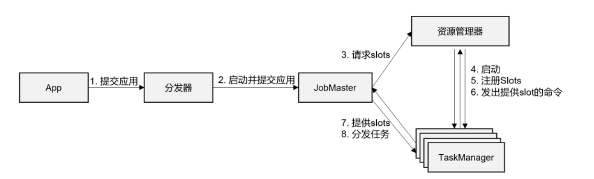

具体步骤如下：

（1） 一般情况下，由客户端（App）通过分发器提供的 REST 接口，将作业提交给JobManager。

（2）由分发器启动 JobMaster，并将作业（包含 JobGraph）提交给 JobMaster。

（3）JobMaster 将 JobGraph 解析为可执行的 ExecutionGraph，得到所需的资源数量，然后向资源管理器请求资源（slots）。

（4）资源管理器判断当前是否由足够的可用资源；如果没有，启动新的 TaskManager。

（5）TaskManager 启动之后，向 ResourceManager 注册自己的可用任务槽（slots）。

（6）资源管理器通知 TaskManager 为新的作业提供 slots。

（7）TaskManager 连接到对应的 JobMaster，提供 slots。

（8）JobManager提交要在slots中执行的任务给TaskManager。

（9）TaskManager 执行任务，互相之间可以交换数据。

​		如果部署模式不同，或者集群环境不同（例如 Standalone、YARN、K8S 等），其中一些步骤可能会不同或被省略，也可能有些组件会运行在同一个 JVM 进程中。比如我们在上一章实践过的独立集群环境的会话模式，就是需要先启动集群，如果资源不够，只能等待资源释放，而不会直接启动新的 TaskManager。

### 4.2.2 独立模式（Standalone）

​		在独立模式（Standalone）下，只有会话模式和应用模式两种部署方式。两者整体来看流程是非常相似的：TaskManager 都需要手动启动，所以当 ResourceManager 收到 JobMaster 的请求时，会直接要求 TaskManager 提供资源。而 JobMaster 的启动时间点，会话模式是预先启动，应用模式则是在作业提交时启动。提交的整体流程如图 4-3 所示。

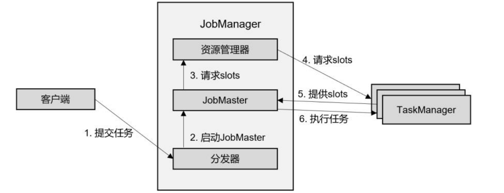

​		除去第 4 步不会启动 TaskManager，而且直接向已有的 TaskManager 要求资源，其他步骤与上一节所讲抽象流程完全一致。

### 4.2.3 YARN 集群

​		接下来我们再看一下有资源管理平台时，具体的提交流程。我们以 YARN 为例，分不同的部署模式来做具体说明。

#### 1. 会话（Session）模式

​		在会话模式下，我们需要先启动一个 YARN session，这个会话会创建一个 Flink 集群。

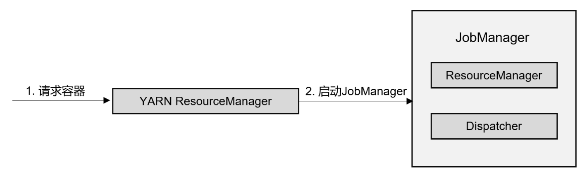

​		这里只启动了 JobManager，而 TaskManager 可以根据需要动态地启动。在 JobManager 内部，由于还没有提交作业，所以只有 ResourceManager 和 Dispatcher 在运行，如上图所示。

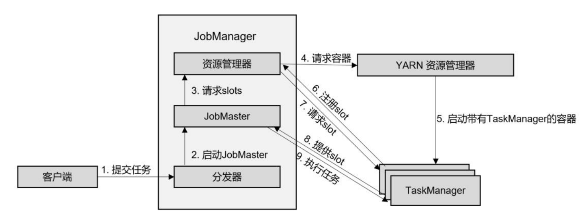

​		接下来就是真正提交作业的流程，如上图所示：

（1）客户端通过 REST 接口，将作业提交给分发器。

（2）分发器启动 JobMaster，并将作业（包含 JobGraph）提交给 JobMaster。

（3）JobMaster 向资源管理器请求资源（slots）。

（4）资源管理器向 YARN 的资源管理器请求 container 资源。

（5）YARN 启动新的 TaskManager 容器。

（6）TaskManager 启动之后，向 Flink 的资源管理器注册自己的可用任务槽。

（7）资源管理器通知 TaskManager 为新的作业提供 slots。

（8）TaskManager 连接到对应的 JobMaster，提供 slots。

（9）JobMaster 将需要执行的任务分发给 TaskManager，执行任务。

​		可见，整个流程除了请求资源时要“上报”YARN 的资源管理器，其他与 4.2.1 节所述抽象流程几乎完全一样

#### 2. 单作业（Per-Job）模式

​		在单作业模式下，Flink 集群不会预先启动，而是在提交作业时，才启动新的 JobManager。具体流程如图 4-6 所示

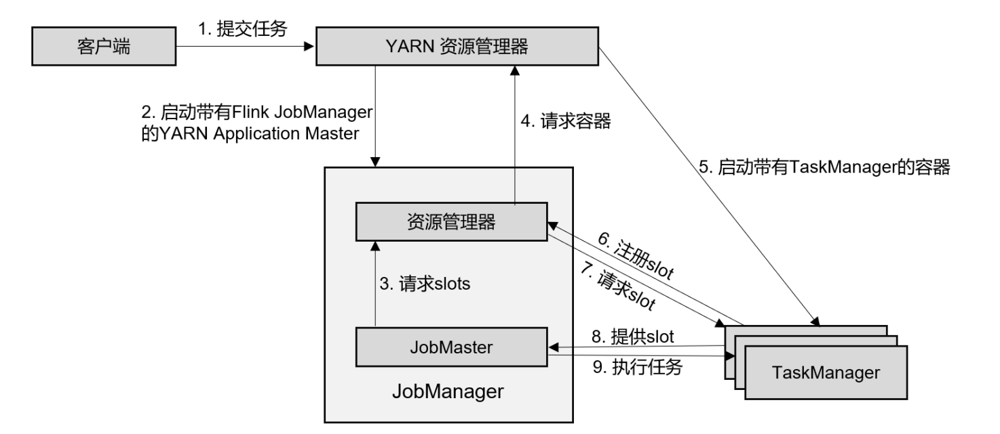

（1）客户端将作业提交给 YARN 的资源管理器(Yarn ResourceManage)，这一步中会同时将 Flink 的 Jar 包和配置上传到 HDFS，以便后续启动 Flink 相关组件的容器。

（2）YARN 的资源管理器分配 Container 资源并通知对应的NodeManager启动ApplicationMaster，ApplicationMaster启动后加载Flink的Jar包和配置构建环境，去启动 Flink JobManager，并将作业提交给JobMaster。这里省略了 Dispatcher 组件。

（3）JobMaster 向资源管理器(**Yarn 的ResourceManager**)请求资源（slots）**(因为是yarn模式，所有资源归yarn RM管理)启动TaskManager**。

（4）资源管理器向 YARN 的资源管理器请求 container 资源。

（5）YARN 启动新的 TaskManager 容器。Yarn ResourceManager分配Container资源后，由ApplicationMaster通知资源所在节点的NodeManager启动TaskManage，NodeManager加载Flink的Jar包和配置构建环境并启动TaskManager。

（6）TaskManager 启动之后，向 Flink 的资源管理器注册自己的可用任务槽。

（7）资源管理器通知 TaskManager 为新的作业提供 slots。

（8）TaskManager 连接到对应的 JobMaster，提供 slots。

（9）JobMaster 将需要执行的任务分发给 TaskManager，执行任务。

​	可见，区别只在于 JobManager 的启动方式，以及省去了分发器。当第 2 步作业提交给JobMaster，之后的流程就与会话模式完全一样了。

#### 3. 应用（Application）模式

​		应用模式与单作业模式的提交流程非常相似，只是初始提交给 YARN 资源管理器的不再是具体的作业，而是整个应用。一个应用中可能包含了多个作业，这些作业都将在 Flink 集群中启动各自对应的 JobMaster。

## 4.3 一些重要概念

​	一个具体的作业，是怎样从我们编写的代码，转换成 TaskManager 可以执行的任务的？JobManager 收到提交的作业，又是怎样确定总共有多少任务、需要多少资源？

### 4.3.1 数据流图（Dataflow Graph）

​		Flink 是流式计算框架。它的程序结构，其实就是定义了一连串的处理操作，每一个数据输入之后都会依次调用每一步计算。在 Flink 代码中，我们定义的每一个处理转换操作都叫作“算子”（Operator），所以我们的程序可以看作是一串算子构成的管道，数据则像水流一样有序地流过。

​		所有的 Flink 程序都可以归纳为由三部分构成：Source、Transformation 和 Sink。

- Source 表示“源算子”，负责读取数据源。
- Transformation 表示“转换算子”，利用各种算子进行处理加工。
- Sink 表示“下沉算子”，负责数据的输出

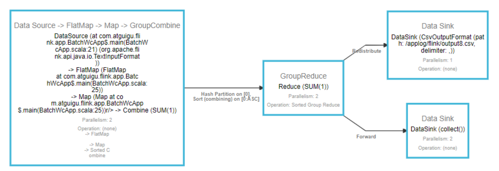

​		在运行时，Flink 程序会被映射成所有算子按照逻辑顺序连接在一起的一张图，这被称为“逻辑数据流”（logical dataflow），或者叫“数据流图”（dataflow graph）。我们提交作业之后，打开 Flink 自带的 Web UI，点击作业就能看到对应的 dataflow，如图 4-7 所示。在数据流图中，可以清楚地看到 Source、Transformation、Sink 三部分。

​		数据流图dataflow graph类似于任意的有向无环图（DAG），这一点与 Spark 等其他框架是一致的。图中的每一条数据流（dataflow）以一个或多个 source 算子开始，以一个或多个 sink 算子结束。

​		在大部分情况下，dataflow 中的算子，和程序中的转换运算是一一对应的关系。代码中基于 DataStream API 的每一个方法调用，并非都对应一个算子。

​		除了 Source 读取数据和 Sink 输出数据，一个中间的转换算子（Transformation Operator）必须是一个转换处理的操作；而在代码中有一些方法调用，数据是没有完成转换的。可能只是对属性做了一个设置，也可能定义的是数据的传递方式而非转换，又或者是需要几个方法合在一起才能表达一个完整的转换操作。例如，在之前的代码中，用到了定义分组的方法 keyBy，它就只是一个数据分区操作，而并不是一个算子。事实上，代码中可以看到调用其他转换操作之后返回的数据类型是 SingleOutputStreamOperator，说明这是一个算子操作；而 keyBy 之后返回的数据类型是 KeyedStream。

### 4.3.2 并行度（Parallelism）

​		一个算子操作就应该是一个任务。那是不是程序中的算子数量，就是最终执行的任务数呢？

#### 1. 什么是并行计算

​		对于 Spark而言，是把根据程序生成的 DAG 划分阶段（stage）、进而分配任务的。而对于 Flink 这样的流式引擎，其实没有划分 stage 的必要。因为数据是连续不断到来的，完全可以按照数据流图建立一个“流水线”，前一个操作处理完成，就发往处理下一步操作的节点。如果说 Spark基于 MapReduce 架构的思想是“数据不动代码动”，那么 Flink 就类似“代码不动数据流动”，原因就在于流式数据本身是连续到来的、我们不会同时传输所有数据，这其实是更符合数据流本身特点的处理方式。

​		在大数据场景下，都是依靠分布式架构做并行计算，从而提高数据吞吐量的。既然处理完一个操作就可以把数据发往别处，那我们就可以将不同的算子操作任务，分配到不同的节点上执行了。这样就对任务做了分摊，实现了并行处理。

​		但是仔细分析会发现，这种“并行”其实并不彻底。因为算子之间是有执行顺序的，对一条数据来说必须依次执行；而一个算子在同一时刻只能处理一个数据。比如之前 WordCount，一条数据到来之后，我们必须先用 source 算子读进来、再做 flatMap 转换；一条数据被 source读入的同时，之前的数据可能正在被 flatMap 处理，这样不同的算子任务是并行的。但如果多条数据同时到来，一个算子是没有办法同时处理的，我们还是需要等待一条数据处理完、再处理下一条数据——这并没有真正提高吞吐量。

​		所以相对于上述的“任务并行”，我们真正关心的，是“数据并行”。也就是说，多条数据同时到来，我们应该可以同时读入，同时在不同节点执行 flatMap 操作。

#### 2. 并行子任务和并行度

​		怎样实现数据并行呢？其实也很简单，我们把一个算子操作，“复制”多份到多个节点，数据来了之后就可以到其中任意一个执行。这样一来，一个算子任务就被拆分成了多个并行的“子任务”（subtasks），再将它们分发到不同节点，就真正实现了并行计算。

​		在 Flink 执行过程中，

- 每一个算子（operator）可以包含一个或多个子任务（operator subtask），这些子任务在不同的线程、不同的物理机或不同的容器中完全独立地执行。
- 一个特定算子的子任务（subtask）的个数被称之为其并行度（parallelism）。

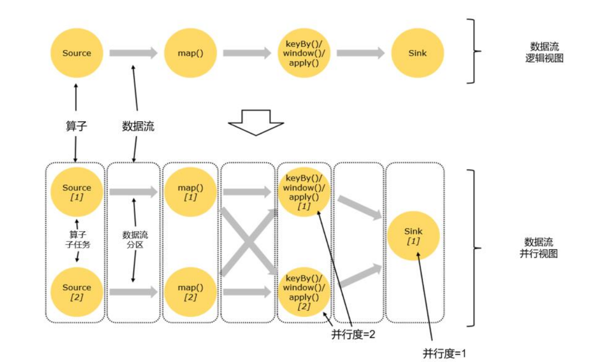

​		这样，包含并行子任务的数据流，就是并行数据流，它需要多个分区（stream partition）来分配并行任务。一般情况下，一个流程序的并行度，可以认为就是其所有算子中最大的并行度。一个程序中，不同的算子可能具有不同的并行度。

​		如上图所示，当前数据流中有 source、map、window、sink 四个算子，除最后 sink，其他算子的并行度都为 2。整个程序包含了 7 个子任务，至少需要 2 个分区来并行执行。我们可以说，这段流处理程序的并行度就是 2。

### 3. 并行度的设置

​		在 Flink 中，可以用不同的方法来设置并行度，它们的有效范围和优先级别也是不同的。

（1）代码中设置

​		我们在代码中，可以很简单地在算子后跟着调用 setParallelism()方法，来设置当前算子的并行度：

```
stream.map(word -> Tuple2.of(word, 1L)).setParallelism(2);
```

​		这种方式设置的并行度，只针对当前算子有效。

​		另外，我们也可以直接调用执行环境的 setParallelism()方法，全局设定并行度：

```
env.setParallelism(2);
```

​		这样代码中所有算子，默认的并行度就都为 2 了。我们一般不会在程序中设置全局并行度，因为如果在程序中对全局并行度进行硬编码，会导致无法动态扩容。这里要注意的是，由于 keyBy 不是算子，所以无法对 keyBy 设置并行度。

（2）提交应用时设置

​		在使用 flink run 命令提交应用时，可以增加-p 参数来指定当前应用程序执行的并行度，它的作用类似于执行环境的全局设置：

```
bin/flink run –p 2 –c com.atguigu.wc.StreamWordCount ./FlinkTutorial-1.0-SNAPSHOT.jar
```

​		如果我们直接在 Web UI 上提交作业，也可以在对应输入框中直接添加并行度。

（3）配置文件中设置

​		我们还可以直接在集群的配置文件 flink-conf.yaml 中直接更改默认并行度：

```
parallelism.default: 2
```

​		这个设置对于整个集群上提交的所有作业有效，初始值为 1。无论在代码中设置、还是提交时的-p 参数，都不是必须的；所以在没有指定并行度的时候，就会采用配置文件中的集群默认并行度。在开发环境中，没有配置文件，默认并行度就是当前机器的 CPU 核心数。2.运行 WordCount 流处理程序时，会看到结果前有 1~4 的分区编号——运行程序的电脑是 4 核 CPU，那么开发环境默认的并行度就是 4。

​		所有的并行度设置方法，它们的优先级如下：

（1）对于一个算子，首先看在代码中是否单独指定了它的并行度，这个特定的设置优先级最高，会覆盖后面所有的设置。

（2）如果没有单独设置，那么采用当前代码中执行环境全局设置的并行度。

（3）如果代码中完全没有设置，那么采用提交时-p 参数指定的并行度。

（4）如果提交时也未指定-p 参数，那么采用集群配置文件中的默认并行度。

​		这里需要说明的是，算子的并行度有时会受到自身具体实现的影响。比如前面用到的读取 socket 文本流的算子 socketTextStream，它本身就是非并行的 Source 算子，所以无论怎么设置，它在运行时的并行度都是 1，对应在数据流图上就只有一个并行子任务。这一点大家可以自行在 Web UI 上查看验证。

​		那么实践中怎样设置并行度比较好呢？那就是在代码中只针对算子设置并行度，不设置全局并行度，这样方便我们提交作业时进行动态扩容。

### 4.3.3 算子链（Operator Chain）

​		仔细观察 Web UI 上给出的图，如下图所示，上面的节点似乎跟代码中的算子又不是一一对应的。

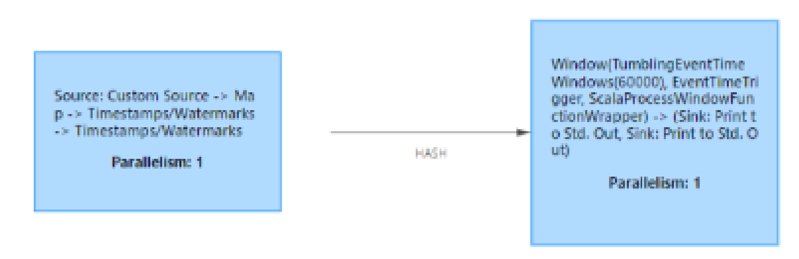

​		很明显，这里的一个节点，会把转换处理的很多个任务都连接在一起，合并成了一个“大任务”。

#### 1. 算子间的数据传输

​		回到上一小节的例子，我们先来考察一下算子任务之间数据传输的方式。

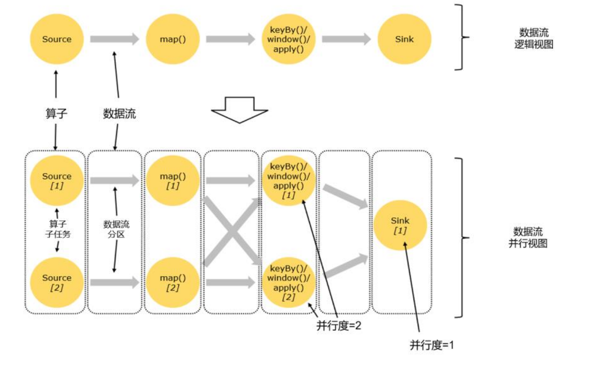

​		如图 4-10 所示，一个数据流在算子之间传输数据的形式可以是一对一（one-to-one）的直通 (forwarding)模式，也可以是打乱的重分区（redistributing）模式，具体是哪一种形式，取决于算子的种类。

（1）一对一（One-to-one，forwarding）

​		这种模式下，数据流维护着分区以及元素的顺序。比如图中的 source 和 map 算子，source算子读取数据之后，可以直接发送给 map 算子做处理，它们之间不需要重新分区，也不需要调整数据的顺序。这就意味着 map 算子的子任务，看到的元素个数和顺序跟 source 算子的子任务产生的完全一样，保证着“一对一”的关系。map、filter、flatMap 等算子都是这种 one-to-one的对应关系。

​		这种关系类似于 Spark 中的窄依赖。

（2）重分区（Redistributing）

​		在这种模式下，数据流的分区会发生改变。比图中的 map 和后面的 keyBy/window 算子之间（这里的 keyBy 是数据传输算子，后面的 window、apply 方法共同构成了 window 算子）,以及 keyBy/window 算子和 Sink 算子之间，都是这样的关系。

​		每一个算子的子任务，会根据数据传输的策略，把数据发送到不同的下游目标任务。例如，keyBy()是分组操作，本质上基于键（key）的哈希值（hashCode）进行了重分区；而当并行度改变时，比如从并行度为 2 的 window 算子，要传递到并行度为 1 的 Sink 算子，这时的数据传输方式是再平衡（rebalance），会把数据均匀地向下游子任务分发出去。这些传输方式都会引起重分区（redistribute）的过程，这一过程类似于 Spark 中的 shuffle。

​		总体说来，这种算子间的关系类似于 Spark 中的宽依赖。

#### 2. 合并算子链

​		在 Flink 中，并行度相同的一对一（one to one）算子操作，可以直接链接在一起形成一个“大”的任务（task），这样原来的算子就成为了真正任务里的一部分，如下图 所示。每个 task会被一个线程执行。这样的技术被称为“算子链”（Operator Chain）。

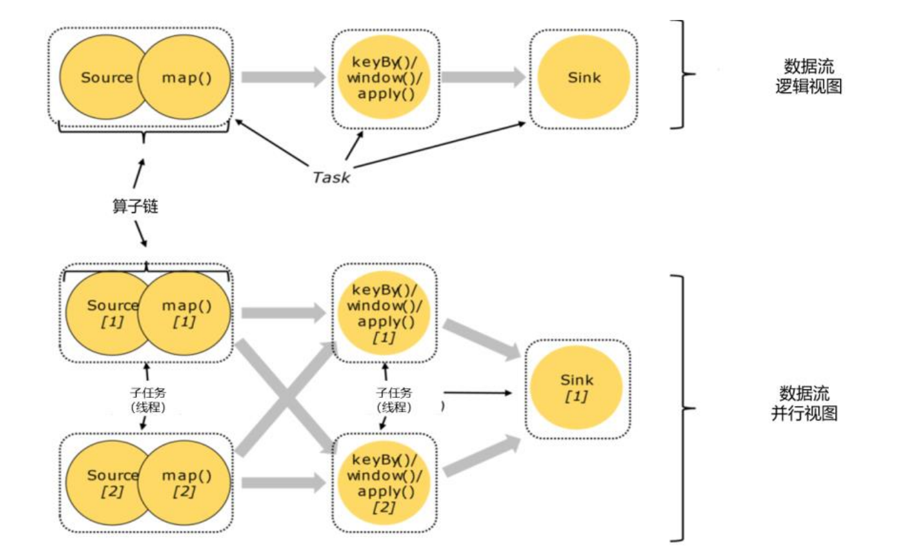

​		比如在上图中的例子中，Source 和 map 之间满足了算子链的要求，所以可以直接合并在一起，形成了一个任务；因为并行度为 2，所以合并后的任务也有两个并行子任务。这样，这个数据流图所表示的作业最终会有 5 个任务，由 5 个线程并行执行。

​		Flink 为什么要有算子链这样一个设计呢？这是因为将算子链接成 task 是非常有效的优化：可以减少线程之间的切换和基于缓存区的数据交换，在减少时延的同时提升吞吐量。

​		Flink 默认会按照算子链的原则进行链接合并，如果我们想要禁止合并或者自行定义，也可以在代码中对算子做一些特定的设置：

```
// 禁用算子链
.map(word -> Tuple2.of(word, 1L)).disableChaining();
// 从当前算子开始新链
.map(word -> Tuple2.of(word, 1L)).startNewChain()
```

### 4.3.4 作业图（JobGraph）与执行图（ExecutionGraph）

​		至此，我们已经彻底了解了由代码生成任务的过程，现在来做个梳理总结。

​		由 Flink 程序直接映射成的数据流图（dataflow graph），也被称为逻辑流图（logical StreamGraph），因为它们表示的是计算逻辑的高级视图。到具体执行环节时，我们还要考虑并行子任务的分配、数据在任务间的传输，以及合并算子链的优化。为了说明最终应该怎样执行一个流处理程序，Flink 需要将逻辑流图进行解析，转换为物理数据流图。

​		在这个转换过程中，有几个不同的阶段，会生成不同层级的图，其中最重要的就是作业图（JobGraph）和执行图（ExecutionGraph）。Flink 中任务调度执行的图，按照生成顺序可以分成四层：

​		逻辑流图（StreamGraph）→ 作业图（JobGraph）→ 执行图（ExecutionGraph）→ 物理图（Physical Graph）。

​		我们可以回忆一下之前处理 socket 文本流的 StreamWordCount 程序：

```
env.socketTextStream().flatMap(…).keyBy(0).sum(1).print();
```

​		如果提交时设置并行度为 2：

```
bin/flink run –p 2 –c com.atguigu.wc.StreamWordCount ./FlinkTutorial-1.0-SNAPSHOT.jar
```

​		那么根据之前的分析，除了 socketTextStream()是非并行的 Source 算子，它的并行度始终为 1，其他算子的并行度都为 2。

​		接下来我们分析一下程序对应四层调度图的演变过程，如下 所示。

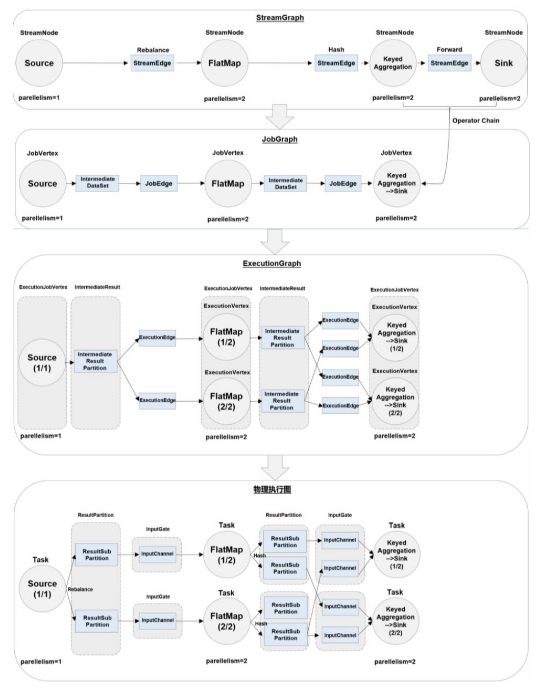

#### 1. 逻辑流图（StreamGraph）

​		这是根据用户通过 DataStream API 编写的代码生成的最初的 DAG 图，用来表示程序的拓扑结构。这一步一般在客户端完成。

​		逻辑流图中的节点，完全对应着代码中的四步算子操作：

​		源算子 Source（socketTextStream()）→扁平映射算子 Flat Map(flatMap()) →分组聚合算子Keyed Aggregation(keyBy/sum()) →输出算子 Sink(print())。

#### 2. 作业图（JobGraph）

​		StreamGraph 经过优化后生成的就是作业图（JobGraph），这是提交给 JobManager 的数据结构，确定了当前作业中所有任务的划分。主要的优化为: 将多个符合条件的节点链接在一起合并成一个任务节点，形成算子链，这样可以减少数据交换的消耗。JobGraph 一般也是在客户端生成的，在作业提交时传递给 JobMaster。

​		在上图中，分组聚合算子（Keyed Aggregation）和输出算子 Sink(print)并行度都为 2，而且是一对一的关系，满足算子链的要求，所以会合并在一起，成为一个任务节点。

#### 3. 执行图（ExecutionGraph）

​		JobMaster 收到 JobGraph 后，会根据它来生成执行图（ExecutionGraph）。ExecutionGraph是 JobGraph 的并行化版本，是调度层最核心的数据结构。

​		从上图中可以看到，与 JobGraph 最大的区别就是按照并行度对并行子任务进行了拆分，并明确了任务间数据传输的方式。

#### 4. 物理图（Physical Graph）

​		JobMaster 生成执行图后， 会将它分发给 TaskManager；各个 TaskManager 会根据执行图部署任务，最终的物理执行过程也会形成一张“图”，一般就叫作物理图（Physical Graph）。这只是具体执行层面的图，并不是一个具体的数据结构。

​		对应在上图中，物理图主要就是在执行图的基础上，进一步确定数据存放的位置和收发的具体方式。有了物理图，TaskManager 就可以对传递来的数据进行处理计算了。

​		所以我们可以看到，程序里定义了四个算子操作：源（Source）->转换（flatMap）->分组聚合（keyBy/sum）->输出（print）；合并算子链进行优化之后，就只有三个任务节点了；再考虑并行度后，一共有 5 个并行子任务，最终需要 5 个线程来执行。

### 4.3.5 任务（Tasks）和任务槽（Task Slots）

​		通过前几小节的介绍，我们对任务的生成和分配已经非常清楚了。上一小节中我们最终得到结论：作业划分为 5 个并行子任务，需要 5 个线程并行执行。那在我们将应用提交到 Flink集群之后，到底需要占用多少资源呢？是否需要 5 个 TaskManager 来运行呢？

#### 1. 任务槽（Task Slots）

​		之前已经提到过，Flink 中每一个 worker(也就是 TaskManager)都是一个 JVM 进程，它可以启动多个独立的线程，来并行执行多个子任务（subtask）。

​		所以如果想要执行 5 个任务，并不一定非要 5 个 TaskManager，我们可以让 TaskManager多线程执行任务。如果可以同时运行 5 个线程，那么只要一个 TaskManager 就可以满足我们之前程序的运行需求了。

​		很显然，TaskManager 的计算资源是有限的，并不是所有任务都可以放在一个 TaskManager上并行执行。并行的任务越多，每个线程的资源就会越少。那一个 TaskManager 到底能并行处理多少个任务呢？为了控制并发量，我们需要在 TaskManager 上对每个任务运行所占用的资源做出明确的划分，这就是所谓的任务槽（task slots）。

​		slot 的概念其实在分布式框架中并不陌生。所谓的“槽”是一种形象的表达。如果大家见过传说中的“卡带式游戏机”，就会对它有更直观的认识：游戏机上的卡槽提供了可以运行游戏的接口和资源，我们把游戏卡带插入卡槽，就可以占用游戏机的计算资源，执行卡带中的游戏程序了。一台经典的小霸王游戏机（如图 4-13）一般只有一个卡槽，而在 TaskManager 中，我们可以设置多个 slot，只要插入“卡带”——也就是分配好的任务，就可以并行执行了

​		每个任务槽（task slot）其实表示了 TaskManager 拥有计算资源的一个固定大小的子集。这些资源就是用来独立执行一个子任务的。

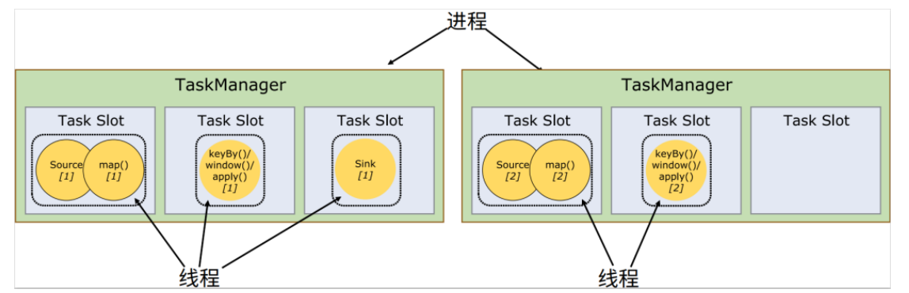

​		假如一个 TaskManager 有三个 slot，那么它会将管理的内存平均分成三份，每个 slot 独自占据一份。这样一来，我们在 slot 上执行一个子任务时，相当于划定了一块内存“专款专用”，就不需要跟来自其他作业的任务去竞争内存资源了。所以现在我们只要 2 个 TaskManager，就可以并行处理分配好的 5 个任务了，如图 4-14 所示。

#### 2. 任务槽数量的设置

​		我们可以通过集群的配置文件来设定 TaskManager 的 slot 数量：

```
taskmanager.numberOfTaskSlots: 8
```

​		通过调整 slot 的数量，我们就可以控制子任务之间的隔离级别。

​		具体来说，如果一个 TaskManager 只有一个 slot，那将意味着每个任务都会运行在独立的JVM 中（当然，该 JVM 可能是通过一个特定的容器启动的）；而一个 TaskManager 设置多个slot 则意味着多个子任务可以共享同一个 JVM。它们的区别在于：前者任务之间完全独立运行，隔离级别更高、彼此间的影响可以降到最小；而后者在同一个 JVM 进程中运行的任务，将共享 TCP 连接和心跳消息，也可能共享数据集和数据结构，这就减少了每个任务的运行开销，在降低隔离级别的同时提升了性能。

​		需要注意的是，slot 目前仅仅用来隔离内存，不会涉及 CPU 的隔离。在具体应用时，可以将 slot 数量配置为机器的 CPU 核心数，尽量避免不同任务之间对 CPU 的竞争。这也是开发环境默认并行度设为机器 CPU 数量的原因。

#### 3. 任务对任务槽的共享

​		这样看来，一共有多少任务，我们就需要有多少 slot 来并行处理它们。不过实际提交作业进行测试就会发现，我们之前的 WordCount 程序设置并行度为 2 提交，一共有 5 个并行子任务，可集群即使只有 2 个 task slot 也是可以成功提交并运行的。这又是为什么呢？

​		我们可以基于之前的例子继续扩展。如果我们保持 sink 任务并行度为 1 不变，而作业提交时设置全局并行度为 6，那么前两个任务节点就会各自有 6 个并行子任务，整个流处理程序则有 13 个子任务。那对于 2 个 TaskManager、每个有 3 个 slot 的集群配置来说，还能否正常运行呢？

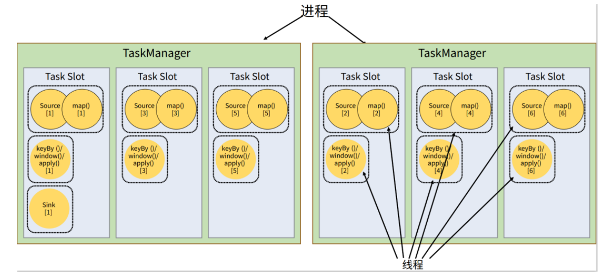

​		完全没有问题。这是因为默认情况下，Flink 是允许子任务共享 slot 的。如图 4-15 所示，只要属于同一个作业，那么对于不同任务节点的并行子任务，就可以放到同一个 slot 上执行。所以对于第一个任务节点 source→map，它的 6 个并行子任务必须分到不同的 slot 上（如果在同一 slot 就没法数据并行了），而第二个任务节点 keyBy/window/apply 的并行子任务却可以和第一个任务节点共享 slot。

​		于是最终结果就变成了：每个任务节点的并行子任务一字排开，占据不同的 slot；而不同的任务节点的子任务可以共享 slot。一个 slot 中，可以将程序处理的所有任务都放在这里执行，我们把它叫作保存了整个作业的运行管道（pipeline）。

​		这个特性看起来有点奇怪：我们不是希望并行处理、任务之间相互隔离吗，为什么这里又允许共享 slot 呢？

​		我们知道，一个 slot 对应了一组独立的计算资源。在之前不做共享的时候，每个任务都平等地占据了一个 slot，但其实不同的任务对资源的占用是不同的。例如这里的前两个任务，source/map 尽管是两个算子合并算子链得到的，但它只是基本的数据读取和简单转换，计算耗时极短，一般也不需要太大的内存空间；而 window 算子所做的窗口操作，往往会涉及大量的数据、状态存储和计算，我们一般把这类任务叫作“资源密集型”（intensive）任务。当它们被平等地分配到独立的 slot 上时，实际运行我们就会发现，大量数据到来时 source/map 和 sink任务很快就可以完成，但 window 任务却耗时很久；于是下游的 sink 任务占据的 slot 就会等待闲置，而上游的 source/map 任务受限于下游的处理能力，也会在快速处理完一部分数据后阻塞对应的资源开始等待（相当于处理背压）。这样资源的利用就出现了极大的不平衡，“忙的忙死，闲的闲死”。

​		解决这一问题的思路就是允许 slot 共享。当我们将资源密集型和非密集型的任务同时放到一个 slot 中，它们就可以自行分配对资源占用的比例，从而保证最重的活平均分配给所有的TaskManager。

​		slot 共享另一个好处就是允许我们保存完整的作业管道。这样一来，即使某个 TaskManager出现故障宕机，其他节点也可以完全不受影响，作业的任务可以继续执行。

​		另外，同一个任务节点的并行子任务是不能共享 slot 的，所以允许 slot 共享之后，运行作业所需的 slot 数量正好就是作业中所有算子并行度的最大值。这样一来，我们考虑当前集群需要配置多少 slot 资源时，就不需要再去详细计算一个作业总共包含多少个并行子任务了，只看最大的并行度就够了。

​		当然，Flink 默认是允许 slot 共享的，如果希望某个算子对应的任务完全独占一个 slot，或者只有某一部分算子共享 slot，我们也可以通过设置“slot 共享组”（SlotSharingGroup）手动指定：

```
.map(word -> Tuple2.of(word, 1L)).slotSharingGroup(“1”);
```

​		这样，只有属于同一个 slot 共享组的子任务，才会开启 slot 共享；不同组之间的任务是完全隔离的，必须分配到不同的 slot 上。在这种场景下，总共需要的 slot 数量，就是各个 slot共享组最大并行度的总和。

#### 4. 任务槽和并行度的关系

​		直观上看，slot 就是 TaskManager 为了并行执行任务而设置的，那它和之前讲过的并行度（Parallelism）是不是一回事呢？

​		Slot 和并行度确实都跟程序的并行执行有关，但两者是完全不同的概念。简单来说，task slot 是 静 态 的 概 念 ， 是 指 TaskManager 具 有 的 并 发 执 行 能 力 ， 可 以 通 过 参 数taskmanager.numberOfTaskSlots 进行配置；而并行度（parallelism）是动态概念，也就是TaskManager 运行程序时实际使用的并发能力，可以通过参数 parallelism.default 进行配置。换句话说，并行度如果小于等于集群中可用 slot 的总数，程序是可以正常执行的，因为 slot 不一定要全部占用，有十分力气可以只用八分；而如果并行度大于可用 slot 总数，导致超出了并行能力上限，那么心有余力不足，程序就只好等待资源管理器分配更多的资源了。

​		下面我们再举一个具体的例子。假设一共有 3 个 TaskManager，每一个 TaskManager 中的slot 数量设置为 3 个，那么一共有 9 个 task slot，如图 4-16 所示，表示集群最多能并行执行 9个任务。

​		而我们定义 WordCount 程序的处理操作是四个转换算子：

​		source→ flatMap→ reduce→ sink

​		当所有算子并行度相同时，容易看出 source 和 flatMap 可以合并算子链，于是最终有三个任务节点。

​		如果我们没有任何并行度设置，而配置文件中默认 parallelism.default=1，那么程序运行的默认并行度为 1，总共有 3 个任务。由于不同算子的任务可以共享任务槽，所以最终占用的 slot只有 1 个。9 个 slot 只用了 1 个，有 8 个空闲，如图 4-17 中的 Example 1 所示。

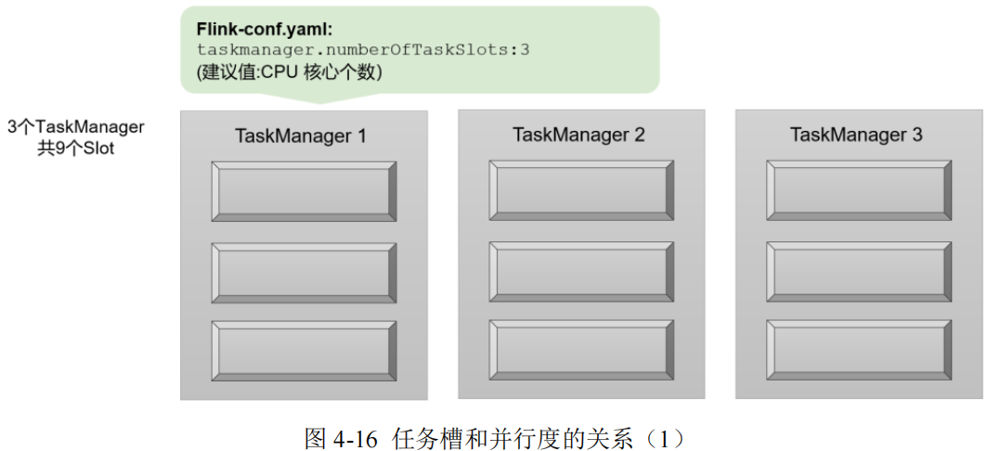

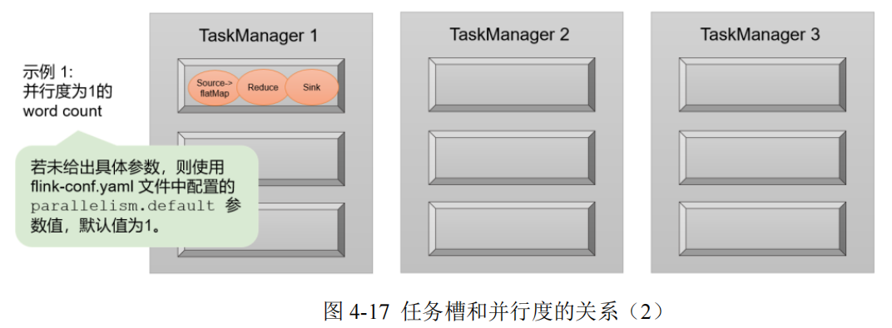

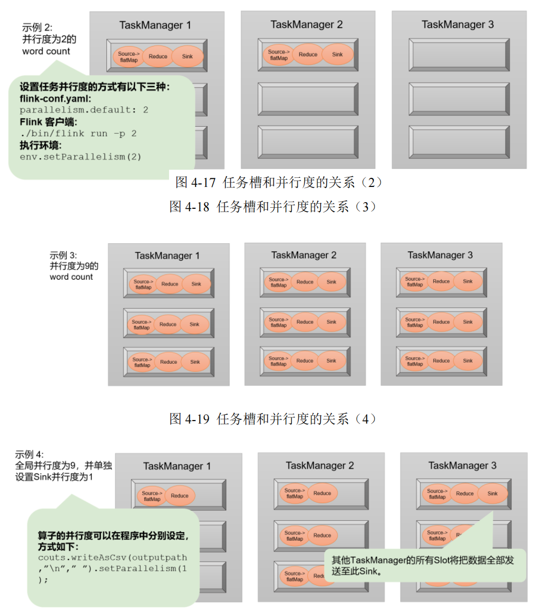

​		如果我们更改默认参数，或者提交作业时设置并行度为 2，那么总共有 6 个任务，共享任务槽之后会占用 2 个 slot，如图 4-18 中 Example 2 所示。同样，就有 7 个 slot 空闲，计算资源没有充分利用。所以可以看到，设置合适的并行度才能提高效率。

​		那对于这个例子，怎样设置并行度效率最高呢？当然是需要把所有的 slot 都利用起来。考虑到 slot 共享，我们可以直接把并行度设置为 9，这样所有 27 个任务就会完全占用 9 个 slot。这是当前集群资源下能执行的最大并行度，计算资源得到了充分的利用，如图 4-19 中 Example3 所示。

​		另外再考虑对于某个算子单独设置并行度的场景。例如，如果我们考虑到输出可能是写入文件，那会希望不要并行写入多个文件，就需要设置 sink 算子的并行度为 1。这时其他的算子并行度依然为 9，所以总共会有 19 个子任务。根据 slot 共享的原则，它们最终还是会占用全部的 9 个 slot，而 sink 任务只在其中一个 slot 上执行，如图 4-20 中 Example 4 所示。通过这个例子也可以明确地看到，整个流处理程序的并行度，就应该是所有算子并行度中最大的那个，这代表了运行程序需要的 slot 数量。

## 4.4 本章总结

​		在这一章，我们在之前部署运行的基础上，深入介绍了 Flink 的系统架构和不同组件，并进一步针对不同的部署模式详细讲述了作业提交和任务处理的流程。此外，通过展开讲解架构中的一些重要概念，解答了 Flink 任务调度的核心问题，并对分布式流处理架构的设计做了思考分析。

​		本章内容不仅是 Flink 架构知识的学习，更是分布式处理思想的入门。我们可以通过 Flink这样一个经典框架的学习，触摸到分布式架构的底层原理。

​		Flink 流处理架构设计还涉及事件时间、状态管理以及检查点等重要概念，保证分布式流处理系统的低延迟、时间正确性和状态一致性。我们将在后面的章节对这些内容做详细展开。
