# **Hadoop简介**

- Hadoop应运而生，它是一个能够对大量数据进行分布式处理的软件框架，并且是以一种可靠、高效、可伸缩的方式进行处理的.
- 狭义上来说，hadoop就是单独指代hadoop这个软件
- 广义上来说，hadoop指代大数据的一个生态圈，包括很多其他的软件

**1. hadoop的版本介绍**

- 0.x系列版本：hadoop当中最早的一个开源版本，在此基础上演变而来的1.x以及2.x的版本
- 1.x版本系列：hadoop版本当中的第二代开源版本，主要修复0.x版本的一些bug等
- 2.x版本系列：架构产生重大变化，引入了yarn平台等许多新特性，也是现在生产环境当中使用最多的版本
- 3.x版本系列：在2.x版本的基础上，引入了一些hdfs的新特性等，且已经发型了稳定版本，未来公司的使用趋势

**2. hadoop生产环境版本选择**

- Hadoop三大发行版本：Apache、Cloudera、Hortonworks。

- - Apache版本最原始（最基础）的版本，对于入门学习最好。
  - Cloudera在大型互联网企业中用的较多。
  - Hortonworks文档较好。

**3. hadoop的架构模块介绍**

- Hadoop由三个模块组成：**分布式**存储HDFS、分布式计算MapReduce、资源调度引擎Yarn

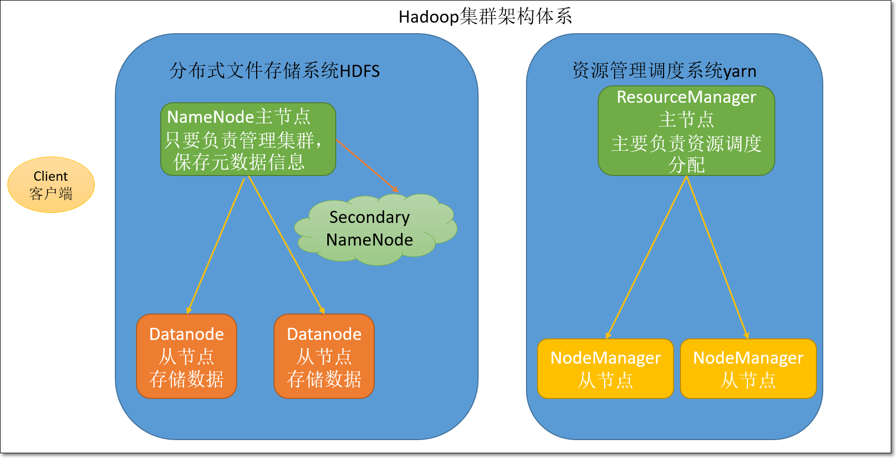

- ==关键词==：
  - 分布式
  - 主从架构
- HDFS模块：
  -  namenode：主节点，主要负责HDFS集群的管理以及元数据信息管理

  -  datanode：从节点，主要负责存储用户数据

  -  secondaryNameNode：辅助namenode管理元数据信息，以及元数据信息的冷备份
- Yarn模块：

  - ResourceManager：主节点，主要负责资源分配
  - NodeManager：从节点，主要负责执行任务

# 1、HDFS：Hadoop分布式文件系统

## 1.1. 理解分布式文件系统

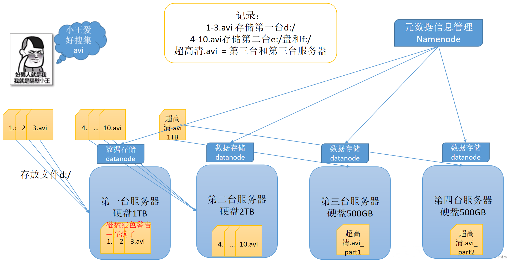

- 最直观的理解便是三个臭皮匠，顶个诸葛亮。

- 很多的磁盘加一起就可以装下天下所有的avi

- 类似于你出五毛，我出五毛，我们一起凑一块的效果

## 1.2. hdfs的架构详细剖析

### 1.2.1. 分块存储&机架感知&3副本

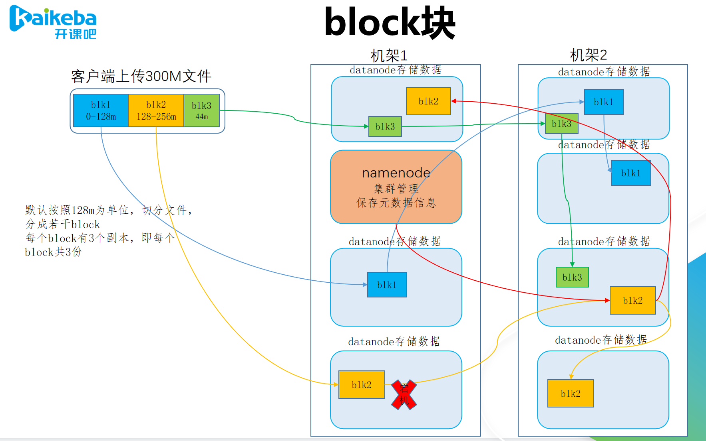

- 分块存储

  - 保存文件到HDFS时，会先默认按==128M==的大小对文件进行切分成block块
  - block快一旦划分之后，写入数据完成之后，再不会写入数据了（写入完成后，不允许修改）
  - 数据以block块的形式存在HDFS文件系统中
    - 在hadoop1当中，文件的block块默认大小是64M
    - hadoop2、3当中，文件的block块大小默认是128M，block块的大小可以通过hdfs-site.xml当中的配置文件进行指定

  ```xml
  <property>
      <name>dfs.blocksize</name>
      <value>块大小 以字节为单位</value><!-- 只写数值就可以 -->
  </property>
  ```
  - [hdfs-default.xml](https://hadoop.apache.org/docs/r2.7.7/hadoop-project-dist/hadoop-hdfs/hdfs-default.xml)参考默认属性

  - 例如：

    如果有一个文件大小为1KB，也是要占用一个block块，但是实际占用磁盘空间还是1KB大小

    类似于有一个水桶可以装128斤的水，但是我只装了1斤的水，那么我的水桶里面水的重量就是1斤，而不是128斤

  - block元数据：每个block块的元数据大小大概为150字节

- 3副本存储（机架感知）
  
  - 为了保证block块的安全性，也就是数据的安全性，在hadoop2当中，采用文件默认保存==三个副本==，我们可以更改副本数以提高数据的安全性
  - 在hdfs-site.xml当中修改以下配置属性，即可更改文件的副本数

```xml
    <property>
          <name>dfs.replication</name>
          <value>3</value>
    </property>
```

- block快存储哪台机器有三个条件控制
  
  离客户端比较近的
  
  磁盘比较空闲的
  比较鲜活的datanode（最近一次心跳时间与namenode时间间隔比较短的）
  
- [扩展：机架感知](https://hadoop.apache.org/docs/r2.8.5/hadoop-project-dist/hadoop-common/RackAwareness.html)

  为了保证副本在集群的安全性

  第一个节点

  ​		集群内部（优先考虑和客户端相同节点作为第一个节点）

  ​		集群外部（选择资源丰富且不繁忙的节点为第一个节点）

  第二个节点 选择和第一个节点不同机架的其他节点

  第三个节点 与第二个节点相同机架的其他节点

  第N个节点 与前面节点不重复的其他节点

  - 副本存放策略，不同版本稍有区别Replica Placement: The First Baby Steps：
  - [比如apache hadoop 2.7.7](<https://hadoop.apache.org/docs/r2.7.7/hadoop-project-dist/hadoop-hdfs/HdfsDesign.html>)
    - Replica Placement: The First Baby Steps
  - [比如apache hadoop 2.8.5](<https://hadoop.apache.org/docs/r2.8.5/hadoop-project-dist/hadoop-hdfs/HdfsDesign.html>)

### 1.2.2. 抽象成数据块的好处

1. 文件可能大于集群中任意一个磁盘 
    10T*3/128 = xxx块 10T 文件方式存—–>多个block块，这些block块属于一个文件

2. 使用块抽象而不是文件可以简化存储子系统

   hdfs将所有的文件全部抽象成为block块来进行存储，不管文件大小，全部一视同仁都是以block块的形式进行存储，方便我们的分布式文件系统对文件的管理

3. 块非常适合用于数据备份；进而提供数据容错能力和可用性

### 1.2.3. HDFS架构

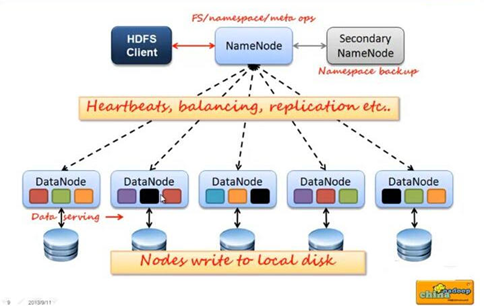

- HDFS集群包括，NameNode和DataNode以及Secondary Namenode。

  - **1.NameNode**

    ​	**主节点**，主要负责管理整个文件系统的元数据（元数据存在内存），包括hdfs目录树、每个文件有哪些块、每个块存储在哪些datanode

    - 存放信息，文件的元数据信息，文件与Block块的映射信息，块与DataNode的映射关系。

      其中关闭集群时，文件的元数据信息和文件和Block块的映射会被实例化到磁盘上。都是固定的内容。但是Block块与DataNode的映射关系不会被持久化保存，因为并不能保证每次重启的时候每个DN都能正常启动，有可能客户端访问NN得到文件Block对应DN地址是失效的。为了解决这个问题，为保证每一个Block块与DataNode的映射是有效的，每次集群启动,DN都会汇报当前节点信息给NN节点，当所有DN都成功启动后，NN也就收集好了Block与DN的有效映射关系。如果启动中由部分DN失败了，导致有的Block副本数达不到最小要求，NN会将Block复制到其他DN上。

    - 心跳机制

      当集群启动完毕后，NN与DN保存心跳机制，每3秒发送一次，如果超过三次本次心跳失败，暂时标记当前DN节点不可用，当DN超过10分钟+30S，那么NN会将DN存储的数据转存到其他DN节点上。

    - 接受客户的请求，客户端访问与上传文件都会询问NN并得到对应的DN位置。

    - 存放日志文件，NN为了追寻效率，所有数据都存放在内存中。

  - **2.DataNode** 

    ​	**从节点**，主要负责存储用户数据（数据存在磁盘）

    - 存储数据，Block都会存放在DN节点上。block id到DataNode本地文件的映射关系。
      - HDFS特别害怕小文件，因为小文件可能还没有映射文件大。
    - 心跳机制，DN启动后，检测当前节点Block的信息及完整性，如果没有问题，就将其汇报给NN节点。

  - **3.Secondary NameNode**

    **辅助NN**管理元数据信息，以及元数据信息的冷备份

    用来监控HDFS状态的辅助后台程序，每隔一段时间获取HDFS元数据的快照。

  - **4.SNN进行日志文件合并的过程**

    - 当NN日志文件达到64MB或者经过3600S之后，会创建新的日志文件。SNN会拉取最新的日志文件和上一次的快照信息，然后对快照进行日志的操作，并拍摄新的快照，并复制到NN节点。


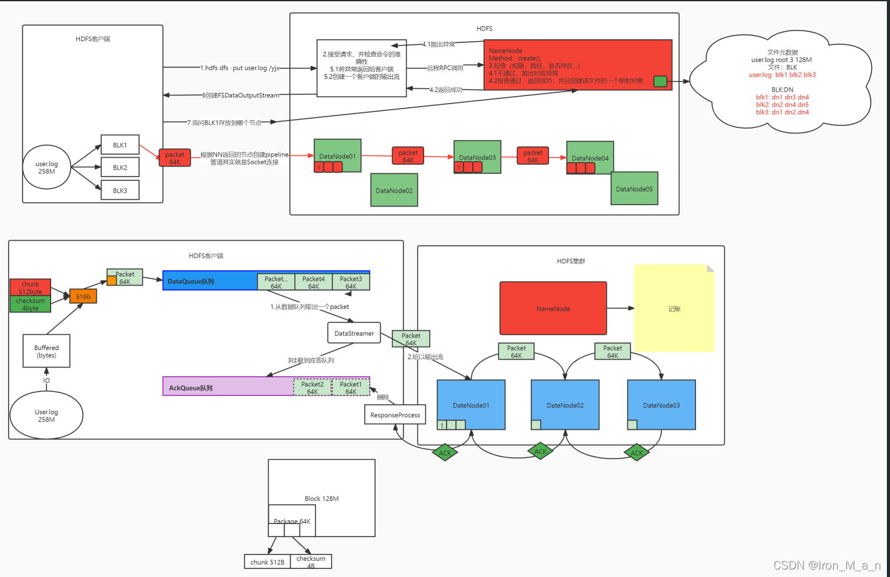

### 1.2.4. 扩展

#### 1.块缓存

- 通常DataNode从磁盘中读取块，但对于访问频繁的文件，其对应的块可能被显示的缓存在DataNode的内存中，以堆外块缓存的形式存在。

- 默认情况下，一个块仅缓存在一个DataNode的内存中，当然可以针对每个文件配置DataNode的数量。作业调度器通过在缓存块的DataNode上运行任务，可以利用块缓存的优势提高读操作的性能。

  例如： 
   连接（join）操作中使用的一个小的查询表就是块缓存的一个很好的候选。 
   用户或应用通过在缓存池中增加一个cache directive来告诉namenode需要缓存哪些文件及存多久。缓存池（cache pool）是一个拥有管理缓存权限和资源使用的管理性分组

#### 2.hdfs的文件权限验证

- hdfs的文件权限机制与linux系统的文件权限机制类似

  r:read  w:write x:execute 权限x对于文件表示忽略，对于文件夹表示是否有权限访问其内容

  如果linux系统用户zhangsan使用hadoop命令创建一个文件，那么这个文件在HDFS当中的owner就是zhangsan

  HDFS文件权限的目的，防止好人做错事，而不是阻止坏人做坏事。HDFS相信你告诉我你是谁，你就是谁
  
  hdfs 权限-》kerberos、ranger、sentry来做

## 1.3. hdfs安全模式

- 安全模式是HDFS所处的一种特殊状态
  
  ​		安全模式是HDFS的一种工作状态，处于安全模式的状态下，只向客户端提供文件的只读视图，不接受对命名空间的修改；同时NameNode节点也不会进行数据块的复制或者删除
  
  ​		各个DataNode会向NameNode发送自身的数据块列表
  
  ​		NameNode有足够的数据块信息后，便在30秒后退出安全模式
  
  ​		NameNode发现数据节点过少会启动数据块复制过程
  
- HDFS启动流程，在NameNode主节点启动时，HDFS首先进入安全模式
  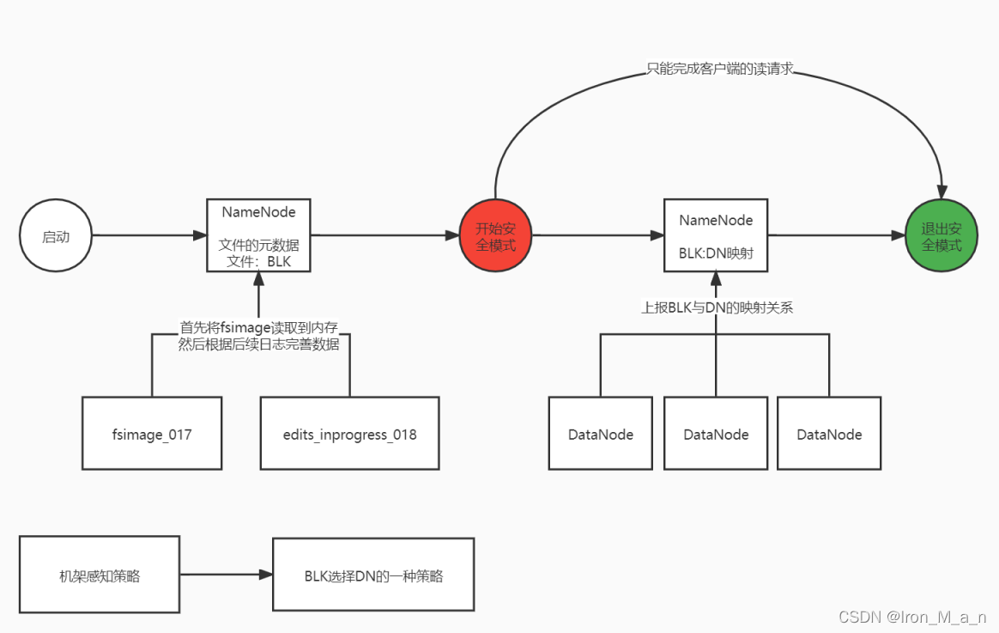
  - DataNode在启动的时候会向namenode汇报可用的block等状态，当整个系统达到安全标准时，HDFS自动离开安全模式。
  - 如果HDFS处于安全模式下，则文件block不能进行任何的副本复制操作，因此达到最小的副本数量要求是基于datanode启动时的状态来判定的
  - 启动时不会再做任何复制（从而达到最小副本数量要求）
  - hdfs集群刚启动的时候，默认30S钟的时间是处于安全期的，只有过了30S之后，集群脱离了安全模式，然后才可以对集群进行操作

- 何时退出安全模式
  - namenode知道集群共多少个block（不考虑副本），假设值是total；
  
  - namenode启动后，会上报block report，namenode开始累加统计满足最小副本数（默认1）的block个数，假设是num
  
  - 当num/total > 99.9%时，退出安全模式
  
  - 离开安全模式，需要满足以下条件：
  
    1）达到副本数量要求的block比例满足要求；
  
    2）可用的datanode节点数满足配置的数量要求；
  
    3） 1、2 两个条件满足后维持的时间达到配置的要求。

```shell
[hadoop@node01 hadoop]$ hdfs dfsadmin -safemode  
Usage: hdfs dfsadmin [-safemode enter | leave | get | wait]
```


## 1.4. NameNode和SecondaryNameNode功能剖析

### 1.4.1. namenode与secondaryName解析

- NameNode主要负责集群当中的元数据信息管理，而且元数据信息需要经常随机访问，因为元数据信息必须高效的检索
  - 元数据信息保存在哪里能够==快速检索==呢？
  - 如何保证元数据的持久==安全==呢？
- **为了保证元数据信息的快速检索，那么我们就必须将元数据存==放在内存==当中**，因为在内存当中元数据信息能够最快速的检索，那么随着元数据信息的增多（每个block块大概占用150字节的元数据信息），内存的消耗也会越来越多。
- 如果所有的元数据信息都存放内存，服务器断电，内存当中所有数据都消失，为了**保证元数据的==安全持久**==，元数据信息必须做可靠的持久化，在**hadoop当中为了持久化存储元数据信息**，将所有的元数据信息保存在了FSImage文件当中，那么FSImage随着时间推移，必然越来越膨胀，FSImage的操作变得越来越难，为了解决元数据信息的增删改，hadoop当中还引入了**元数据操作日志edits文件**，**edits文件记录了客户端操作元数据的信息**，随着时间的推移，edits信息也会越来越大，为了解决edits文件膨胀的问题，hadoop当中引入了**secondaryNamenode来专门做fsimage与edits文件**

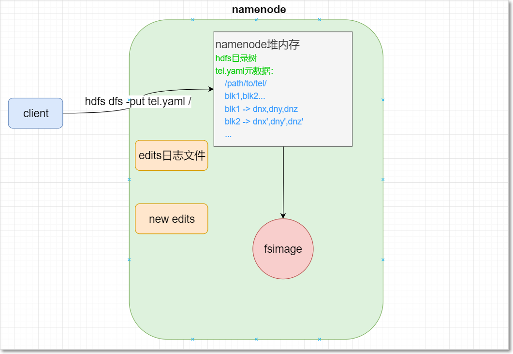

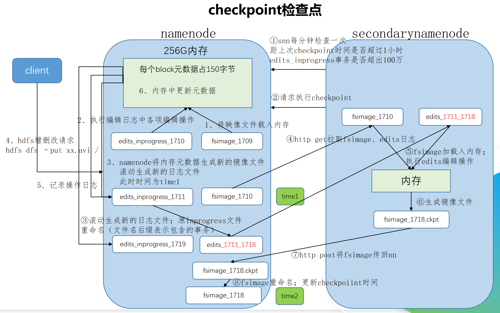

1. namenode工作机制

   （1）第一次启动namenode格式化后，创建fsimage和edits文件。如果不是第一次启动，直接加载编辑日志和镜像文件到内存。

   （2）客户端对元数据进行增删改的请求

   （3）namenode记录操作日志，更新滚动日志。

   （4）namenode在内存中对元数据进行增删改查

2. Secondary NameNode工作

   （1）Secondary NameNode询问namenode是否需要checkpoint。直接带回namenode是否检查结果。

​       （2）Secondary NameNode请求执行checkpoint。

​       （3）namenode滚动正在写的edits日志

​       （4）将滚动前的编辑日志和镜像文件拷贝到Secondary NameNode

​       （5）Secondary NameNode加载编辑日志和镜像文件到内存，并合并。

​       （6）生成新的镜像文件fsimage.chkpoint

​       （7） 拷贝fsimage.chkpoint到namenode

​       （8）namenode将fsimage.chkpoint重新命名成fsimage

| 属性                                 | 值              | 解释                                                         |
| ------------------------------------ | --------------- | ------------------------------------------------------------ |
| dfs.namenode.checkpoint.period       | 3600秒(即1小时) | The number of seconds between two periodic checkpoints.      |
| dfs.namenode.checkpoint.txns         | 1000000         | The Secondary NameNode or CheckpointNode will create a checkpoint of the namespace every 'dfs.namenode.checkpoint.txns' transactions, regardless of whether 'dfs.namenode.checkpoint.period' has expired. |
| dfs.namenode.checkpoint.check.period | 60(1分钟)       | The SecondaryNameNode and CheckpointNode will poll the NameNode every 'dfs.namenode.checkpoint.check.period' seconds to query the number of uncheckpointed transactions. |


### 1.4.2. FSImage与edits详解

- 所有的元数据信息都保存在了FsImage与Eidts文件当中，这两个文件就记录了所有的数据的元数据信息，元数据信息的保存目录配置在了hdfs-site.xml当中

```xml
    <!-- namenode保存fsimage的路径 -->
    <property>
        <name>dfs.namenode.name.dir</name>
        <value>file:///kkb/install/hadoop-3.1.4/hadoopDatas/namenodeDatas</value>
    </property>
    <!-- namenode保存editslog的目录 -->
    <property>
        <name>dfs.namenode.edits.dir</name>
        <value>file:///kkb/install/hadoop-3.1.4/hadoopDatas/dfs/nn/edits</value>
    </property>
```

- 客户端对hdfs进行写文件时会首先被记录在edits文件中

  edits修改时元数据也会更新。

  每次hdfs更新时edits先更新后，客户端才会看到最新信息。

  fsimage:是namenode中关于元数据的镜像，一般称为检查点。

  一般开始时对namenode的操作都放在edits中，为什么不放在fsimage中呢？

  因为fsimage是namenode的完整的镜像，内容很大，如果每次都加载到内存的话生成树状拓扑结构，这是非常耗内存和CPU。

  fsimage内容包含了namenode管理下的所有datanode中文件及文件block及block所在的datanode的元数据信息。随着edits内容增大，就需要在一定时间点和fsimage合并。

### 1.4.3. FSimage文件当中的文件信息查看

- [官方查看文档](https://hadoop.apache.org/docs/r3.1.4/hadoop-project-dist/hadoop-hdfs/HdfsImageViewer.html)

- 使用命令 hdfs oiv 

```shell
cd  /kkb/install/hadoop-3.1.4/hadoopDatas/namenodeDatas/current
hdfs oiv    #查看帮助信息
hdfs oiv -i fsimage_0000000000000000864 -p XML -o /home/hadoop/fsimage1.xml
```

### 1.4.4. edits当中的文件信息查看

- [官方查看文档](https://hadoop.apache.org/docs/r3.1.4/hadoop-project-dist/hadoop-hdfs/HdfsEditsViewer.html)

- 查看命令 hdfs oev

```shell
cd /kkb/install/hadoop-3.1.4/hadoopDatas/dfs/nn/edits/current
hdfs oev     #查看帮助信息
hdfs oev -i edits_0000000000000000865-0000000000000000866 -o /home/hadoop/myedit.xml -p XML
```


### 1.4.5. namenode元数据信息多目录配置

- 为了保证元数据的安全性

  - 我们一般都是先确定好我们的磁盘挂载目录，将元数据的磁盘做[RAID1](https://baike.baidu.com/item/RAID%201/10405702?fromtitle=RAID1&fromid=2182686&fr=aladdin) namenode的本地目录可以配置成多个，且每个目录存放内容相同，增加了可靠性。
  - 多个目录间逗号分隔

- 具体配置如下：

  hdfs-site.xml

```xml
<property>
   <name>dfs.namenode.name.dir</name>
   <value>file:///kkb/install/hadoop-3.1.4/hadoopDatas/namenodeDatas,file:///path/to/another/</value>
</property>
```


1. 打开[hadoop的官网](https://hadoop.apache.org/docs/r3.1.4/)，简单浏览下官网的目录 

2. [机架感知](https://hadoop.apache.org/docs/r3.1.4/hadoop-project-dist/hadoop-common/RackAwareness.html)

3. dn宕机或重启，block副本数变少或变多，nn会如何响应 -> 副本恢复3个

   [参考](http://blog.sina.com.cn/s/blog_13122c2790101ed52.html)

4. 查看linux目录树

```
sudo yum -y install tree
tree path
```

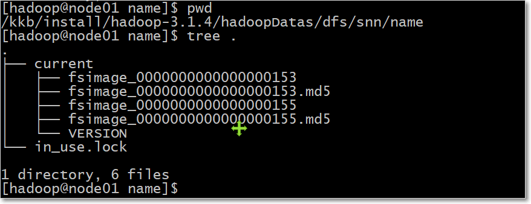


## 1.5.HDFS的写数据流程


流程

1. HDFS的写入过程，首先客户端向NameNode发送一个请求，NN检测请求的合法性，是否有足够的空间创建这个文件，是否有权限上传文件，上传的文件夹路径是否存在，文件是否存在等问题，如果问题又问题返回一个异常给客户端。如果没有问题，在NN上创建一个文件对应的entry文件用来保存文件的元数据信息，文件与Block块的映射信息，Block块与DataNode节点的映射信息，给客户端创建一个输出流用来向HDFS传递文件数据。

2. 客户端向NN，询问第一个Block存放的位置信息，NN通过机架感知策略，返回Block及其副本存放的DN的信息。

   【机架感知策略，为了保证副本在集群中的安全性，

   第一个节点[ (如果集群内，优先考虑与客户端同节点),(集群外，选择一个资源丰富且不忙碌的节点)] 

   第二个节点 选择与第一个节点不同机架上的其他节点。

    第三个节点 选择与第二个节点相同机架的其他节点 ）

   其它节点 与前面不充分的节点】 

   客户端通过得到的DN信息与DN节点之间创建管道，客户端连接DN1，DN1连接DN2，DN2连接DN3。减少客户端带宽，增加传输速率。

3. 管道（管道本质就算Socket连接）建立之后，按packet包发送数据。好处是，如果发送数据的过程中出现了错误了，只需要重写发送失败的packet包，不需要重新发送整个Block块。

4. 讲一下packet包是 什么 ，由什么构成的。

   packet数据分为两类。

   ​	一类是header，packet头信息，存放packet 的的数据长度，在Block中的偏移量，packet序列号，是否为最后一个packet等等信息；

   ​	另一类是实际的数据包，由若干个chunk 与 checksum构成，一个chunk512B，存放文件数据，一个checksum4B,存放chunk的检验文件，检验chunk数据片段是否合法正确。

5. 当chunk与checksum填满一个packet后，这个packet会被挂载到DataQueue队列上，等待守护线程DataStreamer取出发送给管道，当packet取出后不会被删除，而是挂载到了AckQueue应答队列上，如果传输中packet出现错误，会将packet重新加载到DataQueue中等待重新发送。那如何判断成功失败的呢？

6. Packet Ack机制是这样子的，举个例子，一主两备，当客户端传递packet到第一个节点后，同时给予节点一 1个ack状态，第一个节点接收数据后将数据继续发送给第二个节点，同时给予节点二1个ack状态，第二个节点接受数据后将数据继续发送给第三个节点，第三个节点接受成功后，向节点二响应一个成功的ack状态，然后节点二接到到节点三成功的应答后，向节点一响应一个成功的ack状态，然后节点一接受到节点二成功的应答后，向客户端响应一个成功的ack状态，当客户端接到到成功的ack状态时，就认为这个packet发送成功，接受发送下一个packet。如果由一个ack状态为失败，则表示此packet发送失败，将应答队列中的所有packet重新挂载到发送队列，放在发送队列首位，因为要按顺序进行packet的发送。

7. 当所有packet发送成功后，表示当前block发送成功。所有的chunk文件 形成了block 的mate文件，所有checksum文件形成了 block的校验文件。

8. 然后重复上述过程将block全部传输成功，则此文件保存到HDFS中

## 1.6.HDFS的读数据流程

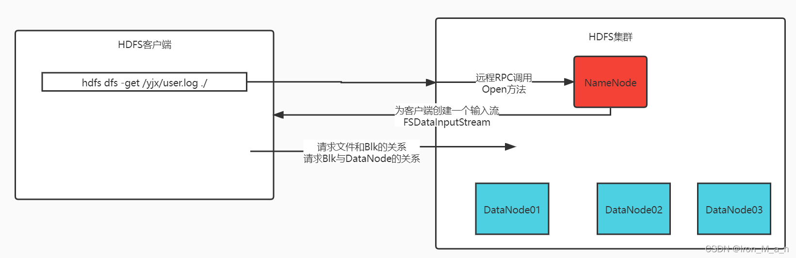 

流程

1. 客户端发送消息给NameNode，申请读取一个文件，NN先判断有没有权限，有没有此文件。

2. 如果没有返回异常，如果有则返回成功并为客户端创建一个输入流，用来读取文件。

3. 客户端获得文件第一个Block的信息，从主备Block中选一个最近进行读取，读取过程，也是按packet为单位读取的。

4. 读取完一个block之后,对这个block进行一次checksum的验证,验证这个block的数据总量是否正确,如果不一致,说明这个block产生损坏,客户端会通知namenode,再从其他节点上读取该block,NameNode收到消息从新备份一次,发指令给这个DataNode让他把这个坏的删除。

5. 以此类推将所有的block块全部读出，合并成一个文件，就完成了读取过程。

## 1.7.Hadoop-HA

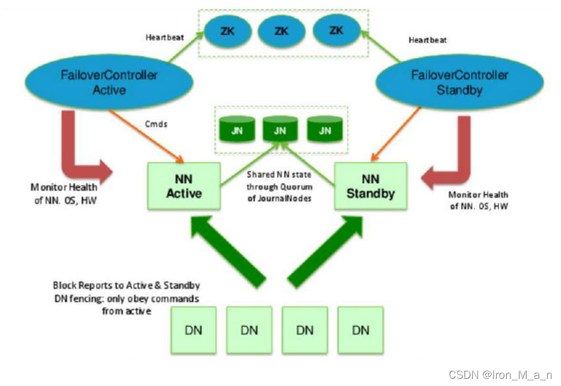

### 1.HA解决的问题(好处)

​		解决了单点故障的问题，启用主备切换模式，当主节点宕机后，集群直接将备用节点切换成主节点。

### 2.ANN的功能作用

Active NameNode 的功能和原理的NN的功能是一样的

- 接受客户端请求，查询数据块DN信息

- 存储数据的元数据信息，文件于Block的映射关系，Block与DN的映射关系

- 启动时：接受DN的block汇报 运行时：和DN保持心跳(3s,10m30s)

- 完全基于内存 优点：数据处理效率高 缺点：数据的持久化(日志edits+快照fsimage)


### 3.SNN的功能作用

- Standby NameNode：NN的备用节点

- 他和主节点做同样的工作，但是它不会发出任何指令

- 替代了SNN，并接替了合并日志的工作。


### 4.DataNode的功能作用

- 存储，文件的Block数据

- 启动时：同时向两个NN汇报Block信息

- 运行中：同时和两个NN节点保持心跳机制

### 5.QJM的功能作用

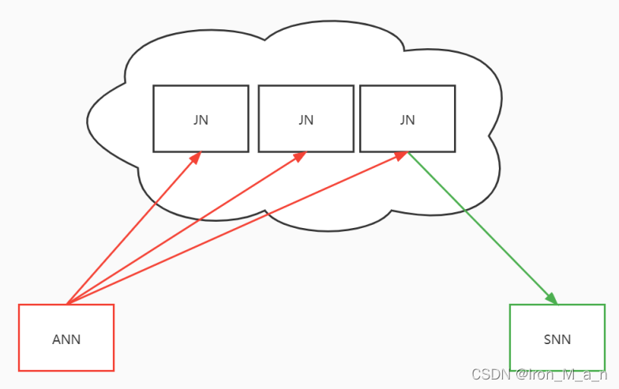

- Quorum JournalNode Manager 共享存储系统，NameNode通过共享存储系统实现日志数据同步。

- JournalNode是一个独立的小集群，它的实现原理和Zookeeper的一致( Paxos)

- ANN产生日志文件的时候，就会同时发送到 JournalNode的集群中每个节点上

- JournalNode不要求所有的jn节点都接收到日志，只要有半数以上的（n/2+1）节点接收到日志，那么本条日志就生效

- SNN每间隔一段时间就去QJM上面取回最新的日志

  - SNN上的日志有可能不是最新的，因为不上所有jn节点都是全部的最新数据


- 在原来的模式下，这些日志文件都是放在active的NameNode(NN) 中，又starndy 的NN 定期来合并这些日志文件(压缩等待),然后将合并后的文件合并到active 的NN,关键问题是，如果这个NN挂掉了那么整个集群就挂掉了，为了解决这个问题。

  - 将日志文件由NN写到几台机器上journalnode,几台的原因是担心有机器挂掉.


  - 设置两个NN，一个是active的，一个是backup的，如果active的挂掉了，通过zookeeper，让backup的NN变成active的NN，通过重播journalnode上的日志，让backup的NN的数据同步到active NN 挂掉的状态, 这样集群的容错能力更强。


### 6.ZKFC作用

- Failover Controller(故障转移控制器)

- 对 NameNode 的主备切换进行总体控制，能及时检测到 NameNode 的健康状况

  - 在主 NameNode 故障时借助 Zookeeper 实现自动的主备选举和切换

  - 为了防止因为NN的GC失败导致心跳受影响，ZKFC作为一个deamon进程从NN分离出来

- 启动时

  - 当集群启动时，主备节点的概念是很模糊的

  - 当ZKFC只检查到一个节点是健康状态，直接将其设置为主节点

  - 当zkfc检查到两个NN节点是的健康状态，发起投票机制

  - 选出一个主节点，一个备用节点，并修改主备节点的状态

- 运行时

  - 当主节点选举成功后，zookeeper中创建一个临时数据并watch，但主节点出现异常问题时，会被watch到，然后回进行主备切换

  - 当宕机的主节点上线后，会转变为备用节点


### 7.Zookeeper

- 辅助投票，辅助NN节点的主备切换

- 和ZKFC保持心跳机制，确定ZKFC的存活


### 8.脑裂问题解决办法

#### 什么是脑裂

- 自动故障恢复过程中，两个NameNode都认为自己是Active。如果同时存在两个Active NameNode，客户端可以连接任何一个，客户端发出改变文件或陌路的请求时，是不会在两个NameNode间同步的，因为两个Active NameNode都不屑去读edits，那么树目录也对不上了，这就是脑裂

解决脑裂的核心是隔离，将旧的主节点进行隔离操作

#### 方法一

- 每次NN发生指令时，会携带一个序列号

- 每次选举,ANN都会将序列号发送给DN

- 出现脑裂后，多个NN发送指令，DN只以最新的指令为准


#### 方法二

- 每次ANN选举后，都会在Zookeeper生成一个临时节点和一个正常节点。

- 当ANN正常下线，临时与正常节点都会被删除

- 当ANN被动下线时，只有临时节点会被删除

- SNN发现临时与正常节点都不在，放心的切换为主节点

- SNN发现只有临时节点不在时，可能是发生了脑裂现象。

  - 首先会联系以前的ANN，PRC调用ANN的ActiveBreadCrumb方法，尝试主切换为备。

  - 如果切换失败，会执行预定义的隔离措施 sshfence或者shellfence将ANN杀死 然后SNN调用BecomeActive成为主节点，开始对外提供服务。并在Zookeeper上创建临时与正常节点。

  - 核心 就是先杀旧主，在立新主


## 1.8、Hadoop-Federation联邦机制

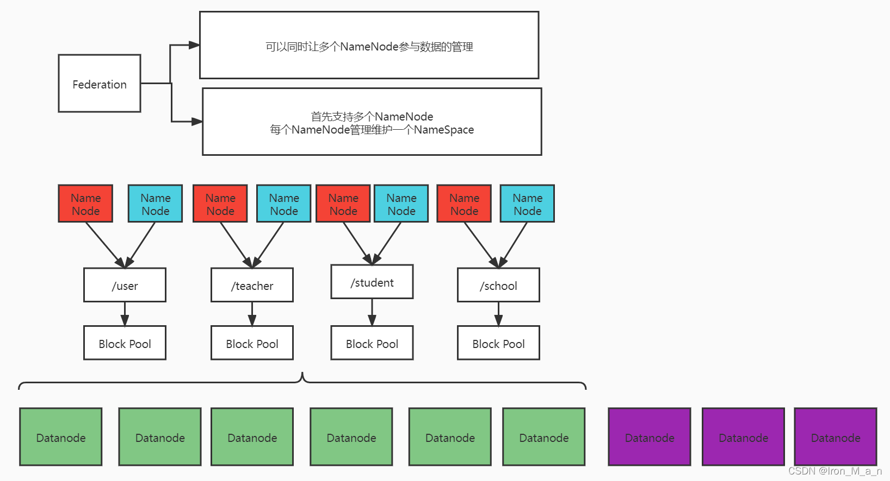

### 1.8.1.联邦机制解决的问题

- 单NN局限性

  - 整个HDFS文件系统的吞吐量受限于单个Namenode的吞吐量

  - 资源的隔离性，HDFS上的一个实验程序就很有可能影响整个HDFS上运行的程序

  - 纵向扩展目前的Namenode不可行

  - 单点故障，Namenode的宕机无疑会导致整个集群不可用。

  - 后期NN节点内存会被占满


### 1.8.2.联邦机制的实现

- 允许一个集群中有多个NN节点，并且每一个NN节点都是HA高可用的。

- 所有的nn共享dn，但是每一个namespace会单独管理自己的块，会创建一个管理块的机制：blocks pool

- 每个NN节点有一个命名空间，每个命名空间有对应的块池

  - 块池Block Pool，存放该NN节点管理的Block块与DN的映射关系

  - 块池是一个逻辑概念

- 通过多个namenode/namespace把元数据的存储和管理分散到多个节点中

- namenode/namespace可以通过增加机器来进行水平扩展

## 1.9.Hadoop3.X新特性

- EC技术，减少文件的存储空间，但执行远程读取时数据重建带来额外的开销，所有用于不太频繁访问的数据。

  Erasure Coding-[Hadoop](https://so.csdn.net/so/search?q=Hadoop&spm=1001.2101.3001.7020) 3.0中的**HDFS擦除编码**（EC）

- 在Hadoop3中允许用户运行多个备用的NameNode。

- 早些时候，多个Hadoop服务的默认端口位于Linux端口范围，因此，具有临时范围冲突端口已经被移除该范围

- DataNode可能会因为文件的添加或者替换导致节点存储出现偏移，但3.X会平衡功能来处理这种情况

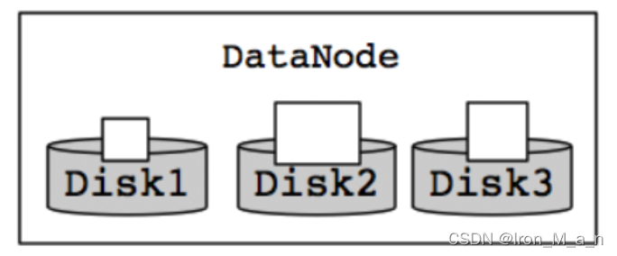

↓

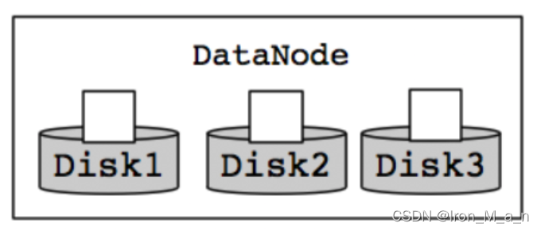

- Hadoop3中，最低版本要求是JDK8


## 1.10.面试题

1 请说下 HDFS 读写流程
2 HDFS 在读取文件的时候,如果其中一个块突然损坏了怎么办
3 HDFS 在上传文件的时候,如果其中一个 DataNode 突然挂掉了怎么办
4 NameNode 在启动的时候会做哪些操作
5 Secondary NameNode 了解吗，它的工作机制是怎样的
6 Secondary NameNode 不能恢复 NameNode 的全部数据，那如何保证 NameNode 数据
存储安全
7 在 NameNode HA 中，会出现脑裂问题吗？怎么解决脑裂
8 小文件过多会有什么危害,如何避免
9 请说下 HDFS 的组织架构

面试题
请说下 MR 中 Map Task 的工作机制

请说下 MR 中 Reduce Task 的工作机制

请说下 MR 中 shuffle 阶段

shuffle 阶段的数据压缩机制了解吗

在写 MR 时，什么情况下可以使用规约

yarn 集群的架构和工作原理知道多少

yarn 的任务提交流程是怎样的

yarn 的资源调度三种模型了解吗

[大数据培训：Hadoop高频面试题 (baidu.com)](https://baijiahao.baidu.com/s?id=1721901087775042053&wfr=spider&for=pc)


# 2、分布式计算模型MapReduce

## 2.1. mapreduce的定义

- [mapreduce](https://so.csdn.net/so/search?q=mapreduce&spm=1001.2101.3001.7020)必须构建在hdfs之上一种大数据离线计算框架
- 计算向数据靠拢，将计算传递给有数据的节点上进行工作
- mapreduce不会马上得到结果,他会有一定的延时

- MapReduce是一个分布式运算程序的编程框架，是用户开发“基于Hadoop的数据分析应用”的核心框架。

- MapReduce核心功能是将用户编写的业务逻辑代码和自带默认组件整合成一个完整的分布式运算程序，并发运行在一个Hadoop集群上。

## 2.2. mapreduce的核心思想

- MapReduce的思想核心是“**分而治之**”，适用于大量复杂的任务处理场景（大规模数据处理场景）。
- Map负责“分”，即把复杂的任务分解为若干个“简单的任务”来并行处理。可以进行拆分的前提是这些==小任务可以并行计算，彼此间几乎没有依赖关系。==
- Reduce负责“合”，即对map阶段的结果进行全局汇总。
- 这两个阶段合起来正是MapReduce思想的体现。
- 还有一个比较形象的语言解释MapReduce：　　
  - 例子一：我们要数图书馆中的所有书。你数1号书架，我数2号书架。这就是“**Map**”。我们人越多，数书就越快。
  - 然后把所有人的统计数加在一起。这就是“**Reduce**”。
  - 例子二：电影黑客帝国当中，特工”（Agents），Smith（史密斯）对付救世主Neo打不过怎么办？一个人打不过，就复制十个出来，十个不行就复制一百个

## 2.3. MapReduce编程模型

- MapReduce是采用一种分而治之的思想设计出来的分布式计算框架
- 那什么是分而治之呢？
  - 比如一复杂、计算量大、耗时长的的任务，暂且称为“大任务”；
  - 此时使用单台服务器无法计算或较短时间内计算出结果时，可将此大任务切分成一个个小的任务，小任务分别在不同的服务器上并行的执行；
  - 最终再汇总每个小任务的结果
- MapReduce由两个阶段组成：
  - Map阶段（切分成一个个小的任务）
  - Reduce阶段（汇总小任务的结果）

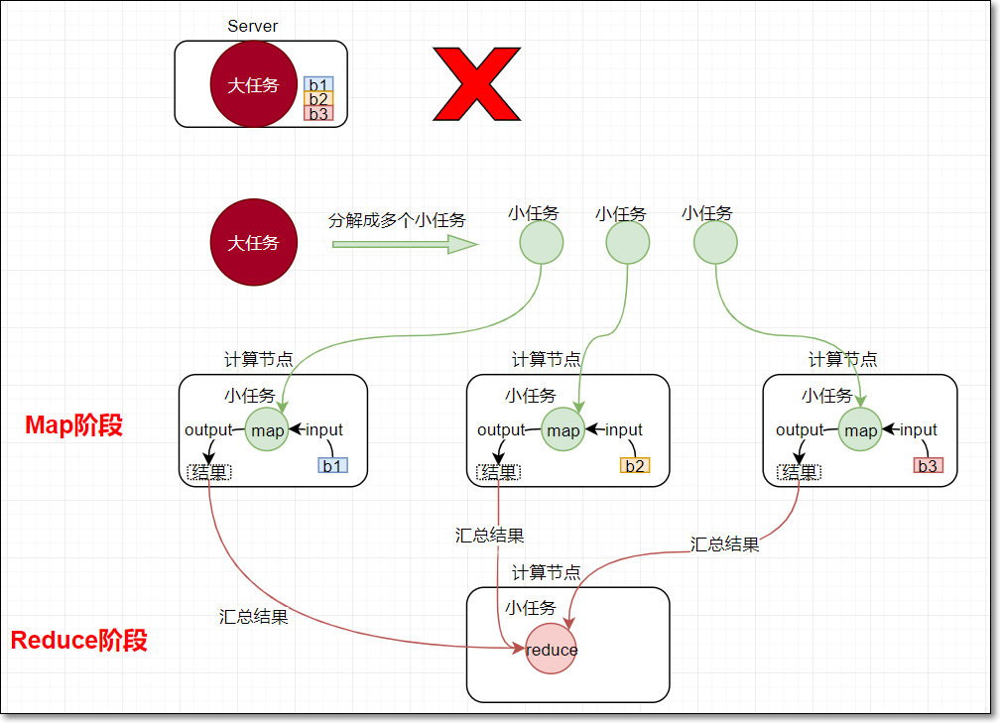

### 1. Map阶段

- map阶段有一个关键的map()函数；

- 此函数的输入是键值对

- 输出是一系列键值对，输出写入本地磁盘。

### 2. Reduce阶段

- reduce阶段有一个关键的函数reduce()函数

- 此函数的输入也是键值对（即map的输出（kv对））

- 输出也是一系列键值对，结果最终写入HDFS

### 3. Map&Reduce

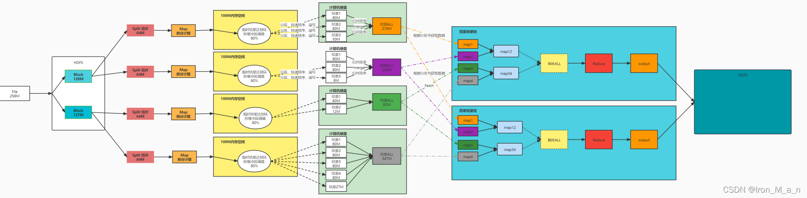

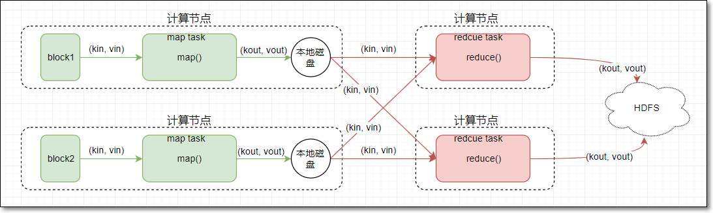

## 2.4. MapReduce的计算流程

### 2.4.1 过程

- 从HDFS上拉取Block用于计算，可能Block小于计算节点的数量，为了动态的调整 参数计算的节点的数据，为了使得计算块的数量和集群的计算能力匹配，对Block进行split切片操作，split是一种逻辑概念，在不改变现在数据存储的情况下，可以控制参与计算的节点数目。一般切片大小为Block块的整数倍(1/2倍 ，2倍等)。

- 一个split切片对应一个map，及一个MapTask。Map开始从对应的切片读取数据，最终读取的是Block的数据，默认的读取器每次从Block读取一行数据，读到内存中，根据自己写的map方法的逻辑对数据进行拆分计算，这样就会在内存中产生大量的临时文件，产生的临时文件存放在内存的环形数据缓存区中，可以循环利用这个缓冲区，减少数据**溢写**（Spill，内存有大小）时的map的停止时间（环形缓冲区，便于写入缓冲区和写出缓冲区同时进行）。缓冲区数据到达80%时，数据会经过分区，分区内进行排序然后溢写到磁盘上，然后以溢写的小文件进行合并成一个大的文件。等到ReduceTask来拉取所需要的文件。

- ReduceTask不同分区拉取到对应的文件后，先进行合并排序操作，合并成为一个大文件后，对这个文件进行reduce操作。最后输出对应的计算结果。


### 2.4.2MapTask过程

1. 包含切分之后的Read，Map，Collect，Spill（溢写，从内存往磁盘写数据的过程被称为Spill），Merge（因为最终的文件只有一个，所以需要将这些溢写文件归并到一起，这个过程就叫做Merge）五个步骤

2. Hadoop默认为行读取器，读取对应split切片的一行的数据。

3. 循环执行用户编写的map()，生成对应的结果，直到读取完毕。

4. map()产生的结果，会被OutputCollector.collect()方法收集，并写入一个环形缓冲区内。

5. 环形缓冲区满后，MapReduce会将数据写到本地磁盘上，生成一个临时文件，需要注意的是，将数据写入本地磁盘之前，先要对数据进行一次本地排序，并在必要时对数据进行合并、压缩等操作。先通过key进行分区，然后分区内排序。ReduceTask拉取时，只需知道数据头，与长度就可以直接拉取到分区对应的数据，不需要排序。

6. Merge(Combine**规约**)阶段：当所有数据处理完成后，MapTask对所有临时文件进行一次合并，以确保最终只会生成一个数据文件。


### 2.4.3ReduceTask过程

1. 包含切分之后的Copy，Merge ，Sort ，Reduce 四个步骤

2. Copy阶段，Reduce不同分区从每一个Map生成的大文件中拉取对应分区的数据。如果其大小超过一定阈值，则写到磁盘上，否则直接放到内存中。

3. Merger阶段，reduce从每个map生成的的大文件中拉取一段需要的文件，或拉取map的数个文件。对拉取的所有小文件，进行合并，合并为一个大文件，为了更好的计算与管理。

4. Sort阶段，各个 MapTask 已经实现对自己的处理结果进行了局部排序，因此，ReduceTask 只需对所有数据进行一次归并排序即可。

5. Reduce 阶段：执行自己编写的reduce()函数，将计算结果写到 HDFS 上。


### 2.4.4MapReduce 中 shuffle 阶段

1. shuffle阶段分为四个步骤：依次为：**分区**，排序，规约，分组，其中前三个步骤在map阶段完成，最后一个步骤在reduce阶段完成。
2. Shuffle是MapReduce的核心，它分布在map阶段和reduce阶段。一般将Map产生输出开始到Redeuce获得数据作为输入之前的过程叫做shuffle。Shuffle描述着数据从map task流向reduce task的这段过程。
3. **Collect阶段**：将 MapTask 的结果输出到默认大小为 100M 的环形缓冲区，保存的是 key/value，Partition 分区信息等。
4. **Spill阶段**：当内存中的数据量达到一定的阀值的时候，就会将数据写入本地磁盘，在将数据写入磁盘之前需要对数据进行一次排序的操作，如果配置了 combiner，还会将有相同分区号和 key 的数据进行排序。
5. **MapTask阶段的Merge**：把所有溢出的临时文件进行一次合并操作，以确保一个 MapTask 最终只产生一个中间数据文件。
6. **Copy阶段**：ReduceTask 启动 Fetcher 线程到已经完成 MapTask 的节点上复制一份属于自己的数据，这些数据默认会保存在内存的缓冲区中，当内存的缓冲区达到一定的阀值的时候，就会将数据写到磁盘之上。
7. **ReduceTask阶段的Merge**：在 ReduceTask 远程复制数据的同时，会在后台开启两个线程对内存到本地的数据文件进行合并操作。
8. **Sort阶段**：在对数据进行合并的同时，会进行排序操作，由于 MapTask 阶段已经对数据进行了局部的排序，ReduceTask 只需保证 Copy 的数据的最终整体有效性即可。
9. Shuffle 中的缓冲区大小会影响到 mapreduce 程序的执行效率，原则上说，缓冲区越大，磁盘io的次数越少，执行速度就越快。缓冲区的大小可以通过参数调整, 参数：mapreduce.task.io.sort.mb 默认100M

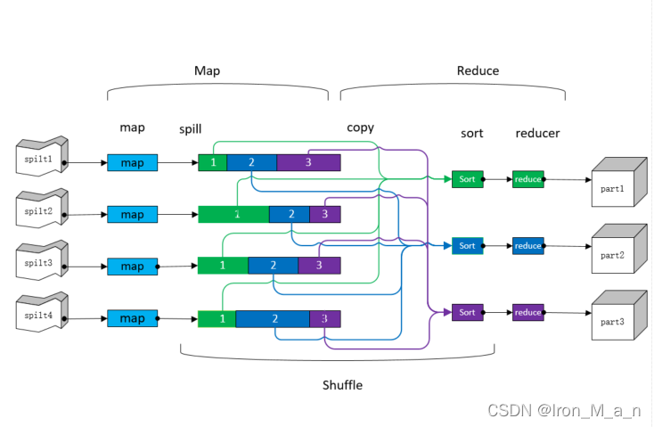

## 2.5. mapreduce编程指导思想（八个步骤背下来）

- mapReduce编程模型的总结：

- MapReduce的开发一共有八个步骤其中map阶段分为2个步骤，shuffle阶段4个步骤，reduce阶段分为2个步骤

### 2.5.1. Map阶段2个步骤

- 第一步：设置inputFormat类，将数据切分成key，value对，输入到第二步

- 第二步：自定义map逻辑，处理我们第一步的输入kv对数据，然后转换成新的key，value对进行输出

### 2.5.2. shuffle阶段4个步骤

- 第三步：对上一步输出的key，value对进行分区。（相同key的kv对属于同一分区）

- 第四步：对每个分区的数据按照key进行排序

- 第五步：对分区中的数据进行规约(combine操作)，降低数据的网络拷贝（可选步骤）

- 第六步：对排序后的kv对数据进行分组；分组的过程中，key相同的kv对为一组；将同一组的kv对的所有value放到一个集合当中（每组数据调用一次reduce方法）

### 2.5.3. reduce阶段2个步骤

- 第七步：对多个map的任务进行合并排序，写reduce函数自己的逻辑，对输入的key，value对进行处理，转换成新的key，value对进行输出

- 第八步：设置将输出的key，value对数据保存到文件中

## 2.6.为什么要有环形缓冲区？

我们读取到文件，直接排序，然后写到HDFS里不就好了吗？为啥还要整一个环形缓冲区呢？

那从架构的角度看环形缓冲区，他这么设计有什么用呢？解决什么问题呢？

环形缓冲区不需要重新申请新的内存，始终用的都是这个内存空间。MR是用java写的，而Java有一个最讨厌的机制就是Full GC。Full GC总是会出来捣乱，这个bug也非常隐蔽，发现了也不好处理。环形缓冲区从头到尾都在用那一个内存，不断重复利用，因此完美的规避了Full GC导致的各种问题，同时也规避了频繁申请内存引发的其他问题。

另外呢，环形缓冲区同时做了两件事情：1、排序；2、索引。在这里一次排序， 将无序的数据变为有序，写磁盘的时候顺序写，读数据的时候顺序读，效率高非常多！

在这里设置索引区也是为了能够持续的处理任务。每读取一段数据，就往索引文件里也写一段，这样在排序的时候能加快速度。


## 2.7. hadoop当中常用的数据类型

- hadoop没有沿用java当中基本的数据类型，而是自己进行封装了一套数据类型，其自己封装的类型与java的类型对应如下

- 下表常用的数据类型对应的Hadoop数据序列化类型

| Java类型 | Hadoop   Writable类型 |
| -------- | --------------------- |
| Boolean  | BooleanWritable       |
| Byte     | ByteWritable          |
| Int      | IntWritable           |
| Float    | FloatWritable         |
| Long     | LongWritable          |
| Double   | DoubleWritable        |
| String   | Text                  |
| Map      | MapWritable           |
| Array    | ArrayWritable         |
| byte[]   | BytesWritable         |

## 2.8. mapreduce编程入门之词频统计

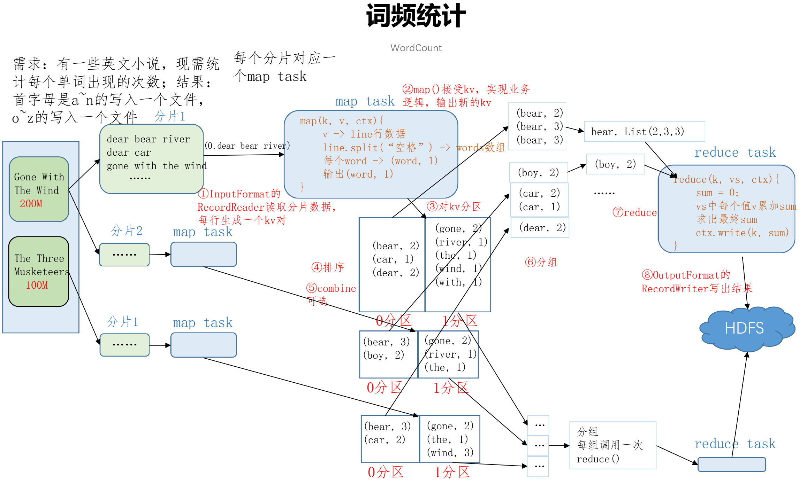

## 2.9. mapreduce编程入门案例之单词计数统计实现

- 需求：现有数据格式如下，每一行数据之间都是使用逗号进行分割，求取每个单词出现的次数

```
hello,hello
world,world
hadoop,hadoop
hello,world
hello,flume
hadoop,hive
hive,kafka
flume,storm
hive,oozie
```

### 2.9.1. 第一步：创建maven工程并导入以下jar包

```xml
    <properties>
        <hadoop.version>3.1.4</hadoop.version>
    </properties>

    <dependencies>
        <dependency>
            <groupId>org.apache.hadoop</groupId>
            <artifactId>hadoop-client</artifactId>
            <version>${hadoop.version}</version>
        </dependency>
        <dependency>
            <groupId>org.apache.hadoop</groupId>
            <artifactId>hadoop-common</artifactId>
            <version>${hadoop.version}</version>
        </dependency>

        <dependency>
            <groupId>org.apache.hadoop</groupId>
            <artifactId>hadoop-hdfs</artifactId>
            <version>${hadoop.version}</version>
        </dependency>

        <dependency>
            <groupId>org.apache.hadoop</groupId>
            <artifactId>hadoop-mapreduce-client-core</artifactId>
            <version>${hadoop.version}</version>
        </dependency>
        <!-- https://mvnrepository.com/artifact/junit/junit -->
        <dependency>
            <groupId>junit</groupId>
            <artifactId>junit</artifactId>
            <version>4.11</version>
            <scope>test</scope>
        </dependency>
        <dependency>
            <groupId>org.testng</groupId>
            <artifactId>testng</artifactId>
            <version>RELEASE</version>
        </dependency>
        <dependency>
            <groupId>log4j</groupId>
            <artifactId>log4j</artifactId>
            <version>1.2.17</version>
        </dependency>
    </dependencies>
    <build>
        <plugins>
            <plugin>
                <groupId>org.apache.maven.plugins</groupId>
                <artifactId>maven-compiler-plugin</artifactId>
                <version>3.0</version>
                <configuration>
                    <source>1.8</source>
                    <target>1.8</target>
                    <encoding>UTF-8</encoding>
                    <!--   <verbal>true</verbal>-->
                </configuration>
            </plugin>
            <plugin>
                <groupId>org.apache.maven.plugins</groupId>
                <artifactId>maven-shade-plugin</artifactId>
                <version>2.4.3</version>
                <executions>
                    <execution>
                        <phase>package</phase>
                        <goals>
                            <goal>shade</goal>
                        </goals>
                        <configuration>
                            <minimizeJar>true</minimizeJar>
                        </configuration>
                    </execution>
                </executions>
            </plugin>
        </plugins>
    </build>
```

### 2.9.2.第二步：定义mapper类

```java
import org.apache.hadoop.io.IntWritable;
import org.apache.hadoop.io.LongWritable;
import org.apache.hadoop.io.Text;
import org.apache.hadoop.mapreduce.Mapper;

import java.io.IOException;

/**
 * 自定义mapper类需要继承Mapper，有四个泛型，
 * keyin:  k1    行偏移量  Long
 * valuein:  v1   一行文本内容   String
 * keyout:  k2   每一个单词   String
 * valueout : v2   1         int
 * 在hadoop当中没有沿用Java的一些基本类型，使用自己封装了一套基本类型
 * long  ==>LongWritable
 * String  ==> Text
 * int  ==>  IntWritable
 */
public class MyMapper extends Mapper<LongWritable, Text, Text, IntWritable> {
    IntWritable intWritable = new IntWritable(1);
    Text text = new Text();

    /**
     * 继承mapper之后，覆写map方法，每次读取一行数据，都会来调用一下map方法
     *
     * @param key：对应k1
     * @param value:对应v1
     * @param context    上下文对象。承上启下，承接上面步骤发过来的数据，通过context将数据发送到下面的步骤里面去
     * @throws IOException
     * @throws InterruptedException k1    v1
     *                              0     hello,world
     *                              <p>
     *                              k2      v2
     *                              hello   1
     *                              world   1
     */
    @Override
    protected void map(LongWritable key, Text value, Context context) throws IOException, InterruptedException {
        //获取我们的一行数据
        String line = value.toString();
        String[] split = line.split(",");

        for (String word : split) {
            //将每个单词出现都记做1次
            //key2  Text类型
            //v2  IntWritable类型
            text.set(word);
            //将我们的key2  v2写出去到下游
            context.write(text, intWritable);
        }
    }
}
```

### 2.9.3.第三步：定义reducer类

```java
import org.apache.hadoop.io.IntWritable;
import org.apache.hadoop.io.Text;
import org.apache.hadoop.mapreduce.Reducer;

import java.io.IOException;

public class MyReducer extends Reducer<Text, IntWritable, Text, IntWritable> {
    //第三步：分区   相同key的数据发送到同一个reduce里面去，相同key合并，value形成一个集合

    /**
     * (hadoop,1)
     * (hive,1)
     * (hadoop,1)
     * (hive,1)
     * (hadoop,1)
     * (hive,1)
     * (hadoop,1)
     * -> hadoop, Iterable<IntWritable>(1,1,1,1) =>调用一次reduce()
     * -> hive, Iterable<IntWritable>(1,1,1) =>调用一次reduce()
     * 继承Reducer类之后，覆写reduce方法
     *
     * @param key
     * @param values
     * @param context
     * @throws IOException
     * @throws InterruptedException
     */
    @Override
    protected void reduce(Text key, Iterable<IntWritable> values, Context context) throws IOException, InterruptedException {
        int result = 0;
        for (IntWritable value : values) {
            //将我们的结果进行累加
            result += value.get();
        }
        //继续输出我们的数据
        IntWritable intWritable = new IntWritable(result);
        //将我们的数据输出
        context.write(key, intWritable);
    }
}
```

### 2.9.4.第四步：组装main程序

```java
import org.apache.hadoop.conf.Configuration;
import org.apache.hadoop.conf.Configured;
import org.apache.hadoop.fs.FileSystem;
import org.apache.hadoop.fs.Path;
import org.apache.hadoop.io.IntWritable;
import org.apache.hadoop.io.Text;
import org.apache.hadoop.mapreduce.Job;
import org.apache.hadoop.mapreduce.lib.input.TextInputFormat;
import org.apache.hadoop.mapreduce.lib.output.TextOutputFormat;
import org.apache.hadoop.util.Tool;
import org.apache.hadoop.util.ToolRunner;

/**
 * 这个类作为mr程序的入口类，这里面写main方法
 */
public class WordCount extends Configured implements Tool {
    /**
     * 实现Tool接口之后，需要实现一个run方法，
     * 这个run方法用于组装我们的程序的逻辑，其实就是组装八个步骤
     *
     * @param args
     * @return
     * @throws Exception
     */
    @Override
    public int run(String[] args) throws Exception {
        /***
         * 第一步：读取文件，解析成key,value对，k1   v1
         * 第二步：自定义map逻辑，接受k1   v1  转换成为新的k2   v2输出
         * 第三步：分区。相同key的数据发送到同一个reduce里面去，key合并，value形成一个集合
         * 第四步：排序   对key2进行排序。字典顺序排序
         * 第五步：规约  combiner过程  调优步骤 可选
         * 第六步：分组
         * 第七步：自定义reduce逻辑接受k2   v2  转换成为新的k3   v3输出
         * 第八步：输出k3  v3 进行保存
         */

        //获取Job对象，组装我们的八个步骤，每一个步骤都是一个class类
        Configuration conf = super.getConf();

        Job job = Job.getInstance(conf, WordCount.class.getSimpleName());

        //判断输出路径，是否存在，如果存在，则删除
        FileSystem fileSystem = FileSystem.get(conf);
        if (fileSystem.exists(new Path(args[1]))) {
            fileSystem.delete(new Path(args[1]), true);
        }

        //实际工作当中，程序运行完成之后一般都是打包到集群上面去运行，打成一个jar包
        //如果要打包到集群上面去运行，必须添加以下设置
        job.setJarByClass(WordCount.class);

        //第一步：读取文件，解析成key,value对，k1:行偏移量  v1：一行文本内容
        job.setInputFormatClass(TextInputFormat.class);
        //指定我们去哪一个路径读取文件
//        TextInputFormat.addInputPath(job,new Path("file:///C:\\Users\\admin\\Desktop\\高级06\\Hadoop\\MapReduce&YARN\\MR第一次\\1、wordCount_input\\数据"));
        TextInputFormat.addInputPath(job, new Path(args[0]));

        //第二步：自定义map逻辑，接受k1   v1  转换成为新的k2   v2输出
        job.setMapperClass(MyMapper.class);
        //设置map阶段输出的key,value的类型，其实就是k2  v2的类型
        job.setMapOutputKeyClass(Text.class);
        job.setMapOutputValueClass(IntWritable.class);

        //第三步到六步：分区，排序，规约，分组都省略

        //第七步：自定义reduce逻辑
        job.setReducerClass(MyReducer.class);
        //设置key3  value3的类型
        job.setOutputKeyClass(Text.class);
        job.setOutputValueClass(IntWritable.class);

        //第八步：输出k3  v3 进行保存
        job.setOutputFormatClass(TextOutputFormat.class);
        //一定要注意，输出路径是需要不存在的，如果存在就报错
//        TextOutputFormat.setOutputPath(job,new Path("C:\\Users\\admin\\Desktop\\高级06\\Hadoop\\MapReduce&YARN\\MR第一次\\wordCount_output"));
        TextOutputFormat.setOutputPath(job, new Path(args[1]));

        job.setNumReduceTasks(3);

        //提交job任务
        boolean b = job.waitForCompletion(true);
        return b ? 0 : 1;
    }

    /*
    作为程序的入口类
     */
    public static void main(String[] args) throws Exception {
        Configuration configuration = new Configuration();

        //提交run方法之后，得到一个程序的退出状态码
        int run = ToolRunner.run(configuration, new WordCount(), args);
        //根据我们 程序的退出状态码，退出整个进程
        System.exit(run);
    }
}
```

- 本地运行

- 集群运行
  - 打包：
  - 启动jar包：
  
  
  
  

## 2.10. Map Task数量及切片机制

### 2.10.1. MapTask个数

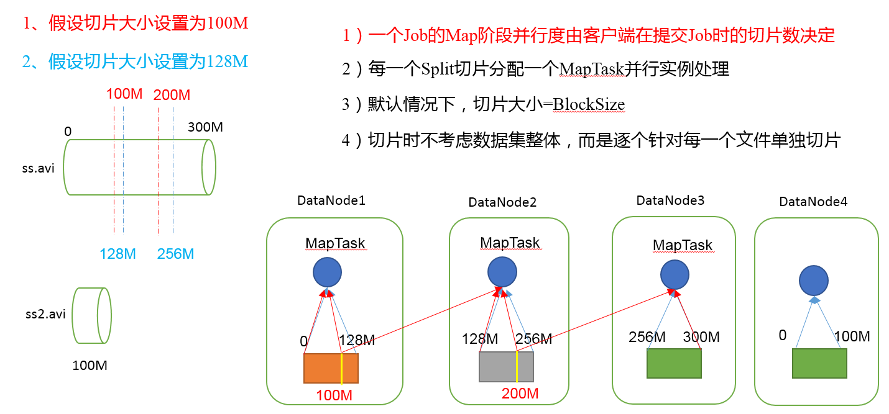

- 在运行我们的MapReduce程序的时候，我们可以清晰的看到会有多个mapTask的运行
  - 那么maptask的个数究竟与什么有关
  - 我们可以通过MapReduce的源码进行查看mapTask的个数究竟是如何决定的
- 在MapReduce当中，每个mapTask处理一个切片split的数据量，注意切片与block块的概念很像，但是block块是HDFS当中存储数据的单位，切片split是MapReduce当中每个MapTask处理数据量的单位。
- MapTask并行度决定机制
- 数据块：Block是HDFS物理上把数据分成一块一块。
- 数据切片：数据切片只是在逻辑上对输入进行分片，并==不会在磁盘上将其切分成片进行存储==。
- 查看FileInputFormat的源码，里面getSplits的方法便是获取所有的切片，其中有个方法便是获取切片大小

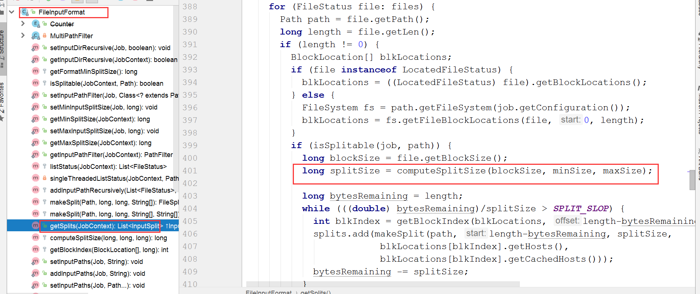

- 切片大小的计算公式：

```java
Math.max(minSize, Math.min(maxSize, blockSize));   
mapreduce.input.fileinputformat.split.minsize=1 默认值为1  
mapreduce.input.fileinputformat.split.maxsize= Long.MAXValue 默认值Long.MAXValue  
blockSize为128M 
```

- 由以上计算公式可以推算出split切片的大小刚好与block块相等

- 那么hdfs上面如果有以下两个文件，文件大小分别为300M和10M，那么会启动多少个MapTask？？？

  1、输入文件两个

```
file1.txt    300M
file2.txt    10M
```

​		2、经过FileInputFormat的切片机制运算后，形成的切片信息如下：

```
file1.txt.split1-- 0~128
file1.txt.split2-- 128~256
file1.txt.split3-- 256~300
file2.txt.split1-- 0~10M
```

​	一共就会有四个切片，与我们block块的个数刚好相等

- 如果有1000个小文件，每个小文件是1kb-100MB之间，那么我们启动1000个MapTask是否合适，该如何合理的控制MapTask的个数？？？

### 2.10.2. 如何控制mapTask的个数

- 如果需要控制maptask的个数，我们只需要调整maxSize和minsize这两个值，那么切片的大小就会改变，切片大小改变之后，mapTask的个数就会改变
- maxsize（切片最大值）：参数如果调得比blockSize小，则会让切片变小，而且就等于配置的这个参数的值。
- minsize（切片最小值）：参数调的比blockSize大，则可以让切片变得比blockSize还大。


## 2.11.小文件合并有很多种方式：

 1、上传之前的小文件合并
 2、使用sequenceFile来进行小文件的合并（通过自定义InputFormat实现将小文件全部读取， 然后输出成为一个SequenceFile格式的大文件，进行文件的合并）

 3、使用har归档文件来进行合并


## 2.12. 自定义InputFormat

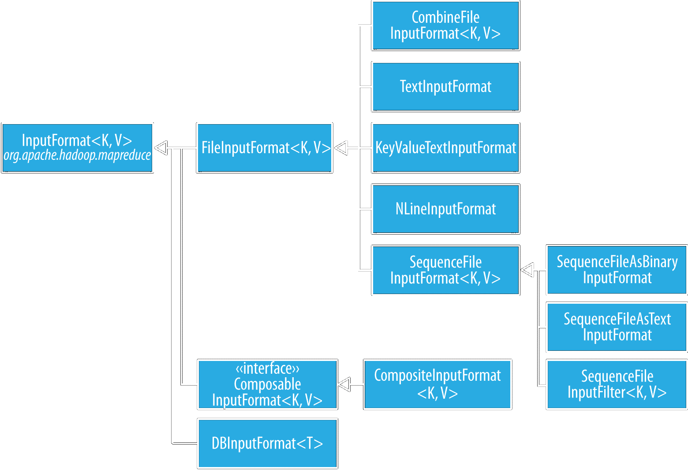

- mapreduce框架当中已经给我们提供了很多的文件输入类，用于处理文件数据的输入，如果以上提供的文件数据类还不够用的话，我们也可以通过自定义InputFormat来实现文件数据的输入

- 需求：现在有大量的小文件，我们通过自定义InputFormat实现将小文件全部读取，然后输出成为一个SequenceFile格式的大文件，进行文件的合并

### 2.12.1. 第一步：自定义InputFormat

```java
import org.apache.hadoop.fs.Path;
import org.apache.hadoop.io.BytesWritable;
import org.apache.hadoop.io.NullWritable;
import org.apache.hadoop.mapreduce.InputSplit;
import org.apache.hadoop.mapreduce.JobContext;
import org.apache.hadoop.mapreduce.RecordReader;
import org.apache.hadoop.mapreduce.TaskAttemptContext;
import org.apache.hadoop.mapreduce.lib.input.FileInputFormat;

import java.io.IOException;

public class MyInputFormat extends FileInputFormat<NullWritable, BytesWritable> {

    @Override
    public RecordReader<NullWritable, BytesWritable> createRecordReader(InputSplit split, TaskAttemptContext context) throws IOException, InterruptedException {
        MyRecordReader myRecordReader = new MyRecordReader();
        myRecordReader.initialize(split, context);
        return myRecordReader;
    }

    /**
     * 注意这个方法，决定我们的文件是否可以切分，如果不可切分，直接返回false
     * 到时候读取一个文件的数据的时候，一次性将此文件全部内容都读取出来
     *
     * @param context
     * @param filename
     * @return
     */
    @Override
    protected boolean isSplitable(JobContext context, Path filename) {
        return false;
    }
}
```

### 2.12.2. 第二步：自定义RecordReader读取数据

```java
import org.apache.hadoop.conf.Configuration;
import org.apache.hadoop.fs.FSDataInputStream;
import org.apache.hadoop.fs.FileSystem;
import org.apache.hadoop.fs.Path;
import org.apache.hadoop.io.BytesWritable;
import org.apache.hadoop.io.IOUtils;
import org.apache.hadoop.io.NullWritable;
import org.apache.hadoop.mapreduce.InputSplit;
import org.apache.hadoop.mapreduce.RecordReader;
import org.apache.hadoop.mapreduce.TaskAttemptContext;
import org.apache.hadoop.mapreduce.lib.input.FileSplit;

import java.io.IOException;

//RecordReader读取分片的数据
public class MyRecordReader extends RecordReader<NullWritable, BytesWritable> {
    //要读取的分片
    private FileSplit fileSplit;
    private Configuration configuration;
    //当前的value值
    private BytesWritable bytesWritable;

    //标记一下分片有没有被读取；默认是false
    private boolean flag = false;

    //初始化方法
    @Override
    public void initialize(InputSplit split, TaskAttemptContext context) throws IOException, InterruptedException {
        this.fileSplit = (FileSplit) split;
        this.configuration = context.getConfiguration();
        this.bytesWritable = new BytesWritable();
    }

    /**
     * RecordReader读取分片时，先判断是否有下一个kv对，根据flag判断；
     * 如果有，则一次性的将文件内容全部读出
     * @return
     * @throws IOException
     * @throws InterruptedException
     */
    @Override
    public boolean nextKeyValue() throws IOException, InterruptedException {
        if (!flag) {
            long length = fileSplit.getLength();
            byte[] splitContent = new byte[(int) length];
            //读取分片内容
            Path path = fileSplit.getPath();
            FileSystem fileSystem = path.getFileSystem(configuration);
            FSDataInputStream inputStream = fileSystem.open(path);

            //split内容写入splitContent
            IOUtils.readFully(inputStream, splitContent, 0, (int) length);
            //当前value值
            bytesWritable.set(splitContent, 0, (int) length);
            flag = true;

            IOUtils.closeStream(inputStream);
            //fileSystem.close();
            
            return true;
        }
        return false;
    }

    /**
     * 获取当前键值对的键
     * @return
     * @throws IOException
     * @throws InterruptedException
     */
    @Override
    public NullWritable getCurrentKey() throws IOException, InterruptedException {
        return NullWritable.get();
    }

    /**
     * 获取当前键值对的值
     * @return
     * @throws IOException
     * @throws InterruptedException
     */
    @Override
    public BytesWritable getCurrentValue() throws IOException, InterruptedException {
        return bytesWritable;
    }

    /**
     * 读取分片的进度
     * @return
     * @throws IOException
     * @throws InterruptedException
     */
    @Override
    public float getProgress() throws IOException, InterruptedException {
        return flag ? 1.0f : 0.0f;
    }

    //释放资源
    @Override
    public void close() throws IOException {

    }
}
```

### 2.12.3.第三步：自定义mapper类

```java
import org.apache.hadoop.io.BytesWritable;
import org.apache.hadoop.io.NullWritable;
import org.apache.hadoop.io.Text;
import org.apache.hadoop.mapreduce.Mapper;
import org.apache.hadoop.mapreduce.lib.input.FileSplit;

import java.io.IOException;

public class MyMapper extends Mapper<NullWritable, BytesWritable, Text, BytesWritable> {
    /**
     * @param key
     * @param value   小文件的全部内容
     * @param context
     * @throws IOException
     * @throws InterruptedException
     */
    @Override
    protected void map(NullWritable key, BytesWritable value, Context context) throws IOException, InterruptedException {
        //文件名
        FileSplit inputSplit = (FileSplit) context.getInputSplit();
        String name = inputSplit.getPath().getName();
        context.write(new Text(name), value);
    }
}
```

### 2.12.4.第四步：定义main方法

```java
import org.apache.hadoop.conf.Configuration;
import org.apache.hadoop.conf.Configured;
import org.apache.hadoop.fs.Path;
import org.apache.hadoop.io.BytesWritable;
import org.apache.hadoop.io.Text;
import org.apache.hadoop.mapreduce.Job;
import org.apache.hadoop.mapreduce.lib.output.SequenceFileOutputFormat;
import org.apache.hadoop.util.Tool;
import org.apache.hadoop.util.ToolRunner;

public class MyInputFormatMain extends Configured implements Tool {
    @Override
    public int run(String[] args) throws Exception {
        Job job = Job.getInstance(super.getConf(), "mergeSmallFile");
        //如果要集群运行，需要加
        job.setJarByClass(MyInputFormatMain.class);

        job.setInputFormatClass(MyInputFormat.class);
        MyInputFormat.addInputPath(job, new Path(args[0]));

        job.setMapperClass(MyMapper.class);
        job.setMapOutputKeyClass(Text.class);
        job.setMapOutputValueClass(BytesWritable.class);

        //没有reduce。但是要设置reduce的输出的k3   value3 的类型
        job.setOutputKeyClass(Text.class);
        job.setOutputValueClass(BytesWritable.class);

        //将我们的文件输出成为SequenceFile这种格式
        job.setOutputFormatClass(SequenceFileOutputFormat.class);
        SequenceFileOutputFormat.setOutputPath(job, new Path(args[1]));

        boolean b = job.waitForCompletion(true);
        return b ? 0 : 1;
    }

    public static void main(String[] args) throws Exception {
        int run = ToolRunner.run(new Configuration(), new MyInputFormatMain(), args);
        System.exit(run);
    }

}
```

## 2.13. mapreduce的partitioner详解

- 在mapreduce执行当中，有一个默认的步骤就是partition分区；
  - 分区主要的作用就是默认将key相同的kv对数据发送到同一个分区中；
  - 在mapreduce当中有一个抽象类叫做Partitioner，默认使用的实现类是HashPartitioner，我们可以通过HashPartitioner的源码，查看到分区的逻辑如下
- 我们MR编程的第三步就是分区；这一步中决定了map生成的每个kv对，被分配到哪个分区里
  - 那么这是如何做到的呢？
  - 要实现此功能，涉及到了分区器的概念；

### 2.13.1. 默认分区器HashPartitioner

- MR框架有个默认的分区器HashPartitioner

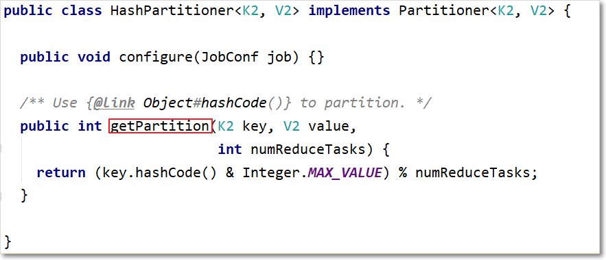

我们能观察到：

- HashPartitioner实现了Partitioner接口
- 它实现了getPartition()方法
  - 此方法中对k取hash值
  - 再与MAX_VALUE按位与
  - 结果再模上reduce任务的个数
- 所以，能得出结论，相同的key会落入同一个分区中

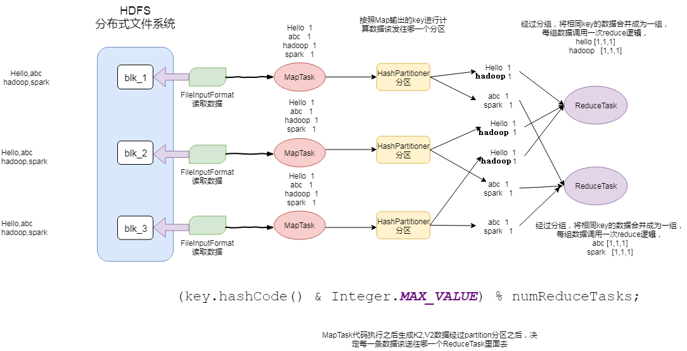

### 2.13.2. 一、自定义分区器

- 实际生产中，有时需要自定义分区的逻辑，让key落入我们想让它落入的分区
- 此时就需要自定义分区器
- 如何实现？
- 参考默认分区器HashPartitioner
  - 自定义的分区器类，如CustomPartitioner
    - 实现接口Partitioner
    - 实现getPartition方法；此方法中定义分区的逻辑
  - main方法
    - 将自定义的分区器逻辑添加进来job.setPartitionerClass(CustomPartitioner.class)
    - 设置对应的reduce任务个数job.setNumReduceTasks(3)

- 现有一份关于手机的流量数据，样本数据如下

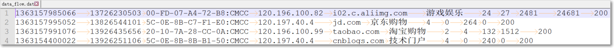

数据格式说明

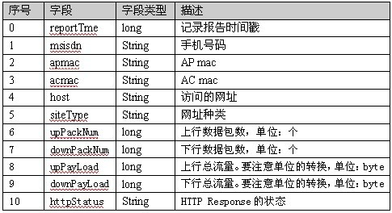

- ==需求==：使用mr，实现将不同的手机号的数据划分到6个不同的文件里面去，具体划分规则如下

```
135开头的手机号分到一个文件里面去，
136开头的手机号分到一个文件里面去，
137开头的手机号分到一个文件里面去，
138开头的手机号分到一个文件里面去，
139开头的手机号分到一个文件里面去，
其他开头的手机号分到一个文件里面去
```

- 根据mr编程8步，需要实现的代码有：
  - 一、针对输入数据，设计JavaBean
  - 二、自定义的Mapper逻辑（第二步）
  - 三、自定义的分区类（第三步）
  - 四、自定义的Reducer逻辑（第七步）
  - 五、main程序入口
- 代码实现
- 一、针对数据文件，设计JavaBean；作为map输出的value

```java
import org.apache.hadoop.io.Writable;

import java.io.DataInput;
import java.io.DataOutput;
import java.io.IOException;

//序列化与反序列化
public class FlowBean implements Writable {
    //上行包个数
    private Integer upPackNum;
    //下行包个数
    private Integer downPackNum;
    //上行总流量
    private Integer upPayLoad;
    //下行总流量
    private Integer downPayLoad;

    //反序列化的时候要用到
    public FlowBean() {
    }

    @Override
    public void write(DataOutput out) throws IOException {
        //调用序列化方法时，要用与类型匹配的write方法
        //记住序列化的顺序
        out.writeInt(upPackNum);
        out.writeInt(downPackNum);
        out.writeInt(upPayLoad);
        out.writeInt(downPayLoad);
    }

    @Override
    public void readFields(DataInput in) throws IOException {
        //发序列话的顺序要与序列化保持一直
        //使用的方法类型要匹配
        this.upPackNum = in.readInt();
        this.downPackNum = in.readInt();
        this.upPayLoad = in.readInt();
        this.downPayLoad = in.readInt();
    }

    public Integer getUpPackNum() {
        return upPackNum;
    }

    public Integer getDownPackNum() {
        return downPackNum;
    }

    public Integer getUpPayLoad() {
        return upPayLoad;
    }

    public Integer getDownPayLoad() {
        return downPayLoad;
    }

    public void setUpPackNum(Integer upPackNum) {
        this.upPackNum = upPackNum;
    }

    public void setDownPackNum(Integer downPackNum) {
        this.downPackNum = downPackNum;
    }

    public void setUpPayLoad(Integer upPayLoad) {
        this.upPayLoad = upPayLoad;
    }

    public void setDownPayLoad(Integer downPayLoad) {
        this.downPayLoad = downPayLoad;
    }

    @Override
    public String toString() {
        return "FlowBean{" +
                "upPackNum=" + upPackNum +
                ", downPackNum=" + downPackNum +
                ", upPayLoad=" + upPayLoad +
                ", downPayLoad=" + downPayLoad +
                '}';
    }
}
```

### 2.13.3. 二、自定义Mapper类

```java
import org.apache.hadoop.io.LongWritable;
import org.apache.hadoop.io.Text;
import org.apache.hadoop.mapreduce.Mapper;

import java.io.IOException;

public class FlowMapper extends Mapper<LongWritable, Text, Text, FlowBean> {
    private FlowBean flowBean;
    private Text text;

    @Override
    protected void setup(Context context) throws IOException, InterruptedException {
        flowBean = new FlowBean();
        text = new Text();
    }

    @Override
    protected void map(LongWritable key, Text value, Context context) throws IOException, InterruptedException {
        String[] split = value.toString().split("\t");

        String phoneNum = split[1];
        //上行包个数
        String upPackNum = split[6];
        //下行包个数
        String downPackNum = split[7];
        //上行总流量
        String upPayLoad = split[8];
        //下行总流量
        String downPayLoad = split[9];

        text.set(phoneNum);

        flowBean.setUpPackNum(Integer.parseInt(upPackNum));
        flowBean.setDownPackNum(Integer.parseInt(downPackNum));
        flowBean.setUpPayLoad(Integer.parseInt(upPayLoad));
        flowBean.setDownPayLoad(Integer.parseInt(downPayLoad));

        context.write(text, flowBean);
    }
}
```

### 2.13.4. 三、自定义分区

```java
import org.apache.hadoop.io.Text;
import org.apache.hadoop.mapreduce.Partitioner;

public class PartitionOwn extends Partitioner<Text, FlowBean> {

    @Override
    public int getPartition(Text text, FlowBean flowBean, int numPartitions) {
        String phoenNum = text.toString();

        if (null != phoenNum && !phoenNum.equals("")) {
            if (phoenNum.startsWith("135")) {
                return 0;
            } else if (phoenNum.startsWith("136")) {
                return 1;
            } else if (phoenNum.startsWith("137")) {
                return 2;
            } else if (phoenNum.startsWith("138")) {
                return 3;
            } else if (phoenNum.startsWith("139")) {
                return 4;
            } else {
                return 5;
            }
        } else {
            return 5;
        }
    }
}
```

### 2.13.5 四、自定义Reducer

```java
import org.apache.hadoop.io.Text;
import org.apache.hadoop.mapreduce.Reducer;

import java.io.IOException;

public class FlowReducer extends Reducer<Text, FlowBean, Text, Text> {

    @Override
    protected void reduce(Text key, Iterable<FlowBean> values, Context context) throws IOException, InterruptedException {
        //上行包个数
        int upPackNum = 0;
        //下行包个数
        int downPackNum = 0;
        //上行总流量
        int upPayLoad = 0;
        //下行总流量
        int downPayLoad = 0;

        for (FlowBean value : values) {
            upPackNum += value.getUpPackNum();
            downPackNum += value.getDownPackNum();
            upPayLoad += value.getUpPayLoad();
            downPayLoad += value.getDownPayLoad();
        }

        context.write(key, new Text(upPackNum + "\t" + downPackNum + "\t" + upPayLoad + "\t" + downPayLoad));
    }
}
```

### 2.13.6 五、main入口

```java
import org.apache.hadoop.conf.Configuration;
import org.apache.hadoop.conf.Configured;
import org.apache.hadoop.fs.Path;
import org.apache.hadoop.io.Text;
import org.apache.hadoop.mapreduce.Job;
import org.apache.hadoop.mapreduce.lib.input.TextInputFormat;
import org.apache.hadoop.mapreduce.lib.output.TextOutputFormat;
import org.apache.hadoop.util.Tool;
import org.apache.hadoop.util.ToolRunner;

public class FlowMain extends Configured implements Tool {
    @Override
    public int run(String[] args) throws Exception {
        //获取job对象
        Job job = Job.getInstance(super.getConf(), FlowMain.class.getSimpleName());
        //如果程序打包运行必须要设置这一句
        job.setJarByClass(FlowMain.class);

        job.setInputFormatClass(TextInputFormat.class);
        TextInputFormat.addInputPath(job, new Path(args[0]));

        job.setMapperClass(FlowMapper.class);
        job.setMapOutputKeyClass(Text.class);
        job.setMapOutputValueClass(FlowBean.class);

        //设置使用的分区器
        job.setPartitionerClass(PartitionOwn.class);
        //reduce task个数
        job.setNumReduceTasks(Integer.parseInt(args[2]));

        job.setReducerClass(FlowReducer.class);
        job.setOutputKeyClass(Text.class);
        job.setOutputValueClass(Text.class);

        job.setOutputFormatClass(TextOutputFormat.class);
        TextOutputFormat.setOutputPath(job, new Path(args[1]));

        boolean b = job.waitForCompletion(true);
        return b ? 0 : 1;
    }


    public static void main(String[] args) throws Exception {
        Configuration configuration = new Configuration();
        configuration.set("mapreduce.framework.name", "local");
        configuration.set("yarn.resourcemanager.hostname", "local");

        int run = ToolRunner.run(configuration, new FlowMain(), args);
        System.exit(run);
    }

}
```

- ==注意：==对于我们自定义分区的案例，==必须打成jar包上传到集群==上面去运行，因为我们本地已经没法通过多线程模拟本地程序运行了，将我们的数据上传到hdfs上面去，然后通过 hadoop jar提交到集群上面去运行，观察我们分区的个数与reduceTask个数的关系

  

- ==思考==：

  如果手动指定6个分区----正好6个分区都有数据，每个reduceTask都在干活
  
  reduceTask个数设置为3个会出现什么情况----报错只有0，1，2分区，而应该分到3 4 5分区的数据没地去
  
  reduceTask个数设置为9个会出现什么情况----有3个分区是空，可以正常运行

- 

## 2.14. MR中的三次排序

mr在Map任务和Reduce任务的过程中，一共发生了3次排序

1）map的溢写阶段，当map函数产生输出时，会首先写入内存的环形缓冲区，当达到设定的阀值，在刷写磁盘之前，后台线程会将缓冲区的数据划分成相应的分区。在每个分区中，后台线程按键进行内排序。

2）在Map任务完成之前，磁盘上存在多个已经分好区，并排好序的，大小和缓冲区一样的溢写文件，这时溢写文件将被合并成一个已分区且已排序的输出文件。由于溢写文件已经经过第一次排序，所有合并文件只需要再做一次排序即可使输出文件整体有序。

3）在reduce阶段，需要将多个Map任务的输出文件copy到ReduceTask中后合并，由于经过第二次排序，所以合并文件时只需再做一次排序即可使输出文件整体有序

在MapReduce的shuffle过程中执行了三次排序，分别是：
map的溢写阶段：根据分区以及key进行快速排序
map的合并溢写文件：将同一个分区的多个溢写文件进行归并排序，合成大的溢写文件
reduce输入阶段：将同一分区，来自不同map task的数据文件进行归并排序

在这3次排序中第一次是内存缓冲区做的内排序，使用的算法使快速排序，第二次排序和第三次排序都是在文件合并阶段发生的，使用的是归并排序。


## 2.15. mapreduce当中的排序

### 2.15.1. 可排序的Key

- 排序是MapReduce框架中最重要的操作之一。

  - 在MR编程框架中，默认是对K2进行排序

  - MapTask和ReduceTask均会对数据按照key进行排序。该操作属于Hadoop的默认行为。任何应用程序中的数据均会被排序，而不管逻辑上是否需要。

  - 默认排序是按照字典顺序排序，且实现该排序的方法是快速排序。

- 对于MapTask，它会将处理的结果暂时放到环形缓冲区中，当环形缓冲区使用率达到一定阈值后，再对缓冲区中的数据进行一次快速排序，并将这些有序数据溢写到磁盘上，而当数据处理完毕后，它会对磁盘上所有文件进行归并排序。

- 对于ReduceTask，它从每个执行完成的MapTask上远程拷贝相应的数据文件

  - 如果文件大小超过一定阈值，则溢写磁盘上，否则存储在内存中。
  - 如果磁盘上文件数目达到一定阈值，则进行一次归并排序以生成一个更大文件；
  - 如果内存中文件大小或者数目超过一定阈值，则进行一次合并后将数据溢写到磁盘上。
  - 当所有数据拷贝完毕后，ReduceTask统一对内存和磁盘上的所有数据进行一次归并排序。

### 2.15.2. 排序的种类

  - 1、部分排序

    MapReduce根据输入记录的键对数据集排序。保证输出的**每个文件内部有序**

  - 2、全排序

    最终输出结果只有一个文件，且文件内部有序。**实现方式是只设置一个ReduceTask**。但该方法在处理大型文件时效率极低，因为一台机器处理所有文件，完全丧失了MapReduce所提供的并行架构

  - 3、辅助排序

    在Reduce端对key进行==分组==。应用于：在接收的key为bean对象时，如果key（bean对象）的一个或几个字段相同（全部字段比较不相同），那么这些kv对作为一组，调用一次reduce方法，可以采用==分组排序==。

  - 4、二次排序

    - 二次排序：mr编程中，需要先按输入数据的某一列a排序，如果相同，再按另外一列b排序；比如接下来的例子

    - mr自带的类型作为key无法满足需求，往往需要自定义JavaBean作为map输出的key

    - JavaBean中，使用compareTo方法指定排序规则。

### 2.15.3. 二次排序

- 数据：样本数据如下；

  每条数据有5个字段，分别是手机号、上行包总个数、下行包总个数、上行总流量、下行总流量

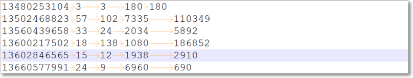

- ==需求==先对下行包总个数升序排序；若相等，再按上行总流量进行降序排序

- 根据mr编程8步，需要实现的代码有：

  - 一、针对输入数据及二次排序规则，设计JavaBean
  - 二、自定义的Mapper逻辑（第二步）
  - 三、自定义的Reducer逻辑（第七步）
  - 四、main程序入口

- 代码实现：

- 一、定义javaBean对象，用于封装数据及定义排序规则

```java
import org.apache.hadoop.io.WritableComparable;

import java.io.DataInput;
import java.io.DataOutput;
import java.io.IOException;

//bean要能够可序列化且可比较，所以需要实现接口WritableComparable
public class FlowSortBean implements WritableComparable<FlowSortBean> {
    private String phone;
    //上行包个数
    private Integer upPackNum;
    //下行包个数
    private Integer downPackNum;
    //上行总流量
    private Integer upPayLoad;
    //下行总流量
    private Integer downPayLoad;

    //用于比较两个FlowSortBean对象
    @Override
    public int compareTo(FlowSortBean o) {
        //升序
        int i = this.downPackNum.compareTo(o.downPackNum);
        if (i == 0) {
            //降序
            i = -this.upPayLoad.compareTo(o.upPayLoad);
        }
        return i;
    }

    //序列化
    @Override
    public void write(DataOutput out) throws IOException {
        out.writeUTF(phone);
        out.writeInt(upPackNum);
        out.writeInt(downPackNum);
        out.writeInt(upPayLoad);
        out.writeInt(downPayLoad);
    }

    //反序列化
    @Override
    public void readFields(DataInput in) throws IOException {
        this.phone = in.readUTF();
        this.upPackNum = in.readInt();
        this.downPackNum = in.readInt();
        this.upPayLoad = in.readInt();
        this.downPayLoad = in.readInt();
    }

    @Override
    public String toString() {
        return phone + "\t" + upPackNum + "\t" + downPackNum + "\t" + upPayLoad + "\t" + downPayLoad;
    }

    //setter、getter方法
    public String getPhone() {
        return phone;
    }

    public void setPhone(String phone) {
        this.phone = phone;
    }

    public Integer getUpPackNum() {
        return upPackNum;
    }

    public void setUpPackNum(Integer upPackNum) {
        this.upPackNum = upPackNum;
    }

    public Integer getDownPackNum() {
        return downPackNum;
    }

    public void setDownPackNum(Integer downPackNum) {
        this.downPackNum = downPackNum;
    }

    public Integer getUpPayLoad() {
        return upPayLoad;
    }

    public void setUpPayLoad(Integer upPayLoad) {
        this.upPayLoad = upPayLoad;
    }

    public Integer getDownPayLoad() {
        return downPayLoad;
    }

    public void setDownPayLoad(Integer downPayLoad) {
        this.downPayLoad = downPayLoad;
    }
}
```

- 二、自定义mapper类

```java
import org.apache.hadoop.io.LongWritable;
import org.apache.hadoop.io.NullWritable;
import org.apache.hadoop.io.Text;
import org.apache.hadoop.mapreduce.Mapper;

import java.io.IOException;

public class FlowSortMapper extends Mapper<LongWritable, Text, FlowSortBean, NullWritable> {

    private FlowSortBean flowSortBean;

    //初始化
    @Override
    protected void setup(Context context) throws IOException, InterruptedException {
        flowSortBean = new FlowSortBean();
    }

    @Override
    protected void map(LongWritable key, Text value, Context context) throws IOException, InterruptedException {
        /**
         * 手机号	上行包	下行包	上行总流量	下行总流量
         * 13480253104	3	3	180	180
         */
        String[] split = value.toString().split("\t");

        flowSortBean.setPhone(split[0]);
        flowSortBean.setUpPackNum(Integer.parseInt(split[1]));
        flowSortBean.setDownPackNum(Integer.parseInt(split[2]));
        flowSortBean.setUpPayLoad(Integer.parseInt(split[3]));
        flowSortBean.setDownPayLoad(Integer.parseInt(split[4]));

        context.write(flowSortBean, NullWritable.get());
    }
}
```

- 三、自定义reducer类

```java
import org.apache.hadoop.io.NullWritable;
import org.apache.hadoop.mapreduce.Reducer;

import java.io.IOException;

public class FlowSortReducer extends Reducer<FlowSortBean, NullWritable, FlowSortBean, NullWritable> {

    @Override
    protected void reduce(FlowSortBean key, Iterable<NullWritable> values, Context context) throws IOException, InterruptedException {
        //经过排序后的数据，直接输出即可
        context.write(key, NullWritable.get());
    }
}
```

- 四、main程序入口

```java
import org.apache.hadoop.conf.Configuration;
import org.apache.hadoop.conf.Configured;
import org.apache.hadoop.fs.Path;
import org.apache.hadoop.io.NullWritable;
import org.apache.hadoop.mapreduce.Job;
import org.apache.hadoop.mapreduce.lib.input.TextInputFormat;
import org.apache.hadoop.mapreduce.lib.output.TextOutputFormat;
import org.apache.hadoop.util.Tool;
import org.apache.hadoop.util.ToolRunner;

public class FlowSortMain extends Configured implements Tool {
    @Override
    public int run(String[] args) throws Exception {
        //获取job对象
        Job job = Job.getInstance(super.getConf(), "flowSort");
        //如果程序打包运行必须要设置这一句
        job.setJarByClass(FlowSortMain.class);

        job.setInputFormatClass(TextInputFormat.class);
        TextInputFormat.addInputPath(job,new Path(args[0]));

        job.setMapperClass(FlowSortMapper.class);
        job.setMapOutputKeyClass(FlowSortBean.class);
        job.setMapOutputValueClass(NullWritable.class);

        job.setReducerClass(FlowSortReducer.class);
        job.setOutputKeyClass(FlowSortBean.class);
        job.setOutputValueClass(NullWritable.class);

        job.setOutputFormatClass(TextOutputFormat.class);
        TextOutputFormat.setOutputPath(job,new Path(args[1]));

        boolean b = job.waitForCompletion(true);

        return b?0:1;
    }


    public static void main(String[] args) throws Exception {
        Configuration configuration = new Configuration();
        int run = ToolRunner.run(configuration, new FlowSortMain(), args);
        System.exit(run);
    }

}
```

## 2.16. mapreduce中的combiner

### 2.16.1. combiner基本介绍

  - combiner类本质也是reduce聚合，combiner类继承Reducer父类

  - combine是运行在map端的，对map task的结果做聚合；而reduce是将来自不同的map task的数据做聚合

  - 作用：

    - combine可以减少map task落盘及向reduce task传输的数据量

  - 是否可以做map端combine：

    - 并非所有的mapreduce job都适用combine，无论适不适用combine，都不能对最终的结果造成影响；比如下边求平均值的例子，就不适用适用combine

    ```
    Mapper
    3 5 7 ->(3+5+7)/3=5 
    2 6 ->(2+6)/2=4
    
    Reducer
    (3+5+7+2+6)/5=23/5    不等于    (5+4)/2=9/2
    ```

### 2.16.2. 需求：

- 对于我们前面的wordCount单词计数统计，我们加上Combiner过程，实现map端的数据进行汇总之后，再发送到reduce端，减少数据的网络拷贝

- 自定义combiner类

  其实直接使用词频统计中的reducer类作为combine类即可

- 在main方法中加入

```java
 job.setCombinerClass(MyReducer.class);
```

- 运行程序，观察控制台有combiner和没有combiner的异同


## 2.17. mapreduce中的GroupingComparator分组详解

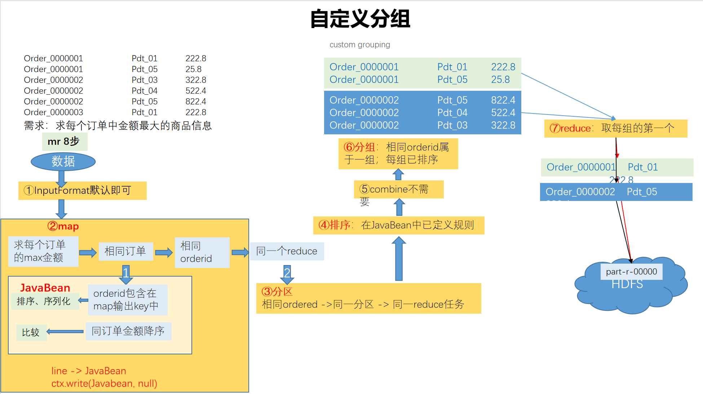

- 关键类GroupingComparator
  - 是mapreduce当中reduce端决定哪些数据作为一组，调用一次reduce的逻辑
  - 默认是key相同的kv对，作为同一组；每组调用一次reduce方法；
  - 可以自定义GroupingComparator，实现自定义的分组逻辑

### 2.17.1. 自定义WritableComparator类

  - （1）继承WritableComparator
  - （2）重写compare()方法

```java
@Override
public int compare(WritableComparable a, WritableComparable b) {
        // 比较的业务逻辑
        return result;
}
```

  - （3）创建一个构造将比较对象的类传给父类

```java
protected OrderGroupingComparator() {
        super(OrderBean.class, true);
}
```

### 2.17.2. 需求：

- 现在有订单数据如下

| **订单id**    | **商品id** | **成交金额** |
| ------------- | ---------- | ------------ |
| Order_0000001 | Pdt_01     | 222.8        |
| Order_0000001 | Pdt_05     | 25.8         |
| Order_0000002 | Pdt_03     | 322.8        |
| Order_0000002 | Pdt_04     | 522.4        |
| Order_0000002 | Pdt_05     | 822.4        |
| Order_0000003 | Pdt_01     | 222.8        |

- 现在需要求取每个订单当中金额最大的商品信息
- 根据mr编程8步，需要实现的代码有：

  - 一、针对输入数据及相同订单按金额降序排序，设计JavaBean
  - 二、自定义的Mapper逻辑（第二步）
  - 三、自定义分区器，相同订单分到同一区（第三步）
  - 四、自定义分区内排序（在JavaBean中已完成）（第四步）
  - 五、自定义分组，相同订单的为同一组（第六步）
  - 六、自定义的Reducer逻辑（第七步）
  - 七、main程序入口

### 2.17.3. 自定义OrderBean对象

```java
import org.apache.hadoop.io.WritableComparable;

import java.io.DataInput;
import java.io.DataOutput;
import java.io.IOException;

public class OrderBean implements WritableComparable<OrderBean> {
    private String orderId;
    private Double price;

    /**
     * key间的比较规则
     *
     * @param o
     * @return
     */
    @Override
    public int compareTo(OrderBean o) {
        //注意：如果是不同的订单之间，金额不需要排序，没有可比性
        int orderIdCompare = this.orderId.compareTo(o.orderId);
        if (orderIdCompare == 0) {
            //比较金额，按照金额进行倒序排序
            int priceCompare = this.price.compareTo(o.price);
            return -priceCompare;
        } else {
            //如果订单号不同，没有可比性，直接返回订单号的升序排序即可
            return orderIdCompare;
        }
    }

    /**
     * 序列化方法
     *
     * @param out
     * @throws IOException
     */
    @Override
    public void write(DataOutput out) throws IOException {
        out.writeUTF(orderId);
        out.writeDouble(price);
    }

    /**
     * 反序列化方法
     *
     * @param in
     * @throws IOException
     */
    @Override
    public void readFields(DataInput in) throws IOException {
        this.orderId = in.readUTF();
        this.price = in.readDouble();
    }

    public String getOrderId() {
        return orderId;
    }

    public void setOrderId(String orderId) {
        this.orderId = orderId;
    }

    public Double getPrice() {
        return price;
    }

    public void setPrice(Double price) {
        this.price = price;
    }

    @Override
    public String toString() {
        return orderId + "\t" + price;
    }
}
```

### 2.17.4. 自定义mapper类：

```java
import org.apache.hadoop.io.LongWritable;
import org.apache.hadoop.io.NullWritable;
import org.apache.hadoop.io.Text;
import org.apache.hadoop.mapreduce.Mapper;

import java.io.IOException;

public class GroupMapper extends Mapper<LongWritable, Text, OrderBean, NullWritable> {

    /**
     * Order_0000001	Pdt_01	222.8
     * Order_0000001	Pdt_05	25.8
     * Order_0000002	Pdt_03	322.8
     * Order_0000002	Pdt_04	522.4
     * Order_0000002	Pdt_05	822.4
     * Order_0000003	Pdt_01	222.8
     * Order_0000003	Pdt_03	322.8
     * Order_0000003	Pdt_04	522.4
     *
     * @param key
     * @param value
     * @param context
     * @throws IOException
     * @throws InterruptedException
     */
    @Override
    protected void map(LongWritable key, Text value, Context context) throws IOException, InterruptedException {
        String[] fields = value.toString().split("\t");

        OrderBean orderBean = new OrderBean();
        orderBean.setOrderId(fields[0]);
        orderBean.setPrice(Double.valueOf(fields[2]));

        //输出orderBean
        context.write(orderBean, NullWritable.get());
    }
}
```

### 2.17.5. 自定义分区类：

```java
import org.apache.hadoop.io.NullWritable;
import org.apache.hadoop.mapreduce.Partitioner;

public class GroupPartitioner extends Partitioner<OrderBean, NullWritable> {
    @Override
    public int getPartition(OrderBean orderBean, NullWritable nullWritable, int numPartitions) {
        //将每个订单的所有的记录，传入到一个reduce当中
        return orderBean.getOrderId().hashCode() % numPartitions;
    }
}
```

### 2.17.6. 自定义分组类：

```java
import org.apache.hadoop.io.WritableComparable;
import org.apache.hadoop.io.WritableComparator;

public class MyGroup extends WritableComparator {
    public MyGroup() {
        //分组类：要对OrderBean类型的k进行分组
        super(OrderBean.class, true);
    }

    @Override
    public int compare(WritableComparable a, WritableComparable b) {
        OrderBean a1 = (OrderBean) a;
        OrderBean b1 = (OrderBean) b;
        //需要将同一订单的kv作为一组
        return a1.getOrderId().compareTo(b1.getOrderId());
    }
}
```

### 2.17.7. 自定义reduce类

```java
import org.apache.hadoop.io.NullWritable;
import org.apache.hadoop.mapreduce.Reducer;

import java.io.IOException;

public class GroupReducer extends Reducer<OrderBean, NullWritable, OrderBean, NullWritable> {

    /**
     * Order_0000002	Pdt_03	322.8
     * Order_0000002	Pdt_04	522.4
     * Order_0000002	Pdt_05	822.4
     * => 这一组中有3个kv
     * 并且是排序的
     * Order_0000002	Pdt_05	822.4
     * Order_0000002	Pdt_04	522.4
     * Order_0000002	Pdt_03	322.8
     *
     * @param key
     * @param values
     * @param context
     * @throws IOException
     * @throws InterruptedException
     */
    @Override
    protected void reduce(OrderBean key, Iterable<NullWritable> values, Context context) throws IOException, InterruptedException {
        //Order_0000002	Pdt_05	822.4 获得了当前订单中进而最高的商品
        context.write(key, NullWritable.get());
    }
}
```

### 2.17.8. 定义程序入口类

```java
import org.apache.hadoop.conf.Configuration;
import org.apache.hadoop.conf.Configured;
import org.apache.hadoop.fs.Path;
import org.apache.hadoop.io.NullWritable;
import org.apache.hadoop.mapreduce.Job;
import org.apache.hadoop.mapreduce.lib.input.TextInputFormat;
import org.apache.hadoop.mapreduce.lib.output.TextOutputFormat;
import org.apache.hadoop.util.Tool;
import org.apache.hadoop.util.ToolRunner;

/**
 * 分组求top 1
 */
public class GroupMain extends Configured implements Tool {
    @Override
    public int run(String[] args) throws Exception {
        //获取job对象
        Job job = Job.getInstance(super.getConf(), "group");
        job.setJarByClass(GroupMain.class);

        //第一步：读取文件，解析成为key，value对
        job.setInputFormatClass(TextInputFormat.class);
        TextInputFormat.addInputPath(job, new Path(args[0]));

        //第二步：自定义map逻辑
        job.setMapperClass(GroupMapper.class);
        job.setMapOutputKeyClass(OrderBean.class);
        job.setMapOutputValueClass(NullWritable.class);

        //第三步：分区
        job.setPartitionerClass(GroupPartitioner.class);

        //第四步：排序  已经做了

        //第五步：规约  combiner  省掉

        //第六步：分组   自定义分组逻辑
        job.setGroupingComparatorClass(MyGroup.class);

        //第七步：设置reduce逻辑
        job.setReducerClass(GroupReducer.class);
        job.setOutputKeyClass(OrderBean.class);
        job.setOutputValueClass(NullWritable.class);

        //第八步：设置输出路径
        job.setOutputFormatClass(TextOutputFormat.class);
        TextOutputFormat.setOutputPath(job, new Path(args[1]));

        //如果设置reduce任务数为多个，必须打包到集群运行
        //job.setNumReduceTasks(3);

        boolean b = job.waitForCompletion(true);
        return b ? 0 : 1;
    }

    public static void main(String[] args) throws Exception {
        int run = ToolRunner.run(new Configuration(), new GroupMain(), args);
        System.exit(run);
    }
}
```

- ==拓展：如何求每个组当中的top2的订单金额数据？？？==

## 2.18. map task工作机制

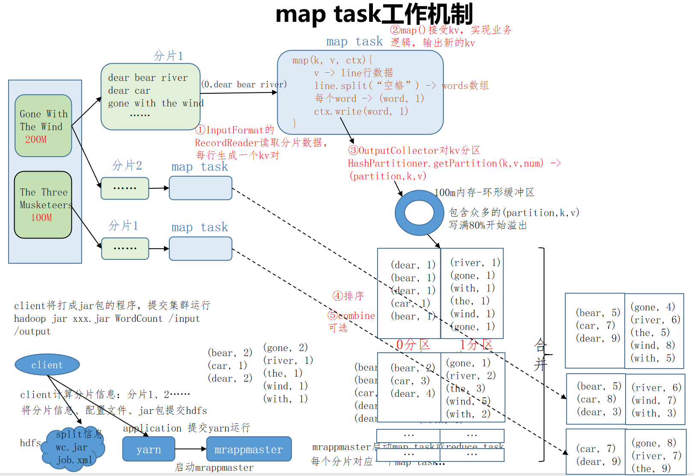

（1）Read阶段：MapTask通过用户编写的RecordReader，从输入InputSplit中解析出一个个key/value。

（2）Map阶段：该节点主要是将解析出的key/value交给用户编写map()函数处理，并产生一系列新的key/value。

（3）Collect收集阶段：在用户编写map()函数中，当数据处理完成后，一般会调用OutputCollector.collect()输出结果。在该函数内部，它会将生成的key/value分区（调用Partitioner），并写入一个环形内存缓冲区中。

（4）Spill阶段：即“溢写”，当环形缓冲区满80%后，MapReduce会将数据写到本地磁盘上，生成一个临时文件。需要注意的是，将数据写入本地磁盘之前，先要对数据进行一次本地排序，并在必要时对数据进行合并、压缩等操作。

- 溢写阶段详情：
  - 步骤1：利用快速排序算法对缓存区内的数据进行排序，排序方式是，先按照分区编号Partition进行排序，然后按照key进行排序。这样，经过排序后，数据以分区为单位聚集在一起，且同一分区内所有数据按照key有序。
  - 步骤2：按照分区编号由小到大依次将每个分区中的数据写入任务工作目录下的临时文件output/spillN.out（N表示当前溢写次数）中。如果用户设置了Combiner，则写入文件之前，对每个分区中的数据进行一次规约操作。
  - 步骤3：将分区数据的元信息写到内存索引数据结构SpillRecord中，其中每个分区的元信息包括，在临时文件中的偏移量、压缩前数据大小和压缩后数据大小。如果当前内存索引大小超过1MB，则将内存索引写到文件output/spillN.out.index中。


（5）合并阶段：当所有数据处理完成后，MapTask对所有临时文件进行一次合并，以确保最终只会生成一个数据文件。

- 当所有数据处理完后，MapTask会将所有临时文件合并成一个大文件，并保存到文件output/file.out中，同时生成相应的索引文件output/file.out.index。
- 在进行文件合并过程中，MapTask以分区为单位进行合并。对于某个分区，它将采用多轮递归合并的方式。每轮合并io.sort.factor（默认10）个文件，并将产生的文件重新加入待合并列表中，对文件排序后，重复以上过程，直到最终得到一个大文件。

- 让每个MapTask最终只生成一个数据文件，可避免同时打开大量文件和同时读取大量小文件产生的随机读取带来的开销。

## 2.19. reduce task工作机制

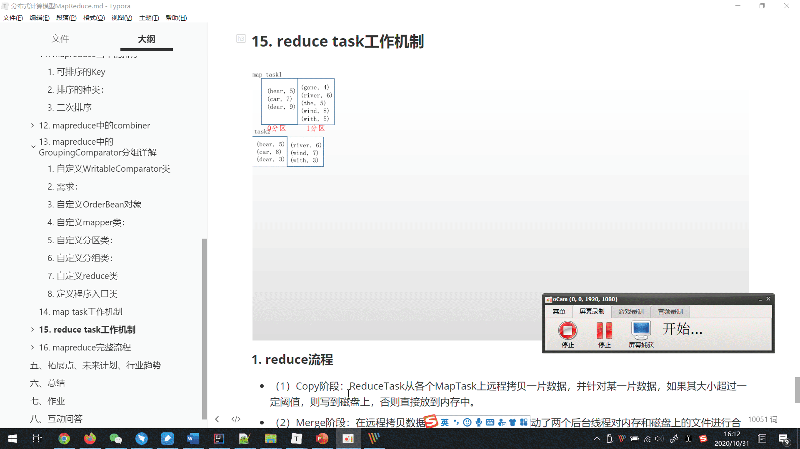

### 2.19.1. reduce流程

（1）Copy阶段：ReduceTask从各个MapTask上远程拷贝一片数据，并针对某一片数据，如果其大小超过一定阈值，则写到磁盘上，否则直接放到内存中。

（2）Merge阶段：在远程拷贝数据的同时，ReduceTask启动了两个后台线程对内存和磁盘上的文件进行合并，以防止内存使用过多或磁盘上文件过多。

（3）Sort阶段：当所有map task的分区数据全部拷贝完，按照MapReduce语义，用户编写reduce()函数输入数据是按key进行聚集的一组数据。为了将key相同的数据聚在一起，Hadoop采用了基于排序的策略。由于各个MapTask已经实现对自己的处理结果进行了==局部排序==，因此，ReduceTask只需对所有数据进行一次==归并排序==即可。

（4）Reduce阶段：reduce()函数将计算结果写到HDFS上。

### 2.19.2. 设置ReduceTask并行度（个数）

- ReduceTask的并行度同样影响整个Job的执行并发度和执行效率，但与MapTask的并发数由切片数决定不同，ReduceTask数量的决定是可以直接手动设置：

  // 默认值是1，手动设置为4

  `job.setNumReduceTasks(4);`

### 2.19.3. 实验：测试ReduceTask多少合适

- （1）实验环境：1个Master节点，16个Slave节点：CPU:8GHZ，内存: 2G

- （2）实验结论：

- 表4-3 改变ReduceTask （数据量为1GB）

| **MapTask   =16** |      |      |      |      |      |      |      |      |      |      |
| ----------------- | ---- | ---- | ---- | ---- | ---- | ---- | ---- | ---- | ---- | ---- |
| ReduceTask        | 1    | 5    | 10   | 15   | 16   | 20   | 25   | 30   | 45   | 60   |
| 总时间            | 892  | 146  | 110  | 92   | 88   | 100  | 128  | 101  | 145  | 104  |

## 2.20. mapreduce完整流程

### 2.20.1. map简图

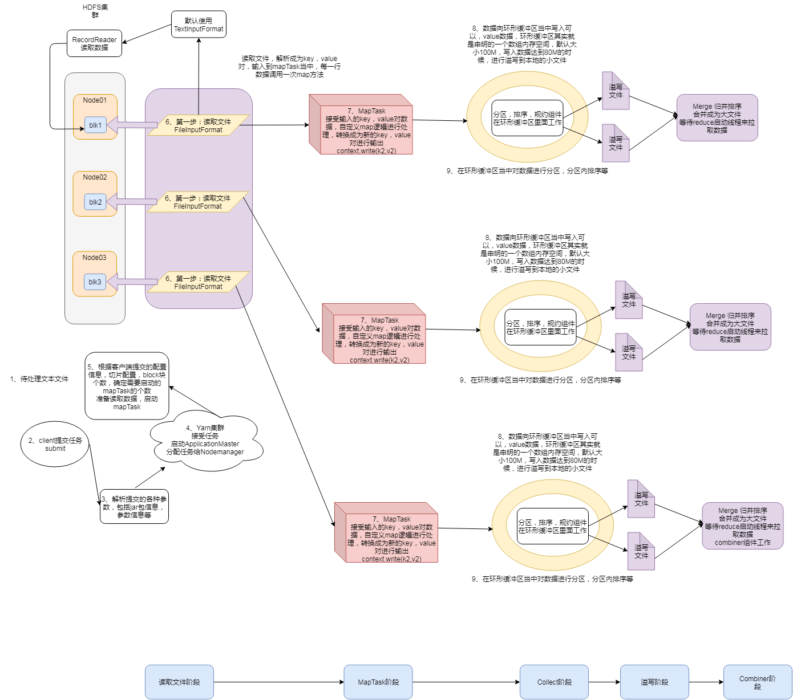

### 2.20.2. reduce简图

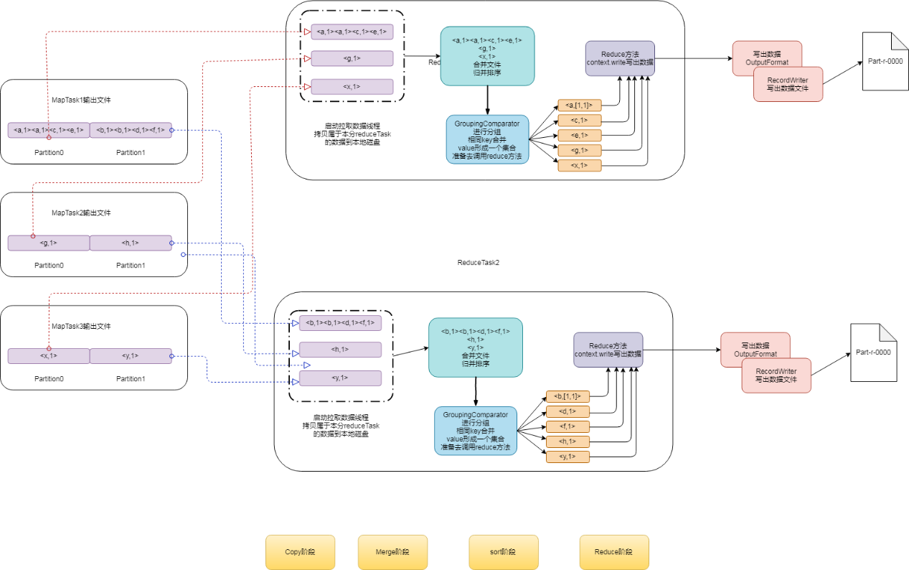

### 2.20.3. mapreduce简略步骤

1. 第一步：读取文件，解析成为key，value对

2. 第二步：自定义map逻辑接受k1,v1，转换成为新的k2,v2输出；写入环形缓冲区

3. 第三步：分区：写入环形缓冲区的过程，会给每个kv加上分区Partition index。（同一分区的数据，将来会被发送到同一个reduce里面去）

4. 第四步：排序：当缓冲区使用80%，开始溢写文件
  1. 先按partition进行排序，相同分区的数据汇聚到一起；
  2. 然后，每个分区中的数据，再按key进行排序

5. 第五步：combiner。调优过程，对数据进行map阶段的合并（注意：并非所有mr都适合combine）

6. 第六步：将环形缓冲区的数据进行溢写到本地磁盘小文件

7. 第七步：归并排序，对本地磁盘溢写小文件进行归并排序

8. 第八步：等待reduceTask启动线程来进行拉取数据

9. 第九步：reduceTask启动线程，从各map task拉取属于自己分区的数据

10. 第十步：从mapTask拉取回来的数据继续进行归并排序

11. 第十一步：进行groupingComparator分组操作

12. 第十二步：调用reduce逻辑，写出数据

13. 第十三步：通过outputFormat进行数据输出，写到文件，一个reduceTask对应一个结果文件


# 3、YARN资源调度系统

## 3.1. 什么是YARN（

- Apache Hadoop YARN(Yet Another Resource Negotiator)是Hadoop的子项目，为分离Hadoop2.0资源管理和计算组件而引入
- YRAN具有足够的通用性，可以支持其它的分布式计算模式

## 3.2. YARN架构剖析

- 类似HDFS，YARN也是经典的**主从（master/slave）架构**
  - YARN服务由一个ResourceManager（RM）和多个NodeManager（NM）构成

  - ResourceManager为主节点（master）

  - NodeManager为从节点（slave）

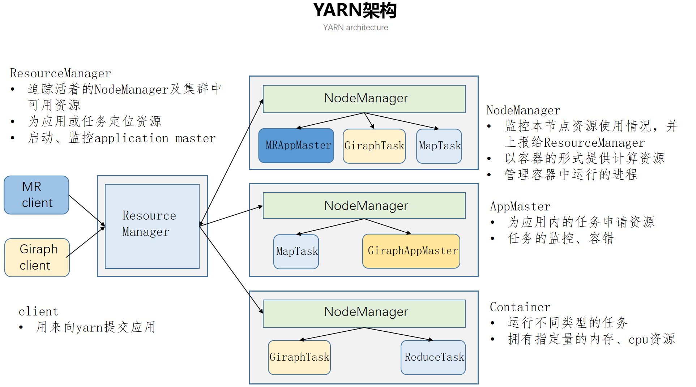

### 3.2.1 ResourceManager

- ResourceManager是YARN中主的角色
- RM是一个全局的资源管理器，集群只有一个active的对外提供服务
  - 负责整个系统的资源管理和分配
  - 包括处理客户端请求
  - 启动/监控 ApplicationMaster
  - 监控 NodeManager、资源的分配与调度
- 它主要由两个组件构成：
  - 调度器（Scheduler）
  - 应用程序管理器（Applications Manager，ASM）
- 调度器Scheduler
  - 调度器根据队列、容量等限制条件（如每个队列分配一定的资源，最多执行一定数量的作业等），将系统中的资源分配给各个正在运行的应用程序。
  - 需要注意的是，该调度器是一个“纯调度器”
    - 它不从事任何与具体应用程序相关的工作，比如不负责监控或者跟踪应用的执行状态等，也不负责重新启动因应用执行失败或者硬件故障而产生的失败任务，这些均交由应用程序相关的ApplicationMaster完成。
    - 调度器仅根据各个应用程序的资源需求进行资源分配，而资源分配单位用一个抽象概念“资源容器”（Resource Container，简称Container）表示，Container是一个动态资源分配单位，它将内存、CPU、磁盘、网络等资源封装在一起，从而限定每个任务使用的资源量。
- 应用程序管理器Applications Manager，ASM
  - 应用程序管理器主要负责管理整个系统中**所有**应用程序
  - 接收job的提交请求
  - 为应用分配第一个 Container 来运行 ApplicationMaster
    - 包括应用程序提交
    - 与调度器scheduler协商资源以启动 ApplicationMaster
    - 监控 ApplicationMaster 运行状态并在失败时重新启动它等

### 3.2.2 NodeManager

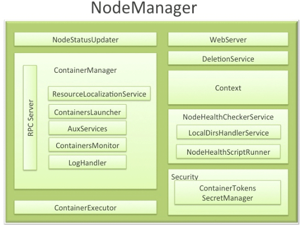

- NodeManager 是YARN中的 slave角色
- NodeManager ：
  - 当一个节点启动时，它会向 ResourceManager 进行==注册==并告知 ResourceManager 自己有多少资源可用。
  - 每个计算节点，运行一个NodeManager进程，通过心跳（==每秒== yarn.resourcemanager.nodemanagers.heartbeat-interval-ms ）上报节点的资源状态(磁盘，内存，cpu等使用信息)
- 功能：

  - 接收及处理来自 ResourceManager 的命令请求，分配 Container 给应用的某个任务；
  - NodeManager 监控本节点上的资源使用情况和各个 Container 的运行状态（cpu和内存等资源）
  - 负责监控并报告 Container 使用信息给 ResourceManager。
  - 定时地向RM汇报以确保整个集群平稳运行，RM 通过收集每个 NodeManager 的报告信息来追踪整个集群健康状态的，而 NodeManager 负责监控自身的健康状态；
  - 处理来自 ApplicationMaster 的请求；
  - 管理着所在节点每个 Container 的生命周期；
- 管理每个节点上的日志；
  - 在运行期，通过 NodeManager 和 ResourceManager 协同工作，这些信息会不断被更新并保障整个集群发挥出最佳状态。
  - NodeManager 只负责管理自身的 Container，它并不知道运行在它上面应用的信息。负责管理应用信息的组件是 ApplicationMaster

### 3.2.3 Container

- Container 是 YARN 中的资源抽象
  - YARN以Container为单位分配资源
  - 它封装了某个节点上的多维度资源，如内存、CPU、磁盘、网络等
  - 当 AM 向 RM 申请资源时，RM 为 AM 返回的资源便是用 Container 表示的
- YARN 会为每个任务分配一个 Container，且该任务只能使用该 Container 中指定数量的资源。
- Container 和集群NodeManager节点的关系是：
  - 一个NodeManager节点可运行多个 Container
  - 但一个 Container 不会跨节点。
  - 任何一个 job 或 application 必须运行在一个或多个 Container 中
  - 在 Yarn 框架中，ResourceManager 只负责告诉 ApplicationMaster 哪些 Containers 可以用
  - ApplicationMaster 还需要去找 NodeManager 请求分配具体的 Container。
- 需要注意的是
  - Container 是一个动态资源划分单位，是根据应用程序的需求动态生成的
  - 目前为止，YARN 仅支持 CPU 和内存两种资源，且使用了轻量级资源隔离机制 Cgroups 进行资源隔离。
- 功能：
  - 对task环境的抽象；

  - 描述一系列信息；

  - 任务运行资源的集合（cpu、内存、io等）；

  - 任务运行环境

### 3.2.4 **ApplicationMaster**

- 功能：
  - 获得数据分片；
  - 为应用程序申请资源并进一步分配给内部任务（TASK）；
  - 任务监控与容错；
  - 负责协调来自ResourceManager的资源，并通过NodeManager监视容器的执行和资源使用情况。

- ApplicationMaster 与 ResourceManager 之间的通信
  - 是整个 Yarn 应用从提交到运行的最核心部分，是 Yarn 对整个集群进行动态资源管理的根本步骤
  - application master==周期性的向resourcemanager发送心跳==，让rm确认appmaster的健康
  - Yarn 的动态性，就是来源于多个Application 的 ApplicationMaster 动态地和 ResourceManager 进行沟通，不断地申请、释放、再申请、再释放资源的过程。

### 3.2.6 JobHistoryServer 

#### 作业历史服务

- 记录在yarn中调度的作业历史运行情况情况，可以通过历史任务日志服务器来查看hadoop的历史任务，出现错误都应该第一时间来查看日志

> 配置历史服务jobhistoryserver

#### 第一步：修改mapred-site.xml

- node01执行以下命令修改mapred-site.xml

```shell
cd /kkb/install/hadoop-3.1.4/etc/hadoop
vim mapred-site.xml
```

- 增加如下内容

```xml
<property>
    <name>mapreduce.jobhistory.address</name>
    <value>node01:10020</value>
</property>

<property>
    <name>mapreduce.jobhistory.webapp.address</name>
    <value>node01:19888</value>
</property>

<property>
  <name>yarn.app.mapreduce.am.env</name>
  <value>HADOOP_MAPRED_HOME=/kkb/install/hadoop-3.1.4</value>
</property>
<property>
  <name>mapreduce.map.env</name>
  <value>HADOOP_MAPRED_HOME=/kkb/install/hadoop-3.1.4</value>
</property>
<property>
  <name>mapreduce.reduce.env</name>
  <value>HADOOP_MAPRED_HOME=/kkb/install/hadoop-3.1.4</value>
</property>


```

> <font color='red'>注意：如果已经存在以上两项配置，那么就不需要再进行配置了</font>

#### 第二步：修改yarn-site.xml

```shell
vim yarn-site.xml
```

- 增加内容

```xml
<!-- 开启日志聚合功能，将application运行时，每个container的日志聚合到一起，保存到文件系统，一般是HDFS -->
<property>
    <name>yarn.log-aggregation-enable</name>
    <value>true</value>
</property>
<!-- 多长时间删除一次聚合产生的日志 -->
<property>
    <name>yarn.log-aggregation.retain-seconds</name>
    <value>2592000</value><!--30 day-->
</property>
<!-- 保留用户日志多少秒。只有日志聚合功能没有开启时yarn.log-aggregation-enable，才有效；现已开启 
<property>
    <name>yarn.nodemanager.log.retain-seconds</name>
    <value>604800</value>
</property>
-->
<!-- 指定聚合产生的日志的压缩算法 -->
<property>
    <name>yarn.nodemanager.log-aggregation.compression-type</name>
    <value>gz</value>
</property>
<!--  nodemanager本地文件存储目录  -->
<property>
    <name>yarn.nodemanager.local-dirs</name>
    <value>/kkb/install/hadoop-3.1.4/hadoopDatas/yarn/local</value>
</property>
<!--  resourceManager  保存完成任务的最大个数  -->
<property>
    <name>yarn.resourcemanager.max-completed-applications</name>
    <value>1000</value>
</property>
<property>
    <name>yarn.log.server.url</name>
    <value>http://node01:19888/jobhistory/logs</value>
</property>
```

#### 第三步：将修改后的文件同步到其他机器上面去

- node01服务器执行以下命令，将修改后的文件同步发送到其他服务器上面去

```shell
cd /kkb/install/hadoop-3.1.4/etc/hadoop
scp mapred-site.xml  yarn-site.xml  node02:$PWD
scp mapred-site.xml  yarn-site.xml  node03:$PWD
```

#### 第四步：重启yarn以及jobhistory服务

- node01执行以下命令重启yarn

```shell
cd /kkb/install/hadoop-3.1.4
sbin/stop-yarn.sh
sbin/start-yarn.sh
mapred --daemon stop historyserver
```

- 启动jobhistory服务

  在yarn-site.xml中如下属性指定的节点上，运行命令启动

```shell
cd /kkb/install/hadoop-3.1.4
mapred --daemon start historyserver
```

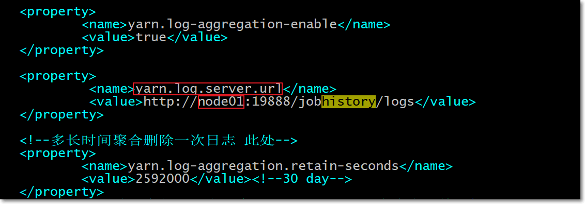

  - 启动成功后会出现JobHistoryServer进程(使用jps命令查看，下面会有介绍) 

  - 并且可以从19888端口进行查看日志详细信息

    ```
    node01:19888
    ```

    点击链接，查看job日志
    
    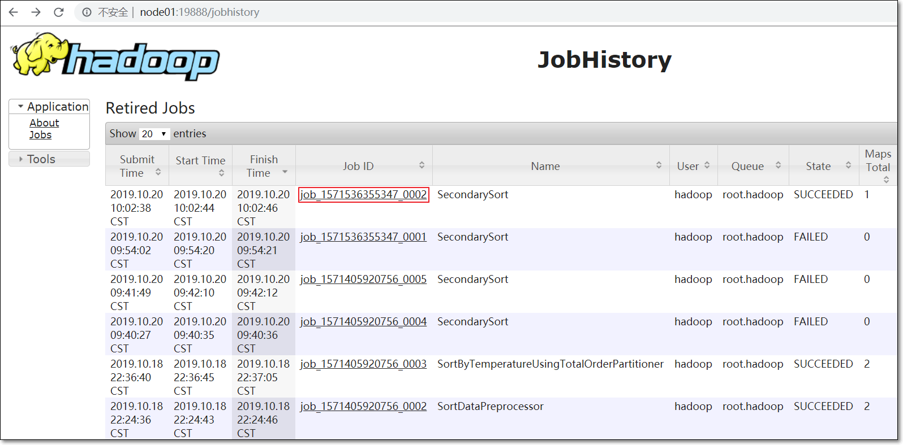

- 如果没有启动jobhistoryserver，无法查看应用的日志
- 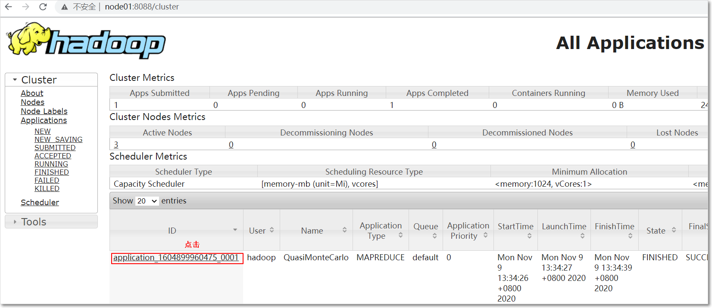

打开如下图界面，在下图中点击History，页面会进行一次跳转

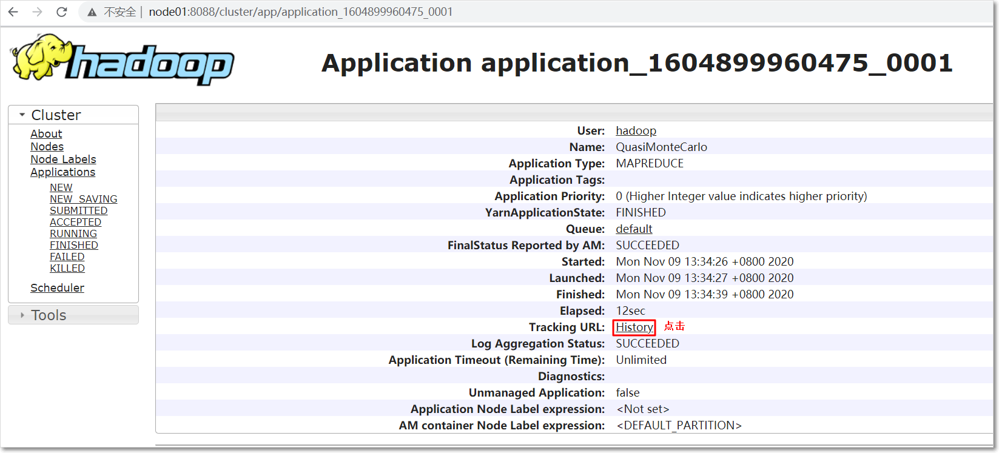

- 点击History之后 跳转后的页面如下图是空白的，因为没有启动jobhistoryserver


- jobhistoryserver启动后，在此运行MR程序，如PI
- 点击History连接，跳转一个赞新的页面
  - TaskType中列举的map和reduce，Total表示此次运行的mapreduce程序执行所需要的map和reduce的任务数、

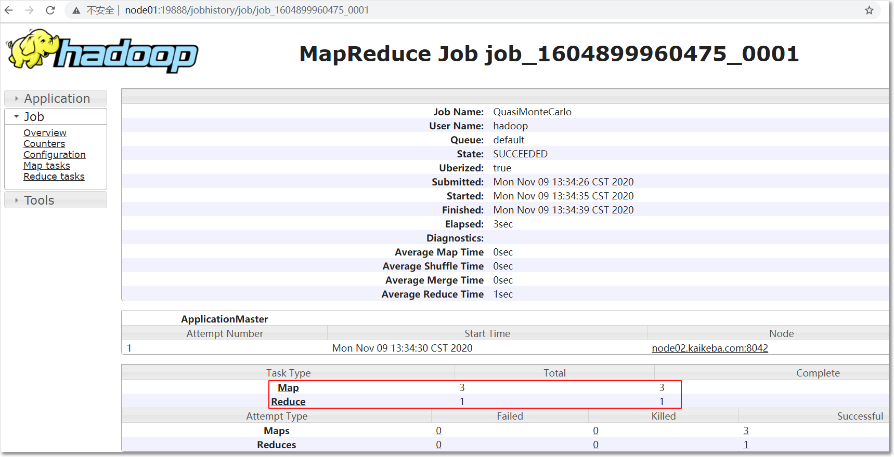

- 点击TaskType列中Map连接

- 看到map任务的相关信息比如执行状态,启动时间，完成时间。

- 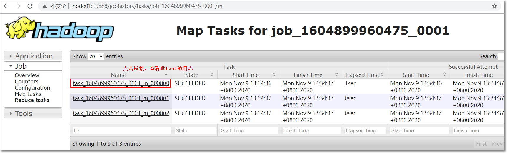

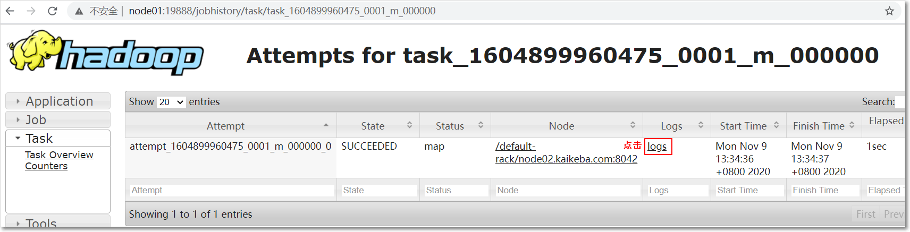

- 进入任务日志界面

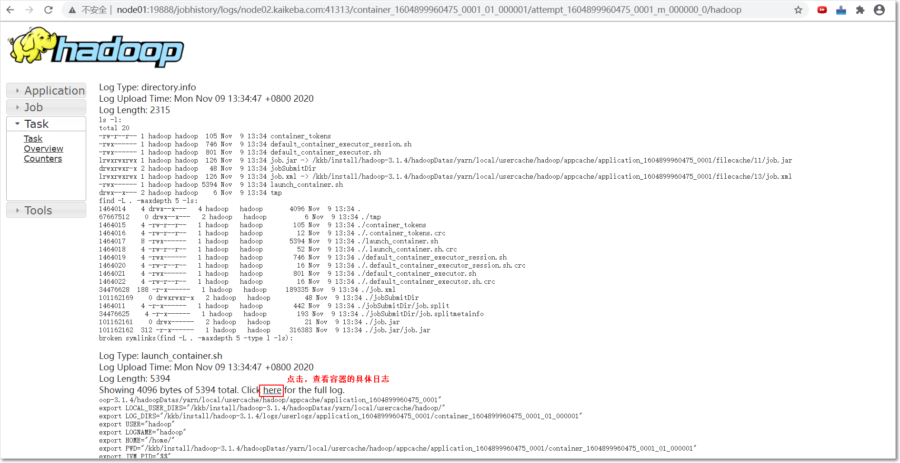

- 可以使用同样的方式我们查看reduce任务执行的详细信息，这里不再赘述.

- jobhistoryserver就是进行作业运行过程中历史运行信息的记录，方便我们对作业进行分析.

  

### 3.2.7 Timeline Server 

- 用来写日志服务数据 , 一般来写与第三方结合的日志服务数据(比如spark等)
- 它是对jobhistoryserver功能的有效补充，jobhistoryserver只能对mapreduce类型的作业信息进行记录
- 它记录除了jobhistoryserver能够对作业运行过程中信息进行记录之外，还记录更细粒度的信息，比如任务在哪个队列中运行，运行任务时设置的用户是哪个用户。
- timelineserver功能更强大,但不是替代jobhistory两者是功能间的互补关系


## 3.3. YARN应用运行原理


### 3.3.1 YARN应用提交过程

- Application在Yarn中的执行过程，整个执行过程可以总结为三步：
  - 应用程序提交
  - 启动应用的ApplicationMaster实例
  - ApplicationMaster 实例管理应用程序的执行

- **具体提交过程为：**


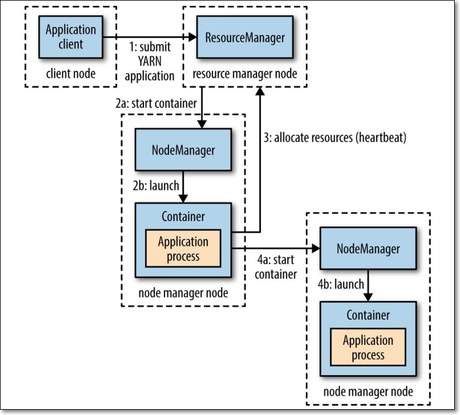

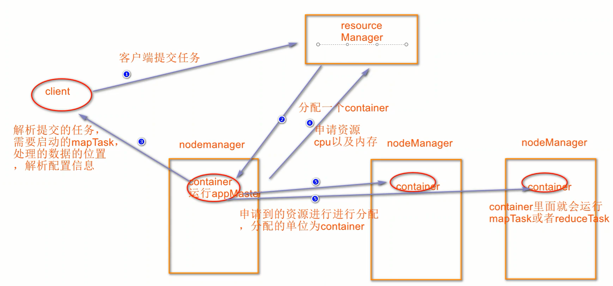

- 客户端程序向 ResourceManager 提交应用，并请求一个 ApplicationMaster 实例；

- ResourceManager 找到一个可以运行一个 Container 的 NodeManager，并在这个 Container 中启动 ApplicationMaster 实例；

- ApplicationMaster 向 ResourceManager 进行==注册==，注册之后客户端就可以查询 ResourceManager 获得自己 ApplicationMaster 的详细信息，以后就可以和自己的 ApplicationMaster 直接交互了（这个时候，客户端主动和 ApplicationMaster 交流，应用先向 ApplicationMaster 发送一个满足自己需求的资源请求）；

- ApplicationMaster 根据 resource-request协议 向 ResourceManager 发送 resource-request请求；

- 当 Container 被成功分配后，ApplicationMaster 通过向 NodeManager 发送 **container-launch-specification**信息来启动Container，container-launch-specification信息包含了能够让Container 和 ApplicationMaster 交流所需要的资料；

- 应用程序的代码以 task 形式在启动的 Container 中运行，并把运行的进度、状态等信息通过 **application-specific**协议 发送给ApplicationMaster；

- 在应用程序运行期间，提交应用的客户端主动和 ApplicationMaster 交流获得应用的运行状态、进度更新等信息，交流协议也是 **application-specific**协议；

- 应用程序执行完成并且所有相关工作也已经完成，ApplicationMaster 向 ResourceManager==取消注册==然后关闭，用到所有的 Container 也归还给系统。

- **精简版的：**

  - 步骤1：用户将应用程序提交到 ResourceManager 上；
  - 步骤2：ResourceManager为应用程序 ApplicationMaster 申请资源，并与某个 NodeManager 通信启动第一个 Container，以启动ApplicationMaster；
  - 步骤3：ApplicationMaster 与 ResourceManager 注册进行通信，为内部要执行的任务申请资源，一旦得到资源后，将于 NodeManager 通信，以启动对应的 Task；
  - 步骤4：所有任务运行完成后，ApplicationMaster 向 ResourceManager 注销，整个应用程序运行结束。

### 3.3.2 MapReduce on YARN

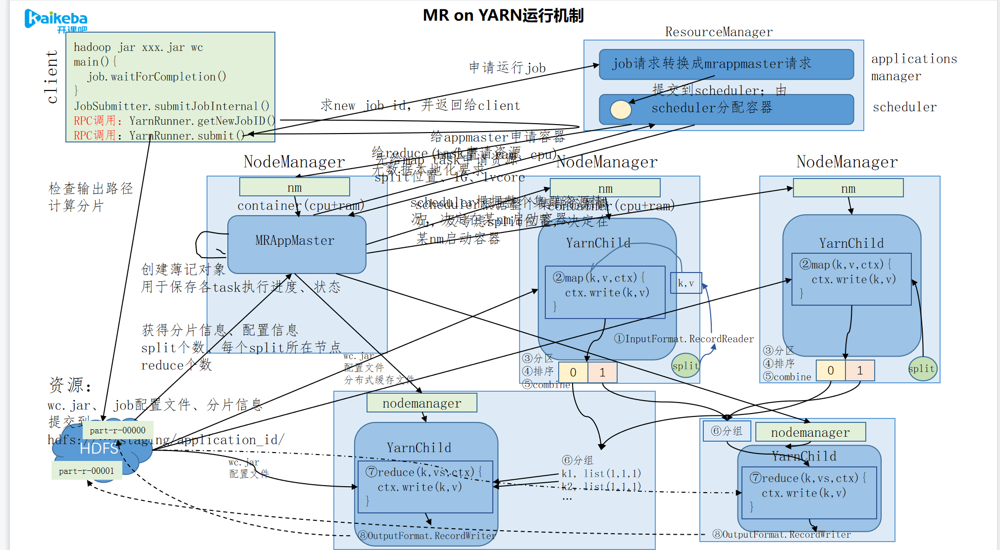

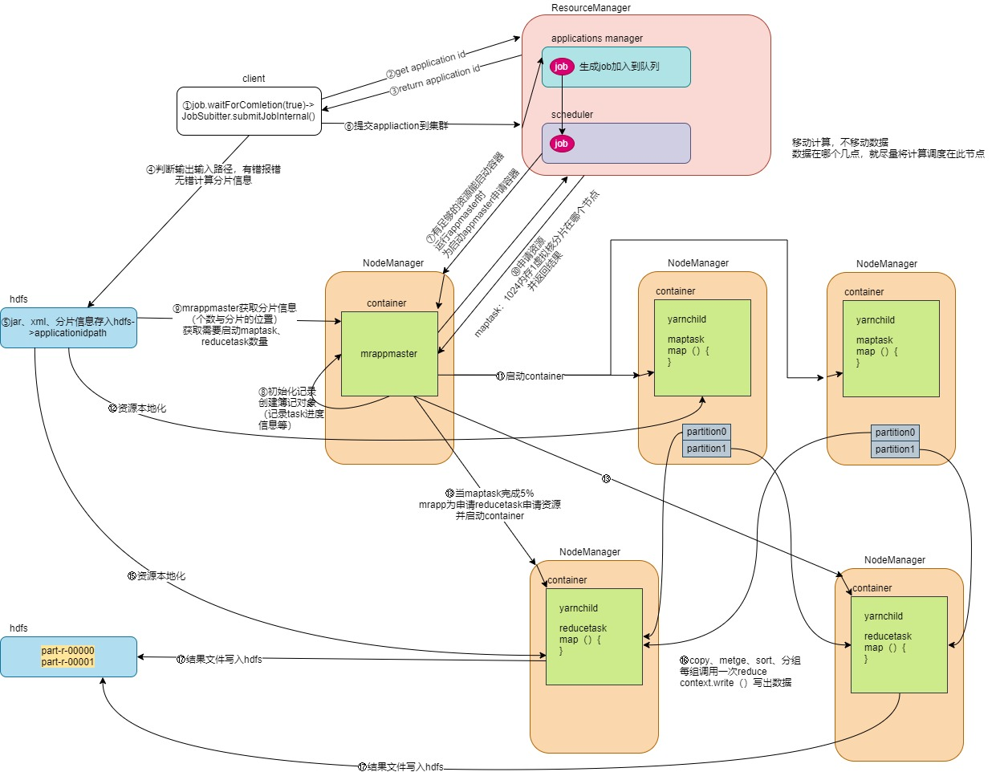

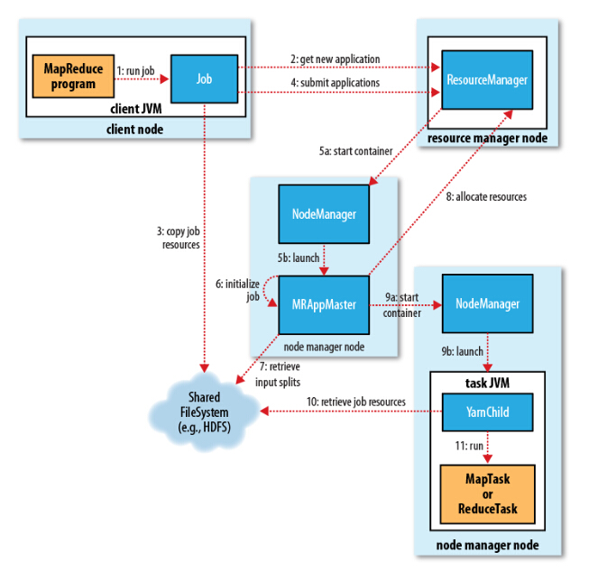

- 提交作业

  - ①程序打成jar包，在客户端运行hadoop jar命令，提交job到集群运行
  - job.waitForCompletion(true)中调用Job的submit()，此方法中调用JobSubmitter的**submitJobInternal**()方法；
    - ②submitClient.getNewJobID()向resourcemanager请求一个MR作业id
    - 检查输出目录：如果没有指定输出目录或者目录已经存在，则报错
    - 计算作业分片；若无法计算分片，也会报错
    - ③运行作业的相关资源，如作业的jar包、配置文件、输入分片，被上传到HDFS上一个以作业ID命名的目录（jar包副本默认为10，运行作业的任务，如map任务、reduce任务时，可从这10个副本读取jar包）
    - ④调用resourcemanager的submitApplication()提交作业
  - 客户端**每秒**查询一下作业的进度（map 50% reduce 0%），进度如有变化，则在控制台打印进度报告；
  - 作业如果成功执行完成，则打印相关的计数器
  - 但如果失败，在控制台打印导致作业失败的原因（要学会**查看日志**，定位问题，分析问题，解决问题）

- **初始化作业**

  - 当ResourceManager(以下简称RM)收到了submitApplication()方法的调用通知后，请求传递给RM的scheduler（调度器）；调度器分配container（容器）
  - ⑤a RM与指定的NodeManager通信，通知NodeManager启动容器；NodeManager收到通知后，创建占据特定资源的container；
  - ⑤b 然后在container中运行MRAppMaster进程
  - ⑥MRAppMaster需要接受任务（各map任务、reduce任务的）的进度、状态，所以appMaster需要创建多个簿记对象，记录这些信息
  - ⑦从HDFS获得client计算出的输入分片split
    - 每个分片split创建一个map任务
    - 通过 mapreduce.job.reduces 属性值(编程时，jog.setNumReduceTasks()指定)，知道当前MR要创建多少个reduce任务
    - 每个任务(map、reduce)有task id

- **Task 任务分配**

  - 如果小作业，appMaster会以==uberized==的方式运行此MR作业；appMaster会决定在它的JVM中顺序执行此MR的任务；

    - 原因是，若每个任务运行在一个单独的JVM时，都需要单独启动JVM，分配资源（内存、CPU），需要时间；多个JVM中的任务再在各自的JVM中并行运行

    - 若将所有任务在appMaster的JVM中==顺序执行==的话，更高效，那么appMaster就会这么做 ，任务作为uber任务运行

    - 小作业判断依据：①小于10个map任务；②只有一个reduce任务；③MR输入大小小于一个HDFS块大小

    - 如何开启uber?设置属性 mapreduce.job.ubertask.enable 值为true

      ```java
      configuration.set("mapreduce.job.ubertask.enable", "true");
      ```

    - 在运行任何task之前，appMaster调用setupJob()方法，创建OutputCommitter，创建作业的最终输出目录（一般为HDFS上的目录）及任务输出的临时目录（如map任务的中间结果输出目录）

  - ⑧若作业不以uber任务方式运行，那么appMaster会为作业中的每一个任务（map任务、reduce任务）向RM请求container

    - 由于reduce任务在进入排序阶段之前，所有的map任务必须执行完成；所以，为map任务申请容器要优先于为reduce任务申请容器
    - 5%的map任务执行完成后，才开始为reduce任务申请容器
    - 为map任务申请容器时，遵循==数据本地化==，调度器尽量将容器调度在map任务的输入分片所在的节点上（==移动计算，不移动数据==）

    - reduce任务能在集群任意计算节点运行（reduce不需要遵循数据本地化，数据是从maptask拉取的）
    - 默认情况下，为每个map任务、reduce任务分配1G内存、1个虚拟内核，由属性决定mapreduce.map.memory.mb、mapreduce.reduce.memory.mb、mapreduce.map.cpu.vcores、mapreduce.reduce.reduce.cpu.vcores

- **Task 任务执行**

  - app master向scheduler申请-》当调度器为当前任务分配了一个NodeManager（暂且称之为NM01）的容器，并将此信息传递给appMaster后；appMaster与NM01通信，告知NM01启动一个容器，并此容器占据特定的资源量（内存、CPU）启动YarnChild进程
  - NM01收到消息后，启动容器，此容器占据指定的资源量
  - 容器中运行YarnChild，由YarnChild运行当前任务（map、reduce）
  - ⑩资源本地化，在容器中运行任务之前，先将运行任务需要的资源拉取到本地，如作业的JAR文件、配置文件、分布式缓存中的文件-》运行reduce task

- **作业运行进度与状态更新**

  - 作业job以及它的每个task都有状态（running、successfully completed、failed），当前任务的运行进度、作业计数器
  - 任务在运行期间，每隔==3秒==向appMaster汇报执行进度、状态（包括计数器）
  - appMaster汇总目前运行的所有任务的上报的结果
  - 客户端每隔1秒，轮询访问appMaster获得作业执行的最新状态，若有改变，则在控制台打印出来
  - reduce task轮询appmaster，看有没有map task完成，若有，则从此map task拉取分区数据

- 完成作业

  - appMaster收到最后一个任务完成的报告后，将作业状态设置为成功
  - 客户端轮询appMaster查询进度时，发现作业执行成功，程序从waitForCompletion()退出
  - 作业的所有统计信息打印在控制台
  - appMaster及运行任务的容器，清理中间的输出结果，释放资源
  - 作业信息被历史服务器保存，留待以后用户查询

  


### 3.3.3 YARN应用生命周期

- RM: Resource Manager
- AM: Application Master
- NM: Node Manager

1. Client向RM提交应用，包括AM程序及启动AM的命令。
2. RM为AM分配第一个容器，并与对应的NM通信，令其在容器上启动应用的AM。
3. AM启动时向RM注册，允许Client向RM获取AM信息然后直接和AM通信。
4. AM通过资源请求协议，为应用协商容器资源。
5. 如容器分配成功，AM要求NM在容器中启动应用，应用启动后可以和AM独立通信。
6. 应用程序在容器中执行，并向AM汇报。
7. 在应用执行期间，Client和AM通信获取应用状态。
8. 应用执行完成，AM向RM注销并关闭，释放资源。

  **申请资源->启动appMaster->申请运行任务的container->分发Task->运行Task->Task结束->回收container**


## 3.4. YARN调度器

### 3.4.1. 资源调度器的职能

- 资源调度器是YARN最核心的组件之一，是一个插拔式的服务组件，负责整个集群资源的管理和分配。YARN提供了三种可用的资源调度器：FIFO、Capacity Scheduler、Fair Scheduler。

### 3.4.2. 三种调度器的介绍

#### 3.4.2.1. 先进先出调度器（FIFO）

- FIFO Scheduler把应用按提交的顺序排成一个队列，这是一个先进先出队列
  - 在进行资源分配的时候，先给队列中最头上的应用进行分配资源
  - 待最头上的应用需求满足后再给下一个分配，以此类推。
- FIFO Scheduler是最简单也是最容易理解的调度器，也不需要任何配置，但它并不适用于共享集群。
  - 大的应用可能会占用所有集群资源，这就导致其它应用被阻塞。
  - 在共享集群中，更适合采用Capacity Scheduler（容量调度器）或Fair Scheduler（公平调度器），这两个调度器都允许大任务和小任务在提交的同时获得一定的系统资源。
- 可以看出，在FIFO 调度器中，**小任务**会被**大任务**阻塞。

#### 3.4.2.2. 容量调度器（Capacity Scheduler）

- Capacity 调度器允许多个组织共享整个集群，每个组织可以获得集群的一部分计算能力。通过为每个组织分配专门的队列，然后为每个队列分配一定的集群资源，这样整个集群就可以通过设置多个队列的方式给多个组织提供服务了。除此之外，队列内部又可以垂直划分，这样一个组织内部的多个成员就可以共享这个队列的资源了，在一个队列内部，资源调度是采用的FIFO策略。
- 一个job可能使用不了整个队列的资源，这个队列中运行多个job，如果资源够用，就分配给这些job。如果资源不够用，Capacity调度器人分配额外的资源给这个队列，这是“弹性队列”的概念。
- 在正常的操作中，Capacity调度器不会强制释放Container，当一个队列资源不够用时，这个队列只能获取其他队列释放后的Container资源。我们可以为队列设置一个最大资源使用量，以免这个队列过多的占用空闲资源，导致其他队列无法使用这些空闲资源，这是“弹性队列”需要权衡的地方。

#### 3.4.2.3. 公平调度器（Fair Scheduler）

- 公平调度器的设计目标是为所有的应用分配公平的资源（对公平的定义可以通过参数设置）。公平调度器可以在多个队列间工作。假设有两个用户A和B，他们分别拥有一个队列。当A启动一个job而B没有job时，A会获得集群的全部资源，B启动job后，A会继续运行，不过会把一半资源还给B，如果B此时又启动一个job并且其它的job也还在运行，则这个job与B的第一job共享B这个队里的资源，占用B的一半资源，也就是整个集群的1/4的资源，而此时A的job还是占用一般资源，结果就是资源最终在两个用户间平等共享。

### 3.4.3. 自定义队列，实现任务提交不同队列

==建议在集群上做一些没把握的事情前，先给集群虚拟机打个快照再说==

- 前面我们看到了hadoop当中有各种资源调度形式，当前hadoop的任务提交，默认提交到default队列里面去了，将所有的任务都提交到default队列，我们在实际工作当中，可以通过划分队列的形式，对不同的用户，划分不同的资源，让不同的用户的任务，提交到不同的队列里面去，实现资源的隔离                  
- 资源隔离目前有2种，静态隔离和动态隔离。
- 所谓静态隔离是以服务隔离，是通过cgroups（LINUX control groups) 功能来支持的。比如HADOOP服务包含HDFS, HBASE, YARN等等，那么我们固定的设置比例，HDFS:20%, HBASE:40%, YARN：40%， 系统会帮我们根据整个集群的CPU，内存，IO数量来分割资源，先提一下，IO是无法分割的，所以只能说当遇到IO问题时根据比例由谁先拿到资源，CPU和内存是预先分配好的。
- 上面这种按照固定比例分割就是==静态分割==了，仔细想想，这种做法弊端太多，假设我按照一定的比例预先分割好了，但是如果我晚上主要跑mapreduce, 白天主要是HBASE工作，这种情况怎么办？ 静态分割无法很好的支持，缺陷太大
- 动态隔离只要是针对 YARN以及impala, 所谓动态只是相对静态来说，其实也不是动态。 先说YARN， 在HADOOP整个环境，主要服务有哪些？ mapreduce（这里再提一下，mapreduce是应用，YARN是框架，搞清楚这个概念），HBASE, HIVE，SPARK，HDFS，IMPALA， 实际上主要的大概这些，很多人估计会表示不赞同，oozie, ES, storm , kylin，flink等等这些和YARN离的太远了，不依赖YARN的资源服务，而且这些服务都是单独部署就OK，关联性不大。 所以主要和YARN有关也就是HIVE, SPARK，Mapreduce。这几个服务也正式目前用的最多的（HBASE用的也很多，但是和YARN没啥关系）。
- 根据上面的描述，大家应该能理解为什么所谓的动态隔离主要是针对YARN。好了，既然YARN占的比重这么多，那么如果能很好的对YARN进行资源隔离，那也是不错的。如果我有3个部分都需要使用HADOOP，那么我希望能根据不同部门设置资源的优先级别，实际上也是根据比例来设置，建立3个queue name, 开发部们30%，数据分析部分50%，运营部门20%。 
- 设置了比例之后，再提交JOB的时候设置mapreduce.queue.name，那么JOB就会进入指定的队列里面。默认提交JOB到YARN的时候，规则是root.users.username ， 队列不存在，会自动以这种格式生成队列名称。 队列设置好之后，再通过ACL来控制谁能提交或者KIll job。
- 从上面2种资源隔离来看，没有哪一种做的很好，如果非要选一种，我会选取后者，隔离YARN资源， 第一种固定分割服务的方式实在支持不了现在的业务
- 需求：现在一个集群当中，可能有多个用户都需要使用，例如开发人员需要提交任务，测试人员需要提交任务，以及其他部门工作同事也需要提交任务到集群上面去，对于我们多个用户同时提交任务，我们可以通过配置yarn的==多用户资源隔离==来进行实现


> 修改调度器前，可以先看下默认情况下，mr应用提交到了哪个队列，默认提交到default队列

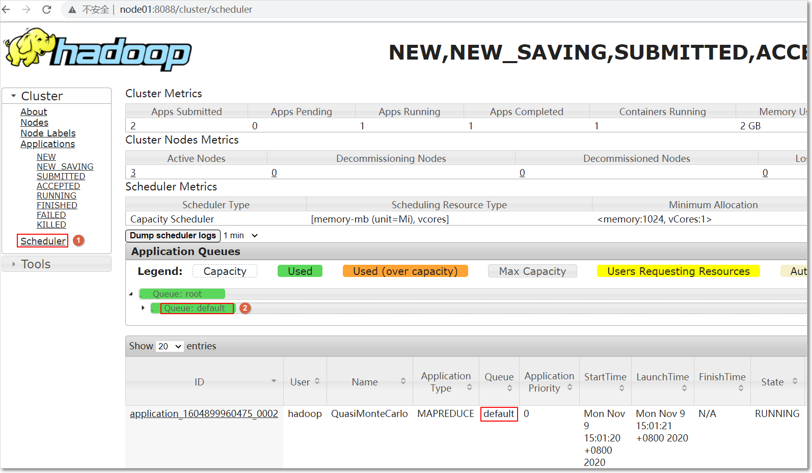

####  3.4.3.1. 第一步：node01编辑yarn-site.xm

- node01修改yarn-site.xml添加以下配置

```shell
cd /kkb/install/hadoop-3.1.4/etc/hadoop
vim yarn-site.xml
```

- 内容如下

```xml
<!--  指定我们的任务调度使用fairScheduler调度器  -->
<property>
	<name>yarn.resourcemanager.scheduler.class</name>
	<value>org.apache.hadoop.yarn.server.resourcemanager.scheduler.fair.FairScheduler</value>
</property>

<!--  指定我们的任务调度的配置文件路径  -->
<property>
	<name>yarn.scheduler.fair.allocation.file</name>
	<value>/kkb/install/hadoop-3.1.4/etc/hadoop/fair-scheduler.xml</value>
</property>

<!-- 是否启用资源抢占，如果启用，那么当该队列资源使用
yarn.scheduler.fair.preemption.cluster-utilization-threshold 这么多比例的时候，就从其他空闲队列抢占资源
  -->
<property>
	<name>yarn.scheduler.fair.preemption</name>
	<value>true</value>
</property>
<property>
	<name>yarn.scheduler.fair.preemption.cluster-utilization-threshold</name>
	<value>0.8f</value>
</property>

<!-- 设置为true，且没有指定队列名，提交应用到用户名同名的队列；如果设置为false或没设置，默认提交到default队列；如果在allocation文件中指定了队列提交策略，忽略此属性  -->
<property>
	<name>yarn.scheduler.fair.user-as-default-queue</name>
	<value>true</value>
	<description>default is True</description>
</property>

<!-- 是否允许在提交应用时，创建队列；如果设置为true，则允许；如果设置为false，如果要将应用提交的队列，没有在allocation文件中指定，那么则将应用提交到default队列；默认为true，如果队列防止策略在allocation文件定义过，那么忽略此属性  -->
<property>
	<name>yarn.scheduler.fair.allow-undeclared-pools</name>
	<value>false</value>
	<description>default is True</description>
</property>
```

#### 3.4.3.2. 第二步：node01添加fair-scheduler.xml配置文件

- node01执行以下命令，添加fair-scheduler.xml的配置文件

```shell
cd /kkb/install/hadoop-3.1.4/etc/hadoop
vim fair-scheduler.xml
```

- 内容如下

```xml
<?xml version="1.0"?>
<allocations>
	<!-- 每个队列中，app的默认调度策略，默认值是fair -->
	<defaultQueueSchedulingPolicy>fair</defaultQueueSchedulingPolicy>

	<user name="hadoop">
		<!-- 用户hadoop最多运行的app个数 -->
		<maxRunningApps>30</maxRunningApps>
	</user>
	<!-- 如果用户没有设置最多运行的app个数，那么用户默认运行10个 -->
	<userMaxAppsDefault>10</userMaxAppsDefault>

	<!-- 定义我们的队列  -->
	<!-- 
	weight
	资源池权重

	aclSubmitApps
	允许提交任务的用户名和组；
	格式为：“user1,user2 group1,group2” 或 “ group1,group2” -》如果只有组，那么组名前要加个空格
	如果提交应用的用户或所属组在队列的ACLs中，或在当前队列的父队列的ACLs中，那么此用户有权限提交应用到此队列
	下例：
		xiaoli有权限提交应用到队列a；xiaofan在队列a的父队列dev的acls中，所以xiaofan也有权限提交应用到队列a
		比如有队列层级root.dev.a；
		有定义
		<queue name="dev">
			...
			<aclSubmitApps>xiaofan</aclSubmitApps>
			...
			<queue name="a">
				...
				<aclSubmitApps>xiaoli</aclSubmitApps>
			</queue>
		</queue>

	aclAdministerApps
	允许管理任务的用户名和组；
	格式同上。
	 -->
	<queue name="root">
		<minResources>512mb,4vcores</minResources>
		<maxResources>102400mb,100vcores</maxResources>
		<maxRunningApps>100</maxRunningApps>
		<weight>1.0</weight>
		<schedulingMode>fair</schedulingMode>
		<aclSubmitApps> </aclSubmitApps>
		<aclAdministerApps> </aclAdministerApps>

		<queue name="default">
			<minResources>512mb,4vcores</minResources>
			<maxResources>30720mb,30vcores</maxResources>
			<maxRunningApps>100</maxRunningApps>
			<schedulingMode>fair</schedulingMode>
			<weight>1.0</weight>
			<!--  所有的任务如果不指定任务队列，都提交到default队列里面来 -->
			<aclSubmitApps>*</aclSubmitApps>
		</queue>

		<queue name="hadoop">
			<minResources>512mb,4vcores</minResources>
			<maxResources>20480mb,20vcores</maxResources>
			<maxRunningApps>100</maxRunningApps>
			<schedulingMode>fair</schedulingMode>
			<weight>2.0</weight>
			<aclSubmitApps>hadoop hadoop</aclSubmitApps>
			<aclAdministerApps>hadoop hadoop</aclAdministerApps>
		</queue>

		<queue name="develop">
			<minResources>512mb,4vcores</minResources>
			<maxResources>20480mb,20vcores</maxResources>
			<maxRunningApps>100</maxRunningApps>
			<schedulingMode>fair</schedulingMode>
			<weight>1</weight>
			<aclSubmitApps>develop develop</aclSubmitApps>
			<aclAdministerApps>develop develop</aclAdministerApps>
		</queue>

		<queue name="test1">
			<minResources>512mb,4vcores</minResources>
			<maxResources>20480mb,20vcores</maxResources>
			<maxRunningApps>100</maxRunningApps>
			<schedulingMode>fair</schedulingMode>
			<weight>1.5</weight>
			<aclSubmitApps>test1,hadoop,develop test1</aclSubmitApps>
			<aclAdministerApps>test1 group_businessC,supergroup</aclAdministerApps>
		</queue>
	</queue>
	<!-- 
		包含一系列的rule元素；这些rule元素用来告诉scheduler调度器，进来的app按照规则提交到哪个队列中
		有多个rule的话，会从上到下进行匹配；
		rule可能会带有argument；所有的rule都带有create argument，表示当前rule是否能够创建一个新队列；默认值是true
		如果rule的create设置为false，且在allocation中没有配置此队列，那么尝试匹配下一个rule
	-->
	<queuePlacementPolicy>
		<!-- app被提交到指定的队列；create为true，则创建；若为false，如果队列不存在，则不创建 -->
		<rule name="specified" create="false"/>
		<!-- app被提交到提交此app的用户所属组的组名命名的队列；如果队列不存在，则不创建 -->
		<rule name="primaryGroup" create="false" />
		<!-- 如果上边的rule都没有匹配上，则app提交到queue指定的的队列；如果没有指定queue值，默认值是root.default -->
		<rule name="default" queue="root.default"/>
	</queuePlacementPolicy>
</allocations>
```

#### 3.4.3.3. 第三步：将修改后的配置文件拷贝到其他机器上

- 将node01修改后的yarn-site.xml和fair-scheduler.xml配置文件分发到其他服务器上面去

```shell
cd /kkb/install/hadoop-3.1.4/etc/hadoop
[hadoop@node01 hadoop]# scp yarn-site.xml  fair-scheduler.xml node02:$PWD
[hadoop@node01 hadoop]# scp yarn-site.xml  fair-scheduler.xml node03:$PWD
```

#### 3.4.3.4. 第四步：重启yarn集群

- 修改完yarn-site.xml配置文件之后，重启yarn集群，node01执行以下命令进行重启

```shell
[hadoop@node01 hadoop]# cd /kkb/install/hadoop-3.1.4/
[hadoop@node01 hadoop-3.1.4]# sbin/stop-yarn.sh
[hadoop@node01 hadoop-3.1.4]# sbin/start-yarn.sh
```

> ==技巧：==yarn rmadmin -refreshQueues：已经设置集群使用fairscheduler，然后再修改fair-schduler.xml后，运行此命令，立即生效，不需要再重启集群了

#### 3.4.3.5. 第五步：修改任务提交的队列

- 修改代码，添加我们mapreduce任务需要提交到哪一个队列里面去

``` java
Configuration configuration = new Configuration();

//情况1
//注释掉 configuration.set("mapreduce.job.queuename", "hadoop");
//匹配规则：<rule name="primaryGroup" create="false" />

//情况2
configuration.set("mapreduce.job.queuename", "hadoop");
//匹配规则：<rule name="specified" create="false"/>

//情况3
configuration.set("mapreduce.job.queuename", "hadoopv1");
//allocation文件中，注释掉<rule name="primaryGroup" create="false" />；刷新配置yarn rmadmin -refreshQueues
//匹配规则：<rule name="default" queue="root.default"/>

```

- hive任务指定提交队列，hive-site.xml文件添加

```xml
<property>
    <name>mapreduce.job.queuename</name>
    <value>test1</value>
</property>
```

- spark任务运行指定提交的队列

```
1- 脚本方式
--queue hadoop

2- 代码方式
sparkConf.set("spark.yarn.queue", "develop")
```


# 4、hadoop的企业级调优

## 4.1. hdfs调优以及yarn参数调优

### 4.1.1. HDFS参数调优hdfs-site.xml

- dfs.namenode.handler.count=20 * log2(Cluster Size)

  调整namenode处理客户端的线程数

  比如集群规模为8台时，此参数设置为60

  The number of Namenode RPC server threads that listen to requests from clients. If dfs.namenode.servicerpc-address is not configured then Namenode RPC server threads listen to requests from all nodes.

  NameNode有一个工作线程池，用来处理不同DataNode的并发心跳以及客户端并发的元数据操作。对于大集群或者有大量客户端的集群来说，通常需要增大参数dfs.namenode.handler.count的默认值10。设置该值的一般原则是将其设置为集群大小的自然对数乘以20，即20logN，N为集群大小。

- 编辑日志存储路径dfs.namenode.edits.dir设置与镜像文件存储路径dfs.namenode.name.dir尽量分开，达到最低写入延迟

- 元数据信息fsimage多目录冗余存储配置

### 4.1.2. YARN参数调优yarn-site.xml

- 根据实际调整每个节点和单个任务申请内存值

  - yarn.nodemanager.resource.memory-mb

    表示该节点上YARN可使用的物理内存总量，默认是8192（MB），注意，如果你的节点内存资源不够8GB，则需要调减小这个值，而YARN不会智能的探测节点的物理内存总量。

  - yarn.scheduler.maximum-allocation-mb

    单个任务可申请的最多物理内存量，默认是8192（MB）。

- Hadoop宕机

  - 如果MR造成系统宕机。此时要控制Yarn同时运行的任务数，和每个任务申请的最大内存。调整参数：yarn.scheduler.maximum-allocation-mb（单个任务可申请的最多物理内存量，默认是8192MB）
  - 如果写入文件过量造成NameNode宕机。那么调高Kafka的存储大小，控制从Kafka到HDFS的写入速度。高峰期的时候用Kafka进行缓存，高峰期过去数据同步会自动跟上。

## 4.2. mapreduce运行慢的主要原因可能有哪些

- MapReduce程序效率的瓶颈在于两点：

- 一、计算机性能

  CPU、内存、磁盘健康、网络

- 二、I/O操作优化

  1. 数据倾斜
  2. map和reduce数设置不合理
  3. map运行时间太长，导致reduce等待过久
  4. 小文件过多
  5. 大量的不可分割的超大文件
  6. spill次数过多
  7. merge次数过多

## 4.3. mapreduce的优化方法

- MapReduce优化方法主要从六个方面考虑：数据输入、Map阶段、Reduce阶段、IO传输、数据倾斜问题和常用的调优参数。

### 4.3.1. 数据输入阶段

- 合并小文件：在执行mr任务前将小文件进行合并；因为大量的小文件会产生大量的map任务，任务都需要初始化，从而导致mr运行缓慢
- 采用CombineTextInputFormat来作为输入，解决输入端大量小文件场景。

### 4.3.2. MapTask运行阶段

- **减少spill溢写次数**：通过调整mapreduce.task.io.sort.mb及mapreduce.map.sort.spill.percent参数的值，增大触发spill的内存上限，减少spill次数，从而减少磁盘io的次数
- **减少merge合并次数**：调整mapreduce.task.io.sort.factor参数，增大merge的文件数，减少merge的次数，从而缩短mr处理时间
- 在map之后，不影响业务逻辑的情况下，先进行combine处理，减少I/O

### 4.3.3. ReduceTask运行阶段

- **设置合理的map、reduce个数**：两个数值都不能太小，也不能太大；
  - 太少，导致task执行时长边长；
  - 太多，导致map、reduce任务间竞争资源，造成处理超时错误。
- **设置map、reduce共存**：
  - 调整mapreduce.job.reduce.slowstart.completedmaps参数(默认0.05)，是map运行到一定程度后，reduce也开始运行，减少reduce的等待时间
  - 比如调到0.8
- **规避使用reduce**：
  - 因为reduce在用于连接数据集的时候会产生大量的网络消耗
- **合理设置reduce端的buffer**：
  - 默认情况下，数据达到一定阈值的时候，Buffer中的数据会写入磁盘，然后reduce会从磁盘中获得所有的数据。即Buffer与reduce没有关联的，中间多次写磁盘、读磁盘的过程。那么可以通过调整参数，使得Buffer中的数据可以直接输送到reduce，从而减少I/O开销；mapreduce.reduce.input.buffer.percent默认为0.0，当值大于0的时候，会保留指定比例的内存读Buffer中的数值直接拿给Reducer使用。这样一来，设置Buffer需要内存，读取数据需要内存，Reduce计算也需要内存，所以要根据作业的运行情况进行调整。

### 4.3.4. IO传输阶段

- **进行数据压缩**：
  - 减少网络I/O的数据量，安装snappy和lzo压缩编码器
- 使用SequenceFile二进制文件

### 4.3.5. 数据倾斜问题

- 数据倾斜现象：

  - 数据频率倾斜-- 某一分区的数据量要远远大于其他分区
  - 数据大小倾斜-- 部分记录的大小远远大于平均值

- 减少数据倾斜的方法

  - 方法1：抽样和范围分区

    对原始数据进行抽样，根据抽样数据集，预设分区边界值

  - 方法2：自定义分区

    基于map输出key的背景知识，进行自定义分区。

    例如，如果map输出键的单词来源于一本书，且其中某些专业词汇出现的次数比较多，那么就可以自定义分区将这些专业词汇发送给固定的若干reduce任务。而将其他的都发送个剩余的reduce任务

  - 方法3：Combine

    使用combine减少数据倾斜。在可能的情况下，Combine的目的是聚合并精简数据

  - 方法4：采用Map Join，尽量避免Reduce Join

### 4.3.6. 常用的调优参数

- 资源相关参数

#### 1. mapred-site.xml

- 以下参数是在用户自己的MR应用程序中配置就可以生效（mapred-default.xml）

| 配置参数                                      | 参数说明                                                     |
| --------------------------------------------- | ------------------------------------------------------------ |
| mapreduce.map.memory.mb                       | 一个MapTask可使用的资源上限（单位:MB），默认为1024。如果MapTask实际使用的资源量超过该值，则会被强制杀死。 |
| mapreduce.reduce.memory.mb                    | 一个ReduceTask可使用的资源上限（单位:MB），默认为1024。如果ReduceTask实际使用的资源量超过该值，则会被强制杀死。 |
| mapreduce.map.cpu.vcores                      | 每个MapTask可使用的最多cpu core数目，默认值: 1               |
| mapreduce.reduce.cpu.vcores                   | 每个ReduceTask可使用的最多cpu core数目，默认值: 1            |
| mapreduce.reduce.shuffle.parallelcopies       | 每个Reduce去Map中取数据的并行数。默认值是5                   |
| mapreduce.reduce.shuffle.merge.percent        | Buffer中的数据达到多少比例开始写入磁盘。默认值0.66           |
| mapreduce.reduce.shuffle.input.buffer.percent | Buffer大小占Reduce可用内存的比例。默认值0.7                  |
| mapreduce.reduce.input.buffer.percent         | 指定多少比例的内存用来存放Buffer中的数据，默认值是0.0        |

- 应该在YARN启动之前就配置在服务器的配置文件中才能生效（yarn-default.xml）

| 配置参数                                 | 参数说明                                        |
| ---------------------------------------- | ----------------------------------------------- |
| yarn.scheduler.minimum-allocation-mb     | 给应用程序Container分配的最小内存，默认值：1024 |
| yarn.scheduler.maximum-allocation-mb     | 给应用程序Container分配的最大内存，默认值：8192 |
| yarn.scheduler.minimum-allocation-vcores | 每个Container申请的最小CPU核数，默认值：1       |
| yarn.scheduler.maximum-allocation-vcores | 每个Container申请的最大CPU核数，默认值：32      |
| yarn.nodemanager.resource.memory-mb      | 给Containers分配的最大物理内存，默认值：8192    |

- Shuffle性能优化的关键参数，应在YARN启动之前就配置好（mapred-default.xml）

| 配置参数                         | 参数说明                          |
| -------------------------------- | --------------------------------- |
| mapreduce.task.io.sort.mb        | Shuffle的环形缓冲区大小，默认100m |
| mapreduce.map.sort.spill.percent | 环形缓冲区溢出的阈值，默认80%     |

#### 2. 容错相关参数(MapReduce性能优化)

| 配置参数                     | 参数说明                                                     |
| ---------------------------- | ------------------------------------------------------------ |
| mapreduce.map.maxattempts    | 每个Map Task最大重试次数，一旦重试参数超过该值，则认为Map Task运行失败，默认值：4。 |
| mapreduce.reduce.maxattempts | 每个Reduce Task最大重试次数，一旦重试参数超过该值，则认为Map Task运行失败，默认值：4。 |
| mapreduce.task.timeout       | Task超时时间，经常需要设置的一个参数，该参数表达的意思为：如果一个Task在一定时间内没有任何进入，即不会读取新的数据，也没有输出数据，则认为该Task处于Block状态，可能是卡住了，也许永远会卡住，为了防止因为用户程序永远Block住不退出，则强制设置了一个该超时时间（单位毫秒），默认是600000。如果你的程序对每条输入数据的处理时间过长（比如会访问数据库，通过网络拉取数据等），建议将该参数调大，该参数过小常出现的错误提示是“AttemptID:attempt_14267829456721_123456_m_000224_0  Timed out after 300 secsContainer killed by the ApplicationMaster.”。 |

## 4.4. hdfs小文件解决方案总结

### 4.4.1. 小文件的问题弊端

- HDFS上每个文件都要在NameNode上建立一个索引，这个索引的大小约为150byte，这样当小文件比较多的时候，就会产生很多的索引文件
- 一方面会大量占用NameNode的内存空间，另一方面就是索引文件过大使得索引速度变慢。

### 4.4.2. 小文件的解决方案

- 优化方式：

  方式一：在数据采集的时候，就将小文件或小批数据合成大文件再上传HDFS。

  方式二：在业务处理之前，在HDFS上使用MapReduce程序对小文件进行合并。

  方式三：在MapReduce处理时，可采用CombineTextInputFormat提高效率。

- 归档命令：hadoop archive

  高效的将小文件进行归档的工具，能将多个小文件打包成一个HAR文件，这样就减少了NameNode的内存使用

- 利用sequence file作为小文件的容器

  Sequence File由一系列的二进制的key/value组成，如果key为文件名，value为文件内容，则可以将大量小文件合并到一个SequenceFile文件中

- CombineFileInputFormat

  CombineFileInputFormat用于将多个文件合并成一个单独的split，并且会考虑数据的存储位置。

- 开启jvm重用

  对于处理大量小文件的job，可以开启jvm重用，约减少40%的运行时间

  jvm重用原理：一个map运行在一个jvm上，开启重用的话，该map在jvm上运行完毕后，此jvm中会继续运行此job的其他map任务

  具体设置：mapreduce.job.jvm.numtasks值在10到20之间

# 5、Hadoop3.x新特性

## 5.1.新特性

   - 最低Java版本要求从Java7变为Java8 

     - 所有Hadoop的jar都是基于Java 8运行是版本进行编译执行的，仍在使用Java 7或更低Java版本的用户需要升级到Java 8。

   - HDFS支持纠删码（erasure coding）

     - 纠删码是一种比副本存储更节省存储空间的数据持久化存储方法。比如Reed-Solomon(10,4)标准编码技术只需要1.4倍的空间开销，而标准的HDFS副本技术则需要3倍的空间开销。由于纠删码额外开销主要在于重建和远程读写，它通常用来存储不经常使用的数据（冷数据）。另外，在使用这个新特性时，用户还需要考虑网络和CPU开销。
     - Hadoop 2.x - 可以通过复制（浪费空间）来处理容错。
       Hadoop 3.x - 可以通过Erasure编码处理容错。

   - YARN时间线服务 v.2(YARN Timeline Service v.2)

     - YARN Timeline Service v.2用来应对两个主要挑战：（1）提高时间线服务的可扩展性、可靠性，（2）通过引入流(flow)和聚合(aggregation)来增强可用性。为了替代Timeline Service v.1.x，YARN Timeline Service v.2 alpha 2被提出来，这样用户和开发者就可以进行测试，并提供反馈和建议，不过YARN Timeline Service v.2还只能用在测试容器中。
     - 在hadoop2.4版本之前对任务执行的监控只开发了针对MR的**Job History Server**，它可以提供给用户用户查询已经运行完成的作业的信息，但是后来，随着在YARN上面集成的越来越多的计算框架，比如spark、Tez，也有必要为基于这些计算引擎的技术开发相应的作业任务监控工具，所以hadoop的开发人员就考虑开发一款更加通用的Job History Server，即YARN Timeline Server

   - 重写Shell脚本

     - Hadoop的shell脚本被重写，修补了许多**长期存在的bug**，并增加了一些新的特性（**what特性**）。

   - 覆盖客户端的jar（Shaded client jars）

     - 在2.x版本中，hadoop-client Maven artifact配置将会拉取hadoop的传递依赖到hadoop应用程序的环境变量，这回带来传递依赖的版本和应用程序的版本相冲突的问题。
     - HADOOP-11804 添加新 hadoop-client-api和hadoop-client-runtime artifcat，将hadoop的依赖隔离在一个单一Jar包中，也就避免hadoop依赖渗透到应用程序的类路径中。

   - 支持Opportunistic Containers和Distributed Scheduling

     - ExecutionType概念被引入，这样一来，应用能够通过Opportunistic的一个执行类型来请求容器。即使在调度时，没有可用的资源，这种类型的容器也会分发给NM中执行程序。在这种情况下，容器将被放入NM的队列中，等待可用资源，以便执行。Opportunistic container优先级要比默认Guaranteedcontainer低，在需要的情况下，其资源会被抢占，以便Guaranteed container使用。这样就需要提高集群的使用率。

       ​    Opportunistic container默认被中央RM分配，但是，目前已经增加分布式调度器的支持，该分布式调度器做为AMRProtocol解析器来实现。

   - MapReduce任务级本地优化

     - MapReduce添加了映射输出收集器的本地化实现的支持。对于密集型的洗牌操作（shuffle-intensive）jobs，可以带来30%的性能提升。

   - 支持多余2个以上的NameNodes

     - 针对HDFS NameNode的高可用性，最初实现方式是提供一个活跃的（active）NameNode和一个备用的（Standby）NameNode。通过对3个JournalNode的法定数量的复制编辑，使得这种架构能够对系统中任何一个节点的故障进行容错。

       ​    该功能能够通过运行更多备用NameNode来提供更高的容错性，满足一些部署的需求。比如，通过配置3个NameNode和5个JournalNode，集群能够实现两个节点故障的容错。

   - 修改了多重服务的默认端口

     - 在之前的Hadoop版本中，多重Hadoop服务的默认端口在Linux临时端口范围内容（32768-61000），这就意味着，在启动过程中，一些服务器由于端口冲突会启动失败。这些冲突端口已经从临时端口范围移除，NameNode、Secondary NameNode、DataNode和KMS会受到影响。我们的文档已经做了相应的修改，可以通过阅读发布说明 **HDFS-9427和HADOOP-12811**详细了解所有被修改的端口

   - 提供文件系统连接器（filesystem connnector）,支持Microsoft Azure Data Lake和Aliyun对象存储系统

     - Hadoop支持和Microsoft Azure Data Lake和Aliyun对象存储系统集成，并将其作为Hadoop兼容的文件系统

   - **数据节点内置平衡器（Intra-datanode balancer）**

     - 在单一DataNode管理多个磁盘情况下，在执行普通的写操作时，每个磁盘用量比较平均。但是，当添加或者更换磁盘时，将会导致一个DataNode磁盘用量的严重不均衡。由于目前**HDFS均衡器**关注点在于DataNode之间（inter-），而不是intra-，所以不能处理这种不均衡情况。

       ​    在hadoop3 中，通过DataNode内部均衡功能Intra-data节点平衡器已经可以处理上述情况，可以通过**hdfs diskbalancer Cli**来调用。

       

   - 重写了守护进程和任务的堆管理机制

     - 针对Hadoop**守护进程**和MapReduce**任务的堆管理机制**，Hadoop3 做了一系列的修改。

       ​    HADOOP-10950 引入配置守护进程堆大小的新方法。特别地，HADOOP_HEAPSIZE配置方式已经被弃用，可以根据主机的内存大小进行自动调整。

       ​    MAPREDUCE-5785 简化了MAP的配置，减少了任务堆的大小，所以不需要再任务配置和Java可选项中明确指出需要的堆大小。已经明确指出堆大小的现有配置不会受到该改变的影响。

   - S3Gurad:为S3A文件系统客户端提供一致性和元数据缓存

     - HADOOP-13345 为亚马逊S3存储的S3A客户端提供了可选特性：能够使用DynamoDB表作为文件和目录元数据的快速、一致性存储。

   - HDFS的基于路由器互联（HDFS Router-Based Federation）

     - HDFS Router-Based Federation添加了一个**RPC路由层**，为**多个HDFS命名空间**提供了一个联合视图。这和现有的ViewFs、HDFS Federation功能类似，区别在于通过服务端管理表加载，而不是原来的客户端管理。从而简化了现存HDFS客户端接入federated cluster的操作。

   - 基于API配置的Capacity Scheduler queue configuration

     -  OrgQueue扩展了capacity scheduler，提供了一种编程方法，该方法提供了一个REST API来修改配置，用户可以通过远程调用来修改队列配置。这样一来，队列的administer_queue ACL的管理员就可以实现自动化的队列配置管理。 TODO 实践 **how?**

   - **YARN资源类型**

     - Yarn资源模型已经被一般化，可以支持用户自定义的可计算资源类型，而不仅仅是CPU和内存。比如，集群管理员可以定义像GPU数量，软件序列号、本地连接的存储的资源。然后，Yarn任务能够在这些可用资源上进行调度。 TODO **how？**


## 5.如何选择版本

- 是否为开源软件  TODO**，即是否免费。**
- 是否有稳定版  TODO**，这个一般软件官方网站会给出说明。**
- 是否经实践验证  TODO**，这个可通过检查是否有一些大点的公司已经在生产环境中使用知道**
- 是否有强大的社区支持 TODO**，当出现一个问题时，能够通过社区、论坛等网络资源快速获取解决方法。**

