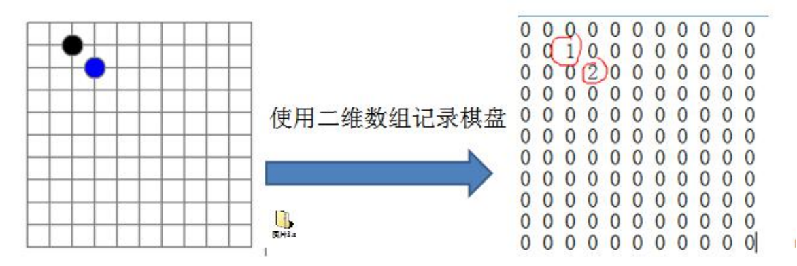
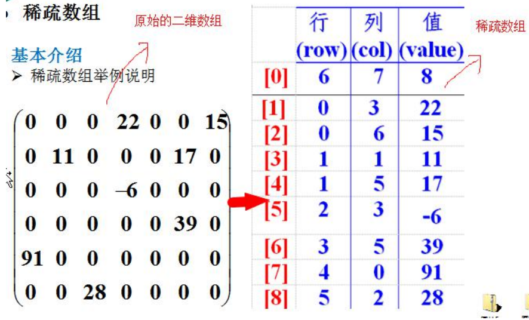
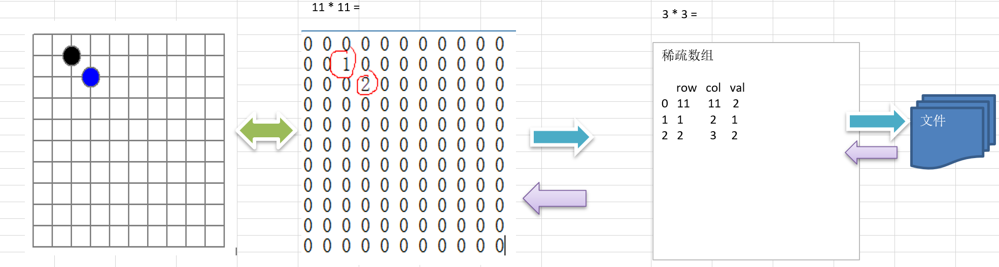

稀疏 sparsearray 数组

第 3 章 稀疏数组和队列 

3.1 稀疏 sparsearray 数组 

3.1.1先看一个实际的需求

  编写的五子棋程序中，有存盘退出和续上盘的功能。 



分析问题: 因为该二维数组的很多值是默认值 0, 因此记录了**很多没有意义的数据**.->**稀疏数组**。 


3.1.2基本介绍 

当一个数组中大部分元素为０，或者为同一个值的数组时，可以使用稀疏数组来保存该数组。 

稀疏数组的处理方法是:

1）记录数组**一共有几行几列，有多少个不同**的值 

2）把具有不同值的元素的行列及值记录在一个小规模的数组中，从而**缩小程序**的规模


 稀疏数组举例说明



3.1.3应用实例

1）使用稀疏数组，来保留类似前面的二维数组(棋盘、地图等等) 

2）把稀疏数组存盘，并且可以从新恢复原来的二维数组数

3）整体思路分析



二维数组 转 稀疏数组的思路

1. 遍历 原始的二维数组，得到有效数据的个数 sum
2. 根据sum 就可以创建 稀疏数组 sparseArr  int[sum + 1] [3]
3. 将二维数组的有效数据数据存入到 稀疏数组


稀疏数组转原始的二维数组的思路

1. 先读取稀疏数组的第一行，根据第一行的数据，创建原始的二维数组，比如上面的 chessArr2 = int [11][11]

2. 在读取稀疏数组后几行的数据，并赋给 原始的二维数组 即可.


``

```
package com.atguigu.queue;

import java.util.Scanner;

public class ArrayQueueDemo {

   public static void main(String[] args) {
      //测试一把
      //创建一个队列
      ArrayQueue queue = new ArrayQueue(3);
      char key = ' '; //接收用户输入
      Scanner scanner = new Scanner(System.in);//
      boolean loop = true;
      //输出一个菜单
      while(loop) {
         System.out.println("s(show): 显示队列");
         System.out.println("e(exit): 退出程序");
         System.out.println("a(add): 添加数据到队列");
         System.out.println("g(get): 从队列取出数据");
         System.out.println("h(head): 查看队列头的数据");
         key = scanner.next().charAt(0);//接收一个字符
         switch (key) {
         case 's':
            queue.showQueue();
            break;
         case 'a':
            System.out.println("输出一个数");
            int value = scanner.nextInt();
            queue.addQueue(value);
            break;
         case 'g': //取出数据
            try {
               int res = queue.getQueue();
               System.out.printf("取出的数据是%d\n", res);
            } catch (Exception e) {
               // TODO: handle exception
               System.out.println(e.getMessage());
            }
            break;
         case 'h': //查看队列头的数据
            try {
               int res = queue.headQueue();
               System.out.printf("队列头的数据是%d\n", res);
            } catch (Exception e) {
               // TODO: handle exception
               System.out.println(e.getMessage());
            }
            break;
         case 'e': //退出
            scanner.close();
            loop = false;
            break;
         default:
            break;
         }
      }
      
      System.out.println("程序退出~~");
   }

}

// 使用数组模拟队列-编写一个ArrayQueue类
class ArrayQueue {
   private int maxSize; // 表示数组的最大容量
   private int front; // 队列头
   private int rear; // 队列尾
   private int[] arr; // 该数据用于存放数据, 模拟队列

   // 创建队列的构造器
   public ArrayQueue(int arrMaxSize) {
      maxSize = arrMaxSize;
      arr = new int[maxSize];
      front = -1; // 指向队列头部，分析出front是指向队列头的前一个位置.
      rear = -1; // 指向队列尾，指向队列尾的数据(即就是队列最后一个数据)
   }

   // 判断队列是否满
   public boolean isFull() {
      return rear == maxSize - 1;
   }

   // 判断队列是否为空
   public boolean isEmpty() {
      return rear == front;
   }

   // 添加数据到队列
   public void addQueue(int n) {
      // 判断队列是否满
      if (isFull()) {
         System.out.println("队列满，不能加入数据~");
         return;
      }
      rear++; // 让rear 后移
      arr[rear] = n;
   }

   // 获取队列的数据, 出队列
   public int getQueue() {
      // 判断队列是否空
      if (isEmpty()) {
         // 通过抛出异常
         throw new RuntimeException("队列空，不能取数据");
      }
      front++; // front后移
      return arr[front];

   }

   // 显示队列的所有数据
   public void showQueue() {
      // 遍历
      if (isEmpty()) {
         System.out.println("队列空的，没有数据~~");
         return;
      }
      for (int i = 0; i < arr.length; i++) {
         System.out.printf("arr[%d]=%d\n", i, arr[i]);
      }
   }

   // 显示队列的头数据， 注意不是取出数据
   public int headQueue() {
      // 判断
      if (isEmpty()) {
         throw new RuntimeException("队列空的，没有数据~~");
      }
      return arr[front + 1];
   }
}
```
