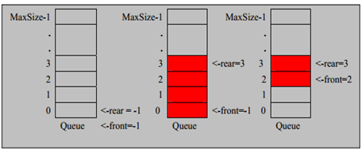
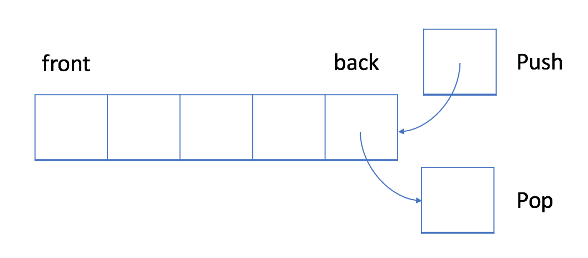
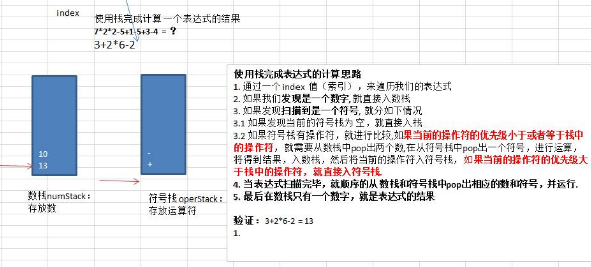
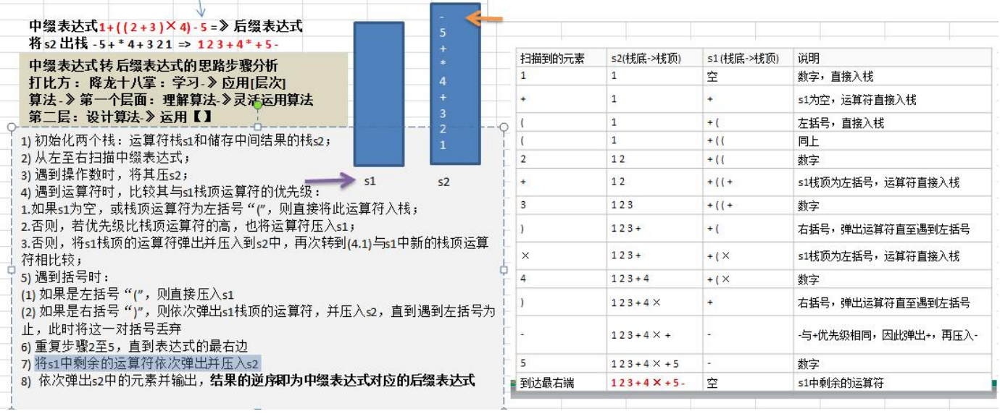

# 队列&栈

> [探索--队列 & 栈](https://leetcode-cn.com/explore/learn/card/queue-stack/)

## 队列：先入先出的数据结构

### 1.介绍

Ø队列是一个有序列表，可以用**数组**或是**链表**来实现。

Ø遵循**先入先出**的原则。即：先存入队列的数据，要先取出。后存入的要后取出



在 FIFO 数据结构中，将首先处理添加到队列中的第一个元素。


如上图所示，队列是典型的 FIFO 数据结构。插入（insert）操作也称作入队（enqueue），新元素始终被添加在队列的末尾。 删除（delete）操作也被称为出队（dequeue)。 你只能移除第一个元素。


### 2.数组模拟队列思路


 队列本身是有序列表，若使用数组的结构来存储队列的数据，则队列数组的声明如下图, 其中 maxSize 是该队 列的最大容量。 

 因为队列的输出、输入是分别从前后端来处理，因此需要两个变量 front 及 rear 分别记录队列前后端的下标， front 会随着数据输出而改变，而 rear 则是随着数据输入而改变，如图所


当我们将数据存入队列时称为”addQueue”，addQueue 的处理需要有两个步骤：


思路分析

 **1) 将尾指针往后移：rear+1 , 当 front == rear 【空】**

 **2) 若尾指针 rear 小于队列的最大下标 maxSize，则将数据存入 rear 所指的数组元素中，否则无法存入数据。 rear == maxSize[队列满]**（下标从0开始，数组大小为5，下标最大就是4）


代码实现：

```java
package com.atguigu.queue;

import java.util.Scanner;

/**
 * @Description: MyArrayQueueDemo$
 * @Author YellowPower
 * @Date: 2021/12/30$ 16:17$
 * @Version 1.0
 */ 

// 使用数组模拟队列-编写一个ArrayQueue类
class MyArrayQueue {
    private int maxSize; // 表示数组的最大容量
    private int front; // 队列头
    private int rear; // 队列尾
    private int[] arr; // 该数据用于存放数据, 模拟队列

    // 创建队列的构造器
    public MyArrayQueue(int arrMaxSize) {
        maxSize = arrMaxSize;
        arr = new int[maxSize];
        front = 0; // 指向队列头部，分析出front是指向队列头的前一个位置.
        rear = 0; // 指向队列尾，指向队列尾的数据(即就是队列最后一个数据)
    }

    // 判断队列是否满
    public boolean isFull() {
        return rear == maxSize;
    }

    // 判断队列是否为空
    public boolean isEmpty() {
        return rear == front;
    }

    // 添加数据到队列
    public void addQueue(int n) {
        // 判断队列是否满
        if (isFull()) {
            System.out.println("队列满，不能加入数据~");
            return;
        }
        arr[rear] = n;
        rear++; // 让rear 后移
    }

    // 获取队列的数据, 出队列
    public int getQueue() {
        // 判断队列是否空
        if (isEmpty()) {
            // 通过抛出异常
            throw new RuntimeException("队列空，不能取数据");
        }

        front++; // front后移
        return arr[front - 1];
    }

    // 显示队列的所有数据
    public void showQueue() {
        // 遍历
        if (isEmpty()) {
            System.out.println("队列空的，没有数据~~");
            return;
        }
        for (int i = front; i < arr.length && front <= rear; i++) {
            System.out.printf("arr[%d]=%d\n", i, arr[i]);
        }
    }

    // 显示队列的头数据， 注意不是取出数据
    public int headQueue() {
        // 判断
        if (isEmpty()) {
            throw new RuntimeException("队列空的，没有数据~~");
        }
        return arr[front];
    }
}
```


### 3.数组模拟环形队列

对前面的数组模拟队列的优化，充分利用数组. 因此将数组看做是一个环形的。(通过取模的方式来实现即可) 

上面是一种简单但低效的队列实现。

更有效的方法是使用循环队列。 具体来说，我们可以使用固定大小的数组和两个指针来指示起始位置和结束位置。 目的是重用我们之前提到的被浪费的存储。

 分析说明：

1) 尾索引的下一个为头索引时表示队列满，即将队列容量空出一个作为约定,这个在做判断队列满的 时候需要注意 (rear + 1) % maxSize == front 满]
2) rear == front [空] 3) 分析示意图


思路如下:

1. front 变量的含义做一个调整： front 就指向队列的第一个元素, 也就是说 arr[front] 就是队列的第一个元素

front 的初始值 = 0

2. rear 变量的含义做一个调整：rear 指向队列的最后一个元素的后一个位置. **因为希望空出一个空间做为约定(个人理解：就是为了在队列满时，留个位置存尾指针rear的，因为queue[rear]是空的，不存值，队列不满时，每次来一个rear当前位置存上后，往后移一位，rear=rear+1%size，不留一个位置的话，当队列刚满时，rear=rear+1%size==front与队列为空条件冲突，实际队列长度是size-1)**.

rear 的初始值 = 0，（jiu）

3. 当队列满时，条件是 (rear + 1) % maxSize == front 【满】

4. 对队列为空的条件， rear == front 空

5. 当我们这样分析， 队列中有效的数据的个数  **(rear + maxSize - front) % maxSize**  // rear = 1 front = 0 

6. 我们就可以在原来的队列上修改得到，一个环形队列

   


       + 语言：java
       
       + 思路：用count记录数量，和capacity对比来看是否空或者满载了。head头指针指向第一个元素，初始值=0；tail尾指针指向最后一个元素的后一个位置，因为需要一个位置来进行做约定，初始值=0。
       
       + 队列为空条件：head == tail
       
       + 循环队列是否为满 原文链接：https://blog.csdn.net/lpp0900320123/article/details/20694409
       
         ```
         这个问题比较复杂，假设数组的存数空间为7，此时已经存放1，2，5,7,22,90六个元素了，如果在往数组中添加一个元素，则rear=front；此时，队列满与队列空的判断条件front=rear相同，这样的话我们就不能判断队列到底是空还是满了；
         ```
       
         解决这个问题有两个办法：
       
         1. 一是增加一个参数，用来记录数组中当前元素的个数；
         2. 二是，少用一个存储空间，也就是数组的最后一个存数空间不用，当（tail+1）% capacity==head时，队列满（我采用的这个方法）

  


代码实现：

```java
class MyCircularQueue {
	    int head,tail;
    int capacity;
    int[] queue;

    public MyCircularQueue(int k) {
        head = 0;
        tail = 0;
        capacity=k+1;
        queue = new int[k+1];
    }
    /**
     * Insert an element into the circular queue. Return true if the operation is successful.
     */
    boolean enQueue(int data){
        if(isFull()) {
            return false;
        }
        queue[tail] = data;
        tail = (tail + 1) % capacity;
        return true;
    }

    /**
     * Delete an element from the circular queue. Return true if the operation is successful.
     */
    boolean deQueue() {
        if (isEmpty()) {
            return false;
        }
        head = (head + 1) % capacity;
        return true;
    }
    public int Front() {
        if (isEmpty()) {
            return -1;
        }
        return queue[head];
    }

    /**
     * Get the last item from the queue.
     */
    public int Rear() {
        if (isEmpty()) {
            return -1;
        }
        return queue[(tail - 1 + capacity) % capacity];
    }
    /**
     * Checks whether the circular queue is full or not.
     */
    boolean isEmpty() {
        return tail == head;
    }

    /**
     * Checks whether the circular queue is empty or not.
     */
    boolean isFull() {
        return (tail + 1) % capacity == head;
    }
}
```

### 4. 练习

#### 1. LeetCode-数据流中的移动平均值

[LeetCode试炼之路之(3):数据流中的移动平均值（346） - yaphse - 博客园 (cnblogs.com)](https://www.cnblogs.com/yaphse-19/p/12026735.html)


给定一个整数数据流和一个窗口大小，根据该滑动窗口的大小，计算其所有整数的移动平均值。

**思路：**
使用队列的思想来处理滑动平均中先进先出的数据操作。注意开始时队列内元素个数。

```java
//保存当前窗口数字的总和
private double previousSum = 0.0;
//窗口的最大值
private int maxSize;
//链表用于保存当前窗口的值
private Queue<Integer> currentWindow;

public MovingAverage(int val){
    currentWindow = new LinkedList<Integer>();
    maxSize = val;
}

private double next(int val){
    double sum = 0;
    if(maxSize==currentWindow.size()){
        previousSum -= currentWindow.remove();
    }
    currentWindow.add(val);
    previousSum +=val;
    return previousSum/currentWindow.size();
}
```


## 队列和广度优先搜索

### 1. LeetCode 286. 墙与门（BFS）

你被给定一个 m × n 的二维网格，网格中有以下三种可能的初始化值：

-1 表示墙或是障碍物
0 表示一扇门
INF 无限表示一个空的房间。然后，我们用 231 - 1 = 2147483647 代表 INF。你可以认为通往门的距离总是小于 2147483647 的。
你要给每个空房间位上填上该房间到 最近 门的距离，如果无法到达门，则填 INF 即可。


[[LeetCode\] 286. Walls and Gates 墙和门 - Grandyang - 博客园 (cnblogs.com)](https://www.cnblogs.com/grandyang/p/5285868.html)

#### 代码0：

思路是，搜索0的位置，每找到一个0，以其周围四个相邻点为起点，开始 DFS 遍历，并带入深度值1，如果遇到的值大于当前深度值，将位置值赋为当前深度值，并对当前点的四个相邻点开始DFS遍历，注意此时深度值需要加1，这样遍历完成后，所有的位置就被正确地更新了，参见代码如下：

```java
    public void wallsAndGates(int[][] rooms) {
        for (int i = 0; i < rooms.length; i++) {
            for (int j = 0; j < rooms[i].length; j++) {
                if (rooms[i][j] == 0) dfs(rooms, i, j, 0);
            }
        }
    }

    void dfs(int[][] rooms, int i, int j, int val) {
        if (i < 0 || i >= rooms.length || j < 0 || j >= rooms[i].length || val < rooms[i][j]) return;
        rooms[i][j] = val;
        dfs(rooms, i + 1, j, val + 1);
        dfs(rooms, i - 1, j, val + 1);
        dfs(rooms, i, j + 1, val + 1);
        dfs(rooms, i, j - 1, val + 1);

    }
```


#### 代码1：

BFS 的解法，需要借助 queue，首先把门的位置都排入 queue 中，然后开始循环，对于门位置的四个相邻点，判断其是否在矩阵范围内，并且位置值是否大于上一位置的值加1，如果满足这些条件，将当前位置赋为上一位置加1，并将次位置排入 queue 中，这样等 queue 中的元素遍历完了，所有位置的值就被正确地更新了

```java
public void wallsAndGates2(int[][] rooms) {
    Queue<int[]> queue = new LinkedList<int[]>();
    int[][] dirs = {{0, -1}, {-1, 0}, {0, 1}, {1, 0}};
    for (int i = 0; i < rooms.length; i++) {
        for (int j = 0; j < rooms[i].length; j++) {
            if (rooms[i][j] == 0) queue.add(new int[]{i, j});
        }
    }

    while (!queue.isEmpty()) {
        int i = queue.peek()[0], j = queue.peek()[1];
        queue.poll();
        for (int k = 0; k < dirs.length; k++) {
            int x=i+dirs[k][0], y=j+dirs[k][1];
            if (x < 0 || x >= rooms.length || y < 0 || y >= rooms[0].length || rooms[x][y] < rooms[i][j] + 1) continue;
            rooms[x][y] = rooms[i][j]+1;
            queue.add(new int[]{x, y});
        }
    }
}
```

### 2. 岛屿数量

+ 语言：java

+ 思路：每次遇到岛屿，借助DFS(深度优先搜索)扩展、标记。然后岛屿数量计数+1，寻找下一个岛屿位置（前面借助DFS(深度优先搜索)已经把本次遇到的岛屿都标记了，不会再遇到了）。

#### 代码0（2ms，97.40%）：dfs

  ```java
  class Solution {
      public int numIslands(char[][] grid) {
          // 边界条件判定
          if (grid == null || grid.length == 0) return 0;
          // 统计岛屿个数
          int count = 0;
          int width =grid[0].length;
          int height = grid.length;
          //遍历每个格子
          for (int i = 0; i < grid.length; i++) {
              for (int j = 0; j < grid[i].length; j++) {
                  // 只有当前格子是1的才开始计算
                  if(grid[i][j] == '1') {
                      // 如果当前格子是1，岛屿数量+1
                      count++;
                      // 然后通过dfs把当前格子上下左右格子为1的格子都置0, 因为连在一起的是一个岛屿
                      dfs(grid, i, j);
                  }
              }
          }
          return count;
      }
      // 把当前格子以及他邻近的为1的格子都会置为1
      public void dfs(char[][] grid, int i, int j, int width, int height) {
          // 越界，或已走过或是水 ==‘0’
          if (i < 0 || i >= height || j < 0 || j >= width || grid[i][j] == '0') return;
          grid[i][j] = '0';
          dfs(grid, i - 1, j);//上
          dfs(grid, i + 1, j);//下
          dfs(grid, i, j + 1);//左
          dfs(grid, i, j - 1);//右
      }
  }
  ```

#### 参考代码1（1ms）：bfs

  ```java
  class Solution {
      void bfs(char[][] grid, int i, int j, int width, int height) {
          Queue<int[]> queue = new LinkedList<>();
          queue.offer(new int[]{i, j});
          while (!queue.isEmpty()) {
              int[] cur = queue.poll();
              i = cur[0];
              j = cur[1];
              if (i >= 0 && i < height && j >= 0 && j < width && grid[i][j] == '1') {
                  grid[i][j] = '0';
                  queue.offer(new int[]{i-1,j});
                  queue.offer(new int[]{i+1,j});
                  queue.offer(new int[]{i,j-1});
                  queue.offer(new int[]{i,j+1});
              }
          }
      }
      public int numIslands(char[][] grid) {
          int cnt = 0;
          int width =grid[0].length;
          int height = grid.length;
          for (int i = 0; i < grid.length; i++) {
              for (int j = 0; j < grid[0].length; j++) {
                  if (grid[i][j] == '1') {
                      bfs(grid, i, j,width, height);
                      cnt++;
                  }
              }
          }
          return cnt;
      }
  }
  ```

### 3. 打开转盘锁

+ 语言：java

+ 思路：BFS(宽度优先搜索算法)，从0000到结果，或者结果到0000的情况很好想到，就每轮BFS尝试4个位置的向上、向下转动共8种情况（1轮）。直到遇到终点或者遇到死路。

  > [我写了一套 BFS 算法框架，见到 BFS 直接套](https://leetcode-cn.com/problems/open-the-lock/solution/wo-xie-liao-yi-tao-bfs-suan-fa-kuang-jia-jian-dao-/)

#### 代码1：单向BFS。

（97ms，64.05%）

  ```java
  class Solution {
      public int openLock(String[] deadends, String target) {
          // (1) deadends存到HashSet以便下面判断，之后visited也存这里
          HashSet<String> visited = new HashSet<>();
          for(String deadend:deadends){
              visited.add(deadend);
          }
  
          // (2) 初始化BFS要用到的队列queue
          Queue<String> queue = new LinkedList<>();
          queue.add("0000");
  
          int res = -1;
          String cur;
          while(!queue.isEmpty()){
              // 每轮BFS遍历当前所有子节点可能情况
              int size = queue.size(); // 在循环里queue每一步可能在增加新的元素，大小会一直不变，只需要遍历完当前的元素就可以
              while (size>0){
                  cur = queue.poll();
                  --size;
                  // <1> 浏览过相同的了，或者这个是思路deadends，就继续取queue的下一个元素
                  if(visited.contains(cur))
                      continue;
                  // <2> 遇到结果了直接返回答案。
                  if(cur.equals(target))
                      return res+1;
                  // <3> 获取所有可能的走法，共4位，每一位都可能往上拨动or往下拨动，共8种可能
                  for(int i = 0;i<4;++i){
                      queue.add(upLock(cur,i));
                      queue.add(downLock(cur,i));
                  }
                  // <4> 标记当前弹出的String串已经访问过
                  visited.add(cur);
              }
              // 该轮没找到答案，继续下一轮
              ++res;
          }
          return -1;// 没找到才可能走到这里，没找到返回-1
      }
  
      // 往上拨动锁
      public String upLock(String str,int index){
          char[] chars = str.toCharArray();
          if(chars[index]=='9')
              chars[index] = '0';
          else
              chars[index]+=1;
          return new String(chars);
      }
  
      // 往下拨动锁
      public String downLock(String str,int index){
          char[] chars = str.toCharArray();
          if(chars[index]=='0')
              chars[index] = '9';
          else
              chars[index]-=1;
          return new String(chars);
      }
  }
  ```

#### 代码2：双向DFS。

（25ms，94.94%）

  **传统的 BFS 框架就是从起点开始向四周扩散，遇到终点时停止；而双向 BFS 则是从起点和终点同时开始扩散，当两边有交集的时候停止**。

  

  用HashSet代替queue，使用两个HashSet，BFS原本一般是从head->tail判断是否含有目标target，这里分别从head->tail和从tail->head，那么只要两个碰头了，说明"0000"可以到target，且target可以到"0000"。

  中间需要注意的就是，每轮固定遍历queue1，但是实际每轮过后queue1和queue2会有一个对调操作，也就是一轮head->tail进行BFS，一轮tail->head进行BFS。

  双向BFS好处就是可以减少存储中间节点，因为单项BFS，如果是树的话，越下面加入queue的节点越多；如果头->尾和尾->头的BFS同时进行，既可以避免round回合数越多，queue暂存的节点过多的问题。

  ```java
  class Solution {
      public int openLock(String[] deadends, String target) {
          // (1) deadends存到HashSet以便下面判断，之后visited也存这里
          HashSet<String> visited = new HashSet<>();
          for(String deadend:deadends){
              visited.add(deadend);
          }
  
          // (2) 初始化"双向BFS"要用到的2个HashSet(因为只要碰头就表示找到了，所以用HashSet方便判断交集)
          HashSet<String> queue1 = new HashSet<>();
          HashSet<String> queue2 = new HashSet<>();
          queue1.add("0000");
          queue2.add(target);
  
          int res = -1;
          String cur;
          while(!queue1.isEmpty()&&!queue2.isEmpty()){
              //用于存储queue1下一轮要遍历的节点。
              HashSet<String> temp = new HashSet<>();
              for(String str:queue1){
                  // <1> 浏览过相同的了，或者这个是思路deadends，就继续取queue的下一个元素
                  if(visited.contains(str))
                      continue;
                  // <2> 如果另一个queue2含有当前queue1的元素，说明碰头了head-> str <- tail
                  if(queue2.contains(str))
                      return res+1;
                  // <3> 获取所有可能的走法，共4位，每一位都可能往上拨动or往下拨动，共8种可能
                  for(int i = 0;i<4;++i){
                      temp.add(upLock(str,i));
                      temp.add(downLock(str,i));
                  }
                  // <4> 标记当前弹出的String串已经访问过
                  visited.add(str);
              }
              // 该轮没找到答案，继续下一轮
              ++res;
              // queue1永远是下一轮要遍历的节点组
              // queue2则是下下轮的
              // 双向BFS，假如分别从头到尾和从尾到头；那么 head->tail ; tail->head ; head->tail ....
              queue1 = queue2;
              queue2 = temp;
          }
          return -1;// 没找到才可能走到这里，没找到返回-1
      }
  
      // 往上拨动锁
      public String upLock(String str,int index){
          char[] chars = str.toCharArray();
          if(chars[index]=='9')
              chars[index] = '0';
          else
              chars[index]+=1;
          return new String(chars);
      }
  
      // 往下拨动锁
      public String downLock(String str,int index){
          char[] chars = str.toCharArray();
          if(chars[index]=='0')
              chars[index] = '9';
          else
              chars[index]-=1;
          return new String(chars);
      }
  }
  ```

#### 参考代码1：直接先判断是否可能到达targrt

（1ms）

+ （把target的8种拨动情况全考虑一遍），然后就直接数字计算需要走的步数。

  ```java
  class Solution {
      public int openLock(String[] deadends, String target) {
          List<String> deals = Arrays.asList(deadends);
          if (deals.contains("0000")) return -1;
          final List<String> options = new ArrayList<>();
          char[] cs;
          char c;
          int zero = '0';
          for (int i = 0; i < 4; i++ ){
              cs = target.toCharArray();
              c = cs[i];
              cs[i] = (char) ((c - zero + 1) % 10 + zero);
              options.add(new String(cs));
              cs[i] = (char) ((c - zero + 9) % 10 + zero);
              options.add(new String(cs));
          }
          options.removeAll(deals);
          if (options.isEmpty()) return -1;
          int step = Integer.MAX_VALUE;
          for ( String option : options ){
              int curStep = 1;
              cs = option.toCharArray();
              for ( int i = 0; i < 4; i++ ){
                  int num = cs[i] - zero;
                  if (num > 5) curStep += 10 - num;
                  else curStep += num;
              }
              step = Math.min(curStep, step);
          }
          return step;
      }
  }
  ```

### 4. 完全平方数

+ 语言：java

+ 给定正整数 n，找到若干个完全平方数（比如 1, 4, 9, 16, ...）使得它们的和等于 n。你需要让组成和的完全平方数的个数最少。

  给你一个整数 n ，返回和为 n 的完全平方数的 最少数量 。

  完全平方数 是一个整数，其值等于另一个整数的平方；换句话说，其值等于一个整数自乘的积。例如，1、4、9 和 16 都是完全平方数，而 3 和 11 不是。

+ 思路：整体上是BFS，需要让"组成和的完全平方数的个数"最少，可以理解为，以n作为根节点，然后每一层子树都是减去某一个完全平方数后的值，这样来计算最小深度。树的最小深度就可以用BFS写了。

  1. 先计算出所有可能出现的完全平方数，可以用for循环i\*i<=n实现，方便遍历。（计算每层子树的值，root-X = 当前层某子树值）
  2. BFS（~~使用queue~~）使用HashSet（因为会有重复计算，草稿纸上画画树就知道了），(~~每轮根据当前queue大小（某一层拥有的节点总数）作为一层for循环~~)**HashSet不方便直接边添加边遍历**，所以这里用一个临时HashSet存储下一层，接着每轮替换一下HashSet引用，指向刚才临时创建的下一层就好了。
  3. 每一层计算下一层，每个子树都需要遍历完全平方数，又是一个for循环。

  

#### 代码0

（45ms，49.29%）

  ```java
  class Solution {
      public int numSquares(int n) {
          // (1) 计算并存储所有可能用到的完全平方数
          ArrayList<Integer> squares = new ArrayList<>();
          for(int i = 1;i*i<=n;++i){
              squares.add(i*i);
          }
  
          // (2) 初始化BFS要用到的HashSet(因为会有重复计算)，加入根节点n
          HashSet<Integer> curFloor = new HashSet<>();
          curFloor.add(n);
  
          int res = 0;
          // (3) BFS常见套路之 最外层while判断HashSet非空
          while(!curFloor.isEmpty()){
              ++res; // 层数+1(结果值+1)
              HashSet<Integer> nextFloor = new HashSet<>(); // 存储下一层节点
              // (4) 遍历每一层树节点BFS每一轮就是一层
              for(int curNode:curFloor){
                  // (5) 每一层所有的树节点，每一个都需要和之前存的"完全平方数"计算差值，作为自己下面一层的子节点加入queue
                  for(int num:squares){
                      if(curNode==num) // 如果当前节点的值已经就是某个"完全平方数"了，那么直接返回层数res
                          return res;
                      else if(curNode<num) // 如果不够减了，就没必要继续遍历"完全平方数"了。进入外层循环，计算同层别的节点的子树
                          break;
                      else
                          nextFloor.add(curNode-num); // 下一层子树，比如完全平方数有1 2 4 ...，当前curNode 5，那么其子树就是 4、3 和 1
                  }
              }
              // (6) 调换引用，curFloor引用指向下一层
              curFloor = nextFloor;
          }
          return res;
      }
  }
  ```

#### 代码1：和代码0类似

```java
    public int numSquares(int n) {
        //记录访问过的节点值
        Set<Integer> visited = new HashSet<>();
        Queue<Integer> queue = new LinkedList<>();
        queue.offer(0);
        int level = 0;

        while (!queue.isEmpty()) {
            level ++;
            //每一层的节点数量
            int size = queue.size();
            //遍历当前层的所有节点
            for (int i=0; i < size; i++) {
                //节点的值
                int cur = queue.poll();
                //访问当前节点的子节点，类比于二叉树的左右子节点
                for (int j = 1; j * j <= n; j++) {
                    //子节点的值
                    int nodeValue = cur + j * j;
                    //nodeValue始终是完全平方数的和，当他等于n的
                    //时候直接返回
                    if(nodeValue == n) return level;
                    //如果大于n，终止内层循环
                    if (nodeValue > n) break;
                    if (!visited.contains(nodeValue)) {
                        queue.offer(nodeValue);
                        visited.add(nodeValue);
                    }
                }
            }
        }
        return level;
    }
```


#### 参考代码2：DP动态规划

（41ms）

+ 从1计算到n，利用dp\[0]是0，最外层for遍历从1~n，每次初始化dp\[i]=i，也就是假设最坏情况，数字i由i个1组成，然后再计算`dp[i] = min(dp[i],dp[i-j*j]+1)`，这里`dp[i-j*j]+1`可能是`dp[0]+1`也就是`0+1=1`。

  ```java
  class Solution {
      public int numSquares(int n) {
          int[] dp = new int[n + 1];
          for(int i = 1; i <= n; i ++){
              dp[i] = i;
              for(int j = 1; i - j * j >= 0; j ++){
                  dp[i] = Math.min(dp[i], dp[i - j * j] + 1);
              }
          }
  
          return dp[n];
      }
  }
  ```

  

#### 参考代码3：数学方法

（1ms）

没啥好值得学习的。

+ 拉格朗日四平方和定理说明任何一个数，都可以由小于等于4个的完全平方数相加得到。

  当n=(8b+7)*4^n的时候，n是由4个完全平方数得到，否则n只有1到3个完全平方数得到。
  
  由1个，2个和4个完全平方数得到的n我们很容易判断，所以剩下的就是由3个完全平方数得到的n。我们分为4步走的战略，
  
  先判断是否能由1个平方数组成
  在判断是否能由4个平方数组成
  接着判断是否能由2个平方数组成
  如果上面都不成立，只能由3个平方数组成了。
  
  作者：数据结构和算法
  链接：https://leetcode-cn.com/leetbook/read/queue-stack/kfgtt/?discussion=xgcYsh
  来源：力扣（LeetCode）
  著作权归作者所有。商业转载请联系作者获得授权，非商业转载请注明出处。
  
  
  
+ ```java
  public int numSquares(int n) {
      //一，先判断由1个平方数组成的
      //如果n是平方数，直接返回1即可，表示n由
      //1个平方数组成
      if (is_square(n))
          return 1;
      //如果n是4的倍数，就除以4，因为4是2的平方，
      //如果n可以由m个完全平方数组成，那么4n也
      //可以由m个完全平方数组成
      while ((n & 3) == 0)
          n >>= 2;
      //二，在判断由4个平方数组成的
      //如果n是4的倍数，在上面代码的执行中就会一直除以4，
      //直到不是4的倍数为止，所以这里只需要判断n=(8b+7)
      //即可
      if ((n & 7) == 7)
          return 4;
      int sqrt_n = (int) (Math.sqrt(n));
      //三，接着判断由2个平方数组成的
      //下面判断是否能由2个平方数组成
      for (int i = 1; i <= sqrt_n; i++) {
          if (is_square(n - i * i)) {
              return 2;
          }
      }
      //四，剩下的只能由3个平方数组成了
      //如果上面都不成立，根据拉格朗日四平方和定理
      //只能由3个平方数组成了
      return 3;
  }
  
  //判断n是否是平方数
  public boolean is_square(int n) {
      int sqrt_n = (int) (Math.sqrt(n));
      return sqrt_n * sqrt_n == n;
  }
  
  作者：数据结构和算法
  链接：https://leetcode-cn.com/leetbook/read/queue-stack/kfgtt/?discussion=xgcYsh
  来源：力扣（LeetCode）
  著作权归作者所有。商业转载请联系作者获得授权，非商业转载请注明出处。
  ```


## 栈：后进先出的数据结构



在 LIFO 数据结构中，将首先处理添加到队列中的最新元素。

与队列不同，栈是一个 LIFO 数据结构。通常，插入操作在栈中被称作入栈 push 。与队列类似，总是在堆栈的末尾添加一个新元素。但是，删除操作，退栈 pop ，将始终删除队列中相对于它的最后一个元素。
链接：https://leetcode-cn.com/leetbook/read/queue-stack/ghqur/


### 1.最小栈

+ 思路：维护两个栈，一个是题目要求的存储所有数据的栈，另一个是单调递减的单调栈（方便获取最小值）。

#### 代码0：

（6ms，97.08%）

```java
  class MinStack {

      LinkedList<Integer> stack; // 存放所有值的栈
      LinkedList<Integer> minStack; // 维持一个递减的最小单调栈

      /** initialize your data structure here. */
      public MinStack() {
          stack = new LinkedList<>();
          minStack = new LinkedList<>();
      }

      public void push(int x) {
          stack.addFirst(x);
          if(minStack.isEmpty()||minStack.peekFirst()>=x)
              minStack.addFirst(x);
      }

      public void pop() {
          if(stack.pollFirst().equals(minStack.peekFirst()))
              minStack.pollFirst();
      }

      public int top() {
          return stack.peekFirst();
      }

      public int getMin() {
          return minStack.peekFirst();
      }
  }
```


#### 参考代码1：

（3ms）

利用自定义链表维护min最小值，主要没有实际的`pop`操作，只是移动链表指针，所以更轻量级，更快。

```java
  class MinStack {
      //链表头，相当于栈顶
      private Node head;
      /** initialize your data structure here. */
      public MinStack() {
  
      }
  	//压栈，需要判断栈是否为空
      public void push(int x) {
          if (head == null) {
              head = new Node(x, x);
          } else {
              head = new Node(x, Math.min(x, head.min), head);
          }
  
      }
  	//出栈，相当于把链表头删除
      public void pop() {
          head = head.next;
      }
  
      public int top() {
          return head.val;
      }
  
      public int getMin() {
          return head.min;
      }
  
      private class Node {
          int val;
          int min;
          Node next;
  
          private Node(int val, int min) {
              this(val, min, null);
          }
  
          private Node(int val, int min, Node next) {
              this.val = val;
              this.min = min;
              this.next = next;
          }
      }
  }
```


### 2. 有效的括号

    语言：java

+ 思路：就直接判断是否是某种左括号，是的话就入栈，否则就是遇到了某种右括号，试图和栈中元素匹配并出栈。

```java
public boolean isValid(String s) {
    Stack<Character> stack = new Stack<>();
    char[] chars = s.toCharArray();
    //遍历所有的元素
    for (char c : chars) {
        //如果是左括号，就把他们对应的右括号压栈
        if (c == '(') {
            stack.push(')');
        } else if (c == '{') {
            stack.push('}');
        } else if (c == '[') {
            stack.push(']');
        } else if (stack.isEmpty() || stack.pop() != c) {
            //否则就只能是右括号。
            //1，如果栈为空，说明括号无法匹配。
            //2，如果栈不为空，栈顶元素就要出栈，和这个右括号比较。
            //如果栈顶元素不等于这个右括号，说明无法匹配，
            //直接返回false。
            return false;
        }
    }
    //最后如果栈为空，说明完全匹配，是有效的括号。
    //否则不完全匹配，就不是有效的括号
    return stack.isEmpty();
}

作者：数据结构和算法
链接：https://leetcode-cn.com/leetbook/read/queue-stack/g9d0h/?discussion=VxJ4ZX
来源：力扣（LeetCode）
著作权归作者所有。商业转载请联系作者获得授权，非商业转载请注明出处。
```


#### 代码1：

（0ms，100%）

+ 不过这里已经明确了所有元素，可以考虑直接用一个数组和指针配合模拟栈。

  这里直接把原字符串转换的字符数组当作栈使用。

```java
  class Solution {
      public boolean isValid(String s) {
          char[] stack = s.toCharArray();
          int top = 0, index = 0;//top表示栈顶指针，index则是遍历元素的指针
          int len = s.length();
          while(index<len){
              switch (stack[index]){
                  case '(':
                  case '[':
                  case '{':
                      stack[top++] = stack[index]; // 直接把原字符串转换的字符数组当栈用
                      break;
                  case ')':
                      if(top<1||stack[top-1]!='(')
                          return false;
                      --top;
                      break;
                  case ']':
                      if(top<1||stack[top-1]!='[')
                          return false;
                      --top;
                      break;
                  case '}':
                      if(top<1||stack[top-1]!='{')
                          return false;
                      --top;
                      break;
              }
              ++index;
          }
          return top==0;
      }
  }
```


#### 参考代码1：

（0ms）

思路一样，就是写法略有不同。

```java
  class Solution {
      public boolean isValid(String s) {
          char[] charArray = new char[s.length() + 1];
  
          int p = 1;
  
          for (char c : s.toCharArray()) {
              if (c == '(' || c == '{' || c == '[') {
                  charArray[p++] = c;
              } else {
                  p--;
                  if (c == ')' && charArray[p] != '(') {
                      return false;
                  }
                  if (c == '}' && charArray[p] != '{') {
                      return false;
                  }
                  if (c == ']' && charArray[p] != '[') {
                      return false;
                  }
              }
          }
          return p == 1; // 如果左括号还有剩余 括号没有一一对应，属于无效情况
      }
  }
```


### 3.每日温度

+ 语言：java


#### 代码0：暴力

思路：使用下面这种两个下标来遍历的方法

```java
class Solution {
    public int[] dailyTemperatures(int[] temperatures) {
        int[] m =new int[temperatures.length];
        for(int i=0;i<temperatures.length;i++){
            int j = i+1;
            while(j<temperatures.length && temperatures[i]>=temperatures[j] ){
                j++;
            }
            if(j ==temperatures.length){
                m[i] = 0;
            }else{
                m[i] = j-i;
            }
        }
        return m;
    }
}
```


#### 代码1：栈

（16ms，80.66%）

+ 思路：该方法使用栈解决，使用栈记录下标，这样只需要走一遍就能完成

  1. 需要暂存的是小于或等于当前遍历到的数字，就想到队列或者栈，这里判断我们只需要存大数，小的中间需要去掉，那么就是栈了。
  2. 再加上"如果气温在这之后都不会升高"这句提示性的话，并且每次存的都是小于等于自己的数字，所以我们维护的应该是一个单调递减栈。

  3. 由于我们需要在出栈的时候，根据下标的差值判断是某一位置后第几天遇到高温，那么栈中需要存的就是下标值而不是具体的数值。

  ```java
  class Solution {
      public int[] dailyTemperatures(int[] T) {
          Stack<Integer> stack = new Stack<>();
          int[] ret = new int[T.length];
          for (int i = 0; i < T.length; i++) {
              while (!stack.isEmpty() && T[i] > T[stack.peek()]) {
                  int idx = stack.pop();
                  ret[idx] = i - idx;
              }
              stack.push(i);
          }
          return ret;
      }
  。
  }
  ```


#### 代码2：数组栈

栈改为数组的形式

```java
    public int[] dailyTemperatures_array_stack(int[] temperatures) {
        int[] stack = new int[temperatures.length];
        int top = -1;
        int[] ret = new int[temperatures.length];
        int len = temperatures.length;
        for (int i = 0; i < len; i++) {
            while (top != -1 && temperatures[i] > temperatures[stack[top]]) {
                int idx = stack[top];
                top--;
                ret[idx] = i - idx;
            }
            stack[++top] = i;
        }
        return ret;
    }
```

#### 代码3：参照柱状图中最大的矩形

没看懂

```java
public int[] dailyTemperatures(int[] T) {
    int length = T.length;
    Stack<Integer> stack = new Stack<>();
    int[] res = new int[length];
    for (int i = 0; i < length; i++) {
        int h = T[i];
        if (stack.isEmpty() || h <= T[stack.peek()]) {
            stack.push(i);
        } else {
            int top = stack.pop();
            res[top] = i - top;
            i--;
        }
    }
    return res;
}
```

作者：数据结构和算法
链接：https://leetcode-cn.com/leetbook/read/queue-stack/genw3/?discussion=OGBxRQ
来源：力扣（LeetCode）
著作权归作者所有。商业转载请联系作者获得授权，非商业转载请注明出处。


#### 参考代码4：从后面开始查找

[从后面开始查找](https://leetcode-cn.com/leetbook/read/queue-stack/genw3/?discussion=OGBxRQ)

+ （3ms）

+ 从后往前，外层for循环表示给每个res\[i]计算结果值，内层for循环表示寻找比res[i]大的值，运用了类似KMP算法的技巧，快速跳过绝对不可能出现匹配的位置。

  ```java
  class Solution {
      public int[] dailyTemperatures(int[] T) {
          int[] res = new int[T.length];
          //从后面开始查找
          for (int i = res.length - 2; i >= 0; i--) {// 从倒数第二个开始
              int j = i + 1;
              while (j < res.length) {
                  if (T[j] > T[i]) {
                      //如果找到就停止while循环
                      res[i] = j - i;
                      break;
                  } else if (res[j] == 0) {
                      //如果没找到，并且res[j]==0。说明第j个元素后面没有
                      //比第j个元素大的值，因为这一步是第i个元素大于第j个元素的值，
                      //那么很明显这后面就更没有大于第i个元素的值。直接终止while循环。
                      break;
                  } else {
                      //如果没找到，并且res[j]！=0说明第j个元素后面有比第j个元素大的值，
                      //然后我们让j往后挪res[j]个单位，找到那个值，再和第i个元素比较
                      j += res[j];
                  }
              }
          }
          return res;
      }
  
  作者：数据结构和算法
  链接：https://leetcode-cn.com/leetbook/read/queue-stack/genw3/?discussion=OGBxRQ
  来源：力扣（LeetCode）
  著作权归作者所有。商业转载请联系作者获得授权，非商业转载请注明出处。
  }
  ```


### 4. 逆波兰表达式求值

**逆波兰表达式：就是后缀表达式。后缀就是指算符写在后面。**

如 ( 1 + 2 ) * ( 3 + 4 ) 。 该算式的逆波兰表达式写法为 ( ( 1 2 + ) (
3 4 + ) * ) 。

 **逆波兰表达式主要有以下两个优点：**

去掉括号后表达式无歧义，上式即便写成 1 2 + 3 4 + * 也可以依据次序计算出正确结果。

适合用栈操作运算：遇到数字则入栈；遇到算符则取出栈顶两个数字进行计算，并将结果压入栈中


#### 代码0：直接运算，栈

```java
class Solution {
    public int evalRPN(String[] tokens) {
        Stack<Integer> stack = new Stack<>();
        for(String token : tokens) {
            if(token.equals("+")){
                int num1 = stack.pop();
                int num2 = stack.pop();
                stack.push(num2 + num1);
            }else if (token.equals("-")){
                int num1 = stack.pop();
                int num2 = stack.pop();
                stack.push(num2 - num1);
            }else if (token.equals("*")){
                int num1 = stack.pop();
                int num2 = stack.pop();
                stack.push(num2 * num1);
            }else if (token.equals("/")){
                int num1 = stack.pop();
                int num2 = stack.pop();
                stack.push(num2 / num1);
            }else{
                stack.push(Integer.parseInt(token));
            }
        }
        return stack.pop();
    }
}
```


#### 代码1：数组模拟栈

具体实现方面，创建数组 stack 模拟栈，数组下标 00 的位置对应栈底，定义 index 表示栈顶元素的下标位置，初始时栈为空，index=−1。当遇到操作数和运算符时，进行如下操作：

如果遇到操作数，则将 index 的值加 1，然后将操作数赋给 stack[index]；

如果遇到运算符，则将 index 的值减 1，此时 stack[index] 和 stack[index+1] 的元素分别是左操作数和右操作数，使用运算符对两个操作数进行运算，将运算得到的新操作数赋给 stack[index]。

整个逆波兰表达式遍历完毕之后，栈内只有一个元素，因此 index=0，此时 stack[index] 即为逆波兰表达式的值。

链接：https://leetcode-cn.com/problems/evaluate-reverse-polish-notation/solution/ni-bo-lan-biao-da-shi-qiu-zhi-by-leetcod-wue9/

```java
    public int evalRPN_stack_array(String[] tokens) {
        int n = tokens.length;
        int[] stack = new int[(n + 1) / 2];
        int index = -1;
        for (int i = 0; i < n; i++) {
            String token = tokens[i];
            if (tokens[i].equals("+")) {
                index--;
                stack[index] =stack[index] + stack[index+1];
            } else if (tokens[i].equals("-")) {
                index--;
                stack[index] = stack[index] - stack[index+1];
            } else if (tokens[i].equals("*")) {
                index--;
                stack[index] =  stack[index] * stack[index+1];
            } else if (tokens[i].equals("/")) {
                index--;
                stack[index] = stack[index] /stack[index+1] ;
            } else {
                index++;
                stack[index] = Integer.parseInt(token);
            }
        }
        return stack[index];
    }
```


#### 代码2：DFS----没通过

（1ms，100%）：

思路：题目明确提示，逆波兰表达式如果遇到符号就计算，遇到数字则入栈。

  我们分析下，正确的逆波兰表达式，每次都是取两个数字，然后紧接着一个符号，就直接计算了。居然我们知道明确规律就一定是两数字然后一符号，那么我们连new一个栈都省了，直接通过DFS，在过程中获取两个需要被计算的数字即可。

```java
  class Solution {
      String[] tokens; // 方便快速访问tokens
      int topIndex; //模拟栈顶指针
  
      public int evalRPN(String[] tokens) {
          this.tokens = tokens;
          topIndex = tokens.length - 1; // 从后往前，必定1符号2数字的规律
          return dfs();
      }
  
      public int dfs() {
          String tmp = tokens[topIndex--];
          int a,b;
          switch (tmp) {
              case "+":
                  a = dfs();
                  b = dfs();
                  return a + b;
              case "-":
                  a = dfs();
                  b = dfs();
                  return a - b;
              case "*":
                  a = dfs();
                  b = dfs();
                  return a * b;
              case "/":
                  a = dfs();
                  b = dfs();
                  return a / b;
              default:
                  return Integer.parseInt(tmp);
          }
      }
  }
```


### 5.表达式计算

[中缀表达式求值问题 - Matrix海子 - 博客园 (cnblogs.com)](https://www.cnblogs.com/dolphin0520/p/3708602.html)

#### 5.1. 中缀表达式计算




```java
// 中缀表达式---+-*/()
public static int InfixExpression(String s) {
    Stack<Integer> nums = new Stack<>();
    Stack<Character> ops = new Stack<>();
    char[] chars = s.toCharArray();
    int number = 0;
    for (int i = 0; i < chars.length; i++) {
        //依次得到expression 的每一个字符
        //判断ch是什么，然后做相应的处理
        //若是数字
        String temp = "";
        if (chars[i] >= '0' && chars[i] <= '9') { //如果是数
            temp += chars[i];
            while (i + 1 < s.length() && chars[i + 1] >= '0' && chars[i + 1] <= '9') {
                temp += chars[i + 1];   // 若是连续数字
                ++i;
            }
            //                nums.push(chars[i] - '0');
            nums.push(Integer.parseInt(temp));
        }
        /*else if (isOper(chars[i])) {//如果符号栈为空或位(入栈
                ops.push(chars[i]);
            } */
        else if (isOper(chars[i])) {//如果是运算符
            //判断当前的符号栈是否为空
            if (!ops.isEmpty()) {
                //如果符号栈有操作符，就进行比较,如果当前的操作符的优先级小于或者等于栈中的操作符,就需要从数栈中pop出两个数,
                //再从符号栈中pop出一个符号，进行运算，将得到结果，入数栈，然后将当前的操作符入符号栈
                if (priority(chars[i]) <= priority(ops.peek())) {   //栈顶符号优先级 较高（大于等于） 当前符号
                    int num1 = nums.pop();
                    int num2 = nums.pop();
                    char oper = ops.pop();
                    int res = calculat(num1, num2, oper);
                    //把运算的结果如数栈
                    nums.push(res);
                    //然后将当前的操作符入符号栈
                    ops.push(chars[i]);
                } else {
                    //如果当前的操作符的优先级大于栈中的操作符， 就直接入符号栈.
                    ops.push(chars[i]);
                }
            } else {
                //如果为符号栈空直接入符号栈
                ops.push(chars[i]);
            }
        }
    }
    while (!ops.isEmpty()) {
        char curOp = ops.pop();
        int num1 = nums.pop();
        int num2 = nums.pop();
        int res = calculat(num1, num2, curOp);
        nums.push(res);
    }
    System.out.printf("表达式 %s = %d", s, nums.peek());
    return nums.pop();
}
```


#### 5.2. 前缀表达式计算

```java
public static double prefixExpression(String s) {
        Stack<Double> nums = new Stack<>();
        Stack<Character> ops = new Stack<>();
        char[] chars = s.toCharArray();
        String regx = "[0-9]*"; //匹配数字
        for (int i = chars.length - 1; i >= 0; i--) {
            if (chars[i] >= '0' && chars[i] <= '9') {
                nums.push((double) (chars[i] - '0'));
            } else {
                double a = nums.pop();
                double b = nums.pop();
                if (chars[i] == '/' && b == 0) {
                    break;
                }
                double res = SymCal(a, b, chars[i]);
                nums.push(res);
            }
        }
        return nums.peek();
    }

    public static double SymCal(double a, double b, char s) {
        switch (s) {
            case '*':
                return a * b;
            case '/':
                return a / b;
            case '+':
                return a + b;
            case '-':
                return a - b;
        }
        return 0;
    }

```


#### 5.3. 后缀表达式（逆波兰表达式）计算

```java
	public int evalRPN(String[] tokens) {
        Stack<Integer> stack = new Stack<>();
        for(String token : tokens) {
            if(token.equals("+")){
                int num1 = stack.pop();
                int num2 = stack.pop();
                stack.push(num2 + num1);
            }else if (token.equals("-")){
                int num1 = stack.pop();
                int num2 = stack.pop();
                stack.push(num2 - num1);
            }else if (token.equals("*")){
                int num1 = stack.pop();
                int num2 = stack.pop();
                stack.push(num2 * num1);
            }else if (token.equals("/")){
                int num1 = stack.pop();
                int num2 = stack.pop();
                stack.push(num2 / num1);
            }else{
                stack.push(Integer.parseInt(token));
            }
        }
        return stack.pop();
    }
```

#### 5.4. 中缀表达式转后缀表达式



```java
    public static void infixToPostfix(String s) {
        char[] chars = s.toCharArray();
        Stack<Character> ops = new Stack<>();
        Stack<Character> nums = new Stack<>();
        for (int i = 0; i < chars.length; i++) {
            if (chars[i] >= '0' && chars[i] <= '9') {
                nums.push(chars[i]);
            } else if (chars[i] == '(') {
                ops.push(chars[i]);
            } else if (chars[i] == ')') {
                while (ops.peek() != '(') {
                    nums.push(ops.pop());
                }
                ops.pop();      //消除左括号
            } else {
                if (!ops.isEmpty() && priority(chars[i]) <= priority(ops.peek())) {
                    ops.push(chars[i]);
                }
                ops.push(chars[i]);
            }

        }

        while (!ops.isEmpty()) {
            nums.push(ops.pop());
        }
        System.out.println(s + "-->" + nums.toString());
    }

### 和上边的一样
    
    public static void infixToPostfix(String s) {
        char[] chars = s.toCharArray();
        Stack<Character> ops = new Stack<>();
        Stack<Character> nums = new Stack<>();
        for (int i = 0; i < chars.length; i++) {
            if (chars[i] >= '0' && chars[i] <= '9') {
                nums.push(chars[i]);
            } else if (chars[i] == '+' || chars[i] == '-' || chars[i] == '*' || chars[i] == '/' || chars[i] == '(' || chars[i] == ')') {
                if (chars[i] == '(') {
                    ops.push(chars[i]);
                } else if (chars[i] == ')') {
                    while (ops.peek() != '(') {
                        nums.push(ops.pop());
                    }
                    ops.pop();  // 消除左括号
                } else if (!ops.isEmpty() && priority(chars[i]) <= priority(ops.peek())) {
                    nums.push(ops.pop());
                    ops.push(chars[i]);
                } else if (!ops.isEmpty() && priority(chars[i]) > priority(ops.peek())) {
                    ops.push(chars[i]);
                } else {
                    ops.push(chars[i]);
                }
            }
        }

        while (!ops.isEmpty()) {
            nums.push(ops.pop());
        }
        System.out.println(s + "-->" + nums.toString());
    }
```


## 栈和深度优先搜索


### 1.克隆图

+ 语言：java

+ 思路：DFS，先是很好想到的部分，遍历原node的neighbors，然后添加到新结点的neighbors。再来，考虑什么时候创建新结点。如果当前node存在（不为null）并且没出现过（出现过直接返回之前新建过的），那么新建一个新节点。

  1. 是否需要新建结点。
  2. 遍历结点，把邻居结点都添加到这个新建的结点上。（DFS调用）
  3. 返回新建的结点


#### 代码1（40ms，22.23%）：DFS

  ```java
      public Node cloneGraph(Node node) {
          return clone(node, new HashMap<>());
      }
  
      public Node clone(Node node, HashMap<Integer, Node> visited) {
          //边界条件判断
          if (node == null)
              return null;
          //如果当前节点已经创建了，直接返回
          if (visited.containsKey(node.val))
              return visited.get(node.val);
          //否则创建当前节点
          Node newNode = new Node(node.val, new ArrayList<>());
          //把创建的节点存放到map中
          visited.put(newNode.val, newNode);
          //创建当前节点的邻居节点
          for (Node neighbor : node.neighbors)
              newNode.neighbors.add(clone(neighbor, visited));
          return newNode;
      }
  
  链接：https://leetcode-cn.com/leetbook/read/queue-stack/gmcr6/?discussion=YL9nN1
  ```


#### 代码2（26ms，59.36%）：BFS

+ 把图当作类似树的结构来写，一次遍历一层。如果遇到未拷贝的结点，就拷贝一个。把子节点添加到父节点的邻居列表中。

  ```java
  https://blog.csdn.net/weixin_43857345/article/details/109514431
  
  class Solution {
      public Node cloneGraph(Node node) {
          if (node == null) {
              return node;
          }
  
  		// 因为是无向图，为了防止遍历时出现死循环（key：原图节点引用；value：复制节点）
          HashMap<Node, Node> visited = new HashMap<>();
          // 存放遍历每一层的节点
          LinkedList<Node> queue = new LinkedList<>();
          // 初始化队列（默认为头节点1）
          queue.offer(node);
          // 将节点添加到访问哈希表中
          visited.put(node, new Node(node.val, new ArrayList<Node>()));
  
  		// 判断是否还存在节点
          while (!queue.isEmpty()) {
          	// 取出队头节点
              Node currentNode = queue.poll();
              // 遍历寻找邻居
              for (Node neighbor : currentNode.neighbors) {
              	// 判断邻居是否访问过
                  if (!visited.containsKey(neighbor)) {
                  	// 是，则将节点添加到访问哈希表中
                      visited.put(neighbor, new Node(neighbor.val, new ArrayList<Node>()));
                      // 并添加到队尾
                      queue.offer(neighbor);
                  }
                  // 更新复制节点的邻居关系
                  visited.get(currentNode).neighbors.add(visited.get(neighbor));
              }
          }
  		
  		// 返回复制图的头节点
          return visited.get(node);
      }
  }
  ```


### 2.目标和

+ 语言：java

+ 思路：看着就是直接DFS，然后记录出现结果的次数。

  + 终止条件：下标达到`nums.length`。
  + 递归：加上当前遍历数字or减去当前遍历数字。


#### 代码0（611ms，33.28%）：dfs

```java
class Solution {
    int res = 0;

    public int findTargetSumWays(int[] nums, int S) {
        dfs(nums,S,0,0);
        return res;
    }

    public void dfs(int[] nums,int S,int index,int sum){
        if(index==nums.length){
            if(sum==S)
                ++res;
        }else{
            dfs(nums,S,index+1, sum+nums[index]);
            dfs(nums,S,index+1, sum-nums[index]);
        }
    }
}

同理：上边是从0加==target，这个是从target减==0
    int ncount = 0;
	public void dfs(int idx, int[] nums, int S) {
		if (idx == nums.length && S == 0) {// 找到了一个解
			ncount++;
			return;
		}
		
		if (idx == nums.length) 
			return;
	
		solve(idx+1, nums, S-nums[idx]); // nums[idx]符号为正
		solve(idx+1, nums, S+nums[idx]); // nums[idx]符号为负
	}
```


#### 代码1：动态规划-官方题解

dp[i][j]表示在数组 nums{}的前 i 个数中选取元素，使得这些元素之和等于 j 的方案数

```java
public int findTargetSumWays(int[] nums, int target) {
    int sum = 0;
    for (int num : nums) {
        sum += num;
    }
    int diff = sum - target;
    if (diff < 0 || diff % 2 != 0) {
        return 0;
    }
    int n = nums.length, neg = diff / 2;
    int[][] dp = new int[n + 1][neg + 1];
    dp[0][0] = 1;
    for (int i = 1; i <= n; i++) {
        int num = nums[i - 1];
        for (int j = 0; j <= neg; j++) {
            dp[i][j] = dp[i - 1][j];
            if (j >= num) {
                dp[i][j] += dp[i - 1][j - num];
            }
        }
    }
    return dp[n][neg];
}
链接：https://leetcode-cn.com/problems/target-sum/solution/mu-biao-he-by-leetcode-solution-o0cp/
```


#### 参考代码2（11ms，70.05%）：动态规划

这里先计算sum，主要是方便DP动态规划时减少负数下标的出现。

dp[i][j]定义为从数组nums中 **0 - i** 的元素进行加减可以得到 j 的方法数量


> [动态规划思考全过程](https://leetcode-cn.com/problems/target-sum/solution/dong-tai-gui-hua-si-kao-quan-guo-cheng-by-keepal/)

```java
class Solution {
    public static int findTargetSumWays(int[] nums, int s) {
        int sum = 0;
        for (int i = 0; i < nums.length; i++) {
            sum += nums[i];
        }
        // 绝对值范围超过了sum的绝对值范围则无法得到
        if (Math.abs(s) > Math.abs(sum)) return 0;

        int len = nums.length;
        // - 0 +
        int t = sum * 2 + 1;
        int[][] dp = new int[len][t];
        // 横坐标负、0、正，因为不能为负整体右移sum
        // 初始化
        if (nums[0] == 0) {
            //dp[0][-0]和dp[0][+0]
            // nums[0]等于0，那么dp[0][0]是有-0，有+0，有两种，那么右移sum对应就是，dp[0][sum]
            dp[0][sum] = 2;
        } else {
            dp[0][sum + nums[0]] = 1; //dp[0][+num[0]]，右移sum对应就是dp[0][sum + nums[0]]
            dp[0][sum - nums[0]] = 1; //dp[0][-num[0]]，右移sum对应就是dp[0][sum - nums[0]]
        }

        for (int i = 1; i < len; i++) {
            for (int j = 0; j < t; j++) {
                // 边界
                int l = (j - nums[i]) >= 0 ? j - nums[i] : 0;
                int r = (j + nums[i]) < t ? j + nums[i] : 0;
                dp[i][j] = dp[i - 1][l] + dp[i - 1][r];
            }
        }
        return dp[len - 1][sum + s];
    }
}
```


#### 参考代码3：参考后重写2：DP动态规划

```java
class Solution {
    public int findTargetSumWays(int[] nums, int S) {
        int sum = 0;
        for(int num:nums)
            sum+=num;
        if(sum<S) // 因为nums所有数字非负数，如果总和小于S，那么S就肯定不可能算出来
            return 0;
        int len = nums.length;
        int ylen = sum*2+1;// 最多可能就是sum+nums遍历总和，下标从sum开始算，这样可以+也可以-。而sum>=S
        // 下标0 ~ x 计算出 y 的 可能性个数
        int[][] dp = new int[len][ylen];

        // 初始化dp的起始值 下标0位置 计算出 y的可能性 +=1
        dp[0][sum+nums[0]] += 1;
        dp[0][sum-nums[0]] += 1;

        // 外层for循环，遍历 下标1~len-1；0位置前面初始化dp就讨论过了
        // dp[i][j] = dp[i-1][j+nums[i]] + dp[i-1][j-nums[i]]
        for(int i = 1;i<len;++i){
            // 内层for循环,dp计算出来的 结果值，可能是0到sum*2的任何一种情况
            for(int j =0;j<ylen;++j){
                dp[i][j] =
                    dp[i-1][j+nums[i]>=ylen?0:j+nums[i]]
                    +
                    dp[i-1][Math.max(j - nums[i], 0)];
            }
        }

        return dp[len-1][sum+S];// 初始值是sum而不是0（0的话要讨论下标负数的情况更繁琐）
    }
}


public static int findTargetSumWays(int[] nums, int s) {
	int sum = 0;
	for (int i = 0; i < nums.length; i++)
		sum += nums[i];
	// 绝对值范围超过了sum的绝对值范围则无法得到
	if (Math.abs(s) > Math.abs(sum)) return 0;
	int len = nums.length;
	int range = sum * 2 + 1;//因为要包含负数所以要两倍，又要加上0这个中间的那个情况
	int[][] dp = new int[len][range];//这个数组是从总和为-sum开始的
	//加上sum纯粹是因为下标界限问题，赋第二维的值的时候都要加上sum
	// 初始化   第一个数只能分别组成+-nums[i]的一种情况
	dp[0][sum + nums[0]] += 1;
	dp[0][sum - nums[0]] += 1;
	for (int i = 1; i < len; i++) {
		for (int j = -sum; j <= sum; j++) {
			if((j+nums[i]) > sum) {//+不成立 加上当前数大于了sum   只能减去当前的数
				dp[i][j+sum] = dp[i-1][j-nums[i]+sum]+0;
			}else if((j-nums[i]) < -sum) {//-不成立  减去当前数小于-sum   只能加上当前的数
				dp[i][j+sum] = dp[i-1][j+nums[i]+sum]+0;
			}else {//+-都可以
				dp[i][j+sum] = dp[i-1][j+nums[i]+sum]+dp[i-1][j-nums[i]+sum];
			}
		}
	}
	return dp[len - 1][sum + s];
}
```


#### 参考代码4（2ms）：官方题解-dp空间简化

由于 dp 的每一行的计算只和上一行有关，因此可以使用滚动数组的方式，去掉 dp 的第一个维度，将空间复杂度优化到 O(neg)。

实现时，内层循环需采用倒序遍历的方式，这种方式保证转移来的是 dp【i-1][]中的元素值。


链接：https://leetcode-cn.com/problems/target-sum/solution/mu-biao-he-by-leetcode-solution-o0cp/


注意：由于格子是和上一行和上一行左边的格子相关，如果是顺序遍历，就是上一行和这一行左边的格子相关，不正确，应该是逆序遍历。（此处为高阶优化技巧，掌握动态规划即可）

[(7条消息) LeetCode刷题笔记 字节每日打卡 目标和_richie丶的博客-CSDN博客](https://blog.csdn.net/weixin_45322373/article/details/122711764)


dp[j]代表当前背包容量为j的时候，可以获取的最大价值。完全背包是从左向右遍历，dp[j-nums[i]]取到的是拿第i个物品时的值，是新值，可以重复无限的拿，dp[j]的值也会随之增加。
nums：商品的体积
dp：商品的价值


```java
class Solution {
    public int findTargetSumWays(int[] nums, int target) {
        int sum = 0;
        for (int num : nums) {
            sum += num;
        }
        int diff = sum - target;
        if (diff < 0 || diff % 2 != 0) {
            return 0;
        }
        int neg = diff / 2;
        int[] dp = new int[neg + 1];
        dp[0] = 1;
        for (int num : nums) {
            for (int j = neg; j >= num; j--) {
                dp[j] += dp[j - num];
            }
        }
        return dp[neg];
    }
}

链接：https://leetcode-cn.com/problems/target-sum/solution/mu-biao-he-by-leetcode-solution-o0cp/
```


### 3.二叉树的中序遍历

+ 语言：java

+ 思路：利用`while`和显式栈模拟递归的`系统调用栈`。中序遍历，左中右。先一直往左下走，到尽头回溯，然后尝试往右走。


#### 代码0（0ms）：递归

```java
/**
 * Definition for a binary tree node.
 * public class TreeNode {
 *     int val;
 *     TreeNode left;
 *     TreeNode right;
 *     TreeNode(int x) { val = x; }
 * }
 */
class Solution {
    public List<Integer> inorderTraversal_递归(TreeNode root) {
        List<Integer> list = new ArrayList<>();
        inorder(root, list);
        return list;
    }

    public void inorder(TreeNode node, List<Integer> list) {
        if (node == null) return;
        inorder(node.left, list);
        list.add(node.val);
        inorder(node.right, list);
    }
}
```

#### 代码1：显示栈

```java
    public List<Integer> inorderTraversal_显示栈(TreeNode root) {
        List<Integer> list = new ArrayList<>();
        if (root == null) return list;

        Stack<TreeNode> stack = new Stack<>();
        TreeNode cur = root;
        while (cur != null || !stack.isEmpty()) {

            //不断往左子树方向走，每走一次就将当前节点保存到栈中
            //这是模拟递归的调用
            while (cur != null) {
                stack.push(cur);
                cur = cur.left;
            }
            //当前节点为空，说明左边走到头了，从栈中弹出节点并保存
            //然后转向右边节点，继续上面整个过程
            if (!stack.isEmpty()) {
                TreeNode node = stack.pop();
                list.add(node.val);
                cur = node.right;
            }
        }
        return list;
    }
```

#### 代码2：莫里斯morris

[彻底理解被称为二叉树神级遍历的莫里斯（Morris）算法_有裂痕的石头的博客-CSDN博客_莫里斯算法](https://blog.csdn.net/qq_46209845/article/details/119850599)


```

```


## 小结

### 1.用栈实现队列

   + 语言：java

   + 思路：无需解释

   + 代码：

     ```java
     class MyQueue {
     
       private Deque<Integer> deque = new LinkedList<>();
     
       /** Initialize your data structure here. */
       public MyQueue() {
         deque = new LinkedList<>();
       }
     
       /** Push element x to the back of queue. */
       public void push(int x) {
         deque.offer(x);
       }
     
       /** Removes the element from in front of queue and returns that element. */
       public int pop() {
         return deque.pollFirst();
       }
     
       /** Get the front element. */
       public int peek() {
         return deque.peekFirst();
       }
     
       /** Returns whether the queue is empty. */
       public boolean empty() {
         return deque.isEmpty();
       }
     }
     
     /**
      * Your MyQueue object will be instantiated and called as such:
      * MyQueue obj = new MyQueue();
      * obj.push(x);
      * int param_2 = obj.pop();
      * int param_3 = obj.peek();
      * boolean param_4 = obj.empty();
      */
     ```

### 2.用队列实现栈

   + 语言：java

   + 思路：没啥好说的

   + 代码：

     ```java
     class MyStack {
     
       private Deque<Integer> deque;
     
       /**
          * Initialize your data structure here.
          */
       public MyStack() {
         deque = new LinkedList<>();
       }
     
       /**
          * Push element x onto stack.
          */
       public void push(int x) {
         deque.push(x);
       }
     
       /**
          * Removes the element on top of the stack and returns that element.
          */
       public int pop() {
         return deque.poll();
       }
     
       /**
          * Get the top element.
          */
       public int top() {
         return deque.peek();
       }
     
       /**
          * Returns whether the stack is empty.
          */
       public boolean empty() {
         return deque.isEmpty();
       }
     }
     
     /**
      * Your MyStack object will be instantiated and called as such:
      * MyStack obj = new MyStack();
      * obj.push(x);
      * int param_2 = obj.pop();
      * int param_3 = obj.top();
      * boolean param_4 = obj.empty();
      */
     ```

### 3.字符串解码

+ 语言：java

+ 思路：

  + 如果遇到数字，入数字栈；
  + 遇到字母，识别字符串并入栈
  + 遇到"["，入栈
  + 遇到"]"，把之前入栈的数字出栈一个，字符串栈出栈直到遇到"["，每次字符串添加到当前暂存字符串的最前方。然后根据数字次数重复拼接，最后入栈（字符串栈）
  + 最后遍历完后，字符串栈出栈直到为空，每次把弹出的字符串添加到首部，作为结果返回。

#### 参考代码1（2ms，52.19%）：使用辅助栈。

  > [字符串解码（辅助栈法 / 递归法，清晰图解）](https://leetcode-cn.com/problems/decode-string/solution/decode-string-fu-zhu-zhan-fa-di-gui-fa-by-jyd/)

  ```java
  class Solution {
      public String decodeString_辅助栈(String s) {
          StringBuilder res = new StringBuilder();
          int multi = 0;
          char[] chars = s.toCharArray();
          Stack<Integer> nums = new Stack<>();
          Stack<String> strs = new Stack<>();
          for (Character c : chars) {
              if (c >= '0' && c <= '9') {
                  multi = multi * 10 + (c - '0');
              } else if (c == '[') {
                  nums.push(multi);
                  strs.push(res.toString());
                  multi = 0;
                  res = new StringBuilder();
              } else if (c == ']') {
                  //如果遇到右括号，该出栈，出一个数字
                  //同时用ans保存最后面的字符，重复之后，再出栈前面的字符，再重复
                  //注意res 是全局变量，保证了答案完整
                  StringBuilder tmp = new StringBuilder();
                  int tmp_multi = nums.pop();
                  while (tmp_multi-->0) {
                      tmp.append(res);
                  }
                  res = new StringBuilder(strs.pop() + tmp);
              } else {
                  res.append(c);  //如果遇到字符，就入栈，
              }
          }
          return res.toString();
      }
  }
  ```

#### 参考代码2（0ms，递归法）：和辅助栈总体思路相近。这里比较巧妙的是对左右括号的递归回溯处理。

  比较巧妙的就是指针i的变化。

  ```java
  class Solution {
      public String decodeString_递归_DFS(String s) {
          //dfs，碰到字符串加入结果，碰到数字递归开始，碰到]递归结束，返回上一层
          return dfs(s, 0)[0];
      }
  
      public String[] dfs(String s, int i) {
          StringBuilder res = new StringBuilder();
          int multi = 0;
          while (i < s.length()) {
              if (s.charAt(i) >= '0' && s.charAt(i) <= '9') {
                  //获取数字
                  multi = multi * 10 + (s.charAt(i) - '0');
              } else if (s.charAt(i) == '[') {
                  String[] tmp = dfs(s, i + 1); //    获取里面一层的字符串
                  i = Integer.parseInt(tmp[0]);   //    获取里面一层]的位置
                  while (multi > 0) {
                      res.append(tmp[1]);
                      multi--;
                  }
              } else if (s.charAt(i) == ']') {
                  //返回本轮递归结果和下一个开始位置
                  return new String[]{String.valueOf(i), res.toString()};
              } else {
                  res.append(s.charAt(i));
              }
              i++;
          }
          return new String[]{res.toString()};
      }
  }
  ```

### 4.图像渲染

   + 语言：java
   + 思路：岛屿问题。注意点就是，涂色可能涂成原本相同的颜色，所以需要判断是否走过。

#### 代码1（1ms，98.46%）：dfs

```java
class Solution {
  // 一看就是岛屿问题了
  public int[][] floodFill(int[][] image, int sr, int sc, int newColor) {
    dfs(image,sr,sc,image[sr][sc],newColor,new boolean[image.length][image[0].length]);
    return image;
  }

  public void dfs(int[][]image,int x,int y,int oldColor,int newColor,boolean[][] visited){
    if(x<0||x>=image.length||y<0||y>=image[0].length||visited[x][y]||image[x][y]!=oldColor){
      return;
    }
    image[x][y] = newColor;
    visited[x][y] = true;
    dfs(image,x-1,y,oldColor,newColor,visited); //上
    dfs(image,x,y+1,oldColor,newColor,visited); //右
    dfs(image,x+1,y,oldColor,newColor,visited); //下
    dfs(image,x,y-1,oldColor,newColor,visited); //左
  }
}
```

#### 参考代码1（0ms）：bfs

```java
	public int[][] floodFill(int[][] image, int sr, int sc, int newColor) {
//        dfs(image, sr, sc, image[sr][sc], newColor, new boolean[image.length][image[0].length]);
        bfs(image, sr, sc, image[sr][sc], newColor, new boolean[image.length][image[0].length]);
        return image;
    }

    public void bfs(int[][] image, int sr, int sc, int oldColor, int newColor, boolean[][] visited) {
        Queue<int[]> queue = new LinkedList<>();
        queue.offer(new int[]{sr, sc});
        while (!queue.isEmpty()) {
            int[] cur = queue.poll();
            int i = cur[0];
            int j = cur[1];
            if (i < 0 || i >= image.length || j < 0 || j >= image[0].length || image[i][j] != oldColor || visited[i][j]) {
                continue;
            }
            image[i][j] = newColor;
            visited[i][j] = true;
            queue.offer(new int[]{i - 1, j});
            queue.offer(new int[]{i + 1, j});
            queue.offer(new int[]{i, j - 1});
            queue.offer(new int[]{i, j + 1});
        }
    }
```


### 5.01矩阵

+ 语言：java

+ 思路：这个和传统的岛屿问题不大一样。传统岛屿问题从某一端向外扩散，直到遇到边界（或边界条件）的DFS；而这个是先找到所有边界，再从外向里扩散的BFS。

  我这里先把所有原本1的设置为最大值，之后BFS时，如果队列中元素的上下左右值较大，则将其（也就是左邻右舍）替换成当前值+1。

#### 代码（16ms，63.86%）：

```java
class Solution {
  public int[][] updateMatrix(int[][] matrix) {
    int x_len = matrix.length, y_len = matrix[0].length;
    Queue<int[]> queue = new LinkedList<>();
    for (int i = 0; i < x_len; ++i) {
      for (int j = 0; j < y_len; ++j) {
        if (matrix[i][j] == 0) {
          if (i > 0 && matrix[i - 1][j] != 0 || j > 0 && matrix[i][j - 1] != 0 || i < x_len - 1 && matrix[i + 1][j] != 0 || j < y_len - 1 && matrix[i][j + 1] != 0) {
            queue.add(new int[]{i, j});
          }
        } else {
          matrix[i][j] = Integer.MAX_VALUE;
        }
      }
    }
    while (!queue.isEmpty()) {
      int[] pair = queue.poll();
      int i = pair[0], j = pair[1], core = matrix[i][j] + 1;
      if (i > 0 && matrix[i - 1][j] > core) {
        matrix[i - 1][j] = core;
        queue.add(new int[]{i - 1, j});
      } // 上
      if (i < x_len - 1 && matrix[i + 1][j] > core) {
        matrix[i + 1][j] = core;
        queue.add(new int[]{i + 1, j});
      } // 下
      if (j > 0 && matrix[i][j - 1] > core) {
        matrix[i][j - 1] = core;
        queue.add(new int[]{i, j - 1});
      } // 左
      if (j < y_len - 1 && matrix[i][j + 1] > core) {
        matrix[i][j + 1] = core;
        queue.add(new int[]{i, j + 1});
      } // 右
    }
    return matrix;
  }
}
```

#### 参考代码1（18ms，43.08%）：广度优先搜索，BFS。

> [01矩阵--官方题解](https://leetcode-cn.com/problems/01-matrix/solution/01ju-zhen-by-leetcode-solution/)

这个是直接把所有0加入（多余判断），并把数字0的位置都标记已走过。

之后再BFS的时候，根据原本在Queue的数据位置，让其上下左右未走过的值变成自身值+1。

```java
class Solution {
    private int[][] moves = {{-1, 0}, {1, 0}, {0, -1}, {0, 1}};
    public int[][] updateMatrix_bfs(int[][] mat) {
        int rows = mat.length;
        int cols = mat[0].length;
        Queue<int[]> queue = new LinkedList<>();
        boolean[][] visited = new boolean[rows][cols];
        int[][] res = new int[rows][cols];
        for (int i = 0; i < rows; i++) {
            for (int j = 0; j < cols; j++) {
                if (mat[i][j] == 0) {
                    queue.offer(new int[]{i, j});
                    visited[i][j] = true;
                }
            }
        }

        while (!queue.isEmpty()) {
            int[] cur = queue.poll();
            int i = cur[0];
            int j = cur[1];
            for (int k = 0; k < 4; k++) {
                int row = i + moves[k][0];
                int col = j + moves[k][1];
                if (row >= 0 && row < rows && col >= 0 && col < cols && !visited[row][col]) {
                    res[row][col] = res[i][j] + 1;
                    queue.offer(new int[]{row, col});
                    visited[row][col] = true;
                }
            }
        }
        return res;
    }
}
```

#### 参考代码2（11 ms，82.07%）：动态规划

> [01矩阵--官方题解](https://leetcode-cn.com/problems/01-matrix/solution/01ju-zhen-by-leetcode-solution/)

空间换时间。先把所有1的位置在DP数组中替换成巨大值，然后左上到右下、右下到左上，两轮把遍历到的位置替换成（邻居+1）或者（自身），哪个值小取哪个。

之所以两轮是因为，单独左上到右下的时候，有些值可能被多算了（比如某一个格子到左上的有0位置要5格，但是其实他右下角那一个格子就是0，也就是实际值应该是2）

```java
class Solution {
    public int[][] updateMatrix_dp(int[][] mat) {
        int rows = mat.length;
        int cols = mat[0].length;
        //  f(i, j)表示位置 (i, j)到最近的 0 的距离
        int[][] dp = new int[rows][cols];
        for (int i = 0; i < rows; i++) {
            for (int j = 0; j < cols; j++) {
                // 初始化动态规划的数组，所有的距离值都设置为一个很大的数
                // 如果==0的，距离就是 0
                dp[i][j] = mat[i][j] == 0 ? 0 : 10000;
            }
        }
        // 从左上角开始
        // 只有 水平向左移动 和 竖直向上移动，注意动态规划的计算顺序
        for (int i = 0; i < rows; i++) {
            for (int j = 0; j < cols; j++) {
                if (i - 1 >= 0) {    // 左上方
                    dp[i][j] = Math.min(dp[i][j],dp[i - 1][j] + 1);
                }
                if (j - 1 >= 0) {    // 左方
                    dp[i][j] = Math.min(dp[i][j],dp[i][j - 1] + 1);
                }
            }
        }
        // 从右下角开始
        // 只有 水平向右移动 和 竖直向下移动，注意动态规划的计算顺序
        for (int i = rows - 1; i >= 0; i--) {
            for (int j = cols - 1; j >= 0; j--) {
                if (i + 1 < rows) {    // 右下方
                    dp[i][j] = Math.min(dp[i][j],dp[i + 1][j] + 1);
                }
                if (j + 1 < cols) {    // 右方
                    dp[i][j] = Math.min(dp[i][j],dp[i][j + 1] + 1);
                }
            }
        }
        return dp;
    }
}
```

### 6.钥匙和房间

+ 语言：java
+ 思路：BFS，每轮记录下次能够走的房间，然后标记当然房间走过。最后再判断是否存在房间没走过。

#### 代码（3ms，27.21%）：

```java
class Solution {
  // BFS方法二：2ms,33.31%,25.72%
    public boolean canVisitAllRooms_BFS2(List<List<Integer>> rooms) {
        boolean res = true;
        int roomCount = rooms.size();
        boolean[] visited = new boolean[roomCount];
        Queue<Integer> queue = new LinkedList<>();
        queue.addAll(rooms.get(0));
        visited[0] = true;
        while (!queue.isEmpty()) {
            Integer curRoom = queue.poll();
            if (!visited[curRoom]) {
                for (Integer key : rooms.get(curRoom)) {
                    if (!visited[key]) {
                        queue.offer(key);
                    }
                }
                visited[curRoom] = true;
            }
        }
        for (boolean v : visited) {
            if (!v) {
                res = false;
                break;
            }
        }
        return res;
    }
    
    // BFS方法一；1ms,62.16%,8.77%
        public boolean canVisitAllRooms_BFS(List<List<Integer>> rooms) {
        boolean res = true;
        int roomCount = rooms.size();
        boolean[] visited = new boolean[roomCount];
        Queue<List<Integer>> queue = new LinkedList<>();
        queue.offer(rooms.get(0));
        visited[0] = true;
        while (!queue.isEmpty()) {
            List<Integer> curKeys = queue.poll();
            for (Integer key : curKeys) {
                if(!visited[key]) {
                    queue.offer(rooms.get(key));
                    visited[key] = true;
                }
            }
        }
        for (boolean v : visited) {
            if (!v) {
                res = false;
                break;
            }
        }
        return res;
    }
}
```

#### 参考代码1（0ms，100%，12.64%）：DFS，每次先走到底，同样记录过程中走过的房间。

```java
class Solution {
  private boolean[] visited;
  private int num = 0;
  public boolean canVisitAllRooms(List<List<Integer>> rooms) {
    visited = new boolean[rooms.size()];
    dfs(rooms,0);
    return num == rooms.size();
  }
  private void dfs(List<List<Integer>> rooms, int index) {
    visited[index] = true;
    num++;
    List<Integer> keys = rooms.get(index);
    for(int i = 0; i < keys.size(); i++) {
      //for (int i : rooms.get(index)) {
      if(!visited[keys.get(i)]) {

        dfs(rooms,keys.get(i));
      }
    }
  }
}
```

#### 参考后重写（0ms，100%，37.19）：

```java
class Solution {
    int count = 0;
    public boolean canVisitAllRooms_DFS(List<List<Integer>> rooms) {
        boolean[] visited = new boolean[rooms.size()];
        dfs(visited, rooms, 0);
        return count == rooms.size();
    }
    public void dfs(boolean[] visited, List<List<Integer>> rooms, int index) {
        visited[index] = true;
        count++;
        List<Integer> curR = rooms.get(index);
        for (int room: curR) {
            if (!visited[room]) {
                dfs(visited, rooms, room);
            }
        }
    }
}
```


****
