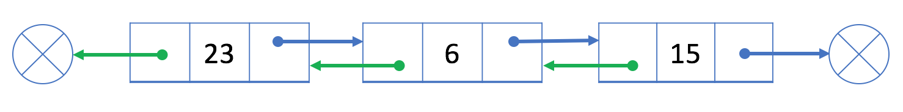
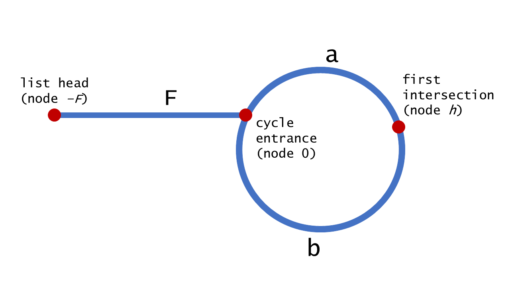
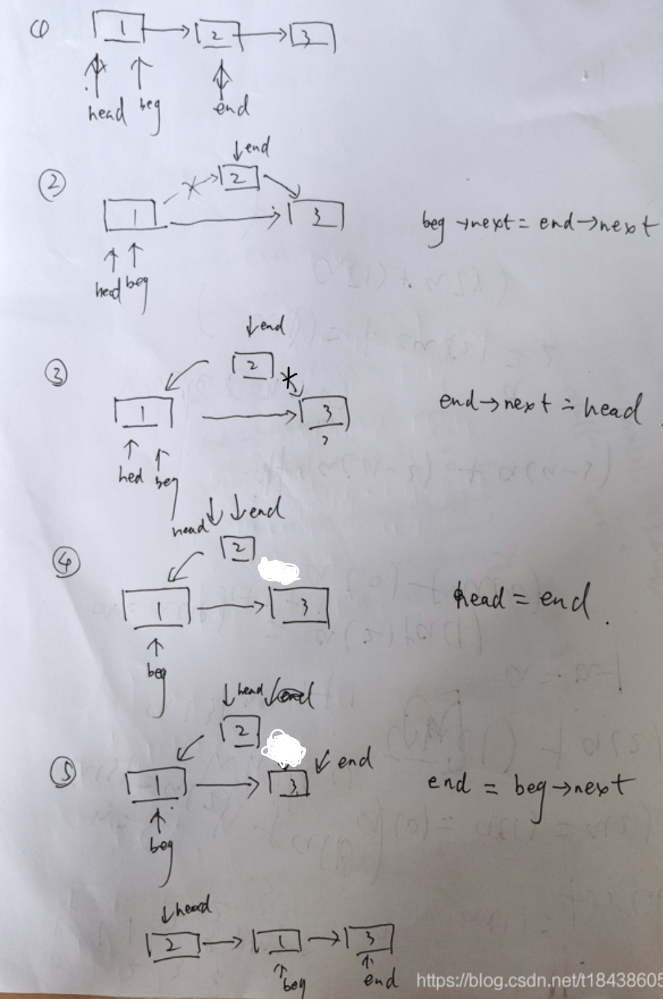
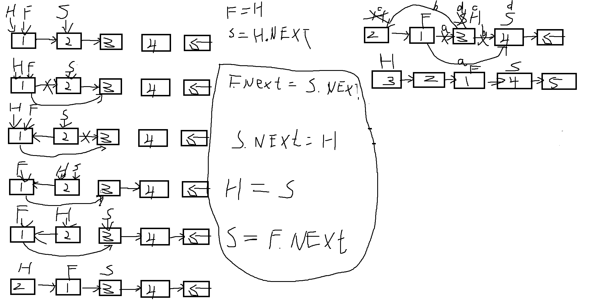
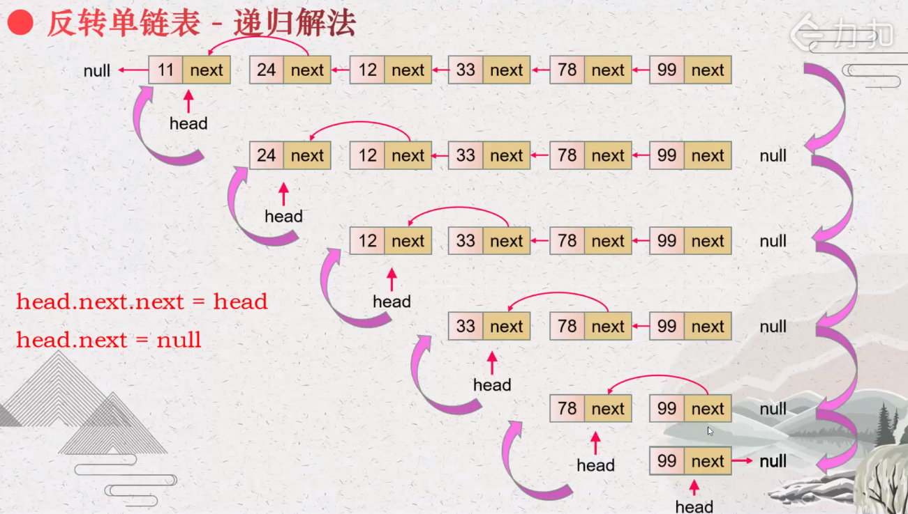
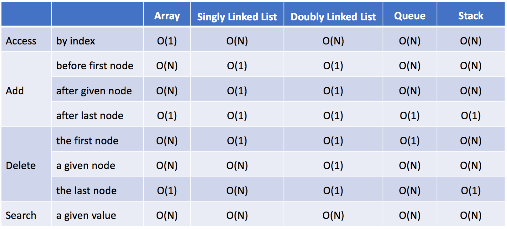

# 链表

> [探索--链表](https://leetcode-cn.com/leetbook/detail/linked-list/)

## 01 概述

与数组相似，链表也是一种线性数据结构。这里有一个例子：


正如你所看到的，链表中的每个元素实际上是一个单独的对象，而所有对象都通过每个元素中的引用字段链接在一起。

1）链表是以节点的方式来存储,是链式存储

2）每个节点包含 data 域， next 域：指向下一个节点. 

3）如图：发现链表的各个节点不一定是连续存储. 

4）链表分带头节点的链表和没有头节点的

链表有两种类型：单链表和双链表。上面给出的例子是一个单链表，这里有一个双链表的例子：




## 02 单向链表

### 简介 

单链表中的每个结点不仅包含值，还包	含链接到下一个结点的`引用字段`。通过这种方式，单链表将所有结点按顺序组织起来。

```java
// Definition for singly-linked list.
public class SingleyListNode {
    int val;
    SinglyListNode next;
    SinglyListNode(int x) { val = x; }
}
```

在大多数情况下，我们将使用头结点(第一个结点)来表示整个列表。


### 设计链表-单链表

单链表中的节点应该具有两个属性：val 和 next。val 是当前节点的值，next 是指向下一个节点的指针/引用。如果要使用双向链表，则还需要一个属性 prev 以指示链表中的上一个节点。假设链表中的所有节点都是 0-index 的。

在链表类中实现这些功能：

- get(index)：获取链表中第 index 个节点的值。如果索引无效，则返回-1。
- addAtHead(val)：在链表的第一个元素之前添加一个值为 val 的节点。插入后，新节点将成为链表的第一个节点。
- addAtTail(val)：将值为 val 的节点追加到链表的最后一个元素。
- addAtIndex(index,val)：在链表中的**第index**个节点**前**添加值为 val  的节点。如果 index 等于链表的长度，则该节点将附加到链的末尾。如果 index 大于链表长度，则不会插入节点。如果index小于0，则在头部插入节点。
- deleteAtIndex(index)：如果索引 index 有效，则删除链表中的第 index 个节点。


https://leetcode-cn.com/problems/design-linked-list/solution/she-ji-lian-biao-by-leetcode/

```java
public class ListNode {
  int val;
  ListNode next;
  ListNode(int x) { val = x; }
}

class MyLinkedList {
  int size;
  ListNode head;  // sentinel node as pseudo-head
  public MyLinkedList() {
    size = 0;
    head = new ListNode(0);
  }

    /**
     * Get the value of the index-th node in the linked list. If the index is invalid, return -1.
     */
    public int get(int index) {
        // if index is invalid
        if (index < 0 || index >= size) return -1;
        Node curNode = head;

        // index steps needed
        // to move from sentinel node to wanted index
        for (int i = 0; i <= index; ++i) {
            curNode = curNode.next;
        }
        return curNode.data;
    }

  /** Add a node of value val before the first element of the linked list. 
  After the insertion, the new node will be the first node of the linked list. */
  public void addAtHead(int val) {
    addAtIndex(0, val);
  }

  /** Append a node of value val to the last element of the linked list. */
  public void addAtTail(int val) {
    addAtIndex(size, val);
  }

  /** Add a node of value val before the index-th node in the linked list. 
  If index equals to the length of linked list, the node will be appended to the end of linked list. 
  If index is greater than the length, the node will not be inserted. */
  public void addAtIndex(int index, int val) {
    // If index is greater than the length, 
    // the node will not be inserted.
    if (index > size) return;

    // [so weird] If index is negative, 
    // the node will be inserted at the head of the list.
    if (index < 0) index = 0;

    ++size;
    // find predecessor of the node to be added
    ListNode pred = head;
    for(int i = 0; i < index; ++i) pred = pred.next;

    // node to be added
    ListNode toAdd = new ListNode(val);
    // insertion itself
    toAdd.next = pred.next;
    pred.next = toAdd;
  }

  /** Delete the index-th node in the linked list, if the index is valid. */
  public void deleteAtIndex(int index) {
    // if the index is invalid, do nothing
    if (index < 0 || index >= size) return;

    size--;
    // find predecessor of the node to be deleted
    ListNode pred = head;
    for(int i = 0; i < index; ++i) pred = pred.next;

    // delete pred.next 
    pred.next = pred.next.next;
  }
}
```


### 单链表面试题(新浪、百度、腾讯) 

单链表的常见面试题有如下: 

#### 1.求单链表中有效节点的个数

        //方法：获取到单链表的节点的个数(如果是带头结点的链表，需求不统计头节点)
        /**
         * @return 返回的就是有效节点的个数
         */
        public int getLength() {
            System.out.println("getLength");
            int count = 0;
            /*if(this.head.next == null) { //空链表
                return 0;
            }*/
            Node cur = this.head.next;
            while (cur != null) {
                count++;
                cur = cur.next;
            }
            return count;
        }


#### 2.查找单链表中的倒数第 k 个结点

```
    //查找单链表中的倒数第 k 个结点 【新浪面试题】
//思路
//1. 编写一个方法，接收 head 节点，同时接收一个 index
//2. index 表示是倒数第 index 个节点
//3. 先把链表从头到尾遍历，得到链表的总的长度 getLength
//4. 得到 size 后，我们从链表的第一个开始遍历 (size-index)个，就可以得到
//5. 如果找到了，则返回该节点，否则返回 nulll
    public Node findLastIndexNode(int index) {
        if (index <= 0 || index > size) {
            return null;
        }
        Node curNode = this.head;

        for (int i = 0; i <= size - index; ++i){
            curNode = curNode.next;
        }
        return curNode;
    }
```


## 03 双链表

语言：java

思路：就单纯的设计链表。需要注意的就是题目给的注解信息

代码（6ms，99.95%）：

```java
class MyLinkedList {

  public class ListNode {
    ListNode prev;
    ListNode next;
    int val;

    public ListNode(int val) {
      this.val = val;
    }
  }

  private ListNode head,tail;  // 头指针、尾指针--单纯指针，不存数据
  private int size = 0;

  /**
     * Initialize your data structure here.
     */
  public MyLinkedList() {
    size = 0;
    head = new ListNode(-1);
    tail = new ListNode(-1);
    head.next = tail;
    tail.pre = head;
  }

  /**
     * Get the value of the index-th node in the linked list. If the index is invalid, return -1.
     */
  public int get(int index) {
    if (index < 0 || index >= size) {
      return -1;
    }
    ListNode cur = head.next;
    while (index-->0) {
      cur = cur.next;
    }
    return cur.val;
  }

  /**
     * Add a node of value val before the first element of the linked list. After the insertion, the new node will be the first node of the linked list.
     */
  public void addAtHead(int val) {
    ++size;
    ListNode newNode = new ListNode(val);
    newNode.next = head.next;
    newNode.pre = head;
    head.next.pre = newNode;
    head.next = newNode;
  }

  /**
     * Append a node of value val to the last element of the linked list.
     */
  public void addAtTail(int val) {
    ++size;
    ListNode newNode = new ListNode(val);
    newNode.pre = tail.pre;
    newNode.next = tail;
    tail.pre.next = newNode;
    tail.pre = newNode;
  }

  /**
     * Add a node of value val before the index-th node in the linked list. If index equals to the length of linked list, the node will be appended to the end of linked list. If index is greater than the length, the node will not be inserted.
     */
  public void addAtIndex(int index, int val) {
    if(index<0||index>size){
      return;
    }
      ListNode cur = head; //找到插入位置节点的前一个节点
      for (int i = 0; i < index; i++) {
          cur = cur.next;
          if (cur == null) return;
      }
      ListNode newNode = new ListNode(val);
      newNode.next = cur.next;
      newNode.prev = cur;
      cur.next.prev = newNode;
      cur.next = newNode;
      size++;
  }

  /**
     * Delete the index-th node in the linked list, if the index is valid.
     */
  public void deleteAtIndex(int index) {
      if (index < 0 || index >= size) return;
      ListNode cur = head, next; //next是要删除的节点，cur是要删除节点的前一个节点
      for (int i = 0; i < index; i++) {
          cur = cur.next;
          if (cur == null) return;
      }
      next = cur.next;
      cur.next = next.next;
      next.next.prev = cur;
      next = null;
      size--;
  }
}

/**
 * Your MyLinkedList object will be instantiated and called as such:
 * MyLinkedList obj = new MyLinkedList();
 * int param_1 = obj.get(index);
 * obj.addAtHead(val);
 * obj.addAtTail(val);
 * obj.addAtIndex(index,val);
 * obj.deleteAtIndex(index);
 */
```

参考代码1（9ms，99.34%）：

```java

public class ListNode {

  int val;
  ListNode next;
  ListNode prev;

  ListNode(int x) {
    val = x;
  }
}

class MyLinkedList {

  int size;
  // sentinel nodes as pseudo-head and pseudo-tail
  ListNode head, tail;

  public MyLinkedList() {
    size = 0;
    head = new ListNode(0);
    tail = new ListNode(0);
    head.next = tail;
    tail.prev = head;
  }

  /**
     * Get the value of the index-th node in the linked list. If the index is invalid, return -1.
     */
  public int get(int index) {
    // if index is invalid
    if (index < 0 || index >= size) {
      return -1;
    }

    // choose the fastest way: to move from the head
    // or to move from the tail
    ListNode curr = head;
    if (index + 1 < size - index) {
      for (int i = 0; i < index + 1; ++i) {
        curr = curr.next;
      }
    } else {
      curr = tail;
      for (int i = 0; i < size - index; ++i) {
        curr = curr.prev;
      }
    }

    return curr.val;
  }

  /**
     * Add a node of value val before the first element of the linked list. After the insertion, the
     * new node will be the first node of the linked list.
     */
  public void addAtHead(int val) {
    ListNode pred = head, succ = head.next;

    ++size;
    ListNode toAdd = new ListNode(val);
    toAdd.prev = pred;
    toAdd.next = succ;
    pred.next = toAdd;
    succ.prev = toAdd;
  }

  /**
     * Append a node of value val to the last element of the linked list.
     */
  public void addAtTail(int val) {
    ListNode succ = tail, pred = tail.prev;

    ++size;
    ListNode toAdd = new ListNode(val);
    toAdd.prev = pred;
    toAdd.next = succ;
    pred.next = toAdd;
    succ.prev = toAdd;
  }

  /**
     * Add a node of value val before the index-th node in the linked list. If index equals to the
     * length of linked list, the node will be appended to the end of linked list. If index is
     * greater than the length, the node will not be inserted.
     */
  public void addAtIndex(int index, int val) {
    // If index is greater than the length,
    // the node will not be inserted.
    if (index > size) {
      return;
    }

    // [so weird] If index is negative,
    // the node will be inserted at the head of the list.
    if (index < 0) {
      index = 0;
    }

    // find predecessor and successor of the node to be added
    ListNode pred, succ;
    if (index < size - index) {
      pred = head;
      for (int i = 0; i < index; ++i) {
        pred = pred.next;
      }
      succ = pred.next;
    } else {
      succ = tail;
      for (int i = 0; i < size - index; ++i) {
        succ = succ.prev;
      }
      pred = succ.prev;
    }

    // insertion itself
    ++size;
    ListNode toAdd = new ListNode(val);
    toAdd.prev = pred;
    toAdd.next = succ;
    pred.next = toAdd;
    succ.prev = toAdd;
  }

  /**
     * Delete the index-th node in the linked list, if the index is valid.
     */
  public void deleteAtIndex(int index) {
    // if the index is invalid, do nothing
    if (index < 0 || index >= size) {
      return;
    }

    // find predecessor and successor of the node to be deleted
    ListNode pred, succ;
    if (index < size - index) {
      pred = head;
      for (int i = 0; i < index; ++i) {
        pred = pred.next;
      }
      succ = pred.next.next;
    } else {
      succ = tail;
      for (int i = 0; i < size - index - 1; ++i) {
        succ = succ.prev;
      }
      pred = succ.prev.prev;
    }

    // delete pred.next
    --size;
    pred.next = succ;
    succ.prev = pred;
  }
}
```

## 04 双指针技巧

### 环形链表

语言：java

思路：快慢指针寻找环。如果有环，快慢指针一定会相遇。需要注意的就是指针判断null。

代码（0ms，100%）：

```java
public class Solution {
    public boolean hasCycle(ListNode head) {
        if (head == null) return false;
        ListNode slow = head, fast = head;

        while (fast != null && fast.next != null) {
            slow = slow.next;
            fast = fast.next.next;
            if (slow == fast) {
                return true;
            }
        }
        slow = null;
        fast = null;
        head.next = null;
        System.gc();
        return false;
    }
}


    public boolean hasCycle(ListNode head) {
        // Initialize slow & fast pointers
        ListNode slow = head;
        ListNode fast = head;
        /**
         * Change this condition to fit specific problem.
         * Attention: remember to avoid null-pointer error
         **/
        while (slow != null && fast != null && fast.next != null) {
            slow = slow.next;           // move slow pointer one step each time
            fast = fast.next.next;      // move fast pointer two steps each time
            if (slow == fast) {         // change this condition to fit specific problem
                return true;
            }
        }
        return false;   // change return value to fit specific problem
    }
```

### 环形链表 II

语言：java

思路：在环形链表的基础上找成环位置。（快慢指针，快的走慢的2倍路程，找到相遇点。相遇点慢指针继续往前，再来个指针从头开始走，下次相遇就是成环位置）

> [环形链表II](https://blog.csdn.net/zhaohong_bo/article/details/91595336) <== 数学证明

假设路线拆分成3段：成环点之前（a），进入环后且最后相遇的位置（b），相遇位置再往下走直到回到成环点的位置（c）；



由于快慢指针速度是2:1，那么快指针走的路程是慢指针的2倍，得出公式：

2*distance(slow) = distance(fast)

2 * (F+a) = F+a+b+a

2F+2a = F+2a+b

F = b

因为 F=b，指针从 h 点出发和从链表的头出发，最后会遍历相同数目的节点后在环的入口处相遇。

代码（1ms，38.00%）：

```java
public class Solution {
    public ListNode detectCycle(ListNode head) {
        if (head == null || head.next == null) return null;
        ListNode slow = head, fast = head;

        //初始标志-无环
        while (fast != null) {
            if (fast.next == null) {
                return null;
            }
            slow = slow.next;
            fast = fast.next.next;
            // 有环-相遇
            if (slow == fast) {
                break;
            }
        }
        //无环
        if (fast == null) {
            return null;
        }
        //有环
        ListNode start = head;
        while (start != slow) {
            start = start.next;
            slow = slow.next;
        }
        return start;
    }
}
```

代码2（0ms）：这个更加简洁。思路是一样的

```java
public class Solution {
  public ListNode detectCycle(ListNode head) {
    ListNode fast = head;
    ListNode slow = head;
    while (true) {
      //如果快指针走到头了
      if (fast == null || fast.next == null) {
        return null;
      }
      fast = fast.next.next;
      slow = slow.next;
      if (fast == slow) {
        //两个点相遇，得到快慢指针相差的距离
        break;
      }
    }
    fast = head;
    while (fast != slow) {
      slow = slow.next;
      fast = fast.next;
    }
    return fast;
  }
}
```

### 相交链表

语言：java

思路：用指针a和b分别遍历headA和headB。当a第一次为null时，让它从headB重新走，而b则是为null时从headA重新走。

这样a和b肯定走的总路程是一样的，如果相交，那么必定在总路程内走到相交点。

推导：headA的链表拆成2段（相交点之前A1，相交点之后A2）；headB同理（B1，B2），其中A2 = B2。

A1+A2+B1 = B1+B2+A1 ===> A2 = B2 (原本相交后的部分就是等长的)

代码（2ms，28.31%）：

```java
    /*
    相等的时候，跳出循环，返回相交点。
    如果不相交，就会在两个指针都是空的时候，跳出循环，返回空。
     */
public class Solution {
    public ListNode getIntersectionNode(ListNode headA, ListNode headB) {
        ListNode a = headA, b = headB;
        if (a == null || b == null) return  null;
        while (a != b) {
            if(a != null) {
                a = a.next;
            }else {
                a = headB;
            }
            if (b != null) {
                b = b.next;
            }else{
                b = headA;
            }
        }
        return a;
    }
}
```

参考代码1（1ms，99.983%）：这个更加简洁。

```java
public class Solution {
  public ListNode getIntersectionNode(ListNode headA, ListNode headB) {
    ListNode h1 = headA;
    ListNode h2 = headB;
    while (h1 != h2) {
      h1 = h1 == null ? headB : h1.next;
      h2 = h2 == null ? headA : h2.next;
    }
    return h1;
  }
}
```

### 删除链表的倒数第N个节点

语言：java

思路：题目要求只用1趟扫描。常规思路就是先遍历一次获取长度，然后计算要删除的节点。

这里为了一趟，可以这样考虑。如果10个，删除倒数第3个，那么先让某个指针走3步，之后在来个指针从头走，两个指针走前面的为null时，后面这个晚来的指针正好就是倒数第3个。

代码（1ms，21.43%）：

```java
class Solution {
  public ListNode removeNthFromEnd(ListNode head, int n) {
    ListNode fast = head,cur = head,pre = head;
    while(n-->0){
      fast = fast.next;
    }
    while(fast!=null){
      pre = cur;
      fast = fast.next;
      cur = cur.next;
    }
    // 需要小心的就是头节点删除的情况
    if(cur==head){
      return head.next;
    }
    pre.next = cur.next;
    return head;
  }
}
```

参考代码1（0ms）：借用一个新节点，就不需要特殊考虑头节点的删除了。

```java
public ListNode removeNthFromEnd(ListNode head, int n) {
  ListNode dummy = new ListNode(0);
  dummy.next = head;
  ListNode first = dummy;
  ListNode second = dummy;
  //Advances first pointer so that the gap between first and second is n nodes apart
  for(int i=1;i<=n+1;i++){
    first = first.next;
  }
  // Move first to the end,maintaining the gap
  while (first!=null){
    first = first.next;
    second = second.next;
  }
  second.next = second.next.next;
  return dummy.next;
}
```

## 05 经典问题

### 反转链表

对于有头节点的链表反转：

- 使用迭代反转法实现时，初始状态忽略头节点（直接将 mid 指向首元节点），仅需在最后一步将头节点的 next 改为和 mid 同向即可；
- 使用头插法或者就地逆置法实现时，仅需将要插入的节点插入到头节点和首元节点之间即可；
- 递归法并不适用反转有头结点的链表（但并非不能实现），该方法更适用于反转无头结点的链表。

语言：java

学习贴：//https://blog.csdn.net/qq_43605381/article/details/108698890


#### 思路1：头节点插入法

指在原有链表的基础上，依次将位于链表头部的节点摘下，然后采用从头部插入的方式生成一个新链表，则此链表即为原链表的反转版。

代码：

```java
public ListNode reverseList(ListNode head) {
    //如果当前链表为空，或者只有一个节点，无需反转，直接返回
    if (head == null || head.next == null) {
        return head;
    }
    //定义一个辅助的指针(变量)，帮助我们遍历原来的链表
    ListNode curNode = head;
    ListNode nextNode;// 指向当前节点[cur]的下一个节点
    ListNode reverseHead = new ListNode(0);
    //遍历原来的链表，每遍历一个节点，就将其取出，并放在新的链表reverseHead 的最前端
    while (curNode != null) {
        nextNode = curNode.next;//先暂时保存当前节点的下一个节点，因为后面需要使用
        curNode.next = tempHeadNode.next;//将cur的下一个节点指向新的链表的最前端
        tempHeadNode.next = curNode; //将cur 连接到新的链表上
        curNode = nextNode;//让cur后移
    }
    //将head 指向 reverseHead.next , 实现单链表的反转
    head = reverseHead.next;
    return head;
}
```


#### 思路2：就地逆置法

就地逆置法和头插法的实现思想类似，唯一的区别在于，头插法是通过建立一个新链表实现的，而就地逆置法则是直接对原链表做修改，从而实现将原链表反转。





值得一提的是，在原链表的基础上做修改，需要额外借助 2 个指针（假设分别为 first 和 end）。仍以图 1 所示的链表为例，接下来用就地逆置法实现对该链表的反转：

代码：


```java
public void reverseList2() {
    if(this.head.next == null || this.head.next.next == null) {
        return;
    }
    //初始状态下，令 firstNode 指向第一个节点，endNode 指向 firstNode->next
    ListNode firstNode = this.head.next;
    ListNode endNode = this.head.next.next;
    while ( endNode != null) {
        firstNode.next = endNode.next;
        endNode.next = this.head.next;
        this.head.next = endNode;    //将 endNode 所指节点 从链表上摘除，然后再添加至当前链表的头部。
        endNode = firstNode.next;   //将 endNode 指向 firstNode->next，然后将 endNode 所指节点 从链表摘除，再添加到当前链表的头部
    }
}

public ListNode reverseList(ListNode head) {
    if(head == null || head.next == null) {
        return head;
    }
    //初始状态下，令 firstNode 指向第一个节点，endNode 指向 firstNode->next
    ListNode firstNode = head;
    ListNode endNode = head.next;
    while ( endNode != null) {
        firstNode.next = endNode.next;
        endNode.next = head;
        head = endNode;    //将 endNode 所指节点 从链表上摘除，然后再添加至当前链表的头部。
        endNode = firstNode.next;   //将 endNode 指向 firstNode->next，然后将 endNode 所指节点 从链表摘除，再添加到当前链表的头部
    }
    return head;
}
```


#### 思路3：递归

和迭代反转法的思想恰好相反，递归反转法的实现思想是从链表的尾节点开始，依次向前遍历，遍历过程依次改变各节点的指向，即另其指向前一个节点。

代码2（0ms）：DFS。这里next直接就是最后一个非null的节点了。真正执行反转的是在回调函数的过程。 

先从推出条件出发那一层开始往上递归，即99节点



```java
//单链表反转-递归
public void reverseList3() {
    this.head.next = doReverseList3(this.head.next);
}
public Node doReverseList3(Node head) { //这里的head节点不是用来指表头的那个节点，实际链表有数据的第一个节点
    // 递归终止条件
    if(head == null || head.next ==null) {// 空链或只有一个结点，直接返回头指针
        return head;
    }
    //一直递归，找到链表中最后一个节点
    Node new_head = doReverseList3(head.next);// 每次递归后的链表的表头节点
    //当逐层退出时，new_head 的指向都不变，一直指向原链表中最后一个节点；
    //递归每退出一层，函数中 head 指针的指向都会发生改变，都指向上一个节点。
    
    //每退出一层，说明当前节点，后面的节点都已经完成了，反转，此时就要反转当前的这个节点
    //每退出一层，都需要改变 head->next 节点指针域的指向，同时令 head 所指节点的指针域为 NULL。
    head.next.next = head;  //这一步就是反转指向的操作
    head.next = null;
    //将 new_head 的指向继续作为函数的返回值，传给上一层的 new_head
    //每一层递归结束，都要将新的头指针返回给上一层。由此，即可保证整个递归过程中，能够一直找得到新链表的表头。
    return new_head;
}
```


#### 思路4：迭代反转法

该算法的实现思想非常直接，就是从当前链表的首元节点开始，一直遍历至链表的最后一个节点，这期间会逐个改变所遍历到的节点的指针域，另其指向前一个节点。

三指针，pre、cur、next（上一个，当前，下一个）

```c++
//迭代反转法，head 为无头节点链表的头指针
link * iteration_reverse(link* head) {
    if (head == NULL || head->next == NULL) {
        return head;
    }
    else {
        link * beg = NULL;
        link * mid = head;
        link * end = head->next;
        //一直遍历
        while (1)
        {
            //修改 mid 所指节点的指向
            mid->next = beg;
            //此时判断 end 是否为 NULL，如果成立则退出循环
            if (end == NULL) {
                break;
            }
            //整体向后移动 3 个指针
            beg = mid;
            mid = end;
            end = end->next;
        }
        //最后修改 head 头指针的指向
        head = mid;
        return head;
    }
}
```


### 移除链表元素

语言：java

https://www.cnblogs.com/loliconsk/p/14296500.html

移除链表元素只需要把指向下一个节点的值改变就可以删除元素，

一般在链表前面加一个伪头会更方便计算，

所以需要新定义一个节点指针去指向头head,分别用pre 和 cur来判断是否是要删除的元素，

然后改变next的值，注意不**要利用伪头或head直接去判断**，不然返回的只有最后一个节点

代码（1ms，99.52%）：

```c++
/**
 * Definition for singly-linked list.
 * public class ListNode {
 *     int val;
 *     ListNode next;
 *     ListNode() {}
 *     ListNode(int val) { this.val = val; }
 *     ListNode(int val, ListNode next) { this.val = val; this.next = next; }
 * }
 */
class Solution {
    public ListNode removeElements(ListNode head, int val) {
        if(head == null) return null;

        ListNode sentinel = new ListNode(-1);
        sentinel.next = head;
        ListNode cur = sentinel;
        while (cur.next != null) {
            if (cur.next.val == val) {
                cur.next = cur.next.next;
            } else {
                cur = cur.next;
            }
        }
        // head可能就是符合条件要删掉的节点，所以new一个新的节点
        ListNode ret = sentinel.next;
        return ret;
    }
}
```

参考代码1（0ms）：利用DFS处理删除头节点的特殊情况。

```java
    public void removeElementsDFS(int val) {
        this.head.next = doRemoveElementsDFS2(this.head.next, val);
    }
    public Node doRemoveElementsDFS2(Node head, int val) {
        // 1.求解最基本的问题的解：也就是当链表为NULL时的解
        if (head == null) {
            return null;
        }
        // 2. 更小问题的解：在【少了当前头节点】的链表中，删除值为val的节点。
        /*3. 处理【当前头节点】

        如果【当前头节点】的值满足要摆删除的条件的话，我们直接返回doRemoveElementsDFS2(head.next, val)。
        也就是【head后面的结果】完成了删除任务之后得到的结果。
        如果【当前头节点】的值不满足要摆删除的条件的话，
        也就是【当前头节点】会保留下来，那么将doRemoveElementsDFS2(head.next, val)赋给【当前头节点】的下一个节点。
        原文链接：https://blog.csdn.net/sunshine77_/article/details/103322839*/
     
        head.next = doRemoveElementsDFS3(head.next, val);
        return head.data==val? head.next: head;
    }
```

### 奇偶链表

语言：java

思路：要求空间复杂度O(1)，时间复杂度O(nodes)。这里就借用两个指针分别指向奇数位置的节点和偶数位置的节点，修改其next指针。最后再拼接两部分即可。

请注意，这里的奇数节点和偶数节点指的是节点编号的奇偶性，而不是节点的值的奇偶性。

代码（0ms，100.00%）：

```java
class Solution {
    public ListNode oddEvenList(ListNode head) {
        if (head == null || head.next == null) return head;

        ListNode odd = head;
        ListNode even = head.next;
        ListNode evenHead = even;
        while (even != null && even.next != null) {
            odd.next = even.next;
            even.next = odd.next.next;
            odd = odd.next;
            even = even.next;
        }
        odd.next = evenHead;
        return head;
    }
}
```

### 回文链表

语言：java

思路：看到题目要求O（n）时间复杂度，O（1）空间复杂度，第一反应就是找中点，翻转后半部分链表。

```java
class Solution {
    public boolean isPalindrome(ListNode head) {
        if (head == null) {
            return true;
        }
        if (head.next == null) {
            return true;
        }
        //1、利用快慢指针获得中心节点
        ListNode fast = head;
        ListNode slow = head;
        while(fast != null && fast.next != null) {
            fast = fast.next.next;
            slow = slow.next;
        }
        //2、反转
        ListNode cur = slow.next;
        while(cur != null) {
            ListNode curNext = cur.next;
            cur.next = slow;
            slow = cur;
            cur = curNext;
        }
        //3、判断data是否相同  -> 一个从前往后走，一个从后往前走 -> 直到相遇的时候
        while (head != slow) {
            if (head.val != slow.val) {
                return false;
            }
            //针对偶数节点来实现的
            if (head.next == slow) {
                return true;
            }
            head = head.next;
            slow = slow.next;
        }
        return true;
    }
}


/**
 * Definition for singly-linked list.
 * public class ListNode {
 *     int val;
 *     ListNode next;
 *     ListNode() {}
 *     ListNode(int val) { this.val = val; }
 *     ListNode(int val, ListNode next) { this.val = val; this.next = next; }
 * }
 */
class Solution {
    public boolean isPalindrome(ListNode head) {
1
}
```


## 小结

链表和其他数据结构（包括数组，队列和栈）之间时间复杂度的比较：



经过这次比较，我们不难得出结论：

如果你需要经常添加或删除结点，链表可能是一个不错的选择。

如果你需要经常按索引访问元素，数组可能是比链表更好的选择。


### 合并两个有序链表

语言：java

思路：没啥好说的，就两指针遍历两个链表，沿途比较大小。（注意是要有顺序的）

参考代码0（0ms）：

```java
class Solution {
    public Node mergeTwoLists(Node list1, Node list2) {
        if (list1 == null) return list2;
        Node newHead = new Node(-1), newCur = newHead, cur1 = list1, cur2 = list2;
        while (cur1 != null && cur2 != null) {
            if (cur1.data <= cur2.data) {
                newCur.next = cur1;
                cur1 = cur1.next;
            } else {
                newCur.next = cur2;
                cur2 = cur2.next;
            }
            newCur = newCur.next;
        }
        newCur.next = cur1 == null ? cur2 : cur1;

        return newHead.next;
    }
}
```


### 两数相加

语言：java

思路：需要注意的就是指针的跳转。

代码（2ms，99.92%）：

```java
class Solution {
  public ListNode addTwoNumbers(ListNode l1, ListNode l2) {
    if (l1 == null) {
      return l2;
    }
    ListNode head = l1, res = head;
    int carry = 0;
    while (l1 != null && l2 != null) {
      int sum = (l1.val + l2.val + carry) % 10;
      carry = (l1.val + l2.val + carry) > 9 ? 1 : 0;
      head.val = sum;
      l1 = l1.next;
      l2 = l2.next;
      if (head.next != null) {
        head = head.next;
      }
    }
    if (l1 != null) {
      while (l1 != null) {
        int sum = (l1.val + carry) % 10;
        carry = (l1.val + carry) > 9 ? 1 : 0;
        head.val = sum;
        l1 = l1.next;
        if (head.next != null) {
          head = head.next;
        }
      }
    }
    if (l2 != null) {
      head.next = l2;
      head = head.next;
      while (l2 != null) {
        int sum = (l2.val + carry) % 10;
        carry = (l2.val + carry) > 9 ? 1 : 0;
        head.val = sum;
        l2 = l2.next;
        if (head.next != null) {
          head = head.next;
        }
      }
    }
    if (carry == 1) {
      head.next = new ListNode(1);
    }
    return res;
  }
}
```

参考代码1（0ms，100%）：把所有情况放在三目运算中考虑。再者，是新建的链表，而不是在原链表上修改。

```java
public ListNode addTwoNumbers(ListNode l1, ListNode l2) {
    if (l1 == null) return l2;

    ListNode head = new ListNode(-1), curHead = head;
    int carry = 0;//进位
    while (l1 != null || l2 != null) {
        int val1 = l1 == null ? 0 : l1.val,
        val2 = l2 == null ? 0 : l2.val;
        curHead.next = new ListNode((val1 + val2 + carry) % 10);
        curHead = curHead.next;
        carry = (val1 + val2 + carry) >= 10? 1 : 0;
        l1 = l1 == null? null:l1.next;
        l2 = l2 == null? null:l2.next;
    }
    if (carry != 0) {
        curHead.next = new ListNode(carry);
    }
    return head.next;
}
```

### 扁平化多级双向链表

语言：java

#### 代码0，迭代

```java
/*
// Definition for a Node.
class Node {
    public int val;
    public Node prev;
    public Node next;
    public Node child;
};
*/

class Solution {
    public void flatten_Child(Node pre, Node child, Node next){
        pre.next = child;
        pre.child = null;
        child.prev = pre;

        Node cur = child;
        while(cur.next != null) {
            cur = cur.next;
        }
        cur.next = next;
        if(next != null) next.prev = cur;
    }

    public Node flatten(Node head) {
        Node cur = head;
        while(cur != null) {
            if (cur.child != null) {
                flatten_Child(cur, cur.child, cur.next);
            }
            cur = cur.next;
        }
        return head;
    }
}
```


#### 代码1：递归的深度优先搜索

[【宫水三叶】一题三解 :「递归（优化）」&「迭代」（附链表题目录） - 扁平化多级双向链表 - 力扣（LeetCode） (leetcode-cn.com)](https://leetcode-cn.com/problems/flatten-a-multilevel-doubly-linked-list/solution/gong-shui-san-xie-yi-ti-shuang-jie-di-gu-9wfz/)

```java
    /* return the tail of the flatten list */
    public Node flatten_Child_Dfs(Node head) {
        Node last = head;
        while (head != null) {
            if(head.child != null) {
                Node next = head.next;
                Node childLast = flatten_Child_Dfs(head.child); // 这一步包含了，把当前有child的节点和child节点互相链接起来（prev、next指针链接），也包含了child链表中如果也有child节点的处理
                head.next = head.child;
                head.child.prev = head;
                head.child = null;
                if (childLast != null) childLast.next = next;
                if(next != null) next.prev = childLast;
                last = head;
                head = childLast;
            } else {
                last = head;
                head = head.next;
            }
        }
        return last;
    }
    public Node flatten(Node head) {
        flatten_Child_Dfs(head);
        return head;
    }
```


### 复制带随机指针的链表

语言：java

[LeetCode 题解 | 138. 复制带随机指针的链表 - 知乎 (zhihu.com)](https://zhuanlan.zhihu.com/p/100388274)

#### 代码0：递归

```java
class Solution {
    HashMap<Node, Node> visitedHash = new HashMap<Node,Node>();

    public Node copyRandomList(Node head) {
        if(head == null) return null;
        if(this.visitedHash.containsKey(head)) return this.visitedHash.get(head);
        Node newNode = new Node(head.val, null, null);
        this.visitedHash.put(head, newNode);
        newNode.next = this.copyRandomList(head.next);
        newNode.random = this.copyRandomList(head.random);
        return newNode;
    }
}
```

#### 代码1：迭代

```java
    HashMap<Node, Node> visited = new HashMap<Node, Node>();

    public Node getCloneNode(Node node) {
        if (node != null) {
            if (this.visited.containsKey(node)) {
                return this.visited.get(node);
            } else {
                this.visited.put(node, new Node(node.val, null, null));
                return this.visited.get(node);
            }
        }
        return null;
    }

    public Node copyRandomList(Node head) {
        if (head == null) return null;
        Node oldNode = head;
        Node newNode = new Node(oldNode.val);
        this.visited.put(oldNode, newNode);
        while (oldNode != null) {
            newNode.random = this.getCloneNode(oldNode.random);
            newNode.next = this.getCloneNode(oldNode.next);

            oldNode = oldNode.next;
            newNode = newNode.next;
        }
        return this.visited.get(head);
    }
```

### 旋转链表

语言：java

一个指针就够了，原理是先遍历整个链表获得链表长度n，然后此时把链表头和尾链接起来，再往后走n - k % n个节点就到达新链表的头结点前一个点，这时断开链表即可。

```java
public ListNode rotateRight(ListNode head, int k) {
    if (head == null || head.next == null) return head;
    int n = 1;
    ListNode cur = head;
    while (cur.next != null) {
        cur = cur.next;
        n++;
    }
    cur.next = head;
    int m = n - k % n;
    for (int i = 0; i < m; i++) {
        cur = cur.next;
    }
    ListNode newHead = cur.next;
    cur.next = null;
    return newHead;
}
```


