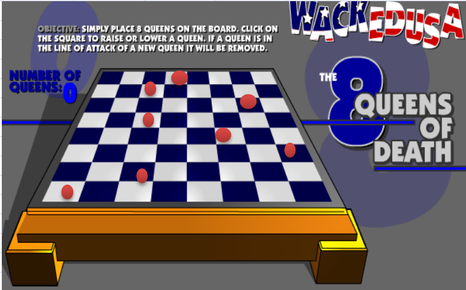

# 递归

> [探索--递归](https://leetcode-cn.com/leetbook/detail/recursion/)

## 01 概述

## 02 递归原理

### 1反转字符串

语言：java

思路：DFS

代码（2ms，14.57%）：

```java
class Solution {
  public void reverseString(char[] s) {
    if(s.length>1){
      dfs(s,0);
    }
  }

  public void dfs(char[] arrs, int index){
    char tmp = arrs[index];
    int another = arrs.length-1-index;
    arrs[index] = arrs[another];
    arrs[another] = tmp;
    if(index==arrs.length/2-1){ //偶数正好到前一半的最后一个下标，如果是奇数最中间的不用进行交换
      return;
    }else{
      dfs(arrs, index+1);
    }
  }
}
```

### 2两两交换链表中的节点

语言：java

思路：DFS，这里需要注意的是，对掉后，原本head的next应该是“假设已经递归对掉完了的链表”，而不是单纯的下标2的第三个节点。

代码（0ms）：

```java
class Solution {
  public ListNode swapPairs(ListNode head) {
    if(head==null||head.next==null){
      return head;
    }
    ListNode next = head.next;
    head.next = swapPairs(next.next);
    next.next = head;
    return next;
  }
}
```


### 3迷宫问题

[迷宫问题的求解(回溯法、深度优先遍历、广度优先遍历) - 随性如风 - 博客园 (cnblogs.com)](https://www.cnblogs.com/wanghang-learning/p/9430672.html)

#### 代码1：回溯-递归

```java
    /**
     * @param map 表示地图
     * @param i   从哪个位置开始找
     * @param j
     * @return 如果找到通路，就返回true, 否则返回false
     */
    public static boolean setWay(int[][] map, int i, int j) {
        if (map[6][5] == 2) { // 通路已经找到ok
            return true;
        } else {
            if (map[i][j] == 0) { //如果当前这个点还没有走过
                //按照策略 下->右->上->左  走
                map[i][j] = 2; // 假定该点是可以走通.
                if (setWay(map, i + 1, j)) {//向下走
                    return true;
                } else if (setWay(map, i, j + 1)) { //向右走
                    return true;
                } else if (setWay(map, i - 1, j)) { //向上
                    return true;
                } else if (setWay(map, i, j - 1)) { // 向左走
                    return true;
                } else {
                    //说明该点是走不通，是死路
                    map[i][j] = 3;
                    return false;
                }
            } else { // 如果map[i][j] != 0 , 可能是 1， 2， 3
                return false;
            }
        }
    }
```

#### 代码02：回溯-栈

```java
private Stack<Block> stack = new Stack<Block>();  //回溯法存储路径的栈

public void findPath1(){
        Block b = new Block(startX,startY);
        stack.push(b);                                //起点进栈  
        while(!stack.empty()){                        //栈空代表所有路径已走完，没有找到通路
            Block t = stack.peek();
            
            int x = t.getX();                         //获取栈顶元素的x
            int y = t.getY();                         //获取栈顶元素的y
            int dir = t.getDir();                     //获取栈顶元素的下一步方向
            
            map[x][y] = 1;                            //把地图上对应的位置标记为1表示是当前路径上的位置，防止往回走
            
            if(t.getX() == endX && t.getY() == endY) {//已达终点
                return ;
            }                     
            
            switch(dir){
                case 1:                                     //向上走一步                           
                    if(x - 1 >= 0 && map[x - 1][y] == 0){   //判断向上走一步是否出界&&判断向上走一步的那个位置是否可达
                        stack.push(new Block(x - 1 , y));   //记录该位置
                    }
                    t.changeDir();                          //改变方向，当前方向已走过
                    continue;                               //进入下一轮循环
                case 2:
                    if(y + 1 <= mapY && map[x][y+1] == 0){
                        stack.push(new Block(x , y + 1));
                    }
                    t.changeDir();
                    continue;
                case 3:
                    if(x + 1 <= mapX && map[x+1][y] == 0){
                        stack.push(new Block(x + 1 , y));
                    }
                    t.changeDir();
                    continue;
                case 4:
                    if(y - 1 >= 0 && map[x][y - 1] == 0){
                        stack.push(new Block(x , y - 1));
                    }
                    t.changeDir();
                    continue;
            }
            t = stack.pop();                                    //dir > 4 当前Block节点已经没有方向可走,出栈
            map[t.getX()][t.getY()] = 0;                        //出栈元素对应的位置已经不再当前路径上，表示可达
            
        }
    }

//打印栈
    public void printStack(){
        int count = 1;        while(!stack.empty()){            Block b = stack.pop();            System.out.print("(" + b.getX() + "," + b.getY() + ") ");            if(count % 10 == 0)                System.out.println("");            count++;        }
    }
```


#### 代码03：BFS

```java
    private WideBlock wb;                             //广度遍历的终点节点

    /*
        广度优先遍历
    */
    public void findPath4(){
        wideFirst();
    }
    
    public void wideFirst(){
        WideBlock start = new WideBlock(startX , startY , null);
        Queue<WideBlock> q = new LinkedList<WideBlock>();  
        map[startX][startY] = 1;                       
        q.offer(start);
        while(q.peek() != null){
            WideBlock b = q.poll();
            int x = b.getX();
            int y = b.getY();
            if(x == endX && y == endY){                 //判断当前节点是否已达终点
                wb = b;
                return;
            }
            if (x - 1 >= 0 && map[x - 1][y] == 0) {     //判断当前节点的能否向上走一步，如果能，则将下一步节点加入队列
                q.offer(new WideBlock(x - 1 , y , b));  //子节点入队
                map[x - 1][y] = 1;                      //标记已访问
            }
            if (y + 1 <= mapY && map[x][y + 1] == 0) {  //判断当前节点能否向右走一步
                q.offer(new WideBlock(x , y + 1 , b));
                map[x][y + 1] = 1;
            }
            if (x + 1 <= mapX && map[x + 1][y] == 0) {
                q.offer(new WideBlock(x + 1 , y , b));
                map[x + 1][y] = 1;
            }
            if (y - 1 >= 0 && map[x][y - 1] == 0) {
                q.offer(new WideBlock(x , y - 1 , b));
                map[x][y -1] = 1;
            }
        }
    }
```

### 4八皇后问题



题解：

1) 第一个皇后先放第一行第一列
2) 第二个皇后放在第二行第一列、然后判断是否OK[即判断是冲突]， 如果不OK，继续放在第二列、第三列、依次把所有列都放完，找到一个合适
3) 继续第三个皇后，还是第一列、第二列……直到第8个皇后也能放在一个不冲突的位置，算是找到了一个正确解
4) 当得到一个正确解时，在栈回退到上一个栈时，就会开始回溯，即将第一个皇后，放到第一列的所有正确解，全部得到.

5) 然后回头继续第一个皇后放第二列，后面继续循环执行 1,2,3,4的步骤 


 说明： 

理论上应该创建一个二维数组来表示棋盘，但是实际上可以通过算法，用一个一维数组即可解决问题. arr[8] = {0 , 4, 7, 5, 2, 6, 1, 3} //对应 arr 下标 表示第几行，即第几个皇后，arr[i] = val , val 表示第 i+1 个皇后，放在第 i+1 行的第 val+1 列

代码0：LeetCode-回溯-递归


```java
class Solution {
    public List<List<String>> solveNQueens(int n) {
        List<List<String>> result = new ArrayList<>();
        int size = n;
        int[] array = new int[size];
        check(0, size, result, array);
        return result;
    }

    private void check(int n, int size,List<List<String>> result,int[] array) {
        if (n == size) {
            List<String> board = new ArrayList<String>();
            for (int i = 0; i < size; i++) {
                char[] row = new char[n];
                Arrays.fill(row, '.');
                row[array[i]] = 'Q';
                board.add(new String(row));
            }
            result.add(board);
            return;
        }
        for (int i = 0; i < size; i++) {
            array[n] = i;
            if (judge(n,array)) {
                check(n+1, size, result,array);
            }
        }
    }

    private boolean judge(int n,int[] array) {
        for (int i = 0; i < n; i++) {
            if (array[i] == array[n] || Math.abs(n - i) == Math.abs(array[n] - array[i])) {
                return false;
            }
        }
        return true;
    }
}
```

