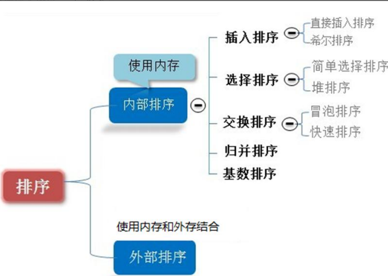
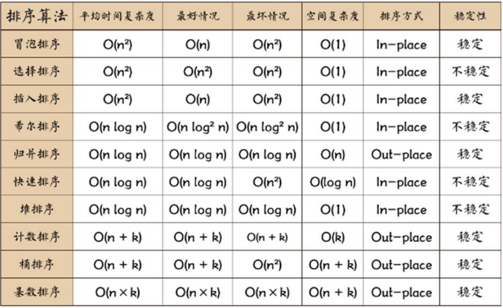
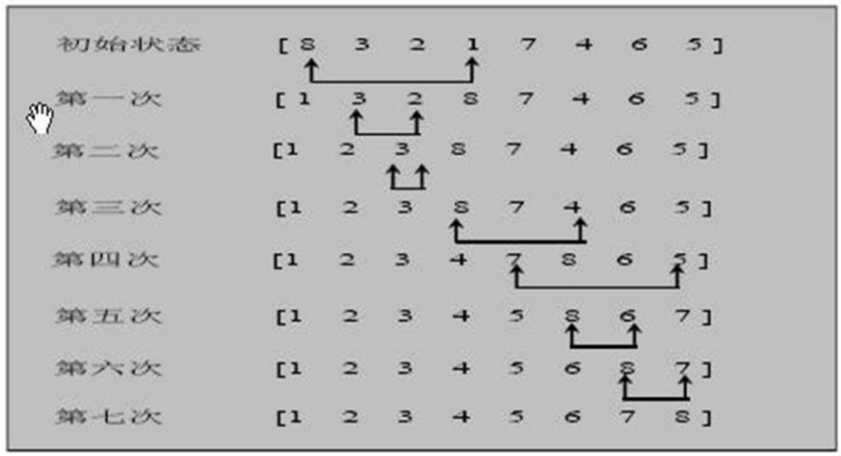
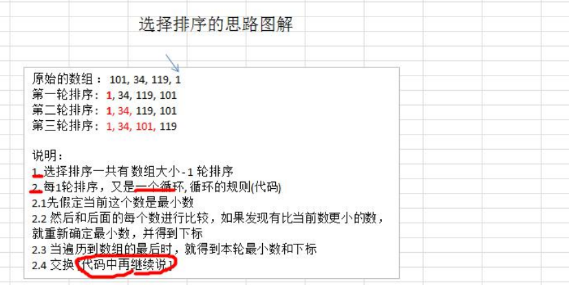
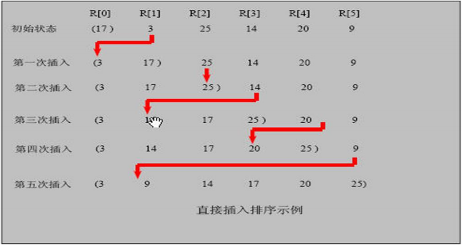
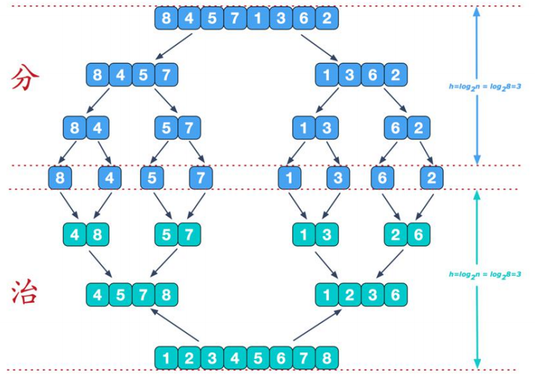
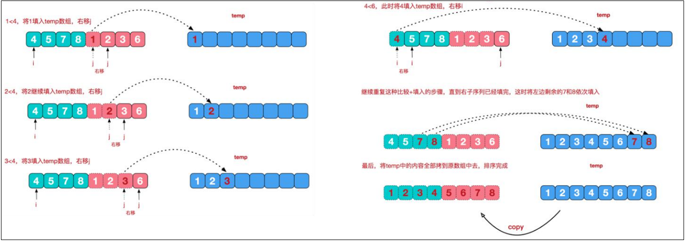
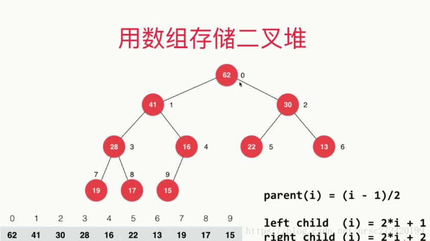

# 排序


## 01 概述

### 排序算法的介绍 

排序也称排序算法(Sort Algorithm)，排序是将**一组数据**，依**指定的顺序**进行**排列的过程**。


### 排序的分类： 

1) 内部排序: 

指将需要处理的所有数据都加载到**内部存储器(内存)**中进行排序。 

2) 外部排序法： 

**数据量过大**，无法全部加载到内存中，需要借助**外部存储(文件等)**进行排序。 

3) 常见的排序算法分类(见右图): 




## 02平均时间复杂度和最坏时间复杂度 

1、稳定性

　　①冒泡排序

　　　　比较是两个相邻的元素比较，交换是两个相邻的元素交换。所以如果两个元素相等，就不用无聊地去交换吧，这样也能减少交换次数。所以冒泡排序是稳定的。

　　②选择排序

　　　　选择排序是每次给第一个位置选第一小的，给第二个位置选第二小的，以此类推.....。所以说两个相等的元素可能因为选择第一个小的就会被打乱顺序。例如5 8 5 2，这四个元素选第一小的2的时候会把5放入放入2的原位置，导致两个5相对顺序变化，所以不稳定。

　　③插入排序

　　　　插入排序是在已经有序的小序列的基础上排序的。排序的规则是：有序小序列后的第一个元素和有序中的最大的比，比他大的直接插入其后，比他小的往前找。相等的话直接插入该元素之后。所以插入排序是稳定的。

　　④快速排序

　　　　快速排序有两个方向，左边的i下标一直往右走，右边的j下标一直往左走。i<=j 交换A[i]和A[j]，如果i>j，交换A[j]和枢轴元素，完成一趟快排。不稳定。

　　⑤归并排序

　　　　归并排序是把序列递归地分成短序列，递归出口是短序列只有1个元素(认为直接有序)或者2个序列(1次比较和交换),然后把各个有序的短序列合并成一个有序的长序列，不断合并直到原序列全部排好序。可以发现，在1个或2个元素时，1个元素不会交换，2个元素如果大小相等也没有人故意交换，这不会破坏稳定 性。那么，在短的有序序列合并的过程中，稳定是是否受到破坏？没有，合并过程中我们可以保证如果两个当前元素相等时，我们把处在前面的序列的元素保存在结 果序列的前面，这样就保证了稳定性。所以，归并排序也是稳定的排序算法。

　　⑥基数排序

　　　　稳定。

　　⑦希尔排序

　　　　不稳定。有自己的步长。

　　⑨堆排序

　　　　不稳定。



### 相关术语解释： 

1) 稳定：如果 a 原本在 b 前面，而 a=b，排序之后 a 仍然在 b 的前面； 

2) 不稳定：如果 a 原本在 b 的前面，而 a=b，排序之后 a 可能会出现在 b 的后面； 

3) 内排序：所有排序操作都在内存中完成； 

4) 外排序：由于数据太大，因此把数据放在磁盘中，而排序通过磁盘和内存的数据传输才能进行； 

5) 时间复杂度： 一个算法执行所耗费的时间。 

6) 空间复杂度：运行完一个程序所需内存的大小。 

7) n: 数据规模 

8) k: “桶”的个数 

9) In-place: 不占用额外内存 

10) Out-place: 占用额外内存


## 03 排序算法

### 01冒泡排序-稳定O(n²)

#### 基本介绍 

冒泡排序（Bubble Sorting）的基本思想是：通过对待排序序列从前向后（从下标较小的元素开始）,**依次比较相邻元素的值，若发现逆序则交换**，使值较大的元素逐渐从前移向后部，就象水底下的气泡一样逐渐向上冒。

#### 优化：

因为排序的过程中，各元素不断接近自己的位置，**如果一趟比较下来没有进行过交换，就说明序列有序**，因此要在 

排序过程中设置一个标志 flag 判断元素是否进行过交换。从而减少不必要的比较。

#### 代码：-低到高

```java
// 冒泡排序 的时间复杂度 O(n^2)
public static void bubbleSort_test(int[] arr) {
   int len = arr.length;
   int tmp;
   // 标识变量，表示是否进行过交换
   boolean flag = false;
   for (int i = 0; i < len - 1; i++) {
      for (int j = 0; j < len - 1; j++) {
         // 如果前面的数比后面的数大，则交换
         if (arr[j] > arr[j + 1]) {
            tmp = arr[j];
            arr[j] = arr[j + 1];
            arr[j + 1] = tmp;
            flag = true;
         }
      }
      if (flag) {       // 发生过交换
         flag = false;  // 重置 flag!!!, 进行下次判断
      }else {             // 没发生过交换，说明已经排好序了
         break;
      }
   }

}
```


### 02简单选择排序-不稳定O(n²)

#### 基本介绍 

选择式排序也属于内部排序法，是从欲排序的数据中，按指定的规则选出某一元素，再依规定交换位置后达到排序的目的

#### 简单选择排序思想

​		简单选择排序（select sorting）也是一种简单的排序方法。

​		它的基本思想是：

​				第一次从 arr[0]~arr[n-1]中选取最小值， 与 arr[0]交换，

​				第二次从 arr[1]~arr[n-1]中选取最小值，与 arr[1]交换，

​				第三次从 arr[2]~arr[n-1]中选取最小值，与 arr[2] 交换，

​				…，

​				第 i 次从 arr[i-1]~arr[n-1]中选取最小值，与 arr[i-1]交换，

​				…,

​				第 n-1 次从 arr[n-2]~arr[n-1]中选取最小值， 与 arr[n-2]交换，

​		总共通过 n-1 次，得到一个按排序码从小到大排列的有序序列。 

#### 简单选择排序思路分析图:






#### 代码：

```java
//选择排序
public static void selectSort(int[] arr) {
    //在推导的过程，我们发现了规律，因此，可以使用for来解决
    //选择排序时间复杂度是 O(n^2)
    for (int i = 0; i < arr.length - 1; i++) {
        int minIndex = i;
        int min = arr[i];
        for (int j = i + 1; j < arr.length; j++) {
            if (min > arr[j]) { // 说明假定的最小值，并不是最小
                min = arr[j]; // 重置min
                minIndex = j; // 重置minIndex
            }
        }

        // 将最小值，放在arr[0], 即交换
        if (minIndex != i) {
            arr[minIndex] = arr[i];
            arr[i] = min;
        }
    }
}
```


### 03直接插入排序 -稳定O(n²)

#### 插入排序法介绍: 

插入式排序属于内部排序法，是对于欲排序的元素以插入的方式找寻该元素的适当位置，以达到排序的目的。 


#### 减治法（增量法）

　　直接插入排序，借鉴了减治法的思想（也有人称之为增量法）。

- 减治法：对于一个全局的大问题，和一个更小规模的问题建立递推关系。
- 增量法：基于一个小规模问题的解，和一个更大规模的问题建立递推关系。

　

　　可以发现，无论是减治法还是增量法，从本质上来讲，都是基于一种建立递推关系的思想来减小或扩大问题规模的一种方法。

　

　　很显然，无论是减治法还是增量法，其核心是如何建立一个大规模问题和一个小规模问题的递推关系。根据应用的场景不同，主要有以下3种变化形式：

- 减去一个常量。（直接插入排序）
- 减去一个常量因子。（二分查找法）
- 减去的规模可变。（辗转相除法）


#### 插入排序法思想: 

插入排序（Insertion Sorting）的基本思想是：**把** **n** **个待排序的元素看成为一个有序表和一个无序表**，开始时**有序表中只包含一个元素**，无序表中包含有 **n-1** **个元素**，排序过程中每次从无序表中取出第一个元素，把它的排 序码依次与有序表元素的排序码进行比较，将它插入到有序表中的适当位置，使之成为新的有序表。 

#### 直接插入排序思路图



#### 代码：普通实现

```java
//插入排序-小到大
public static void insertSort_test(int[] arr) {
    if (arr == null || arr.length < 2) {
        return;
    }
    int len = arr.length;
    // 从第二项开始
    for (int i = 1; i < len; i++) {
        int curV = arr[i];
        // cur 落地标识，防止待插入的数最小
        boolean flag = true; // arr[i]是否比前面的都小 默认比前面的都小
        for (int j = i - 1; j >= 0; j--) {
            if (curV < arr[j]) {
                arr[j + 1] = arr[j];        // 待插入的数，如果比前面的小，则把前面的值挨个后移（前面的已有序）
            } else {
                arr[j + 1] = curV;          // 如果比前面的值大，则把待插入的数插入到当前被比较的后面
                flag = false;               // 存在比待插入的数<=的值---即 待插入的值不是最小的或最小的唯一一个
                break;
            }
        }
        if (flag) {
            arr[0] = curV;  // 如果cur比前面的都小，都往后移了一位，则把cur填入下标0的位置
        }
    }
}
```


#### 优化直接插入排序：设置哨兵位

​		仔细分析直接插入排序的代码，会发现虽然每次都需要将数组向后移位，但是在此之前的判断却是可以优化的。

　　不难发现，每次都是从有序数组的最后一位开始，向前扫描的，这意味着，如果当前值比有序数组的第一位还要小，那就必须比较有序数组的长度n次。这个比较次数，在不影响算法稳定性的情况下，是可以简化的：**记录上一次插入的值和位置，与当前插入值比较**。若当前要插入的值**小于**上个插入的值，将上个值插入的位置之后的数，全部向后移位，从上个值插入的位置作为比较的起点；反之，仍然从有序数组的最后一位开始比较。

```java
//插入排序-小到大-优化哨兵
public static void insertSort_optimized(int[] arr) {
    if (arr == null || arr.length < 2) {
        return;
    }
    int len = arr.length;
    // 记录上一个插入值的位置和数值
    int lastV = arr[0];
    int lastI = 0;
    // 从第二项开始
    for (int i = 1; i < len; i++) {
        int curV = arr[i];
        int startI = i - 1;
        // 根据上一个值，定位开始遍历的位置
        if (curV < lastV) {
            startI = lastI;
            for (int j = i - 1; j >= startI; j--) {
                arr[j + 1] = arr[j];
            }
        }
        // cur 落地标识，防止待插入的数最小
        boolean flag = true; // arr[i]是否比前面的都小 默认比前面的都小
        // 倒序遍历，不断移位
        // 剩余情况是：lastI 位置的数字，和其下一个坐标位置是相同的
        // 循环判断+插入
        for (int j = startI; j >= 0; j--) {
            if (curV < arr[j]) {
                arr[j + 1] = arr[j];        // 待插入的数，如果比前面的小，则把前面的值挨个后移（前面的已有序）
            } else {
                arr[j + 1] = curV;          // 如果比前面的值大，则把待插入的数插入到当前被比较的后面
                flag = false;               // 存在比待插入的数<=的值---即 待插入的值不是最小的或最小的唯一一个
                lastV = curV;
                lastI = j + 1;
                break;
            }
        }
        if (flag) {
            arr[0] = curV;  // 如果cur比前面的都小，都往后移了一位，则把cur填入下标0的位置
            lastV = curV;
            lastI = 0;
        }
    }
}
```


### 04希尔排序（Shell排序）-不稳定O(nlogn)

#### 希尔排序法介绍 

​		希尔排序也是一种**插入排序**，它是简单插入排序经过改进之后的一个**更高效的版本**，也称为**缩小增量排序**

#### 希尔排序法基本思想 

​		希尔排序是把记录按下标的一定增量分组，对每组使用直接插入排序算法排序；随着增量逐渐减少，每组包含的关键词越来越多，**当增量减至** **1** **时**，整个文件恰被分成一组，算法便终止


#### **优化注意：**

- 直接插入排序的优化手段，对希尔排序没有作用，反而是一种伤害。原因在直接插入排序中提到过：其优化手段对于小规模的数组是有害的。而希尔排序的原理是将整个数组拆成若干个小数组，利用直接插入排序对基本有序的数组拥有良好的性能这一特性出发的。
- 同样是不稳定排序，对比直接插入排序的二分查找优化，无论数组规模的大小，希尔排序在性能上都有明显的优势。
  

#### 实现代码01：普通

```java
public void shellSort_test(int[] arr) {
    count = 0;
    if (arr == null || arr.length < 2) {
        return;
    }
    // 增量初始值是 arr.length /2;
    for (int gap = arr.length / 2; gap > 0; gap = gap / 2) {        // gap次直接插入排序
        for (int i = 0; i < gap; i++) {
            // i是每次都那个下标开始 间隔gap项 排序的，开头下标位置
            // 组内进行，相隔容量gap项的直接插入排序
            for (int j = i + gap; j < arr.length; j += gap) { // 第一轮循环 i + gap是相对第二个元素要和只有一个元素的有序集进行排序
                int curV = arr[j];
                boolean flag = true;
                for (int k = j - gap; k >= 0; k -= gap) {
                    count++;
                    if (curV < arr[k]) {
                        arr[k + gap] = arr[k];
                    } else {
                        arr[k + gap] = curV;
                        flag = false;
                        break;
                    }
                }
                if (flag) {
                    arr[i] = curV;
                }
            }
        }
    }
}
```

#### 实现代码02：代码1基础加上哨兵

**注意：----对比代码1并没有起到优化作用**

```java
public void shellSort_optimized(int[] arr) {
   count = 0;
   if (arr == null || arr.length < 2) {
      return;
   }
   // 增量初始值是 arr.length /2;
   for (int gap = arr.length / 2; gap > 0; gap = gap / 2) {
      // gap次直接插入排序
      for (int i = 0; i < gap; i++) {
         // i是每次都那个下标开始 间隔gap项 排序的，开头下标位置
         int lastV = arr[i];
         int lastI = i;
         // 组内进行，相隔容量gap项的直接插入排序
         for (int j = i + gap; j < arr.length; j += gap) { // 第一轮循环 i + gap是相对第二个元素要和只有一个元素的有序集进行排序
            int curV = arr[j];
            int startI = j - gap;
            // 根据上一个值，定位开始遍历的位置
            if (curV < lastV) {
               startI = lastI;
               for (int k = j - gap; k >= startI; k -= gap) {
                  count++;
                  arr[k + gap] = arr[k];
               }
            }
            boolean flag = true;
            for (int k = startI; k >= 0; k -= gap) {
               count++;
               if (curV < arr[k]) {
                  arr[k + gap] = arr[k];
               } else {
                  arr[k + gap] = curV;
                  flag = false;
                  lastV = curV;
                  lastI = k + gap;
                  break;
               }
            }
            if (flag) {
               arr[i] = curV;
            }
         }
      }
   }
}
```


### 05快速排序 -不稳定O(nlogn)

#### 快速排序法介绍: 

​		快速排序（Quicksort），有时又称划分-交换排序（Partition-Exchange Sort），与“归并排序”相同，是“分治法”的又一个实现案例。是对**冒泡排序**的一种改进。

#### 快速基本思想:

​	**快速排序,说白了就是给基准数据找其正确索引位置的过程.**

​		通过一趟排序将要排序的数据分割成独立的两部分，其中一部分的所有数据都比另外一部分的所有数据都要小，然后再按此方法对这两部分数据分别进行快速排序，**整个排序过程可以递归进行**，以此达到整个数据变成有序序列。

​		选取一个数字，通过一次遍历，将这个数字放到其最终的位置，并且保证其最终位置的左侧都小于等于这个数字，其右侧都大于等于这个数字。

​		一个优秀的快速排序实现，能比其竞争对手（归并排序，堆排序，都是时间复杂度为 O(nlog2n) 的排序算法），快2-3倍。

#### 快速排序步骤：

- 从数组中选择一个数字。
- 根据这个数字，对整个数组进行一次划分，即：通过一系列的交换，将这个数字放到其最终位置，并且保证其左侧的数字都小于等于它，右侧的数字都大于等于它。
- 对两侧的子数组进行递归。

 

#### 代码1：实现

```java
// 快速排序-小到大
quickSort_test(arr, 0, arr.length-1);

public static void quickSort_test(int[] arr,int left, int right) {
   // 快速排序,说白了就是给基准数据找其正确索引位置的过程.
   if (left < right) {
      // 找到基准数据的正确索引
      int index = getIndex(arr, left, right);
      // 进行迭代对index之前和之后的数组进行相同的操作使整个数组变成有序
      quickSort_test(arr,left, index - 1);
      quickSort_test(arr,index + 1, right);
   }
}
public static int getIndex(int[] arr, int left, int right) {
   // 基准数据
   int tmp = arr[left];
   while (left < right) {
      // 当队尾元素大于等于tmp时,向左挪动right指针
      while (left < right && arr[right] >= tmp) {
         right--;
      }
      // 如果队尾元素小于tmp了,需要将其赋值给left
      arr[left] = arr[right];

      // 当队首元素小于等于tmp时,向右挪动left指针
      while (left < right && arr[left] <= tmp) {
         left++;
      }
      // 当队首元素大于tmp时,需要将其赋值给right
      arr[right] = arr[left];
   }
   // 跳出循环时left和right相等,此时的left或right就是tmp的正确索引位置
   // 由原理部分可以很清楚的知道left位置的值并不是tmp,所以需要将tmp赋值给arr[left]
   arr[left] = tmp;
   return left; // 返回tmp的正确位置
}
```


### 06归并排序 -稳定O(nlogn)

#### 归并排序介绍: 

​		归并排序（Merge Sort），又称二路归并排序，是指将一个数组一分为二，对每一个子数组递归排序，最后将排好的子数组合并为一个有序数组的过程。归并排序，是“分治法”应用的完美实现。

#### 归并排序思想示意图 1-基本思想:

通过图示，可以发现归并排序一共只需要两个步骤：

- 分：将原数组分为n个子数组，每个子数组长度为1（长度为1的数组自然有序）。
- 合：依次将两个相邻的有序数组，合并成一个有序数组，重复操作直至剩下一个有序数组。




#### 归并排序思想示意图 2-合并相邻有序子序列:

​		再来看看治阶段，我们需要将两个已经有序的子序列合并成一个有序序列，比如上图中的最后一次合并，要将[4,5,7,8]和[1,2,3,6]两个已经有序的子序列，合并为最终序列[1,2,3,4,5,6,7,8]，来看下实现步骤 




#### 实现代码1：

[归并排序 --- 进入现在的公司被面的算法_nrsc的博客-CSDN博客](https://blog.csdn.net/nrsc272420199/article/details/82591453?ops_request_misc=%7B%22request%5Fid%22%3A%22164864643716780274157713%22%2C%22scm%22%3A%2220140713.130102334.pc%5Fblog.%22%7D&request_id=164864643716780274157713&biz_id=0&utm_medium=distribute.pc_search_result.none-task-blog-2~blog~first_rank_ecpm_v1~rank_v31_ecpm-1-82591453.nonecase&utm_term=归并&spm=1018.2226.3001.4450)

```java
  // 归并排序-小到大
	mergeSort_test(arr, 0, arr.length - 1);

  public static void mergeSort_test(int[] arr, int left, int right) {
      if (left < right) {
          // 取中间值
          int mid = (left + right) / 2;
          // 对中间值左边进行排序----不断拆分
          mergeSort_test(arr, left, mid);
          // 对中间值右边进行排序----不断拆分
          mergeSort_test(arr, mid + 1, right);
          // 将左右两个排好序的数组进行合并
          merge_test(arr, left, mid, right);
      }
  }

  //使用两个指针记录数组位置，依次比较指针位置的数字，将较小的数字放入新数组。
  // 左右两个排好序的数组进行合并 这两个数组在原arr中下标分别为
  // arr[left~,mid]和arr[mid+1,right]
  public static void merge_test(int[] arr, int left, int mid, int right) {
      // 新建一个临时数组用来存放排好序的数
      int[] newArray = new int[right - left + 1];
      int newI = 0;// 左边数组的第一个下标
      int leftI = left;// 左边数组的第一个下标
      int rightI = mid + 1;// 右边数组的第一个下标

      // 当两个数组都没到末尾时,谁小,将谁先放进临时数组newArray
      while (leftI <= mid && rightI <= right) {
          if (arr[leftI] < arr[rightI]) {
              newArray[newI++] = arr[leftI++];
          } else {
              newArray[newI++] = arr[rightI++];
          }
      }
      // 能走到这里有两种情况,或者leftI>mid,或者rightI>right了,
      // 也就是左边或右边至少有一个数组已经全部放到新数组newArray里了

// 如果这时候ls<=middle,则此时leftI~mid的值比已经放进newArray的数都大,只需将其依次放入newArray就好了
      while (leftI <= mid) {
          newArray[newI++] = arr[leftI++];
      }

// 同理,如果此时rs<=righe,说明此时rightI~right的值比已经放进newArray的数都大,只需将其依次放入newArray就好了
      while (rightI <= right) {
          newArray[newI++] = arr[rightI++];
      }

// 将newArray数组赋值给arr------newArray是有序数组
      newI = 0;    // 重置临时数组开始小标----从0开始
      while (left <= right) {
          arr[left++] = newArray[newI++];
      }
  }
```


### 07基数排序 -稳定**O(n*k)**

#### 基数排序(桶排序)介绍: 

\1) 基数排序（radix sort）属于“分配式排序”（distribution sort），又称“桶子法”（bucket sort）或 bin sort，顾 名思义，它是通过键值的各个位的值，将要排序的元素分配至某些“桶”中，达到排序的作用 

\2) 基数排序法是属于稳定性的排序，基数排序法的是效率高的**稳定性**排序法 

\3) 基数排序(Radix Sort)是桶排序的扩展 

\4) 基数排序是 1887 年赫尔曼·何乐礼发明的。它是这样实现的：将整数按位数切割成不同的数字，然后按每个 

位数分别比较。 

#### 基数排序基本思想 

\1) 将所有待比较数值统一为同样的数位长度，数位较短的数前面补零。然后，从最低位开始，依次进行一次排序。 

这样从最低位排序一直到最高位排序完成以后, 数列就变成一个有序序列。

#### 实现代码01

```java
  public static void radixSort_test(int[] arr) {
      // 查找数组中最大值
      int max = arr[0];
      for (int i = 1; i < arr.length; i++) {
          if (max < arr[i]) {
              max = arr[i];
          }
      }
      //  计算最大值的位数
      int maxLength = 0;
      maxLength = (max + "").length();

      // 定义0-9的10个桶，为了防止每一位都一样所以将每个桶的长度设为最大,与原数组大小相同
      int[][] bucket = new int[10][arr.length];
      int[] bucketCounts = new int[10];
// n 获取元素中对应位上的数字，即装入那个桶
      for (int i = 0, n = 1; i < maxLength; i++, n *= 10) {
   //(针对每个元素的对应位进行排序处理)， 第一次是个位，第二次是十位，第三次是百位..
          for (int j = 0; j < arr.length; j++) {
      //取出每个元素的对应位的值
              int dightOfElement = (arr[j] / n) % 10;
              bucket[dightOfElement][bucketCounts[dightOfElement]++] = arr[j];
          }
   //按照这个桶的顺序(一维数组的下标依次取出数据，放入原来数组)
          int index = 0;
   //遍历每一桶，并将桶中是数据，放入到原数组
          for (int j = 0; j < bucketCounts.length; j++) {
      //如果桶中，有数据，我们才放入到原数组
              if (bucketCounts[j] != 0) {
         //循环该桶即第k个桶(即第k个一维数组), 放入
                  for (int k = 0; k < bucketCounts[j]; k++) {
            //取出元素放入到arr
                      arr[index++] = bucket[j][k];
                  }
              }
      //第i+1轮处理后，需要将每个 bucketElementCounts[k] = 0 ！！！！
              bucketCounts[j] = 0;
          }
      }
  }
```


### 08堆排序 -不稳定O(nlogn)

#### 前置知识

##### 堆(二叉堆)是一颗完全二叉树。



##### 有用的性质:

假设我们用数组arr来存储二叉堆,则:
最后一个叶子节点的索引为arr.length-1
**最后一个非叶子节点的索引为:(arr.length-1-1)/2**

##### 大根堆和小根堆:

大根堆:每个结点的值都大于或等于其左右孩子结点的值，称为大顶堆, **注意 : 没有要求结点的左孩子的值和右孩子的值的大小关系**

小根堆:每个结点的值都小于或等于其左右孩子结点的值，称为小顶堆

堆的定义：n个关键字序列array[0，…，n-1]，当且仅当满足下列要求：(0 <= i <= (n-1)/2)
　　　　　　① array[i] <= array[2i + 1] 且 array[i] <= array[2i + 2]； 称为小根堆；
　　　　　　② array[i] >= array[2i + 1] 且 array[i] >= array[2i + 2]； 称为大根堆；

**一般升序采用大顶堆，降序采用小顶堆**


##### 由数组生成大根堆(该过程又叫heapify)

n个节点的完全二叉树array[0，…，n-1]，最后一个节点n-1是第(n-1-1)/2个节点的孩子。对第(n-1-1)/2个节点为根的子树调整，使该子树成为堆。
　　对于大根堆，调整方法为：若【根节点的关键字】小于【左右子女中关键字较大者】，则交换。
　　之后向前依次对各节点（(n-1-1)/2 - 1）~ 0为根的子树进行调整，看该节点值是否大于其左右子节点的值，若不是，将左右子节点中较大值与之交换，交换后可能会破坏下一级堆，于是继续采用上述方法构建下一级的堆，直到以该节点为根的子树构成堆为止。
　　反复利用上述调整堆的方法建堆，直到根节点。


#### 堆排序基本思想 

1) 将待排序序列构造成一个大顶堆(将存放在array[0，…，n-1]中的n个元素建成初始堆)

2) 此时，整个序列的最大值就是堆顶的根节点。 

3) 将其与末尾元素进行交换，此时末尾就为最大值。 

4) 但此时堆被破坏，将堆顶元素向下调整使其继续保持大根堆的性质，然后将剩余 n-1 个元素重新构造成一个堆，重复2 3 步骤，这样会得到 n 个元素的次小值。如此反复执行，直到堆中仅剩下一个元素为止，便能得到一个有序序列。 

可以看到在构建大顶堆的过程中，元素的个数逐渐减少，最后就得到一个有序序列了. 

#### 实现代码1：

```java
private static void heapSort(int[] arr) {
    // 1. 先将无序序列构建成一个堆（这里够成了一个大根堆）
    System.out.println("初始化前:" + Arrays.toString(arr));
    buildInitMaxHeap(arr);
    System.out.println("初始化后:" + Arrays.toString(arr));
    // 创建完最大堆之后需要对堆顶和堆底的元素进行调换
    for (int i = arr.length - 1; i > 0; i--) {
        System.out.println("heapSort 调换前:" + Arrays.toString(arr));
        swap(arr, i, 0);// 创建完最大堆之后需要对堆顶和堆底的元素进行调换
        System.out.println("heapSort 调换后:" + Arrays.toString(arr));
        // 调换后,此时最大元素已经位于堆底
        // 而此时除堆底之外不满足最大堆的元素正是堆顶的元素,所以对堆顶的元素
        // 进行调整使其满足最大堆的性质就完成了除去堆底元素外其他元素构建最大堆的工作
        adjustDownToUp(arr, 0, i - 1);
    }
}

// 创建初始最大堆
private static void buildInitMaxHeap(int[] arr) {
    int lastParent = (arr.length - 1 - 1) / 2; //最后一个非叶子节点
    // 从最后一个非叶子节点向前遍历,使所有非叶子节点满足最大堆的性质
    for (int i = lastParent; i >= 0; i--) {
        // arr.length表示要构建最大堆的数组长度
        adjustDownToUp(arr, i, arr.length);
    }
}

// 调整堆中的节点使其满足最大堆
private static void adjustDownToUp(int[] arr, int i, int length) {
    int left = i * 2 + 1; // 左孩子
    int right = i * 2 + 2; // 右孩子
    int largest = i;    //先假设父节点的值最大

    // 如果左子节点大于父节点,则最大值下标(largest)改为左子节点的下标
    if (left < length && arr[left] > arr[i]) {
        largest = left;
    }
    // 如果右子节点大于父节点和左子节点中的最大值,则将最大值下标改为右子节点的
    if (right < length && arr[right] > arr[largest]) {
        largest = right;
    }

    // 如果最大值不是父节点,而是左子节点或右子节点中的一个
    // 就需要将其与父节点进行对换
    if (i != largest) {
        swap(arr, i, largest);
        // 如果父节点不是最大，与子节点交换后，子节点为根的子树可能不满足二叉堆， 所以要对其要进行调整
        adjustDownToUp(arr, largest, length);
    }
}

// 数组中的元素交换
private static void swap(int[] arr, int i, int largest) {
    int tmp = arr[i];
    arr[i] = arr[largest];
    arr[largest] = tmp;
}
```


### 09计数排序- 稳定（n+k）

#### 计数排序介绍

​		计数排序不是一个比较排序算法，该算法于1954年由 Harold H. Seward提出，通过计数将时间复杂度降到了`O(N)`。

​		**元素>=0，且是整数，范围不能过大**。计数排序的核心在于将输入的数据值转化为键存储在额外开辟的数组空间中。作为一种线性时间复杂度的排序，计数排序要求输入的数据必须是有确定范围的整数。

#### 

#### 基础版算法步骤

**第一步**：找出原数组中元素值最大的，记为`max`。

**第二步**：创建一个新数组`count`，其长度是`max`加1，其元素默认值都为0。

**第三步**：遍历原数组中的元素，以原数组中的元素作为`count`数组的索引，以原数组中的元素出现次数作为`count`数组的元素值。

**第四步**：创建结果数组`result`，起始索引`index`。

**第五步**：遍历`count`数组，找出其中元素值大于0的元素，将其对应的索引作为元素值填充到`result`数组中去，每处理一次，`count`中的该元素值减1，直到该元素值不大于0，依次处理`count`中剩下的元素。

**第六步**：返回结果数组`result`。

[一文弄懂计数排序算法！ - 程序员小川 - 博客园 (cnblogs.com)](https://www.cnblogs.com/xiaochuan94/p/11198610.html)

```java
public int[] countSort_MaxMin(int[] arr) {
    // 找出数组的最大值和最小值
    int max = Integer.MIN_VALUE;
    int min = Integer.MAX_VALUE;
    for (int num : arr) {
        if (max < num) {
            max = num;
        }
        if (min > num) {
            min = num;
        }
    }

    System.out.println("max=" + max + ", min=" + min + ", max-min+1=" + (max - min + 1));
    // 计数数组
    // 长度为最大值减最小值加1
    int[] count = new int[max - min + 1];
    // 初始化计数数组
    for (int i = 0; i < arr.length; i++) {
        // A中的元素要减去最小值，再作为新索引
        count[arr[i] - min]++;
    }

    // 结果数组
    int[] result = new int[arr.length];
    // 结果数组的起始索引
    int index = 0;
    // 遍历计数数组，将计数数组的索引填充到结果数组中
    for (int i = 0; i < count.length; i++) {
        while (count[i] > 0) {
            result[index++] = i + min;// 再将减去的最小值补上
            count[i]--;
        }
    }
    return result;
}
```


### 10 桶排序 - 不稳定（n+k）

[三分钟搞懂桶排序 - bigsai - 博客园 (cnblogs.com)](https://www.cnblogs.com/bigsai/p/13396391.html)

#### 桶排序介绍：

​		若待排序集合中元素不是依次递增的，则必然有空间浪费情况，桶排序则是弱化这种情况。**桶排序适用于元素值分布较为集中的序列。**要将最小值到最大值之间的每一个位置申请空间，更新为最小值到最大值之间每一个固定区域申请空间，尽量减少了元素值大小不连续情况下的空间浪费情况。

#### **桶排序的适应场景**

​		桶排序对数据要求较高，适用于数据是均匀分布的情况，这样可以让分布到各个桶内的元素数量相当。而不是被集中分配到其中一个桶或几个桶。

#### 桶排序过程中存在两个关键环节：

​		元素值域的划分，也就是元素到桶的映射规则。映射规则需要根据待排序集合的元素分布特性进行选择，若规则设计的过于模糊、宽泛，则可能导致待排序集合中所有元素全部映射到一个桶上，则桶排序向比较性质排序算法演变。若映射规则设计的过于具体、严苛，则可能导致待排序集合中每一个元素值映射到一个桶上，则桶排序向计数排序方式演化。

​		排序算法的选择，从待排序集合中元素映射到各个桶上的过程，并不存在元素的比较和交换操作，在对各个桶中元素进行排序时，可以自主选择合适的排序算法，桶排序算法的复杂度和稳定性，都根据选择的排序算法不同而不同。

#### 算法过程

1. 根据待排序集合中最大元素和最小元素的差值范围和映射规则，确定申请的桶个数；
2. 遍历待排序集合，将每一个元素移动到对应的桶中；
3. 对每一个桶中元素进行排序，并移动到已排序集合中。

​    步骤 3 中提到的已排序集合，和步骤 1、2 中的待排序集合是同一个集合。与计数排序不同，桶排序的步骤 2 完成之后，所有元素都处于桶中，并且对桶中元素排序后，移动元素过程中不再依赖原始集合，所以可以将桶中元素移动回原始集合即可。

#### 实现代码1

```java
    private void insertionSort(List<Integer> arr) {
        if (arr == null || arr.size() == 0) {
            return;
        }
        for (int i = 1; i < arr.size(); ++i) {
            int cur = arr.get(i);
            int j = i - 1;
            while (j >= 0 && arr.get(j) > cur) {
                arr.set(j + 1, arr.get(j));
                --j;
            }
            arr.set(j + 1, cur);
        }
    }

    public void sort(int[] arr) {
        if (arr == null || arr.length == 0) {
            return;
        }
        int max = arr[0], min = arr[0];
        for (int num : arr) {
            if (num > max) {
                max = num;
            }
            if (num < min) {
                min = num;
            }
        }
        int bucketCount = (max - min) / arr.length + 1;
        List<List<Integer>> buckets = new ArrayList<>(bucketCount);
        for (int i = 0; i < bucketCount; ++i) {
            buckets.add(new ArrayList<>());
        }
        for (int num : arr) {
            int idx = (int) ((num - min) / (max - min + 1.0) * bucketCount);//将待排序序列放入对应桶中
            buckets.get(idx).add(num);
        }
        int idx = 0;
        for (List<Integer> bucket : buckets) {
            bucket.sort(null);
//            insertionSort(bucket);
            for (int num : bucket) {
                arr[idx++] = num;
            }
        }
    }
```

